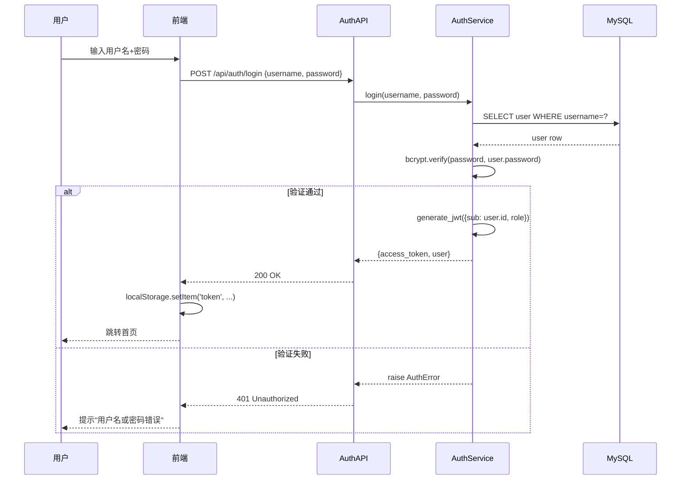
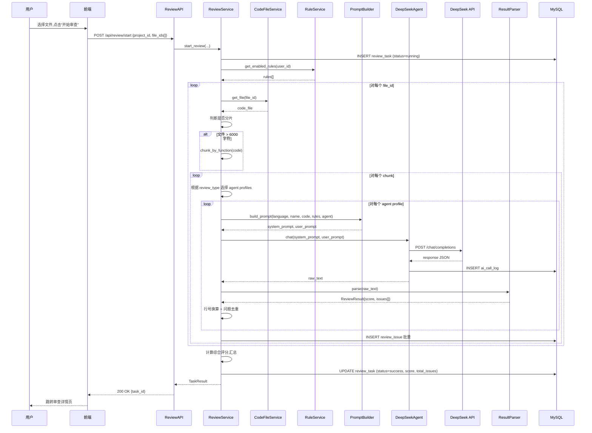
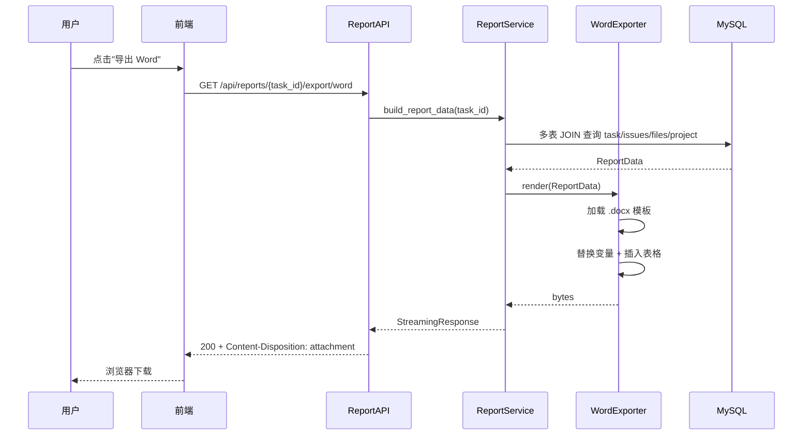

# 03 · 系统设计文档

> 本文从架构、模块、关键时序三个层次描述系统设计。前端 / 后端 / 数据库的细节分别在 06 / 07 / 04 三份文档中展开,本文只写"全局图"。

> **2026-07-10 当前状态说明**：系统已扩展为 194 条业务 HTTP、1 条 WebSocket、14 个 Agent 和 51 张 ORM 表声明；生产入口为 Frontend 容器内 Nginx，共运行 MySQL、Backend、Frontend、ClamAV 4 个容器。本文后续早期架构图中的“14 张业务表”等数字仅代表初版设计，最新差异见 `docs/项目工作方式与部署对齐/`。

## 1. 总体架构

### 1.1 架构概览(分层视角)

```
┌─────────────────────────────────────────────────────────────┐
│                       用户浏览器                              │
│                  Chrome / Edge / Safari                      │
└─────────────────────────────────────────────────────────────┘
                       ▲           │
                       │ HTTPS     │ HTTPS
                       │           ▼
┌─────────────────────────────────────────────────────────────┐
│  表示层 (Presentation Layer)                                  │
│  Vue 3 + Vite + Element Plus + Pinia + Monaco Editor         │
│  - 路由 / 组件 / 状态                                          │
│  - Axios 拦截器 (token / error)                              │
└─────────────────────────────────────────────────────────────┘
                       ▲           │
                       │ REST/JSON │ Bearer JWT
                       │           ▼
┌─────────────────────────────────────────────────────────────┐
│  接口层 (API Layer)  - FastAPI Router                         │
│  /api/auth  /api/projects  /api/code-files  /api/agents     │
│  /api/review  /api/reports  /api/dashboard  /api/ai         │
│  /api/issues  /api/rules  /api/ai-prompt  /api/admin/audit │
└─────────────────────────────────────────────────────────────┘
                       │
                       ▼
┌─────────────────────────────────────────────────────────────┐
│  业务服务层 (Service Layer)                                    │
│  AuthService  ProjectService  CodeFileService                │
│  ReviewService  ReportService  DashboardService              │
│  AgentService  AuditService  AiLogService                   │
└─────────────────────────────────────────────────────────────┘
        │                       │                       │
        ▼                       ▼                       ▼
┌──────────────┐  ┌──────────────────────┐  ┌──────────────┐
│ 数据访问层    │  │  Agent 编排层 (v2.0)  │  │  导出层       │
│ SQLAlchemy   │  │ Orchestrator         │  │ python-docx  │
│   ORM        │  │ AgentRegistry (14个)  │  │ ReportLab    │
│ (14张业务表) │  │ EventBus + Clarify   │  │              │
└──────────────┘  └──────────────────────┘  └──────────────┘
        │                       │
        ▼                       ▼
┌──────────────┐         ┌──────────────────┐
│  MySQL 8.0   │         │  DeepSeek API    │
│   (持久化)    │         │ api.deepseek.com │
└──────────────┘         └──────────────────┘
```

### 1.2 部署视图

```
┌──────────────────── Docker Host ────────────────────┐
│                                                       │
│  ┌──────────────┐    ┌──────────────┐               │
│  │  nginx       │───▶│  frontend    │ Vue3 静态     │
│  │  :80/443     │    │  (静态资源)   │               │
│  └──────────────┘    └──────────────┘               │
│         │                                            │
│         │ /api/* 反向代理                            │
│         ▼                                            │
│  ┌──────────────┐                                    │
│  │  backend     │  FastAPI + Uvicorn :8000          │
│  │              │──────┐                            │
│  └──────────────┘      │                            │
│         │              │ HTTPS                      │
│         ▼              ▼                            │
│  ┌──────────────┐  ┌────────────────┐               │
│  │  mysql       │  │  DeepSeek API  │ 外部服务      │
│  │  :3306       │  │  (公网)         │               │
│  └──────────────┘  └────────────────┘               │
└──────────────────────────────────────────────────────┘
```

详细 docker-compose 见 [09-部署运维文档](./09-部署运维文档.md)。

### 1.3 设计原则

| 原则 | 说明 |
| --- | --- |
| 前后端分离 | SPA + REST,纯 JSON,无服务端模板 |
| 分层清晰 | API → Service → Repository(ORM)→ DB;互不跨层 |
| 业务在 Service | 路由层只做参数校验和调用,业务逻辑全部下沉到 Service |
| 配置外置 | 所有 secret / 数据库连接 / API Key 都走环境变量 |
| 失败可恢复 | DeepSeek 失败不中断整个任务;数据库事务包住关键写 |
| 数据可审计 | 所有 AI 调用入 `ai_call_log` 表 |

## 2. 模块设计

### 2.1 模块清单

| 模块 | 主要组件 | 说明 |
| --- | --- | --- |
| 鉴权模块 | `AuthService`, `jwt_handler`, `password_hasher` | 注册、登录、token 签发与解析 |
| 用户模块 | `UserService` | 用户 CRUD、角色管理 |
| 项目模块 | `ProjectService` | 项目 CRUD、所有权校验 |
| 代码文件模块 | `CodeFileService`, `VersionService`, `LanguageDetector` | 文件 CRUD、版本生成、语言识别 |
| 规则模块 | `RuleService` | 规则启用/禁用、Prompt 片段拼装 |
| 审查模块 | `ReviewService`, `DeepSeekAgent`, `MultiAgent`, `PromptBuilder`, `ResultParser`, `CodeChunker` | 多代理编排、调用、解析、入库、重试 |
| 问题模块 | `IssueService` | 问题查询、状态流转 |
| 报告模块 | `ReportService`, `WordExporter`, `PdfExporter` | 报告生成与导出 |
| 仪表盘模块 | `DashboardService` | 数据聚合 |
| 日志模块 | `AiCallLogService` | AI 调用日志查询 |
| Agent 中心 | `AgentService`, `Orchestrator`, `AgentRegistry`, `EventBus`, `ClarifyStore` | 14个Agent注册、运行时态势、SSE事件推送、主动追问回填 |
| 安全审计 | `SecuritySentinelAgent`, `SecurityService` | OWASP/CWE/敏感信息/项目级威胁建模、安全态势汇总 |
| Agent 自进化 | `EvolutionAgent`, `EvolutionService`, `EvalGate`, `ExperienceService` | 反馈聚合、经验沉淀、提案评估、审批和回滚 |
| AI 助手 | `ChatAssistantAgent`, AI Chat API | 自然语言对话、意图路由、Clarify 追问协议 (v2.0) |
| 提示词生成 | `AiPromptAgent`, AI Prompt API | 审查问题 → 外部 AI 修复提示词, 支持 Cursor/Copilot/ChatGPT/Claude (v2.0) |
| 操作审计 | `AuditService`, audit_log 表 | 关键操作日志记录, 管理员可查 (v2.0) |

### 2.2 模块依赖关系

```
AuthService ───────────────────────────────────┐
                                                ▼
UserService ──── ProjectService ──── CodeFileService ──── VersionService
                       │                       │
                       │                       │
                       ▼                       ▼
                  RuleService           LanguageDetector
                       │                       │
                       └───────┬───────────────┘
                               ▼
                       ReviewService ──┬── CodeChunker
                               │       ├── MultiAgent
                               │       ├── PromptBuilder
                               │       ├── DeepSeekAgent
                               │       └── ResultParser
                               ▼
                       ┌── IssueService
                       ├── ReportService ──┬── WordExporter
                       │                   └── PdfExporter
                       └── AiCallLogService

DashboardService 聚合 review_task / review_issue / project / code_file

┌────────────────────── v2.0 新增 ──────────────────────┐
│                                                        │
│  Orchestrator (主调度)                                   │
│  ├── ChatAssistantAgent  (对话/意图路由/Clarify)        │
│  ├── ReviewAgent  (审查委派)                             │
│  ├── ProjectManagerAgent  (项目管理)                     │
│  ├── AiPromptAgent  (提示词生成)                         │
│  ├── DashboardAgent  (数据分析)                          │
│  ├── SecuritySentinelAgent  (安全审计)                    │
│  ├── EvolutionAgent  (反馈自进化)                          │
│  └── ...  (共14个Agent)                                  │
│                                                        │
│  AgentRegistry ─── AgentService ─── Agent API            │
│  AgentEventBus  ─── SSE Events ─── 前端流式消费         │
│  ClarifyStore   ─── Clarify API ─── 追问回填             │
│                                                        │
│  AuditService  ─── audit_log ─── 操作审计               │
└────────────────────────────────────────────────────────┘
```

### 2.3 关键服务职责

#### ReviewService(核心)

```
职责:
- 接收审查请求,创建 review_task
- 取 project / code_files / rules
- 按 review_type 选择多 Agent 组合
- 循环每个 file:
    分片 → 按代理构造 Prompt → 调 DeepSeekAgent → 解析 → 去重 → 写 issues
- 计算综合评分,更新 task 状态与统计字段
- 异常隔离:单文件失败不影响整体

依赖:
- CodeFileService(读代码)
- RuleService(读启用规则)
- MultiAgent(代理组合与角色约束)
- DeepSeekAgent(LLM 调用)
- ResultParser(JSON 解析与校验)
- 数据库 session
```

#### DeepSeekAgent

```
职责:
- 封装 DeepSeek HTTP 调用
- 重试策略(指数退避,最多 2 次)
- 限流处理(429 等待重试)
- 写 ai_call_log

输入:
- system prompt + user prompt
- model 名称(默认 `deepseek-v4-flash`)
- response_format(默认 json_object)

输出:
- 原始 JSON 字符串 + 元数据(耗时、token 数)
```

#### ResultParser

```
职责:
- 解析 LLM 输出 JSON
- 校验 schema(issues 数组、必填字段)
- 二次清洗:截取 ```json ... ``` 中的内容,去除前后噪音
- 失败时记录原始返回供排查

输出:
- 标准化 ReviewResult 对象
```

#### PromptBuilder

```
职责:
- 加载启用的规则
- 按模板拼装 system / user prompt
- 注入语言、文件名、代码内容、规则清单
- 注入本轮审查代理画像,让不同代理聚焦不同问题类型

模板位置: backend/app/ai/prompts/review.zh.md
```

#### MultiAgent

```
职责:
- 定义通用质量、安全、可靠性、性能、可维护性代理画像
- 将 review_type 映射为代理组合
- 生成可注入 Prompt 的代理说明和任务摘要

映射:
- quick / standard: 通用质量代理
- security: 安全审查代理 + 可靠性代理
- performance: 性能审查代理 + 可维护性代理
- full: 安全 + 可靠性 + 性能 + 可维护性四代理协同
```

#### Orchestrator (v2.0 新增)

```
职责:
- 注册并管理 12 个 Agent 实例
- 接收用户自然语言对话, 通过 ChatAssistantAgent 解析意图
- 将意图路由到对应的专业 Agent
- 统一管理 AgentContext (user_id, trace_id)
- 通过 AgentEventBus 广播调度事件

依赖:
- AgentRegistry (Agent 注册与元数据)
- ChatAssistantAgent (意图解析)
- AgentEventBus (事件广播)
```

#### AgentEventBus (v2.0 新增)

```
职责:
- 单例事件总线, 收集所有 Agent 调用生命周期事件
- 支持 SSE 推送: dispatch → thinking → progress → complete/failed/clarify
- 每个事件关联 trace_id, 前端可追踪调用链
- 保留最近 N 条历史, 新订阅者连接时回放

事件类型:
- dispatch: Orchestrator 派发任务
- thinking: Agent 开始思考
- progress: 有进度产出
- complete: Agent 成功完成
- failed: Agent 执行失败
- clarify: Agent 需要追问
```

#### ClarifyStore (v2.0 新增)

```
职责:
- TTL 5 分钟内存存储待回填的追问
- 定义 6 种必填字段映射 (delete_project / start_review / list_issues / list_files / create_project / review_code)
- 4 种控件类型: text / select_project / select_task / code

流程:
1. ChatAssistantAgent 发现关键意图缺字段 → 返回 CLARIFY
2. Orchestrator 在 ChatResponse 中注入 clarify 对象
3. 前端渲染追问卡片, 用户填写答案
4. POST /api/agents/clarify 回填 → 合并 payload → 继续执行
```

#### AiPromptAgent (v2.0 新增)

```
职责:
- 将审查问题翻译为外部 AI 可粘贴的修复提示词
- 支持 4 种目标工具: Cursor / Copilot / ChatGPT / Claude Code
- 提供三种粒度: 单条问题 / 任务批量 / 项目级修复手册
- 可选 LLM 润色, 敏感字段脱敏

API:
- GET  /api/ai-prompt/tools      支持的工具枚举
- POST /api/ai-prompt/issue       单条问题
- POST /api/ai-prompt/task        任务批量
- POST /api/ai-prompt/project     项目级修复手册
```

## 3. 技术选型与理由

| 选型 | 选项 | 理由 |
| --- | --- | --- |
| 后端框架 | FastAPI | 自带 Swagger,Pydantic 类型校验,异步,部署轻 |
| ORM | SQLAlchemy 2.x | 生态最成熟,事务、关系、迁移齐全 |
| 迁移 | Alembic | 与 SQLAlchemy 配套,版本化 schema |
| 数据校验 | Pydantic v2 | 与 FastAPI 一体,性能比 v1 提升数倍 |
| 配置 | pydantic-settings | 类型安全的环境变量管理 |
| 密码 | passlib[bcrypt] | 业界标准,内置 salt |
| Token | PyJWT | 轻量,HS256 足够本场景 |
| 日志 | loguru | 开箱即用,结构化,按天滚动 |
| LLM | DeepSeek V4 Responses | 中文代码理解强；1M 上下文预算，内部 Agent 在 850K 阈值生成投影并保留完整审计 transcript |
| Word | python-docx | 模板渲染稳定 |
| PDF | ReportLab | 支持中文字体内嵌 |
| 前端框架 | Vue 3 | 学习曲线友好,生态完整 |
| 构建 | Vite | 启动快,HMR 体验好 |
| UI | Element Plus | 表单表格弹窗齐全,与 Vue3 配套 |
| 状态 | Pinia | Vue3 官方推荐,API 简洁 |
| 编辑器 | Monaco Editor | VS Code 内核,语法高亮、行号、智能感知 |
| 图表 | ECharts | 国产,文档全,中文社区活跃 |
| HTTP | Axios | 拦截器机制成熟,适合统一处理 token |

## 4. 关键时序图

> 用 mermaid 表示,可在支持 mermaid 的 Markdown 渲染器中查看。

### 4.1 用户登录



### 4.2 代码审查(核心流程)



### 4.3 报告导出 Word



## 5. 数据流设计

### 5.1 代码上传到 DB

```
用户拖拽文件
   ↓
前端 FormData(multipart)
   ↓
后端接收: FastAPI UploadFile
   ↓
校验:
  - 大小 ≤ 20MB
  - 阻止 `.git`、`node_modules`、`dist`、`build`、IDE 配置等系统/构建目录
  - 默认不限制扩展名,按文件名推断语言;审查入口可排除二进制/图片类文件
  - 编码 UTF-8(或 GBK 转 UTF-8)
   ↓
LanguageDetector 推断 language
   ↓
事务开始:
  ├── INSERT code_file(version_no=1, content=...)
  └── INSERT code_version(file_id, version_no=1, content=...)
事务提交
   ↓
返回 file_id
```

### 5.2 审查任务状态机

```
[pending] --启动--> [running] --成功--> [success]
                       │
                       ├──全部失败--> [failed]
                       │
                       └──用户取消--> [cancelled]
```

字段 `review_task.status` 枚举:`pending / running / success / failed / cancelled`

### 5.3 问题状态机

```
[未修复] ──标记修复──> [已修复]
   │                      │
   │                      └──复查不通过──> [待复查]
   │
   ├──忽略──> [已忽略]
   │
   └──提交复查──> [待复查] ──通过──> [已修复]
                              └──不通过──> [未修复]
```

字段 `review_issue.status` 枚举:`unfixed / fixed / ignored / pending_review`

## 6. 安全设计

### 6.1 鉴权流程

```
登录成功 → 后端签发 JWT
    │
    ├── access_token (HS256, 7 天)
    └── claims: {sub: user_id, role, exp, iat}

前端每次请求:
    Authorization: Bearer <token>

后端中间件:
    1. 解析 token → user_id
    2. 加载 User → 注入 request.state.user
    3. 路由通过 Depends(get_current_user) 拿到 user

权限校验:
    - 路由级: Depends(require_admin) 等
    - 资源级: service 内 user_id 过滤
```

### 6.2 数据访问隔离

所有涉及用户私有数据的 SQL 必须带 `user_id` 过滤:

```python
# ✓ 正确
db.query(Project).filter(Project.user_id == current_user.id, Project.id == pid)

# ✗ 错误,可能越权
db.query(Project).filter(Project.id == pid)
```

封装在 Service 基类中,避免遗漏:

```python
class BaseService:
    def get_owned(self, model, pk, user):
        obj = db.get(model, pk)
        if not obj:
            raise NotFound
        if obj.user_id != user.id and user.role != 'admin':
            raise Forbidden
        return obj
```

### 6.3 文件上传安全

| 风险 | 防御措施 |
| --- | --- |
| 上传可执行文件 | 默认不执行上传内容;阻止系统/构建目录,审查入口排除二进制/图片类文件 |
| 上传超大文件 | 后端 `MAX_UPLOAD_SIZE` 默认限制 20MB,前端/nginx 设置需不低于该值 |
| 文件名注入 | 仅保留 `[A-Za-z0-9._-]`,去路径 |
| 文件内容当代码执行 | 系统不执行任何上传内容,只送 LLM 分析 |
| 编码不一致 | 上传时探测 + 转 UTF-8 入库 |

### 6.4 API 防护

- 登录接口加 IP 维度限流(slowapi,5 次/分钟)
- 注册接口加图形验证码(P2,一期可缓)
- 全站启用 CORS 白名单
- 错误统一格式,不泄露内部信息

## 7. 错误处理与日志

### 7.1 统一错误响应

```json
{
  "code": 40001,
  "message": "用户名或密码错误",
  "detail": null,
  "request_id": "req_8f2a..."
}
```

错误码段:

| 段 | 含义 | 示例 |
| --- | --- | --- |
| 200xx | 成功 | 20000 OK |
| 400xx | 参数错误 | 40001 用户名重复 |
| 401xx | 鉴权错误 | 40100 未登录 / 40101 token 过期 |
| 403xx | 权限错误 | 40300 无访问权限 |
| 404xx | 资源不存在 | 40400 项目不存在 |
| 409xx | 冲突 | 40901 用户名重复 |
| 500xx | 服务器错误 | 50000 内部错误 |
| 502xx | 外部服务错误 | 50201 DeepSeek 不可达 |

### 7.2 日志策略

| 级别 | 场景 |
| --- | --- |
| DEBUG | 仅开发环境,SQL、Prompt 内容 |
| INFO | 关键业务流程:登录、审查启动/完成、文件上传 |
| WARNING | 重试、降级、慢请求(>3s) |
| ERROR | 未捕获异常、外部服务失败、数据库错误 |

日志格式(loguru):

```
{time:YYYY-MM-DD HH:mm:ss.SSS} | {level} | {name}:{function}:{line} | request_id={extra[request_id]} | {message}
```

日志按天滚动,保留 30 天,>50MB 自动切分。

## 8. 性能与扩展性

### 8.1 性能优化要点

- 列表接口分页强制(默认 20,最大 100)
- LONGTEXT 字段不进 `SELECT *`,需要才查 `content`
- 仪表盘聚合用 SQL 子查询而非应用层循环
- DeepSeek 调用并发限制(同一用户同时只 1 个任务,通过任务表加锁)
- 前端 Monaco Editor 按需加载语言包

### 8.2 索引设计要点

详见 [04-数据库设计文档](./04-数据库设计文档.md) 第 4 章,要点:

- `user.username` 唯一索引
- `project(user_id, status)` 复合
- `code_file(project_id, status)` 复合
- `review_task(user_id, create_time)` 复合
- `review_issue(task_id, severity)` 复合

### 8.3 扩展路径(超出毕设)

- 审查任务异步化:Celery + Redis,任务队列+消费者
- 多 LLM 适配:抽 `LLMProvider` 接口,DeepSeek/Qwen/Claude 切换
- 多 Agent 深化:增加代理投票、冲突合并、跨文件上下文代理
- 项目级整体审查:跨文件依赖分析
- 增量审查:仅审查变更行
- 团队/组织模型:多用户协作

## 9. 关键风险与设计应对

| 风险 | 设计应对 |
| --- | --- |
| LLM 返回不规范 JSON | 强制 `json_object` + 二次清洗 + 失败重试 + 原始 response 落库 |
| 单次审查过慢 | 文件分片 + 进度回传 + 超时熔断 |
| DeepSeek 限流(429) | 重试退避(2s/4s)+ 单用户串行 |
| 数据库 LONGTEXT 影响列表性能 | 列表 SQL 不选 content,详情按需获取 |
| 用户越权访问他人项目 | Service 基类强制 user_id 过滤;补充单元测试 |
| 上传非代码文件 | 扩展名+MIME 双校验 |
| API Key 泄露 | 仅后端持有,前端不接触;.env 不入版本库 |
