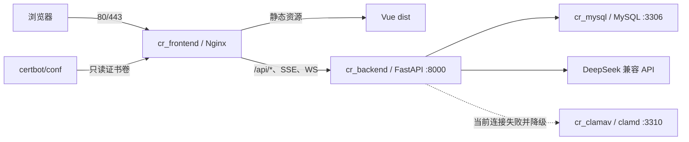

# 09 · 部署运维文档

> 当前实现基线：2026-07-10。本文描述仓库和生产实际使用的 **Nginx + FastAPI + MySQL + ClamAV** 部署。旧专项文档中的 Caddy 记录是当时历史，不代表当前运行配置。

## 1. 部署目标与边界

### 1.1 目标

- 通过 Docker Compose 运行 MySQL、Backend、Frontend/Nginx 和 ClamAV。
- 仅由 Nginx 暴露 80/443；MySQL 和 Backend 仅绑定服务器本机。
- 数据结构由基础初始化 SQL + Alembic 迁移共同完成。
- 生产发布必须具备备份、明确版本、迁移、健康检查和回滚能力。

### 1.2 当前已知限制

| 级别 | 限制 |
| --- | --- |
| P0 | `deploy.sh` 不执行 Alembic，首次部署可能缺表 |
| P0 | Git fetch/reset 逻辑可能重置到旧 `origin/main` |
| P0 | 生产没有文档曾声明的每日数据库备份任务 |
| P0 | Backend 与 ClamAV 网络不通，客户端类名错误，YARA 规则为空，实际扫描降级 |
| P1 | HTTP 不跳转 HTTPS |
| P1 | `/docs` 关闭但 `/openapi.json` 仍公开 |
| P1 | `.env.example` 的 `APP_DOMAIN` 未自动写入 `frontend/nginx.conf`，Nginx 域名仍是静态配置 |
| P1 | 当前脚本没有自动回滚和发布 SHA/迁移断言 |

在这些问题修复前，请使用 `deploy/README.md` 的临时安全流程，而不是只执行一条部署脚本。

## 2. 运行拓扑



## 3. 部署相关目录

```text
deploy/
├── docker-compose.yml       # 4 个服务、端口、卷和内存限制
├── deploy.sh               # 当前构建/重建脚本，尚缺迁移/备份/回滚
├── .env.example            # 环境变量模板
├── issue-cert.sh           # 首次签发证书，短暂停止 frontend
├── renew-cert.sh           # webroot 续期并 reload Nginx
├── certbot/
│   ├── conf/               # 证书持久化目录
│   └── www/                # ACME challenge webroot
└── mysql/
    ├── init.sql            # 22 张基础表
    └── seed.sql            # 初始数据
frontend/
├── Dockerfile              # Node 构建 + nginx:1.27-alpine
├── nginx.conf              # 当前生产网关配置
└── Caddyfile               # 历史遗留，当前镜像不使用
backend/
├── alembic/versions/       # 001～009 迁移
├── alembic.ini
└── Dockerfile
```

## 4. 环境变量

真实值只写 `deploy/.env`，文件权限建议为 600，禁止提交 Git。

| 变量 | 用途 | 要求 |
| --- | --- | --- |
| `MYSQL_ROOT_PASSWORD` | MySQL root 密码 | 强随机值，仅运维使用 |
| `MYSQL_DATABASE` | 业务数据库名 | 与应用连接一致 |
| `MYSQL_USER` / `MYSQL_PASSWORD` | 应用数据库账号 | 最小权限、独立强密码 |
| `JWT_SECRET` | JWT 签名 | 至少 32 字节随机值，轮换需考虑现有会话 |
| `DEEPSEEK_API_KEY` | 默认模型密钥 | 不打印、不提交 |
| `DEEPSEEK_BASE_URL` | 模型端点 | 必须通过 SSRF 校验 |
| `ALLOW_PRIVATE_AI_BASE_URL` | 是否允许私网模型 | 默认 false |
| `AGENT_GOVERNANCE_SCHEDULER_ENABLED` | 治理任务调度 | 小内存环境需评估负载 |
| `AGENT_KNOWLEDGE_GITHUB_TOKEN` | 外部知识抓取 Token | 可选，仅 `.env` |
| `OPENAPI_ENABLED` | 控制 Swagger/ReDoc | 当前不能控制 OpenAPI JSON |
| `REVIEW_MAX_CONCURRENCY` | 审查并发上限 | 2G 机器建议保持较低值 |
| `CORS_ORIGINS` | 跨域白名单 | 生产只配置真实域名 |
| `APP_DOMAIN` | 期望生产域名 | 当前未自动渲染到 Nginx，需手工保持一致 |

不要把用户在聊天、工单或终端中临时提供的高权限凭据复制到 `.env` 之外。暴露过的凭据应立即轮换。

## 5. Docker Compose 现状

### 5.1 服务

| 服务 | 关键配置 |
| --- | --- |
| MySQL | `mysql:8.0`，512 MiB 限制，数据卷 `mysql_data`，仅 `127.0.0.1:3307` |
| Backend | 本地构建，768 MiB 限制，依赖 MySQL healthy，仅 `127.0.0.1:8000` |
| Frontend | Node 构建后使用 Nginx，128 MiB 限制，对外 80/443，挂载证书卷 |
| ClamAV | `clamav/clamav:latest`，独立卷 `clamav_data`，当前无内存限制且网络接线错误 |

### 5.2 网络问题

Compose 默认会把未声明 `networks` 的服务放入默认网络。当前只有 ClamAV 显式加入 `code_review_net`，Backend 不在该网络，因此不能通过 `clamav:3310` 访问它。

目标修复：

- Backend 与 ClamAV 共享同一内部网络。
- 删除 `3310:3310` 公网映射，仅 `expose: 3310`。
- 修正 Python 客户端类，并用 EICAR 等安全测试样本验证真实 clamd 调用。
- 补齐版本化 YARA 规则，或明确移除 YARA 宣称和相关代码。
- 定义扫描不可用时 fail-open/fail-closed 行为和告警。

## 6. Nginx 网关

当前配置文件：`frontend/nginx.conf`。

### 6.1 代理职责

- `/`：Vue SPA，找不到静态文件时回退 `index.html`。
- `/api/`：REST 与 SSE，关闭代理缓冲。
- `/api/ws/`：WebSocket，设置 Upgrade/Connection 和长超时。
- `/.well-known/acme-challenge/`：证书续期 webroot。
- `/docs`、`/openapi.json`：显式反向代理到 Backend。

### 6.2 当前风险

- 80 端口直接提供完整站点，未统一重定向到 HTTPS。
- `/openapi.json` 被显式代理，即使 `OPENAPI_ENABLED=false` 仍可访问。
- 域名/IP写在 Nginx 配置中，未由 `APP_DOMAIN` 模板化。

目标状态：

1. HTTP 仅保留 ACME challenge，其余 301/308 到 HTTPS。
2. 根据策略关闭或鉴权保护 docs/redoc/openapi。
3. 将域名配置模板化，并在部署前执行 `nginx -t`。
4. 增加必要安全响应头并验证不会破坏 Monaco、WebSocket 和下载功能。

## 7. 数据库初始化与迁移

### 7.1 权威关系

- `deploy/mysql/init.sql`：22 张基础表，只在 MySQL 数据目录首次初始化时执行。
- Alembic 001～009：创建其余 29 张 ORM 表并补字段/索引。
- 当前 ORM 共声明 51 张表。

因此，`init.sql` 不能代替 `alembic upgrade head`。

### 7.2 首次部署

```bash
cd deploy
docker compose up -d mysql
docker compose build backend
docker compose run --rm backend alembic upgrade head
docker compose up -d backend frontend clamav
docker compose run --rm backend alembic current
```

### 7.3 升级

```bash
# 先备份
# 再构建镜像
docker compose build backend frontend

# 迁移失败则停止
docker compose run --rm backend alembic upgrade head

# 切换应用
docker compose up -d --no-deps backend frontend
```

不得使用应用启动时的 `_ensure_schema()` 单字段补丁代替正式 Alembic 迁移。

## 8. Git 与版本发布

### 8.1 当前脚本问题

`git fetch origin main` 主要更新 `FETCH_HEAD`，不保证本地 `refs/remotes/origin/main` 被刷新；随后 `git reset --hard origin/main` 可能重置到旧远端跟踪引用。

### 8.2 临时修复口径

```bash
git fetch origin '+refs/heads/main:refs/remotes/origin/main'
remote_sha="$(git rev-parse origin/main)"
git reset --hard "$remote_sha"
test "$(git rev-parse HEAD)" = "$remote_sha"
```

长期方案：CI 构建不可变镜像，生产部署 release tag 或 commit SHA，并将版本写入健康/版本接口和发布记录。

## 9. 证书

### 9.1 首次签发

```bash
cd deploy
./issue-cert.sh example.com admin@example.com
```

脚本会短暂停止 Frontend 释放 80 端口，签发后重新启动。

### 9.2 续期

```bash
./renew-cert.sh
```

生产已配置每周续期任务，最近检查成功。仍应监控证书剩余天数和 cron 退出码。

## 10. 健康检查与冒烟

```bash
cd deploy
docker compose ps
docker compose logs --tail=200 backend
curl -fsS http://127.0.0.1:8000/healthz
curl -fsS https://your-domain.example/ >/dev/null
```

推荐发布后自动验证：

- Git/镜像 SHA。
- Alembic current=head。
- 登录、项目列表、审查列表、报告列表。
- SSE 与 WebSocket 建连。
- `/docs`、`/redoc`、`/openapi.json` 符合策略。
- HTTP 跳 HTTPS。
- 后端日志无新 5xx、API Key 解密错误、Agent 参数错误。

## 11. 日志

```bash
docker compose logs -f backend
docker compose logs -f frontend
docker compose logs -f mysql
docker compose logs -f clamav
```

当前线上已观察到两类需要整改的应用日志：

1. 已保存 API Key 解密失败，可能由加密密钥变化造成。
2. Agent 计划生成的工具参数与实际 `execute()` 签名不一致。

日志中不得输出 Token、API Key、密码、完整代码内容或个人敏感信息。

## 12. 备份与恢复

### 12.1 当前事实

截至 2026-07-10，生产只发现一份手工数据库备份；没有文档曾描述的 `/usr/local/bin/cr_backup.sh` 和每日 cron。此项为 P0，不能以旧文档作为“已备份”的证据。

### 12.2 备份示例

```bash
mkdir -p backups
backup="backups/code_review_$(date +%Y%m%d_%H%M%S).sql"
docker compose exec -T mysql sh -c \
  'exec mysqldump -uroot -p"$MYSQL_ROOT_PASSWORD" --single-transaction --routines --triggers "$MYSQL_DATABASE"' \
  > "$backup"
test -s "$backup"
sha256sum "$backup" > "$backup.sha256"
```

### 12.3 恢复示例

```bash
cat backups/code_review_YYYYMMDD_HHMMSS.sql | \
  docker compose exec -T mysql sh -c \
  'exec mysql -uroot -p"$MYSQL_ROOT_PASSWORD" "$MYSQL_DATABASE"'
```

恢复必须在隔离环境先演练，并记录 RPO/RTO、表数、迁移版本和业务冒烟结果。

## 13. 容量与清理

生产快照显示磁盘使用约 80%，Docker 构建缓存和旧镜像可回收约 3.4 GiB；2 GiB 物理内存下 ClamAV 常驻约 562 MiB，Swap 已明显使用。

建议：

- 磁盘 75%/85% 设置预警/严重告警。
- 定期审查 `docker system df`，只清理确认可回收的缓存和镜像。
- 为 ClamAV 制定保留/移除决策；若保留，评估独立主机或更高内存。
- 后端审查并发保持受控，监控 OOM/restart 次数。
- 盘点服务器其他监听端口及对应服务，关闭无业务必要的公网入口。

## 14. 安全清单

- [ ] 已轮换所有在沟通渠道暴露过的高权限凭据。
- [ ] SSH 仅允许公钥，禁止密码登录和不必要的 root 远程入口。
- [ ] `.env` 权限为 600，未进入 Git、镜像和日志。
- [ ] 3307、8000、3310 不对公网开放。
- [ ] HTTP 强制跳转 HTTPS。
- [ ] OpenAPI 按策略关闭或鉴权。
- [ ] 备份自动化与异地副本已验证。
- [ ] ClamAV/YARA 真实扫描链路已回归，或已移除误导性能力声明。
- [ ] 部署使用受保护版本并具有回滚。

## 15. 发布检查清单

### 发布前

- [ ] 变更范围、迁移和回滚方案已审批。
- [ ] 后端测试、Ruff、compileall、前端 build/lint/test、Compose 解析全部通过。
- [ ] 数据库备份成功且文件非空。
- [ ] 目标 commit SHA/tag 已记录。

### 发布中

- [ ] 构建成功后再切换容器。
- [ ] Alembic 成功到 head。
- [ ] Nginx 配置测试通过。
- [ ] 容器状态、资源和日志正常。

### 发布后

- [ ] 健康检查和核心业务冒烟通过。
- [ ] 线上 SHA、迁移版本与计划一致。
- [ ] HTTPS、WebSocket、SSE、报告下载通过。
- [ ] 观察窗口内没有新增错误和资源异常。

## 16. 相关文档

- 简明操作手册：`deploy/README.md`
- 当前事实与差异：`docs/项目工作方式与部署对齐/ALIGNMENT_项目工作方式与部署对齐.md`
- 整改顺序：`docs/项目工作方式与部署对齐/TODO_项目工作方式与部署对齐.md`
