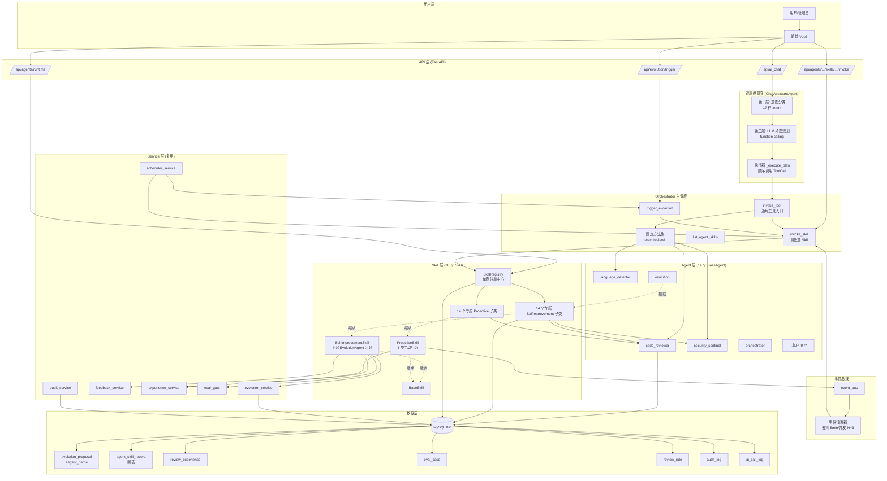
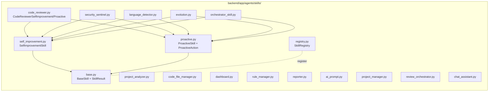
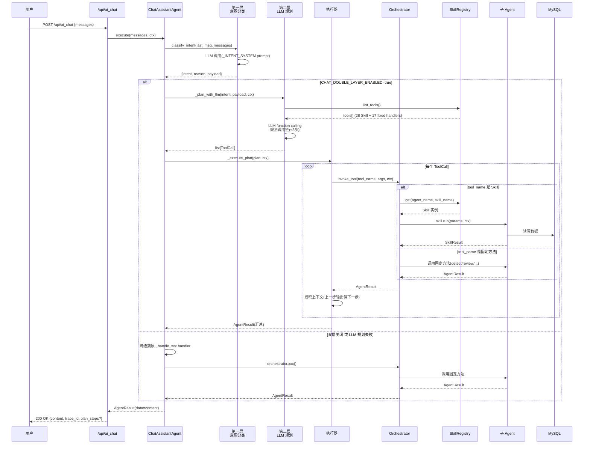
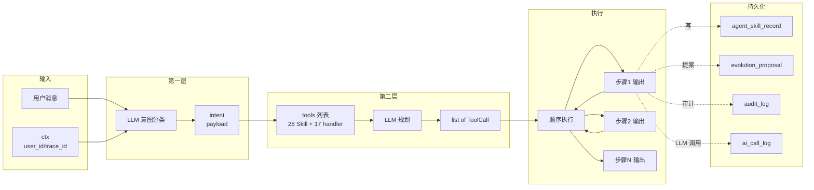
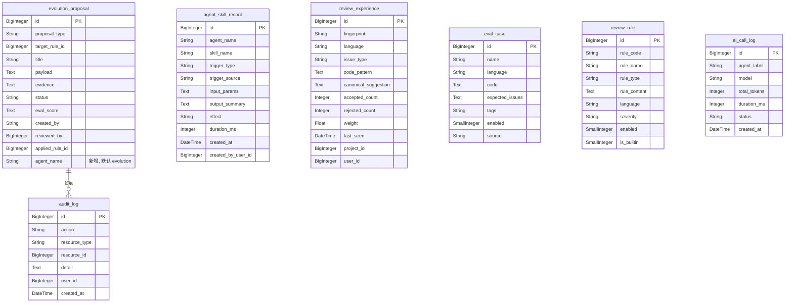

# DESIGN · AgentSkill 自进化与总调度升级

> 阶段: Architect
> 基于 ALIGNMENT + CONSENSUS 设计系统架构、模块分层、接口契约、数据模型、异常处理策略。
> 设计原则: 严格按任务范围, 避免过度设计; 与现有系统架构一致; 复用现有组件和模式。

---

## 1. 整体架构图



---

## 2. 分层设计与核心组件

### 2.1 五层架构

| 层 | 路径 | 职责 | 本期新增/修改 |
|---|---|---|---|
| **API 层** | `backend/app/api/v1/` | HTTP 路由 + 鉴权 + 请求/响应 schema | 新增 `/api/agents/{name}/skills/{skill}/invoke` + 扩展 `/api/evolution/trigger` |
| **调度层** | `backend/app/agents/chat_agent.py` + `orchestrator.py` | 双层调度 + 通用工具入口 | ChatAgent 双层升级 + Orchestrator 新增 4 方法 |
| **Agent 层** | `backend/app/agents/` | 14 个领域 Agent, 各自单一职责 | 14 Agent 各挂载 2 Skill, BaseAgent 扩展 |
| **Skill 层** | `backend/app/agents/skills/`(新) | Skill 抽象 + 28 子类 + SkillRegistry | 全新 |
| **Service 层** | `backend/app/services/` | 反馈/经验/闸门/调度/审计 | 复用, 仅 `scheduler_service` 加注册入口 |

### 2.2 核心组件清单

| 组件 | 路径 | 类型 | 职责 |
|---|---|---|---|
| `BaseSkill` | `agents/skills/base.py` | 新增抽象基类 | Skill 抽象, 提供 `run` / `to_tool_schema` 接口 |
| `SelfImprovementSkill` | `agents/skills/self_improvement.py` | 新增抽象基类 | 自进化闭环模板方法, 下沉 EvolutionAgent 七步 |
| `ProactiveSkill` | `agents/skills/proactive.py` | 新增抽象基类 | 4 类主动行为钩子 |
| `SkillRegistry` | `agents/skills/registry.py` | 新增单例 | Skill 注册/查询/转 tools |
| `SkillResult` | `agents/skills/base.py` | 新增 dataclass | Skill 调用结果 |
| `ProactiveAction` | `agents/skills/proactive.py` | 新增 dataclass | 主动行动建议 |
| `AgentSkillRecord` | `models/agent_skill_record.py` | 新增模型 | Skill 调用记录表 |
| `skill_service` | `services/skill_service.py` | 新增服务 | Skill 调用统一入口, 写 `agent_skill_record` |
| `ChatPlanner` | `agents/chat_planner.py` | 新增类 | LLM 动态规划调用链 |
| `ToolCall` | `agents/chat_planner.py` | 新增 dataclass | LLM 规划的单步调用 |
| 14 × SelfImprovement 子类 | `agents/skills/<agent>.py` | 新增 | per-Agent 进化逻辑 |
| 14 × Proactive 子类 | `agents/skills/<agent>.py` | 新增 | per-Agent 主动行为 |

---

## 3. Skill 层模块设计

### 3.1 模块依赖关系图



### 3.2 BaseSkill 接口契约

```python
# backend/app/agents/skills/base.py
from dataclasses import dataclass, field
from typing import Any, Dict, List, Optional


@dataclass
class SkillResult:
    """Skill 调用结果数据结构

    Attributes:
        success: 是否成功
        data: 输出数据(任意类型, 由 Skill 子类定义)
        error: 失败原因(success=False 时填)
        effect: 效果标签(success / failed / no_op / proposal_created)
        duration_ms: 执行耗时(毫秒)
        artifacts: 产出物列表(如生成的提案 id 列表)
    """
    success: bool
    data: Any = None
    error: Optional[str] = None
    effect: str = "success"
    duration_ms: int = 0
    artifacts: List[Dict[str, Any]] = field(default_factory=list)


class BaseSkill:
    """Skill 抽象基类

    所有 Skill 必须继承此类并实现 run() 钩子。
    Skill 是可挂载到 Agent 的能力模块, 具备:
    - 唯一标识(name)
    - 描述(供 LLM 工具列表与前端展示)
    - 可调用入口(run)
    - 可工具化(to_tool_schema 转 OpenAI tools 格式)
    """

    name: str = "base_skill"
    description: str = ""
    agent_name: str = ""
    invocable: bool = True
    skill_type: str = "base"  # self_improvement / proactive / base

    def __init__(self, agent_name: str):
        """初始化 Skill

        Args:
            agent_name: 所属 Agent name
        """
        self.agent_name = agent_name

    def run(self, params: Dict[str, Any],
            ctx: Optional["AgentContext"] = None) -> SkillResult:
        """Skill 调用入口(子类必须实现)

        Args:
            params: 调用参数(由调用方传入, Skill 子类自定义 schema)
            ctx: Agent 上下文(含 user_id/trace_id 等)

        Returns:
            SkillResult: 调用结果
        """
        raise NotImplementedError

    def to_tool_schema(self) -> Dict[str, Any]:
        """转为 OpenAI function calling 工具描述

        Returns:
            dict: OpenAI tools 格式的工具描述
                {
                    "type": "function",
                    "function": {
                        "name": "...",
                        "description": "...",
                        "parameters": {...JSON Schema...}
                    }
                }
        """
        return {
            "type": "function",
            "function": {
                "name": self.name,
                "description": self.description,
                "parameters": self._params_schema(),
            },
        }

    def _params_schema(self) -> Dict[str, Any]:
        """子类 override 返回参数 JSON Schema, 默认空对象"""
        return {"type": "object", "properties": {}}
```

### 3.3 SelfImprovementSkill 接口契约

```python
# backend/app/agents/skills/self_improvement.py
from typing import Any, Dict, List, Optional
from sqlalchemy.orm import Session

from app.agents.skills.base import BaseSkill, SkillResult


class SelfImprovementSkill(BaseSkill):
    """自进化闭环 Skill 基类

    下沉现有 EvolutionAgent 的七步闭环(Act/Observe/Aggregate/Reflect/Gate/Promote/Rollback)
    为模板方法 evolve(), 子类只需实现 evolve_target() 钩子定义自己的进化对象与策略。

    防翻车:
    - 提案默认 status=pending, 不自动生效
    - 触发提案需满足 min_samples + min_distinct_tasks 双门槛
    - 仅 admin 审批后才 promote
    - 全程留痕 audit_log, 可一键回滚
    """

    skill_type = "self_improvement"

    def __init__(self, agent_name: str,
                 min_samples: int = 20,
                 min_distinct_tasks: int = 2,
                 high_fp_rate: float = 0.6,
                 disable_fp_rate: float = 0.8):
        """初始化自进化 Skill

        Args:
            agent_name: 所属 Agent name
            min_samples: 触发提案的最小已决样本量
            min_distinct_tasks: 触发提案需跨越的最小任务数
            high_fp_rate: 触发降级的假阳性率阈值
            disable_fp_rate: 触发禁用的假阳性率阈值
        """
        super().__init__(agent_name)
        self.min_samples = min_samples
        self.min_distinct_tasks = min_distinct_tasks
        self.high_fp_rate = high_fp_rate
        self.disable_fp_rate = disable_fp_rate

    def evolve(self, db: Session, window_days: int = 90,
               ctx: Optional["AgentContext"] = None) -> SkillResult:
        """自进化模板方法(七步闭环)

        1. Aggregate: 调 aggregate_feedback 聚合信号
        2. Reflect: 调 evolve_target 产出候选提案
        3. Gate: 调 evaluate_gate 跑闸门
        4. Persist: 通过闸门的提案写入 evolution_proposal(默认 pending)

        Args:
            db: 数据库会话
            window_days: 反馈滑动窗口天数
            ctx: Agent 上下文

        Returns:
            SkillResult: data={"proposals": int, "created": int, "skipped": int}
        """
        # 模板方法, 子类不 override
        ...

    def aggregate_feedback(self, db: Session,
                           window_days: int) -> List[Dict[str, Any]]:
        """聚合反馈信号(子类实现)

        Args:
            db: 数据库会话
            window_days: 滑动窗口

        Returns:
            list[dict]: 聚合后的信号列表, 每个 dict 含
                {rule_type, decided, ignored, distinct_ignored_tasks,
                 false_positive_rate, accepted_count, ...}
        """
        raise NotImplementedError

    def evolve_target(self, db: Session,
                      stats: List[Dict[str, Any]]) -> List[Dict[str, Any]]:
        """从聚合信号产出候选提案(子类实现, 纯函数便于单测)

        Args:
            db: 数据库会话(只读, 用于查询现有进化对象如 review_rule)
            stats: aggregate_feedback 的输出

        Returns:
            list[dict]: 候选提案, 每个 dict 含
                {proposal_type, target_rule_id, title, payload, evidence, agent_name}
        """
        raise NotImplementedError

    def evaluate_gate(self, db: Session,
                      proposal: Dict[str, Any]) -> Dict[str, Any]:
        """评估闸门(默认实现复用 eval_gate, 子类可 override)

        Args:
            db: 数据库会话
            proposal: 候选提案

        Returns:
            dict: {passed: bool, score: {before: {...}, after: {...}}, reason: str}
        """
        # 默认实现: 调用 eval_gate.run_eval(...), 子类可自定义基准集
        ...

    def apply_proposal(self, db: Session,
                       proposal: Dict[str, Any]) -> int:
        """应用提案到进化对象(子类实现)

        Args:
            db: 数据库会话
            proposal: 已审批通过的提案

        Returns:
            int: affected_id(如 review_rule.id)
        """
        raise NotImplementedError

    def rollback_proposal(self, db: Session,
                          proposal_id: int) -> bool:
        """回滚提案(默认实现调用 evolution_service.rollback, 子类可 override)

        Args:
            db: 数据库会话
            proposal_id: evolution_proposal.id

        Returns:
            bool: 是否回滚成功
        """
        ...

    def run(self, params: Dict[str, Any],
            ctx: Optional["AgentContext"] = None) -> SkillResult:
        """统一调用入口, params 支持:
            - {"action": "evolve", "window_days": 90} → 跑一轮进化
            - {"action": "apply", "proposal_id": 123} → 应用已审批提案
            - {"action": "rollback", "proposal_id": 123} → 回滚
        """
        ...
```

### 3.4 ProactiveSkill 接口契约

```python
# backend/app/agents/skills/proactive.py
from dataclasses import dataclass
from typing import Any, Dict, List, Optional
from sqlalchemy.orm import Session

from app.agents.skills.base import BaseSkill, SkillResult


@dataclass
class ProactiveAction:
    """主动行动建议数据结构

    Attributes:
        action_type: 行动类型(trigger_evolution / ask_question / scan_finding / learn_reflect)
        priority: 优先级(low / medium / high)
        title: 行动标题
        detail: 详细描述
        payload: 行动参数(供执行使用)
    """
    action_type: str
    priority: str
    title: str
    detail: str
    payload: Dict[str, Any]


class ProactiveSkill(BaseSkill):
    """主动行为 Skill 基类

    4 类主动行为(子类按需 override):
    - should_trigger_evolution: 主动进化触发判定
    - build_clarify_question: 主动提问/建议(复用 clarify_store)
    - scan_domain: 主动巡检/发疑
    - reflect_from_logs: 主动学习/反思

    ProactiveSkill 通常由定时任务(每小时)或事件驱动触发, 不直接产出进化提案,
    而是产出 ProactiveAction 列表, 由调用方决定是否执行。
    """

    skill_type = "proactive"

    def check_proactive(self, db: Session,
                        ctx: Optional["AgentContext"] = None) -> List[ProactiveAction]:
        """扫描自身领域, 返回建议行动列表(子类实现)

        Args:
            db: 数据库会话
            ctx: Agent 上下文

        Returns:
            list[ProactiveAction]: 建议行动列表(按 priority 排序)
        """
        raise NotImplementedError

    def should_trigger_evolution(self, stats: Dict[str, Any]) -> bool:
        """主动进化触发判定(子类 override)

        Args:
            stats: 当前 Agent 的关键指标(如假阳性率、采纳率、调用失败率)

        Returns:
            bool: 是否应触发自进化
        """
        return False

    def build_clarify_question(self, stats: Dict[str, Any]) -> Optional[Dict[str, Any]]:
        """主动提问/建议(子类 override, 复用 clarify_store)

        Args:
            stats: 当前 Agent 的关键指标

        Returns:
            dict|None: 提问内容(None 表示无需提问)
                {"label": "...", "type": "...", "hint": "..."}
        """
        return None

    def scan_domain(self, db: Session) -> List[Dict[str, Any]]:
        """主动巡检/发疑(子类 override)

        Args:
            db: 数据库会话

        Returns:
            list[dict]: 发现的潜在问题列表
        """
        return []

    def reflect_from_logs(self, db: Session,
                          window_days: int = 7) -> List[Dict[str, Any]]:
        """主动学习/反思(子类 override, 从 ai_call_log 挖趋势)

        Args:
            db: 数据库会话
            window_days: 反思窗口

        Returns:
            list[dict]: 学习到的候选改进点
        """
        return []

    def run(self, params: Dict[str, Any],
            ctx: Optional["AgentContext"] = None) -> SkillResult:
        """统一调用入口, params 支持:
            - {"action_type": "check_proactive"} → 跑一轮主动检查
            - {"action_type": "trigger_evolution"} → 触发进化
            - {"action_type": "scan_domain"} → 主动巡检
            - {"action_type": "reflect_from_logs", "window_days": 7} → 反思
        """
        ...
```

### 3.5 SkillRegistry 接口契约

```python
# backend/app/agents/skills/registry.py
from typing import Dict, List, Optional


class SkillRegistry:
    """Skill 注册中心(单例)

    维护 agent_name → list[BaseSkill] 映射, 提供:
    - register: 注册 Skill
    - get: 获取指定 Skill
    - list_for_agent: 列出 Agent 挂载的所有 Skill
    - list_all: 列出所有 Skill
    - list_tools: 转 LLM tools 列表(OpenAI 格式)
    """

    _instance: Optional["SkillRegistry"] = None

    @classmethod
    def instance(cls) -> "SkillRegistry":
        """获取单例"""
        ...

    def register(self, agent_name: str, skill: "BaseSkill") -> None:
        """注册 Skill

        Args:
            agent_name: 所属 Agent name
            skill: Skill 实例
        """
        ...

    def get(self, agent_name: str, skill_name: str) -> Optional["BaseSkill"]:
        """获取指定 Agent 的指定 Skill

        Args:
            agent_name: Agent name
            skill_name: Skill name

        Returns:
            BaseSkill|None
        """
        ...

    def list_for_agent(self, agent_name: str) -> List["BaseSkill"]:
        """列出 Agent 挂载的所有 Skill

        Args:
            agent_name: Agent name

        Returns:
            list[BaseSkill]
        """
        ...

    def list_all(self) -> List["BaseSkill"]:
        """列出所有已注册 Skill

        Returns:
            list[BaseSkill]
        """
        ...

    def list_tools(self,
                   agent_name_filter: Optional[str] = None,
                   invocable_only: bool = True) -> List[Dict]:
        """转为 LLM tools 列表(OpenAI function calling 格式)

        Args:
            agent_name_filter: 仅返回该 Agent 的 Skill(None=全部)
            invocable_only: 仅返回 invocable=True 的 Skill

        Returns:
            list[dict]: OpenAI tools 格式
        """
        ...
```

### 3.6 14 个 Agent 专属 Skill 实现规范

每个 Agent 对应一个文件 `backend/app/agents/skills/<agent_name>.py`, 包含 2 个类:

```python
# 示例: backend/app/agents/skills/code_reviewer.py
class CodeReviewerSelfImprovementSkill(SelfImprovementSkill):
    """code_reviewer 自进化 Skill

    继承现有 EvolutionAgent 的逻辑, 进化对象为 review_rule。
    """
    name = "code_reviewer.self_improve"
    description = "从审查反馈蒸馏规则进化提案(新增/降级/收窄语言)"

    def aggregate_feedback(self, db, window_days):
        """复用 feedback_service.aggregate_by_issue_type"""
        ...

    def evolve_target(self, db, stats):
        """复用 generate_fp_proposals + _distill_rule"""
        ...


class CodeReviewerProactiveSkill(ProactiveSkill):
    """code_reviewer 主动行为 Skill"""
    name = "code_reviewer.proactive"
    description = "主动监测采纳率/假阳性率趋势, 触发进化或提问"

    def check_proactive(self, db, ctx=None):
        """扫描近 7 天的指标, 若假阳性率突增则触发进化或提问"""
        ...

    def scan_domain(self, db):
        """主动巡检: 找出近 7 天未被审查的新提交文件"""
        ...

    def reflect_from_logs(self, db, window_days=7):
        """从 ai_call_log 挖: 哪些 prompt 模式命中率高, 哪些低"""
        ...
```

#### 14 个 Skill 文件清单

| 文件 | SelfImprovement 子类 | Proactive 子类 |
|---|---|---|
| `code_reviewer.py` | CodeReviewerSelfImprovementSkill | CodeReviewerProactiveSkill |
| `security_sentinel.py` | SecuritySentinelSelfImprovementSkill | SecuritySentinelProactiveSkill |
| `language_detector.py` | LanguageDetectorSelfImprovementSkill | LanguageDetectorProactiveSkill |
| `project_analyzer.py` | ProjectAnalyzerSelfImprovementSkill | ProjectAnalyzerProactiveSkill |
| `code_file_manager.py` | CodeFileManagerSelfImprovementSkill | CodeFileManagerProactiveSkill |
| `dashboard.py` | DashboardSelfImprovementSkill | DashboardProactiveSkill |
| `rule_manager.py` | RuleManagerSelfImprovementSkill | RuleManagerProactiveSkill |
| `reporter.py` | ReporterSelfImprovementSkill | ReporterProactiveSkill |
| `ai_prompt.py` | AiPromptSelfImprovementSkill | AiPromptProactiveSkill |
| `project_manager.py` | ProjectManagerSelfImprovementSkill | ProjectManagerProactiveSkill |
| `review_orchestrator.py` | ReviewOrchestratorSelfImprovementSkill | ReviewOrchestratorProactiveSkill |
| `evolution.py` | EvolutionSelfImprovementSkill | EvolutionProactiveSkill |
| `chat_assistant.py` | ChatAssistantSelfImprovementSkill | ChatAssistantProactiveSkill |
| `orchestrator_skill.py` | OrchestratorSelfImprovementSkill | OrchestratorProactiveSkill |

---

## 4. 双层总调度时序图

### 4.1 双层调度主流程



### 4.2 数据流图



---

## 5. 接口契约定义

### 5.1 新增 API 端点

#### 5.1.1 POST `/api/agents/{agent_name}/skills/{skill_name}/invoke`

调用指定 Agent 的指定 Skill(手动触发)。

**请求**:
```json
POST /api/agents/code_reviewer/skills/code_reviewer.self_improve/invoke
Authorization: Bearer <admin_token>
Content-Type: application/json

{
    "params": {
        "action": "evolve",
        "window_days": 90
    }
}
```

**响应**:
```json
{
    "success": true,
    "data": {
        "proposals": 3,
        "created": 2,
        "skipped": 1,
        "record_id": 456
    },
    "effect": "proposal_created",
    "duration_ms": 8500
}
```

**权限**: 仅 admin(role=admin)可调, 写 `audit_log`。

#### 5.1.2 POST `/api/evolution/trigger`(扩展)

**新增 query 参数** `agent_name`(默认 `evolution`):

```json
POST /api/evolution/trigger?agent_name=code_reviewer&window_days=90
Authorization: Bearer <admin_token>
```

行为: 调用 `Orchestrator.trigger_evolution(agent_name, window_days, ctx)`。

#### 5.1.3 GET `/api/agents/runtime`(扩展响应)

响应中每个 Agent 的 `skills` 字段从 `list[str]` 升级为 `list[dict]`:

```json
{
    "code": "code_reviewer",
    "name": "code_reviewer",
    "skills": [
        {
            "name": "code_reviewer.self_improve",
            "description": "从审查反馈蒸馏规则进化提案",
            "type": "self_improvement",
            "invocable": true
        },
        {
            "name": "code_reviewer.proactive",
            "description": "主动监测采纳率趋势",
            "type": "proactive",
            "invocable": true
        }
    ]
}
```

#### 5.1.4 GET `/api/agents/{name}/skills`(新增)

列出指定 Agent 的所有 Skill 元数据 + 最近调用记录(从 `agent_skill_record` 取 Top 10)。

#### 5.1.5 GET `/api/agents/skill-records`(新增)

查询 Skill 调用历史, 支持 `agent_name` / `skill_name` / `trigger_type` / `effect` / 时间范围筛选。

### 5.2 Orchestrator 新增方法

```python
def invoke_tool(self, tool_name: str, arguments: Dict[str, Any],
                ctx: Optional[AgentContext] = None) -> AgentResult:
    """通用工具调用入口

    支持:
    - tool_name 形如 "code_reviewer.self_improve" → 调 Skill
    - tool_name 形如 "list_projects" / "start_review" → 调固定方法

    Args:
        tool_name: 工具名(Skill name 或固定方法名)
        arguments: 工具参数
        ctx: 上下文

    Returns:
        AgentResult
    """
    ...

def invoke_skill(self, agent_name: str, skill_name: str,
                 params: Dict[str, Any],
                 ctx: Optional[AgentContext] = None) -> AgentResult:
    """调用指定 Agent 的指定 Skill

    Args:
        agent_name: Agent name
        skill_name: Skill name
        params: Skill 参数
        ctx: 上下文

    Returns:
        AgentResult
    """
    ...

def list_agent_skills(self, agent_name: str) -> List[Dict]:
    """列出 Agent 挂载的所有 Skill 元数据

    Args:
        agent_name: Agent name

    Returns:
        list[dict]: Skill 元数据列表
    """
    ...

def trigger_evolution(self, agent_name: str = "evolution",
                      window_days: int = 90,
                      ctx: Optional[AgentContext] = None) -> AgentResult:
    """触发指定 Agent 的自进化

    Args:
        agent_name: Agent name(默认 evolution)
        window_days: 反馈窗口
        ctx: 上下文

    Returns:
        AgentResult
    """
    ...
```

### 5.3 ChatPlanner 接口契约

```python
# backend/app/agents/chat_planner.py
from dataclasses import dataclass
from typing import Any, Dict, List, Optional


@dataclass
class ToolCall:
    """LLM 规划的单步调用

    Attributes:
        tool_name: 工具名(Skill name 或固定方法名)
        arguments: 工具参数
        reason: LLM 给出的调用理由
    """
    tool_name: str
    arguments: Dict[str, Any]
    reason: str = ""


class ChatPlanner:
    """LLM 动态规划调用链

    在第一层意图分类后, 用 LLM function calling 规划具体调用链。
    """

    MAX_STEPS = 5
    TIMEOUT_SECONDS = 10

    def __init__(self, agent: "BaseAgent"):
        """初始化规划器

        Args:
            agent: ChatAssistantAgent 实例(用于调 LLM)
        """
        self._agent = agent

    def plan(self, intent: Dict[str, Any],
             ctx: Optional["AgentContext"] = None) -> List[ToolCall]:
        """规划调用链

        Args:
            intent: 第一层输出的 {intent, reason, payload}
            ctx: 上下文

        Returns:
            list[ToolCall]: 调用链(≤5步)

        Raises:
            TimeoutError: LLM 规划超时
            ValueError: LLM 输出非法 tool_name
        """
        ...

    def _build_plan_prompt(self, intent: Dict[str, Any],
                           tools: List[Dict]) -> str:
        """构建规划 prompt"""
        ...

    def _validate_plan(self, plan: List[ToolCall],
                       tools: List[Dict]) -> None:
        """校验 plan 的 tool_name 必须在 tools 列表中"""
        ...
```

### 5.4 skill_service 接口契约

```python
# backend/app/services/skill_service.py
from typing import Any, Dict, Optional
from sqlalchemy.orm import Session

from app.models.user import User


def invoke_skill_with_record(
    db: Session,
    agent_name: str,
    skill_name: str,
    params: Dict[str, Any],
    trigger_type: str = "manual",
    trigger_source: str = "",
    user: Optional[User] = None,
) -> Dict[str, Any]:
    """统一 Skill 调用入口, 写 agent_skill_record

    Args:
        db: 数据库会话
        agent_name: Agent name
        skill_name: Skill name
        params: Skill 参数
        trigger_type: 触发类型(manual/scheduled/event/proactive)
        trigger_source: 触发来源描述
        user: 触发用户(manual 模式)

    Returns:
        dict: {success, data, effect, duration_ms, record_id}
    """
    ...
```

---

## 6. 数据模型(ER 图)



### 6.1 Alembic 迁移脚本设计

文件: `backend/alembic/versions/003_agent_skill_evolution.py`

```python
"""add agent_name to evolution_proposal and agent_skill_record table

Revision ID: 003_agent_skill_evolution
Revises: 002_agent_governance_platform
Create Date: 2026-06-25
"""
from alembic import op
import sqlalchemy as sa


def upgrade():
    # 1. evolution_proposal 加 agent_name 字段(默认 evolution 兼容旧数据)
    op.add_column(
        "evolution_proposal",
        sa.Column("agent_name", sa.String(50), nullable=False, server_default="evolution"),
    )
    op.create_index("ix_evolution_proposal_agent_name", "evolution_proposal", ["agent_name"])

    # 2. 新增 agent_skill_record 表
    op.create_table(
        "agent_skill_record",
        sa.Column("id", sa.BigInteger(), primary_key=True, autoincrement=True),
        sa.Column("agent_name", sa.String(50), nullable=False),
        sa.Column("skill_name", sa.String(100), nullable=False),
        sa.Column("trigger_type", sa.String(20), nullable=False),
        sa.Column("trigger_source", sa.String(100), default=""),
        sa.Column("input_params", sa.Text()),
        sa.Column("output_summary", sa.Text()),
        sa.Column("effect", sa.String(20), default="success"),
        sa.Column("duration_ms", sa.Integer(), default=0),
        sa.Column("created_at", sa.DateTime(), server_default=sa.func.now()),
        sa.Column("created_by_user_id", sa.BigInteger(), nullable=True),
    )
    op.create_index("ix_agent_skill_record_agent_created", "agent_skill_record",
                    ["agent_name", "created_at"])
    op.create_index("ix_agent_skill_record_skill_effect", "agent_skill_record",
                    ["skill_name", "effect"])


def downgrade():
    op.drop_index("ix_agent_skill_record_skill_effect", table_name="agent_skill_record")
    op.drop_index("ix_agent_skill_record_agent_created", table_name="agent_skill_record")
    op.drop_table("agent_skill_record")
    op.drop_index("ix_evolution_proposal_agent_name", table_name="evolution_proposal")
    op.drop_column("evolution_proposal", "agent_name")
```

---

## 7. 异常处理策略

### 7.1 异常分级

| 等级 | 场景 | 处理 |
|---|---|---|
| **致命** | Skill 基类逻辑错误 / 数据库迁移失败 | 抛 RuntimeError, 中断当前请求, 写 audit_log, 通知 admin |
| **错误** | Skill 子类钩子抛异常 / LLM 调用失败 | 捕获, SkillResult(success=False), 写 agent_skill_record(effect=failed), 不中断调用链 |
| **警告** | 闸门评估失败 / 提案去重跳过 | 记 loguru.warning, SkillResult(effect=no_op) |
| **信息** | Skill 正常执行 / 提案创建 | 记 loguru.info, 写 agent_skill_record |

### 7.2 关键异常场景

#### 7.2.1 LLM 规划失败/超时

```python
try:
    plan = self._planner.plan(intent, ctx)
except TimeoutError:
    logger.warning(f"[ChatAgent] LLM 规划超时, 降级到单步 handler")
    return self._handle_single_step(intent, ctx)
except ValueError as e:
    logger.warning(f"[ChatAgent] LLM 规划非法 tool_name: {e}, 降级")
    return self._handle_single_step(intent, ctx)
```

#### 7.2.2 Skill 调用失败

```python
def invoke_skill(self, agent_name, skill_name, params, ctx):
    skill = SkillRegistry.instance().get(agent_name, skill_name)
    if skill is None:
        return AgentResult(success=False, error=f"Skill {skill_name} 不存在")
    try:
        result = skill.run(params, ctx)
        return AgentResult(success=result.success, data=result.data,
                          error=result.error, duration_ms=result.duration_ms)
    except Exception as e:
        logger.exception(f"[Orchestrator] Skill {skill_name} 调用异常")
        return AgentResult(success=False, error=f"Skill 调用异常: {e}")
```

#### 7.2.3 事件驱动进化风暴

```python
# 全局并发限制器(基于 threading.Semaphore)
_evolution_semaphore = threading.Semaphore(3)  # N=3

# 事件去抖(基于内存 dict + 时间戳)
_last_trigger: Dict[str, float] = {}
DEBOUNCE_SECONDS = 300  # 5min

def _on_event_trigger(agent_name: str, event_type: str):
    key = f"{agent_name}:{event_type}"
    now = time.time()
    if now - _last_trigger.get(key, 0) < DEBOUNCE_SECONDS:
        return  # 去抖
    _last_trigger[key] = now
    if not _evolution_semaphore.acquire(blocking=False):
        logger.warning(f"[EventSkill] 进化并发已满, 排队或丢弃: {key}")
        return
    try:
        ...  # 实际触发进化
    finally:
        _evolution_semaphore.release()
```

#### 7.2.4 数据库迁移失败

```python
# deploy.sh 部署前备份
mysqldump -h 127.0.0.1 -P 3307 -u root -p$DB_ROOT_PASSWORD code_review > /opt/backup/before_skill_evolution_$(date +%Y%m%d_%H%M%S).sql

# Alembic 迁移
cd /opt/code-review/backend
alembic upgrade head || {
    echo "迁移失败, 回滚"
    alembic downgrade -1
    mysql -h 127.0.0.1 -P 3307 -u root -p$DB_ROOT_PASSWORD code_review < /opt/backup/before_skill_evolution_*.sql
    exit 1
}
```

---

## 8. 与现有模块的集成点(最小侵入)

### 8.1 BaseAgent 修改(最小)

```python
# backend/app/agents/base.py 修改
class BaseAgent:
    ...
    skills: tuple = ()  # 保留向后兼容(前端展示用)

    def __init__(self, ...):
        ...
        self._skills: List["BaseSkill"] = []  # 新增: Skill 实例列表

    def attach_skill(self, skill: "BaseSkill") -> None:
        """挂载 Skill 并注册到 SkillRegistry"""
        self._skills.append(skill)
        from app.agents.skills.registry import SkillRegistry
        SkillRegistry.instance().register(self.name, skill)

    def _init_skills(self) -> None:
        """子类 override: 初始化并挂载专属 Skill"""
        pass  # 默认无 Skill, 子类按需 override
```

### 8.2 Orchestrator 修改

```python
# backend/app/agents/orchestrator.py 修改
class Orchestrator(BaseAgent):
    def _init_agents(self):
        # 既有代码不动
        ...
        # 新增: 每个 Agent 初始化时挂载 Skill
        for agent in [self.lang_agent, self.project_agent, ...]:
            agent._init_skills()

    def invoke_tool(self, tool_name, arguments, ctx=None):
        """新增: 通用工具调用入口"""
        ...

    def invoke_skill(self, agent_name, skill_name, params, ctx=None):
        """新增: 调用指定 Agent 的指定 Skill"""
        ...

    def list_agent_skills(self, agent_name):
        """新增: 列出 Agent 挂载的所有 Skill 元数据"""
        ...

    def trigger_evolution(self, agent_name="evolution", window_days=90, ctx=None):
        """新增: 触发指定 Agent 的自进化"""
        ...
```

### 8.3 EvolutionAgent 修改(保持 API 兼容)

```python
# backend/app/agents/evolution_agent.py 修改
class EvolutionAgent(BaseAgent):
    def __init__(self, ...):
        super().__init__(...)
        # 新增: 挂载自身的 SelfImprovementSkill
        # 注意: EvolutionAgent 的进化逻辑下沉到 Skill, run() 委托给 Skill
        self._self_improve_skill = None  # 在 _init_skills 中创建

    def _init_skills(self):
        from app.agents.skills.evolution import EvolutionSelfImprovementSkill, EvolutionProactiveSkill
        self.attach_skill(EvolutionSelfImprovementSkill(self.name))
        self.attach_skill(EvolutionProactiveSkill(self.name))
        self._self_improve_skill = self._skills[0]

    def run(self, window_days=90, distiller=None, ctx=None):
        """保持原签名, 内部委托给 SelfImprovementSkill.evolve()"""
        if not self._db:
            return AgentResult(success=False, error="DB 未注入")
        # 委托给 Skill
        skill_result = self._self_improve_skill.evolve(self._db, window_days, ctx)
        return AgentResult(success=skill_result.success,
                          data=skill_result.data,
                          error=skill_result.error)
```

### 8.4 ChatAssistantAgent 修改

```python
# backend/app/agents/chat_agent.py 修改
class ChatAssistantAgent(BaseAgent):
    def __init__(self):
        super().__init__(...)
        self._planner = ChatPlanner(self)  # 新增: 规划器
        # _INTENT_SYSTEM prompt 扩展 3 种 intent

    def execute(self, messages, ctx=None):
        # 既有意图分类逻辑
        intent = self._classify_intent(...)
        # 新增: 双层调度
        if self._double_layer_enabled():
            try:
                plan = self._planner.plan(intent, ctx)
                return self._execute_plan(plan, ctx)
            except (TimeoutError, ValueError) as e:
                logger.warning(f"[ChatAgent] 双层调度降级: {e}")
        # fallback: 单步 handler
        return self._dispatch_single(intent, ctx)

    def _double_layer_enabled(self) -> bool:
        from app.core.config import settings
        return getattr(settings, "chat_double_layer_enabled", True)

    def _execute_plan(self, plan, ctx):
        """顺序执行 ToolCall 链"""
        ...

    # 新增 handler
    def _handle_evolution_trigger(self, intent, ctx):
        """新增 intent: evolution_trigger"""
        ...

    def _handle_agent_skill_invoke(self, intent, ctx):
        """新增 intent: agent_skill_invoke"""
        ...

    def _handle_agent_status(self, intent, ctx):
        """新增 intent: agent_status"""
        ...
```

### 8.5 AgentRegistry 修改

```python
# backend/app/agents/registry.py 修改
def list_runtime(self):
    items = []
    for name, a in self._agents.items():
        ...
        # skills 字段从 tuple 升级为结构化 list[dict]
        from app.agents.skills.registry import SkillRegistry
        skills_meta = [
            {
                "name": s.name,
                "description": s.description,
                "type": s.skill_type,
                "invocable": s.invocable,
            }
            for s in SkillRegistry.instance().list_for_agent(name)
        ]
        items.append({
            ...
            "skills": skills_meta or list(getattr(a, "skills", ()) or ()),
        })
    return items
```

### 8.6 scheduler_service 修改

```python
# backend/app/services/scheduler_service.py 修改
def register_skill_evolution_jobs():
    """注册 per-Agent 定时进化任务

    默认:
    - 每日 03:00 跑 evolution(全 Agent 轮询)
    - 每小时跑 proactive_check(全 Agent 轮询)
    """
    ...
```

### 8.7 event_bus 修改

```python
# backend/app/agents/event_bus.py 修改
def subscribe_skill_triggers():
    """注册事件驱动的 Skill 触发订阅

    订阅清单:
    - REVIEW_ISSUE_STATUS_CHANGED → code_reviewer.self_improve
    - SECURITY_SCAN_COMPLETED → security_sentinel.self_improve
    - AI_CALL_THRESHOLD_REACHED → orchestrator.self_improve
    - EVOLUTION_PROPOSAL_PROMOTED → evolution.self_improve
    """
    ...
```

---

## 9. 前端集成设计

### 9.1 Agent 办公室卡片增强

`AgentOffice.vue` 每个 Agent 卡片新增 skills 列表区域:

```vue
<el-card>
  <div class="agent-header">...</div>
  <div class="agent-skills" v-if="agent.skills?.length">
    <el-tag v-for="skill in agent.skills" :key="skill.name"
            :type="skill.type === 'self_improvement' ? 'success' : 'warning'"
            size="small">
      {{ skill.name.split('.')[1] }}
    </el-tag>
  </div>
</el-card>
```

### 9.2 进化中心按 Agent 分组

`EvolutionCenter.vue` 提案列表新增 `agent_name` 分组与筛选:

```vue
<el-select v-model="filterAgent" placeholder="按 Agent 筛选">
  <el-option label="全部" value="" />
  <el-option v-for="a in agents" :key="a" :label="a" :value="a" />
</el-select>

<el-collapse v-for="agent in groupedProposals" :key="agent.name">
  <el-collapse-item :title="`${agent.name} (${agent.proposals.length})`">
    <ProposalCard v-for="p in agent.proposals" :key="p.id" :proposal="p" />
  </el-collapse-item>
</el-collapse>
```

### 9.3 ChatAgent 调用链 step tree

`ChatAssistant.vue` 新增 step tree 组件展示 LLM 规划的调用链:

```vue
<el-timeline v-if="planSteps?.length">
  <el-timeline-item v-for="(step, i) in planSteps" :key="i"
                    :type="step.status === 'success' ? 'success' : 'danger'"
                    :timestamp="step.duration_ms + 'ms'">
    <h4>{{ step.tool_name }}</h4>
    <p>{{ step.reason }}</p>
    <pre>{{ step.output_summary }}</pre>
  </el-timeline-item>
</el-timeline>
```

### 9.4 Skill 管理页面(新增)

`SkillManager.vue`:
- 列表展示所有 Skill(按 Agent 分组)
- admin 可点击"触发"按钮调用 Skill
- 查看 Skill 调用历史(从 `/api/agents/skill-records` 取)

---

## 10. `.claude/skills/` 文档同步设计

### 10.1 目录结构

```
.claude/skills/
├── README.md                          # 总览
├── base-skill.md                      # BaseSkill 设计说明
├── self-improvement-skill.md          # SelfImprovementSkill 设计说明
├── proactive-skill.md                 # ProactiveSkill 设计说明
├── skill-registry.md                  # SkillRegistry 使用说明
├── code-reviewer/
│   ├── self-improve.md                # CodeReviewerSelfImprovementSkill
│   └── proactive.md                   # CodeReviewerProactiveSkill
├── security-sentinel/
│   ├── self-improve.md
│   └── proactive.md
├── language-detector/
│   ├── self-improve.md
│   └── proactive.md
├── ... (14 个 Agent 子目录)
└── chat-planner.md                    # ChatPlanner 双层调度说明
```

### 10.2 SKILL.md 模板

```markdown
---
name: code_reviewer.self_improve
type: self_improvement
agent: code_reviewer
invocable: true
---

# CodeReviewerSelfImprovementSkill

## 设计意图
从审查反馈蒸馏规则进化提案, 继承现有 EvolutionAgent 的逻辑。

## 调用方式
- 手动: `POST /api/agents/code_reviewer/skills/code_reviewer.self_improve/invoke`
- 定时: 每日 03:00 由 scheduler_service 触发
- 事件: REVIEW_ISSUE_STATUS_CHANGED 事件触发(去抖 5min)

## 参数
- action: evolve / apply / rollback
- window_days: 反馈窗口(默认 90)

## 产出物
- evolution_proposal 记录(status=pending, agent_name=code_reviewer)

## 防翻车
- min_samples=20, min_distinct_tasks=2
- 提案默认 pending, admin 审批才 promote
- 全程写 audit_log, 可一键回滚
```

---

## 11. 设计可行性验证

### 11.1 与现有架构一致性

- ✅ 复用 BaseAgent / AgentRegistry / Orchestrator 三层架构
- ✅ 复用 evolution_service / feedback_service / eval_gate 闭环
- ✅ 复用 event_bus / scheduler_service / audit_service 基础设施
- ✅ 复用 clarify_store 主动提问机制
- ✅ 复用 httpx 同步客户端调 LLM
- ✅ 复用 Pydantic v2 schema + SQLAlchemy 2.x ORM

### 11.2 风险可控性

- ✅ Skill 基类充分抽象, per-Agent 子类只实现 2 个钩子
- ✅ EvolutionAgent.run() 签名不变, 内部委托
- ✅ ChatAgent 双层调度有 fallback, 环境变量开关
- ✅ 数据库迁移加默认值兼容旧数据
- ✅ 服务器部署前备份数据库, 失败可回滚

### 11.3 可测试性

- ✅ Skill 钩子(evolve_target / check_proactive)为纯函数, 便于单测
- ✅ ChatPlanner.plan() 可注入 mock LLM 测试
- ✅ skill_service.invoke_skill_with_record() 可注入 mock Skill 测试
- ✅ 现有 test_evolution_agent.py / test_evolution_service.py 不能挂

### 11.4 可观测性

- ✅ agent_skill_record 表记录每次 Skill 调用
- ✅ event_bus 推送 SKILL_THINKING / SKILL_COMPLETE / SKILL_FAILED 事件
- ✅ audit_log 留痕 admin 手动触发
- ✅ 前端 step tree 展示调用链
