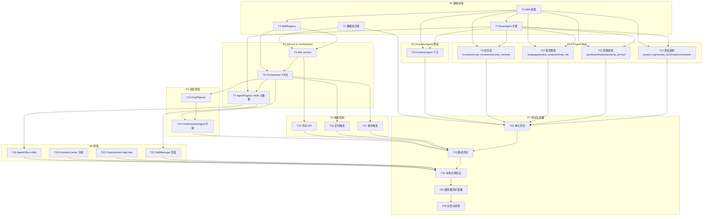

# TASK · AgentSkill 自进化与总调度升级

> 阶段: Atomize
> 基于 DESIGN 文档拆分原子任务, 每个任务可独立编译和测试, 依赖关系清晰无循环。

---

## 0. 任务总览

**总计 22 个原子任务**, 按 8 个优先级批次(P0~P7)组织:

| 批次 | 主题 | 任务数 | 依赖 |
|---|---|---|---|
| P0 | 基础设施 | 4 | 无 |
| P1 | Service 与 Orchestrator | 3 | P0 |
| P2 | EvolutionAgent 改造 | 1 | P0-T2 |
| P3 | 14 Agent 专属 Skill | 4 | P0-T2 |
| P4 | 双层调度 | 2 | P1/P3 |
| P5 | 触发机制 | 3 | P1 |
| P6 | 前端 | 4 | P1/P5 |
| P7 | 测试与部署 | 4 | 全部 |

---

## 1. 任务依赖图

---

## 2. P0 基础设施(4 任务, 可并行)

### T1 · 数据库迁移

- **目标**: `evolution_proposal` 加 `agent_name` 字段 + 新增 `agent_skill_record` 表
- **输入契约**:
  - 前置依赖: 无
  - 输入: 现有 `evolution_proposal` 表(MySQL 8.0, 3307端口)
  - 环境: 本地 Docker MySQL 容器 `cr_mysql` 可用
- **输出契约**:
  - 文件: `backend/alembic/versions/003_agent_skill_evolution.py`
  - 文件: `backend/app/models/agent_skill_record.py`(SQLAlchemy 模型)
  - 文件: `backend/app/models/evolution_proposal.py` 修改: 加 `agent_name` 字段
  - 验收: `alembic upgrade head` 在本地 MySQL 跑通, `evolution_proposal.agent_name` 字段已加且旧数据默认 `evolution`, `agent_skill_record` 表已创建, 索引齐全
- **实现约束**:
  - 技术栈: Alembic + SQLAlchemy 2.x
  - `agent_name` 加 `server_default="evolution"` 兼容旧数据
  - `agent_skill_record` 继承 `IdMixin + TimestampMixin`(参考现有模型)
  - 索引: `(agent_name, created_at)`、`(skill_name, effect)`
- **依赖关系**: 后置: T5/T22

### T2 · Skill 基类实现

- **目标**: 实现 `BaseSkill` / `SkillResult` / `SelfImprovementSkill` / `ProactiveSkill` / `ProactiveAction` 五个核心抽象
- **输入契约**:
  - 前置依赖: 无
  - 输入: DESIGN §3.2/§3.3/§3.4 接口契约
  - 环境: 项目可 import `app.agents.base`
- **输出契约**:
  - 文件: `backend/app/agents/skills/__init__.py`(空 init)
  - 文件: `backend/app/agents/skills/base.py`(BaseSkill + SkillResult)
  - 文件: `backend/app/agents/skills/self_improvement.py`(SelfImprovementSkill)
  - 文件: `backend/app/agents/skills/proactive.py`(ProactiveSkill + ProactiveAction)
  - 验收: `python -c "from app.agents.skills.base import BaseSkill, SkillResult"` 不报错; `python -c "from app.agents.skills.self_improvement import SelfImprovementSkill"` 不报错; `python -c "from app.agents.skills.proactive import ProactiveSkill, ProactiveAction"` 不报错
- **实现约束**:
  - Python 3.9, `Optional[X]` 风格
  - 所有类与函数需 docstring(功能/参数/返回值)
  - `SelfImprovementSkill.evolve()` 模板方法封装七步闭环, 调用 `evolution_service` / `feedback_service` / `eval_gate`
  - `ProactiveSkill.run()` 根据 `params.action_type` 路由到 4 个子方法
- **依赖关系**: 后置: T3/T4/T8/T9/T10/T11/T12

### T3 · SkillRegistry 单例

- **目标**: 实现 Skill 注册中心
- **输入契约**:
  - 前置依赖: T2
  - 输入: BaseSkill 抽象
- **输出契约**:
  - 文件: `backend/app/agents/skills/registry.py`
  - 验收: `SkillRegistry.instance()` 单例可用; `register/get/list_for_agent/list_all/list_tools` 五方法可用; `list_tools()` 输出符合 OpenAI tools 格式
- **实现约束**:
  - 单例模式(参考 `AgentRegistry`)
  - `list_tools()` 输出 `[{"type": "function", "function": {"name", "description", "parameters"}}]`
  - 线程安全(用 threading.Lock 保护 register)
- **依赖关系**: 后置: T5/T6

### T4 · BaseAgent 扩展

- **目标**: `BaseAgent` 加 `_skills` 属性 + `attach_skill` / `_init_skills` 方法
- **输入契约**:
  - 前置依赖: T2/T3
  - 输入: 现有 `backend/app/agents/base.py`
- **输出契约**:
  - 文件: `backend/app/agents/base.py` 修改
  - 验收: `BaseAgent` 实例有 `_skills: list` 属性; `attach_skill(skill)` 能挂载并注册到 `SkillRegistry`; `_init_skills()` 默认空实现, 子类可 override
- **实现约束**:
  - 保留原 `skills: tuple = ()` 字段向后兼容
  - `attach_skill` 调用 `SkillRegistry.instance().register(self.name, skill)`
  - `_init_skills` 在 `__init__` 末尾调用
- **依赖关系**: 后置: T7/T8/T9/T10/T11/T12

---

## 3. P1 Service & Orchestrator(3 任务)

### T5 · skill_service

- **目标**: 实现 Skill 调用统一入口, 写 `agent_skill_record`
- **输入契约**:
  - 前置依赖: T1/T3
  - 输入: `SkillRegistry` + `agent_skill_record` 模型
- **输出契约**:
  - 文件: `backend/app/services/skill_service.py`
  - 函数: `invoke_skill_with_record(db, agent_name, skill_name, params, trigger_type, trigger_source, user)` → `dict`
  - 验收: 调用后 `agent_skill_record` 表新增一条记录, 字段完整
- **实现约束**:
  - 异常捕获: Skill 抛异常时写 `effect=failed` 记录, 不传播
  - `output_summary` 限 500 字
  - 写 `audit_log`(manual 模式)
- **依赖关系**: 后置: T6/T15

### T6 · Orchestrator 新增 4 方法

- **目标**: `Orchestrator` 加 `invoke_tool` / `invoke_skill` / `list_agent_skills` / `trigger_evolution`
- **输入契约**:
  - 前置依赖: T3/T5
  - 输入: 现有 `backend/app/agents/orchestrator.py`
- **输出契约**:
  - 文件: `backend/app/agents/orchestrator.py` 修改
  - 验收: 4 方法可用; `invoke_tool("list_projects", {})` 能调固定方法; `invoke_skill("code_reviewer", "code_reviewer.self_improve", {})` 能调 Skill
- **实现约束**:
  - `invoke_tool` 内部判断 tool_name 是否在 SkillRegistry, 是则调 Skill, 否则映射到固定方法
  - `trigger_evolution` 调 `invoke_skill(agent_name, "{agent_name}.self_improve", {"action": "evolve", "window_days": ...})`
  - 请求级实例(`get_request_orchestrator`)也支持新方法
- **依赖关系**: 后置: T7/T13/T14/T16/T17

### T7 · AgentRegistry skills 元数据升级

- **目标**: `list_runtime()` 把 skills 从 `list[str]` 升级为结构化 `list[dict]`
- **输入契约**:
  - 前置依赖: T4/T6
  - 输入: 现有 `backend/app/agents/registry.py`
- **输出契约**:
  - 文件: `backend/app/agents/registry.py` 修改
  - 验收: `GET /api/agents/runtime` 返回每个 Agent 的 skills 为 `[{"name", "description", "type", "invocable"}]`
- **实现约束**:
  - 调用 `SkillRegistry.instance().list_for_agent(name)` 取结构化元数据
  - 若 Skill 列表为空, fallback 到原 `tuple of str`
  - 不破坏前端旧版本(字段兼容)
- **依赖关系**: 后置: T18/T21

---

## 4. P2 EvolutionAgent 改造(1 任务)

### T8 · EvolutionAgent 保留并下沉

- **目标**: `EvolutionAgent` 挂载 `EvolutionSelfImprovementSkill` + `EvolutionProactiveSkill`, `run()` 委托给 Skill
- **输入契约**:
  - 前置依赖: T2/T4
  - 输入: 现有 `backend/app/agents/evolution_agent.py` + `evolution_service.py` + `feedback_service.py` + `eval_gate.py`
- **输出契约**:
  - 文件: `backend/app/agents/skills/evolution.py`(EvolutionSelfImprovementSkill + EvolutionProactiveSkill)
  - 文件: `backend/app/agents/evolution_agent.py` 修改
  - 验收: `EvolutionAgent.run()` 签名不变, 内部委托; 现有 `/api/evolution/*` 端点测试全通过; `EvolutionAgent` 自身挂载 2 Skill
- **实现约束**:
  - `EvolutionSelfImprovementSkill.evolve_target` 复用 `generate_fp_proposals` + `_distill_rule`
  - `EvolutionSelfImprovementSkill.aggregate_feedback` 复用 `feedback_service.aggregate_by_issue_type`
  - `EvolutionSelfImprovementSkill.evaluate_gate` 复用 `eval_gate`
  - `EvolutionAgent.run()` 内部: `self._self_improve_skill.evolve(self._db, window_days, ctx)`
  - `evolution_proposal.agent_name` 写入 `evolution`
- **依赖关系**: 后置: T22

---

## 5. P3 14 Agent 专属 Skill(4 任务, 可并行)

> 每个任务实现 1 批 Agent 的 SelfImprovement + Proactive Skill, 在 Agent 类的 `_init_skills()` 中挂载。

### T9 · 优先批(evolution / code_reviewer / security_sentinel)

- **目标**: 3 个核心 Agent 的 6 个 Skill 子类
- **输入契约**:
  - 前置依赖: T2/T4
  - 输入: 现有 `code_reviewer` / `security_sentinel` Agent + EvolutionAgent 闭环
- **输出契约**:
  - 文件: `backend/app/agents/skills/code_reviewer.py`(2 类)
  - 文件: `backend/app/agents/skills/security_sentinel.py`(2 类)
  - 文件: `backend/app/agents/review_agent.py` 修改: 加 `_init_skills()`
  - 文件: `backend/app/agents/security_sentinel_agent.py` 修改: 加 `_init_skills()`
  - 验收: 3 Agent 各挂载 2 Skill; `code_reviewer.self_improve` 能产出 `evolution_proposal(agent_name=code_reviewer)`; `security_sentinel.self_improve` 能产出安全规则提案
- **实现约束**:
  - `CodeReviewerSelfImprovementSkill` 复用 `feedback_service` + `generate_fp_proposals`
  - `SecuritySentinelSelfImprovementSkill` 进化 `security_static_rules` / `security_patterns`(在内存字典基础上产出新增/调整提案)
  - 4 类 ProactiveSkill 行为按 §3.4 实现
- **依赖关系**: 后置: T22

### T10 · 检测类批(language_detector / project_analyzer / code_file_manager)

- **目标**: 3 个检测类 Agent 的 6 个 Skill 子类
- **输入契约**:
  - 前置依赖: T2/T4
  - 输入: 现有 `language_detector` / `project_analyzer` / `code_file_manager` Agent + `ai_call_log` 表
- **输出契约**:
  - 文件: `backend/app/agents/skills/language_detector.py`
  - 文件: `backend/app/agents/skills/project_analyzer.py`
  - 文件: `backend/app/agents/skills/code_file_manager.py`
  - 3 个 Agent 类修改: 加 `_init_skills()`
  - 验收: 3 Agent 各挂载 2 Skill
- **实现约束**:
  - `LanguageDetectorSelfImprovementSkill.evolve_target`: 从 `ai_call_log` 挖 detect 调用 + 用户修正信号, 产出语言指纹提案(扩展名/关键字/路径模式)
  - 由于无现有反馈表, 进化对象存到 `evolution_proposal.payload`(JSON)
  - `ProactiveSkill.scan_domain`: 检测类 Agent 主动巡检近 7 天的低置信检测结果
- **依赖关系**: 后置: T22

### T11 · 配置类批(dashboard / rule_manager / reporter / ai_prompt)

- **目标**: 4 个配置类 Agent 的 8 个 Skill 子类
- **输入契约**:
  - 前置依赖: T2/T4
- **输出契约**:
  - 文件: `backend/app/agents/skills/dashboard.py`
  - 文件: `backend/app/agents/skills/rule_manager.py`
  - 文件: `backend/app/agents/skills/reporter.py`
  - 文件: `backend/app/agents/skills/ai_prompt.py`
  - 4 Agent 类修改: 加 `_init_skills()`
  - 验收: 4 Agent 各挂载 2 Skill
- **实现约束**:
  - `DashboardSelfImprovementSkill`: 进化指标阈值(评分等级/告警阈值), 信号来自 dashboard 调用日志 + admin 修正
  - `RuleManagerSelfImprovementSkill`: 进化规则元数据(分类/严重度映射)
  - `ReporterSelfImprovementSkill`: 进化报告模板片段(prompt 片段写入 `evolution_proposal.payload`)
  - `AiPromptSelfImprovementSkill`: 进化提示词模板(target_tool 模板)
- **依赖关系**: 后置: T22

### T12 · 调度类批(project_manager / review_orchestrator / chat_assistant / orchestrator)

- **目标**: 4 个调度类 Agent 的 8 个 Skill 子类
- **输入契约**:
  - 前置依赖: T2/T4
- **输出契约**:
  - 文件: `backend/app/agents/skills/project_manager.py`
  - 文件: `backend/app/agents/skills/review_orchestrator.py`
  - 文件: `backend/app/agents/skills/chat_assistant.py`
  - 文件: `backend/app/agents/skills/orchestrator_skill.py`
  - 4 Agent 类修改: 加 `_init_skills()`
  - 验收: 4 Agent 各挂载 2 Skill
- **实现约束**:
  - `ReviewOrchestratorSelfImprovementSkill`: 进化审查编排策略(quick/standard/full 各类型 Agent 调用顺序)
  - `ChatAssistantSelfImprovementSkill`: 进化意图识别 prompt 片段 + 路由策略
  - `OrchestratorSelfImprovementSkill`: 进化 Agent 路由策略(意图→Agent 映射)
  - `ProactiveSkill.reflect_from_logs`: 从 `ai_call_log` 挖调度成功率/耗时趋势
- **依赖关系**: 后置: T22

---

## 6. P4 双层调度(2 任务)

### T13 · ChatPlanner

- **目标**: 实现 LLM 动态规划调用链
- **输入契约**:
  - 前置依赖: T6
  - 输入: `SkillRegistry.list_tools()` + 该 intent 相关固定 handler
- **输出契约**:
  - 文件: `backend/app/agents/chat_planner.py`(`ToolCall` + `ChatPlanner`)
  - 验收: `plan(intent, ctx)` 返回 `list[ToolCall]`(≤5步); 超时 10s 抛 `TimeoutError`; 非法 tool_name 抛 `ValueError`
- **实现约束**:
  - LLM 调用复用 `BaseAgent.call_json` 机制
  - 规划 prompt 包含: 用户原始消息 + 意图 + tools 列表 + "请规划调用链, 最多 5 步, 输出 JSON 数组"
  - `_validate_plan`: tool_name 必须在 tools 列表中, 否则抛 ValueError
  - 超时用 `concurrent.futures.ThreadPoolExecutor` + `future.result(timeout=10)`
- **依赖关系**: 后置: T14

### T14 · ChatAssistantAgent 双层升级

- **目标**: ChatAgent 集成 ChatPlanner, 新增 3 种 intent handler
- **输入契约**:
  - 前置依赖: T6/T13
  - 输入: 现有 `chat_agent.py`
- **输出契约**:
  - 文件: `backend/app/agents/chat_agent.py` 修改
  - 验收: `execute()` 走双层调度; `CHAT_DOUBLE_LAYER_ENABLED=false` 时回退单层; 新增 `_handle_evolution_trigger` / `_handle_agent_skill_invoke` / `_handle_agent_status` 三 handler
- **实现约束**:
  - `_INTENT_SYSTEM` prompt 扩展 3 种 intent 描述
  - `execute()` 流程: 意图分类 → (双层 enabled? 走 planner + execute_plan : 走原 handler) → 返回
  - `_execute_plan(plan, ctx)`: 顺序执行, 上一步输出作为下一步上下文, 失败终止
  - 降级路径: planner 抛异常时 fallback 到单步 handler
- **依赖关系**: 后置: T23

---

## 7. P5 触发机制(3 任务, 可并行)

### T15 · 手动 API

- **目标**: 新增 `/api/agents/{name}/skills/{skill}/invoke` + 扩展 `/api/evolution/trigger`
- **输入契约**:
  - 前置依赖: T5/T6
  - 输入: 现有 `backend/app/api/v1/agents.py` + `evolution.py`
- **输出契约**:
  - 文件: `backend/app/api/v1/agents.py` 修改
  - 文件: `backend/app/api/v1/evolution.py` 修改
  - 文件: `backend/app/schemas/agent.py` 修改: 加 `SkillInvokeIn` / `SkillInvokeOut` schema
  - 验收: `POST /api/agents/code_reviewer/skills/code_reviewer.self_improve/invoke` 返回 200 + 写 `agent_skill_record`; 非 admin 调用返回 403
- **实现约束**:
  - 鉴权: 仅 `role=admin`(复用现有 `get_current_admin_user` 依赖)
  - 写 `audit_log`(action=skill_invoke)
- **依赖关系**: 后置: T23

### T16 · 定时触发

- **目标**: `scheduler_service` 注册 per-Agent 定时进化任务
- **输入契约**:
  - 前置依赖: T6
  - 输入: 现有 `backend/app/services/scheduler_service.py`
- **输出契约**:
  - 文件: `backend/app/services/scheduler_service.py` 修改
  - 文件: `backend/app/services/agent_scheduler_runtime.py` 修改(若需要)
  - 验收: 注册后 cron 到点能触发; `agent_skill_record.trigger_type='scheduled'`
- **实现约束**:
  - 默认 cron: 每日 03:00 跑 evolution(全 Agent 轮询), 每小时跑 proactive_check
  - 用 `Orchestrator.trigger_evolution(agent_name)` + `invoke_skill(agent_name, "{agent_name}.proactive", {"action_type": "check_proactive"})`
  - 全局并发限制 N=3(用 Semaphore)
- **依赖关系**: 后置: T23

### T17 · 事件触发

- **目标**: `event_bus` 订阅事件触发 Skill
- **输入契约**:
  - 前置依赖: T6
  - 输入: 现有 `backend/app/agents/event_bus.py` + `events.py`
- **输出契约**:
  - 文件: `backend/app/agents/event_bus.py` 修改: 加 `subscribe_skill_triggers()`
  - 文件: `backend/app/agents/events.py` 修改: 加 `REVIEW_ISSUE_STATUS_CHANGED` / `SECURITY_SCAN_COMPLETED` / `AI_CALL_THRESHOLD_REACHED` / `EVOLUTION_PROPOSAL_PROMOTED` 事件类型(若不存在)
  - 验收: emit 事件后 5min 内触发对应 Skill; `agent_skill_record.trigger_type='event'`
- **实现约束**:
  - 去抖: 内存 dict + 时间戳, 5min 内同 key 不重复触发
  - 并发限制: 复用 T16 的 Semaphore
  - 订阅清单按 CONSENSUS §6
- **依赖关系**: 后置: T23

---

## 8. P6 前端(4 任务, 可并行)

### T18 · AgentOffice skills 展示

- **目标**: Agent 办公室卡片展示 skills 列表
- **输入契约**:
  - 前置依赖: T7
  - 输入: 现有 `frontend/src/views/AgentOffice.vue` + `/api/agents/runtime` 响应
- **输出契约**:
  - 文件: `frontend/src/views/AgentOffice.vue` 修改
  - 验收: 每个 Agent 卡片显示 skills 标签(颜色按 type 区分)
- **实现约束**: Element Plus `<el-tag>`, 不破坏现有布局
- **依赖关系**: 后置: T24

### T19 · EvolutionCenter 按 Agent 分组

- **目标**: 进化中心提案按 `agent_name` 分组
- **输入契约**:
  - 前置依赖: T1(后端字段就绪)
  - 输入: 现有 `frontend/src/views/EvolutionCenter.vue`
- **输出契约**:
  - 文件: `frontend/src/views/EvolutionCenter.vue` 修改
  - 文件: `frontend/src/api/evolution.ts` 修改: 提案接口加 `agent_name` 字段
  - 验收: 提案列表按 Agent 分组; 支持按 Agent 筛选
- **实现约束**: Element Plus `<el-collapse>` 分组 + `<el-select>` 筛选
- **依赖关系**: 后置: T24

### T20 · ChatAssistant step tree

- **目标**: ChatAgent 聊天界面展示 LLM 规划的调用链
- **输入契约**:
  - 前置依赖: T14
  - 输入: 现有 `frontend/src/views/ChatAssistant.vue` + `/api/ai_chat` 响应(需扩展返回 plan_steps)
- **输出契约**:
  - 文件: `frontend/src/views/ChatAssistant.vue` 修改
  - 文件: `frontend/src/api/ai_chat.ts` 修改: 响应 schema 加 `plan_steps`
  - 文件: `backend/app/schemas/ai_chat.py` 修改: 响应加 `plan_steps: list[dict]`
  - 验收: 聊天回复下方展示 step tree(每步 tool_name/状态/耗时)
- **实现约束**: Element Plus `<el-timeline>`, 仅双层调度开启时显示
- **依赖关系**: 后置: T24

### T21 · SkillManager 新页面

- **目标**: 新增 Skill 管理页面
- **输入契约**:
  - 前置依赖: T7/T15
  - 输入: 新端点 `/api/agents/{name}/skills` + `/api/agents/skill-records`
- **输出契约**:
  - 文件: `frontend/src/views/SkillManager.vue`(新)
  - 文件: `frontend/src/api/skill.ts`(新)
  - 文件: `frontend/src/router/index.ts` 修改: 加路由
  - 文件: `backend/app/api/v1/agents.py` 修改: 加 `GET /api/agents/{name}/skills` + `GET /api/agents/skill-records`
  - 验收: 页面展示所有 Skill(按 Agent 分组); admin 可点击"触发"按钮; 显示调用历史
- **实现约束**: 表格 + 触发按钮 + 历史抽屉
- **依赖关系**: 后置: T24

---

## 9. P7 测试与部署(4 任务, 顺序)

### T22 · 单元测试

- **目标**: Skill 基类 / SkillRegistry / skill_service / ChatPlanner / 14 Agent Skill 单测
- **输入契约**:
  - 前置依赖: T1~T12
- **输出契约**:
  - 文件: `backend/tests/unit/agents/skills/test_base.py`
  - 文件: `backend/tests/unit/agents/skills/test_registry.py`
  - 文件: `backend/tests/unit/agents/skills/test_self_improvement.py`
  - 文件: `backend/tests/unit/agents/skills/test_proactive.py`
  - 文件: `backend/tests/unit/services/test_skill_service.py`
  - 文件: `backend/tests/unit/agents/test_chat_planner.py`
  - 文件: `backend/tests/unit/agents/skills/test_<agent>.py` × 14
  - 验收: `pytest backend/tests/unit/agents/skills/ backend/tests/unit/services/test_skill_service.py backend/tests/unit/agents/test_chat_planner.py` 全通过; 现有 `test_evolution_agent.py` / `test_evolution_service.py` 全通过(回归)
- **实现约束**:
  - 测试优先: 边界条件 / 异常情况全覆盖
  - Skill 钩子测纯函数(`evolve_target` / `check_proactive`)
  - ChatPlanner 用 mock LLM 测
  - `agent_skill_record` 写入用 SQLite 内存 DB 测
- **依赖关系**: 后置: T23

### T23 · 集成测试

- **目标**: 14 Agent Skill 挂载 / 双层调度链路 / 触发机制集成测
- **输入契约**:
  - 前置依赖: T14/T15/T16/T17/T22
- **输出契约**:
  - 文件: `backend/tests/unit/services/test_skill_integration.py`
  - 文件: `backend/tests/unit/agents/test_chat_double_layer.py`
  - 文件: `backend/tests/unit/services/test_skill_triggers.py`
  - 验收: 集成测试全通过
- **实现约束**:
  - 测 14 Agent 启动后 `SkillRegistry.list_all()` 返回 28 个 Skill
  - 测 ChatAgent 双层调度能串联 3 步调用链
  - 测手动/定时/事件三种触发都写 `agent_skill_record`
  - 测 `CHAT_DOUBLE_LAYER_ENABLED=false` 回退行为
- **依赖关系**: 后置: T24

### T24 · 本地全栈验证

- **目标**: 启动 Docker MySQL + 后端 + 前端, 真实点击验证
- **输入契约**:
  - 前置依赖: T18/T19/T20/T21/T23
- **输出契约**:
  - 文件: `docs/AgentSkill自进化与总调度升级/ACCEPTANCE_AgentSkill自进化与总调度升级.md`(部分, 记录验证结果)
  - 验收: 后端启动无错(`uvicorn app.main:app`); 前端启动无错(`npm run dev`); Agent 办公室显示 14 Agent × 2 Skill; 进化中心按 Agent 分组; ChatAgent 能触发 code_reviewer 自进化; SkillManager 页面可手动触发 Skill; `agent_skill_record` 表有记录
- **实现约束**:
  - 启动顺序: Docker MySQL → 后端 alembic upgrade → 后端启动 → 前端启动
  - 验证 CONSENSUS §7 全部验收口径(A1~F2)
- **依赖关系**: 后置: T25

### T25 · 服务器同步部署

- **目标**: rsync 同步到服务器 + deploy.sh 重建容器 + 健康检查
- **输入契约**:
  - 前置依赖: T24
  - 服务器: `81.70.251.90`, root, 密码 `Lijd20041107`, 路径 `/opt/code-review`
- **输出契约**:
  - 验收: rsync 同步成功; `deploy/deploy.sh` 重建成功; 数据库迁移成功; `https://lijiadong.cn/api/health` 返回 200; 关键 API 抽测通过
- **实现约束**:
  - 部署前服务器手动备份数据库(`mysqldump`)
  - rsync 排除: `.git` / `node_modules` / `__pycache__` / `.env` / `*.pyc`
  - 失败回滚: Alembic downgrade + 恢复备份
- **依赖关系**: 后置: T26

### T26 · 文档与收尾

- **目标**: 生成 `.claude/skills/` SKILL.md + ACCEPTANCE / FINAL / TODO 文档
- **输入契约**:
  - 前置依赖: T25
- **输出契约**:
  - 文件: `.claude/skills/README.md`(总览)
  - 文件: `.claude/skills/base-skill.md` / `self-improvement-skill.md` / `proactive-skill.md` / `skill-registry.md` / `chat-planner.md`
  - 文件: `.claude/skills/<agent>/self-improve.md` + `proactive.md` × 14
  - 文件: `docs/AgentSkill自进化与总调度升级/ACCEPTANCE_AgentSkill自进化与总调度升级.md`(完整)
  - 文件: `docs/AgentSkill自进化与总调度升级/FINAL_AgentSkill自进化与总调度升级.md`
  - 文件: `docs/AgentSkill自进化与总调度升级/TODO_AgentSkill自进化与总调度升级.md`
  - 验收: 28+1 个 SKILL.md 全部生成; 6A 全套文档完整
- **实现约束**:
  - SKILL.md 按 DESIGN §10.2 模板
  - FINAL 文档总结: 完成情况 / 质量评估 / 风险残留
  - TODO 文档: 待办事宜 / 缺少配置 / 用户支持事项
- **依赖关系**: 无后置

---

## 10. 任务执行检查清单

### 10.1 完整性检查

- ✅ 任务覆盖 CONSENSUS §7 全部 6 类验收口径(A/B/C/D/E/F)
- ✅ 22 个原子任务, 每个 ≤ 1 个工作日复杂度
- ✅ 14 个 Agent 全部有 Skill 实现(T8~T12 共 5 任务覆盖 14 Agent + evolution)

### 10.2 一致性检查

- ✅ 与 ALIGNMENT / CONSENSUS / DESIGN 三文档保持一致
- ✅ 接口契约与 DESIGN §3/§5 一致
- ✅ 数据模型与 DESIGN §6 一致

### 10.3 可行性检查

- ✅ 每个 Skill 子类只实现 2 个钩子, 复杂度可控
- ✅ EvolutionAgent 改造保持 API 兼容, 现有测试不挂
- ✅ ChatAgent 双层调度有 fallback, 风险可控
- ✅ 数据库迁移加默认值, 兼容旧数据

### 10.4 可测性检查

- ✅ T22 单元测试覆盖所有 Skill 钩子
- ✅ T23 集成测试覆盖双层调度 + 触发机制
- ✅ T24 本地全栈验证 CONSENSUS §7 全部验收口径
- ✅ 每个任务都有独立验收标准

### 10.5 依赖无循环检查

- ✅ 任务依赖图(DAG)无循环
- ✅ P0 是基础, P1 依赖 P0, P2/P3 依赖 P0, P4 依赖 P1/P3, P5 依赖 P1, P6 依赖 P1/P5, P7 依赖全部
- ✅ 同一批次内任务可并行

---

## 11. 执行顺序建议

**第 1 批(并行)**: T1, T2 → T3, T4
**第 2 批(并行)**: T5, T7, T8, T9, T10, T11, T12
**第 3 批(并行)**: T6, T13
**第 4 批(并行)**: T14, T15, T16, T17, T18(部分), T19, T21
**第 5 批**: T20(需 T14), T22(需 T8~T12)
**第 6 批**: T23
**第 7 批**: T24
**第 8 批**: T25
**第 9 批**: T26

**进入 Approve 阶段**: 整理检查清单, 中断等待用户审批后开始 Automate。
