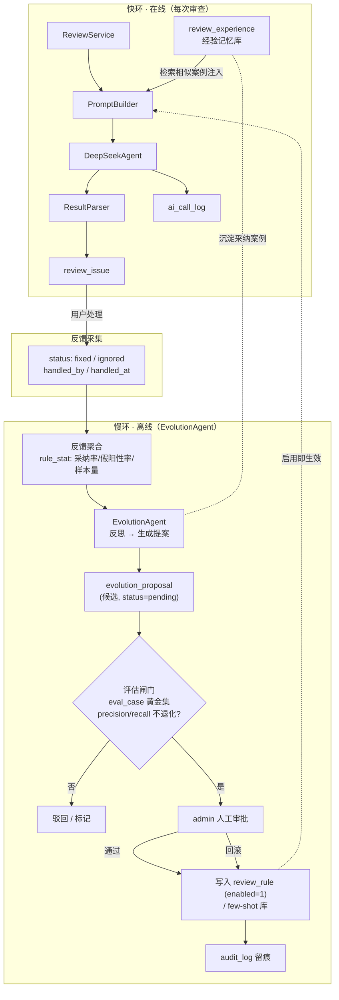

# DESIGN_Agent自进化

## 1. 总体架构

自进化是一条叠加在现有审查链路之上的「双环」：**快环**（在线，每次审查时检索经验、抑制已知噪声，不改模型）+ **慢环**（离线/定时，聚合反馈、蒸馏规则、过闸门、人工审批）。

**闭环出口**：`PROMOTE` 写入的 `review_rule` 在下次审查由 `prompt_builder._format_rules()` 自动注入 Prompt——无需改审查代码，规则启用即生效。

## 2. 核心组件

| 组件 | 位置（建议） | 职责 |
|---|---|---|
| `EvolutionAgent` | `backend/app/agents/evolution_agent.py` | 慢环主体：消费聚合反馈，生成进化提案 |
| `evolution_service` | `backend/app/services/evolution_service.py` | 反馈聚合、提案生命周期、闸门调度、回滚 |
| `feedback_aggregator` | `evolution_service` 内 | 由 `review_issue` 算 `rule_stat`（采纳率/假阳性率/样本量） |
| `experience_store` | `backend/app/services/experience_service.py` | 经验库读写 + 相似检索（指纹/关键词，向量可选） |
| `eval_gate` | `evolution_service` 内 | 在 `eval_case` 黄金集上复跑审查，比对 precision/recall |
| `ReviewExperience` 模型 | `backend/app/models/review_experience.py` | 经验记忆表 |
| `EvolutionProposal` 模型 | `backend/app/models/evolution_proposal.py` | 进化提案表 |
| `EvalCase` 模型 | `backend/app/models/eval_case.py` | 黄金回归集 |
| API | `backend/app/api/v1/evolution.py` | 触发进化、列提案、审批/驳回/回滚、看指标 |
| 前端 | `frontend/src/views/EvolutionCenter.vue` | 进化中心：提案审批台 + 指标看板 |

`EvolutionAgent` 复用 `BaseAgent`，注册进 `AgentRegistry`，享有现有态势感知/事件总线展示。

## 3. 数据模型（新增 3 张表）

沿用 `IdMixin + TimestampMixin`，LONGTEXT 用 `.with_variant(Text, "sqlite")` 兼容本地 SQLite。

### 3.1 `review_experience`（经验记忆库 · L1）

| 字段 | 类型 | 说明 |
|---|---|---|
| `fingerprint` | String(64) | 问题指纹（复用 `_issue_fingerprint` 思路：issue_type+归一化代码模式哈希） |
| `language` | String(30) | 适用语言 |
| `issue_type` | String(50) | 问题类型 |
| `code_pattern` | Text | **脱敏**的代表性代码片段（去标识符/字面量） |
| `canonical_suggestion` | Text | 该类问题的优质修复建议（取自被 fixed 的案例） |
| `accepted_count` | Integer | 被采纳（fixed）次数 |
| `rejected_count` | Integer | 被忽略（ignored）次数 |
| `weight` | Float | 时间衰减权重（见 §5） |
| `last_seen` | DateTime | 最近一次出现，用于衰减 |
| `project_id` / `user_id` | BigInteger nullable | 作用域（NULL=全局），支持本仓库/本团队定制 |

### 3.2 `evolution_proposal`（进化提案 · L2/L3）

| 字段 | 类型 | 说明 |
|---|---|---|
| `proposal_type` | String(30) | `new_rule` / `disable_rule` / `adjust_severity` / `narrow_language` / `new_fewshot` |
| `target_rule_id` | BigInteger nullable | 针对已有规则的提案指向 |
| `payload` | Text(JSON) | 提案内容（如新规则的 rule_name/rule_content/severity/language） |
| `evidence` | Text(JSON) | 支撑证据（样本量、采纳率/假阳性率、代表案例 id） |
| `status` | String(20) | `pending` / `eval_passed` / `eval_failed` / `approved` / `rejected` / `promoted` / `rolled_back` |
| `eval_score` | Text(JSON) nullable | 闸门跑分（before/after 的 precision/recall/FP） |
| `created_by` | String(50) | `evolution_agent` |
| `reviewed_by` | BigInteger nullable | 审批人（admin） |
| `applied_rule_id` | BigInteger nullable | promote 后实际写入/改动的规则 id（用于回滚） |

### 3.3 `eval_case`（黄金回归集 · 闸门基准）

| 字段 | 类型 | 说明 |
|---|---|---|
| `name` | String(100) | 用例名 |
| `language` | String(30) | 语言 |
| `code` | Text | 代码片段 |
| `expected_issues` | Text(JSON) | 期望命中的问题（issue_type + 关键行/关键词） |
| `tags` | String(200) | 分类标签（security/perf/...） |
| `enabled` | SmallInteger | 是否纳入闸门 |
| `source` | String(30) | `seed`（内置）/ `from_feedback`（由真实采纳案例固化而来） |

> `rule_stat`（每规则采纳率/假阳性率）为**计算结果**，由 `feedback_aggregator` 在 `review_issue` 上实时/定时聚合得出，不单独建表（可加物化缓存表作为增强）。

## 4. 进化闭环（七步）

1. **Act**：正常审查产出 `review_issue`（快环已可附带经验检索结果）。
2. **Observe**：用户在问题闭环里把 issue 置为 `fixed` / `ignored`（信号已采集）。
3. **Aggregate**：`feedback_aggregator` 按 `rule_code` / `issue_type` / `language` 聚合 → 采纳率、假阳性率、样本量。
4. **Reflect**：`EvolutionAgent`（手动或定时触发）：
   - 高 `ignored` 率且样本足 → 提案 `disable_rule` / `adjust_severity`（降级）/ `narrow_language`。
   - 反复 `fixed` 且**不被现有规则覆盖**的新模式 → 调 LLM 蒸馏出一条 `new_rule`（人类可读 `rule_content`）。
   - 反复 `fixed` 的具体优质案例 → 写入 `review_experience` + 生成 `new_fewshot`。
5. **Gate**：`eval_gate` 把提案「试用」到 `eval_case` 黄金集上复跑，比对 before/after 的 precision/recall——**不退化才置 `eval_passed`**。
6. **Promote**：admin 在进化中心审批 → 写入 `review_rule`(`enabled=1`, `is_builtin=0`) / few-shot 库 → `audit_log` 留痕 → 下次审查经 `_format_rules` 自动生效。
7. **Rollback**：任一 `promoted` 提案可一键回滚（按 `applied_rule_id` 还原 `enabled` 或删除新增规则），同样留痕。

## 5. 时间衰减与去偏

- 经验权重：`weight = (accepted - λ·rejected) · 0.5^(Δdays / halflife)`，`halflife` 默认 30 天；权重低于阈值的经验不再注入 Prompt（自然淘汰，治理漂移）。
- 注入预算：每次审查最多注入 Top-K（默认 3）条最相关、最高权重的经验，避免抬高 token 成本。
- 去偏：聚合时按 `handled_by` 去重加权，避免单个用户的批量操作主导信号。

## 6. 防翻车设计（最关键）

| 风险 | 设计对策 |
|---|---|
| **Goodhart / 奖励黑客** | `ignored` 不自动删规则；触发提案需 **min 样本量（默认≥20）AND 跨 ≥2 任务/用户** 的双门槛；方向只「降权/收窄」，删除留给人工 |
| **回声室** | `eval_case` 含一批**人工 seed 锚点**，永不被进化覆盖；进化产物必须过闸门；探索（新规则禁用试跑）与利用（已启用规则）分离 |
| **分布漂移** | 经验时间衰减；`rule_stat` 用滑动窗口（默认近 90 天） |
| **闸门即产品** | **无 `eval_case` 不允许 promote**；闸门跑分写入 `eval_score` 可查 |
| **可解释/可回滚** | 进化产物均为人类可读的规则/示例；`evolution_proposal` 全生命周期留痕，`applied_rule_id` 支撑一键回滚 |
| **人工闸门** | 提案默认 `enabled=0`；仅 admin 可审批（复用现有角色与 `audit_log`） |

## 7. 与现有模块的衔接（最小侵入）

- **审查链路**：仅在 `PromptBuilder.build_prompt` 增加可选 `experience_section` 注入点；`ReviewService` 在构 Prompt 前调 `experience_store` 检索。其余链路不动。
- **规则注入**：进化产出的规则就是普通 `review_rule` 行，`_format_rules()` 无需改动。
- **Agent 体系**：`EvolutionAgent` 注册进 `AgentRegistry`，自动获得态势卡/事件流展示。
- **不引入新中间件**：聚合与闸门为同步批处理；触发走 API（手动）或现有定时方式。

## 8. 异常处理

- 进化任务失败只记 warning，不影响在线审查。
- 闸门复跑消耗 LLM 调用，统一计入 `ai_call_log`（带 `task_id=NULL` + 标记来源）。
- 经验检索失败时降级为「不注入」，审查照常进行。
- 提案 payload 校验失败 → 直接置 `rejected` 并记录原因。
