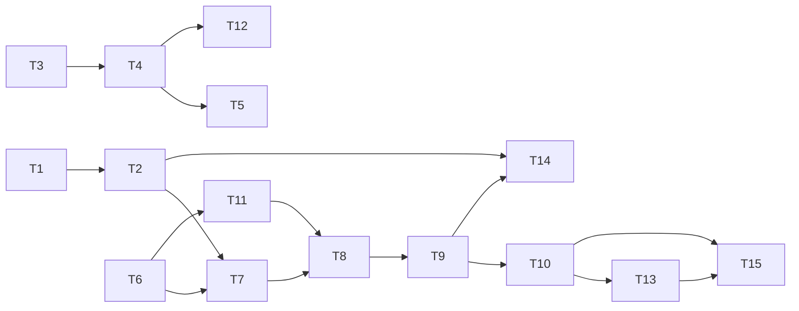

# TASK_Agent自进化

## 1. 分期路线

| 期 | 名称 | 目标 | 风险 |
|---|---|---|---|
| **P1** | 反馈聚合 + 经验记忆（L0/L1） | 把躺着的 `fixed/ignored` 信号变成可查指标 + 审查时注入相似经验 | 低，纯叠加、可关 |
| **P2** | 规则蒸馏 + 评估闸门 + 审批（L2，核心） | `EvolutionAgent` 产候选规则，过黄金集 + admin 审批后生效 | 中 |
| **P3** | few-shot 优化 + 进化中心前端（L3） | 采纳案例固化为示例；可视化提案审批台与指标看板 | 中 |
| **P4（远期）** | 技能合成 / 自动静态规则（L4） | 高频模式自动生成静态检查器 | 高，本期不做 |

> 建议先交付 **P1**（80% 价值、20% 风险），验证反馈信号质量后再进 P2。

> 交付状态(2026-05-31):**P1 + P2 已实现并通过测试**(104 项单测全绿,含 31 项自进化新测)。
> 建表沿用仓库现有约定 —— 本地 SQLite 走 `init_sqlite.py`(`create_all`),部署 MySQL 走
> `deploy/mysql/init.sql`(本仓库 `alembic/versions/` 为空,不实际使用 Alembic)。详见 `ACCEPTANCE`。

## 2. 原子任务

| ID | 任务 | 期 | 输入 | 输出 | 状态 |
|---|---|---|---|---|---|
| T1 | 文档归档（4 份 6A + ACCEPTANCE） | P0 | 设计讨论 | `docs/Agent自进化/` | ✅ 已完成 |
| T2 | `feedback_service`：由 `review_issue` 算反馈信号 | P1 | `review_issue` | 采纳率/假阳性率/样本量 | ✅ 已完成 |
| T3 | `review_experience` 模型 + 建表 | P1 | DESIGN §3.1 | ORM + init_sqlite/init.sql | ✅ 已完成 |
| T4 | `experience_service`：写入 + 相似检索（指纹/衰减） | P1 | T3 | 检索接口 | ✅ 已完成 |
| T5 | `PromptBuilder` 增 `experience_section` 注入点；`ReviewService` 接入 | P1 | T4 | 审查时注入经验 | ✅ 已完成 |
| T6 | `evolution_proposal` + `eval_case` 模型 + 建表 | P2 | DESIGN §3.2/3.3 | 两表 + init_sqlite/init.sql | ✅ 已完成 |
| T7 | `EvolutionAgent`：消费反馈 → 生成提案 | P2 | T2,T6 | 候选提案（带证据） | ✅ 已完成 |
| T8 | `eval_gate`：黄金集复跑 + before/after 跑分 | P2 | T6 | `eval_score` 写入 | ✅ 已完成 |
| T9 | `evolution_service`：提案生命周期 + 审批 + 回滚 | P2 | T7,T8 | 状态机 + `audit_log` | ✅ 已完成 |
| T10 | `api/v1/evolution.py`：触发/列表/审批/驳回/回滚/指标 | P2 | T9 | RESTful 接口 | ✅ 已完成 |
| T11 | 黄金集 seed 数据（含安全/性能/Bug 锚点用例） | P2 | — | `seed_eval_cases.py` 6 条 | ✅ 已完成 |
| T12 | few-shot 样本库 + 注入 | P3 | T4 | 采纳案例转示例 | ⏳ P3 未启动 |
| T13 | `EvolutionCenter.vue`：提案审批台 + 指标看板 | P3 | T10 | 前端视图 | ⏳ P3 未启动 |
| T14 | 单元测试 + 回归（聚合/检索/闸门/回滚/防翻车门槛） | 各期 | pytest | 31 项新测全绿 | ✅ 已完成 |
| T15 | 文档收尾（ACCEPTANCE / FINAL / TODO） | 收尾 | 实现结果 | 验收文档 | 🔄 ACCEPTANCE 已出 |

## 3. 依赖图

## 4. P1 交付物清单（建议起步）

- [ ] `feedback_aggregator`（采纳率/假阳性率/样本量，按 rule_code / issue_type / language）
- [x] `review_experience` 表 + 建表登记（`init_sqlite.py` + `deploy/mysql/init.sql`，兼容 SQLite/MySQL）
- [ ] `experience_service` 写入 + 相似检索 + 时间衰减权重
- [ ] `PromptBuilder` 经验注入点 + `ReviewService` 接入（Top-K 预算控制）
- [ ] 反馈指标 API（供后续看板与 EvolutionAgent 消费）
- [ ] 单元测试：聚合正确性、检索命中、衰减、注入预算上限

## 5. 验收映射

P1 → CONSENSUS A1、A2；P2 → A3、A4、A5、A6、A7、A8；P3 → A2（few-shot）、可视化。每期完成补一段 ACCEPTANCE。
