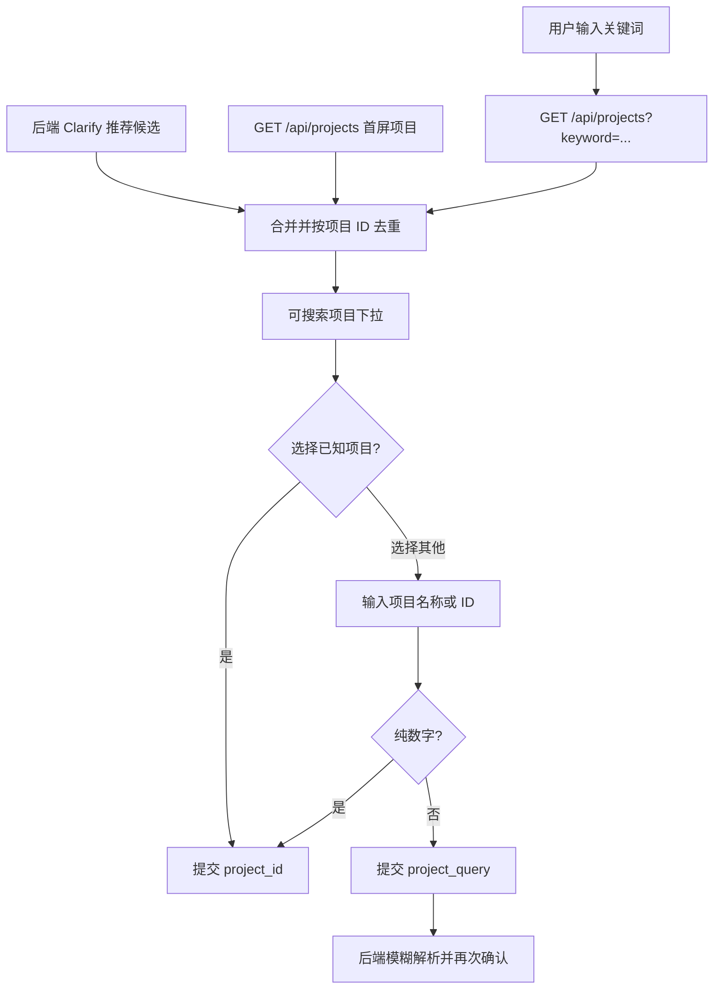

# Agent 项目选择模糊匹配与自定义输入 - 设计文档

## 数据流

## 前端模块

- 新增纯函数工具：选项合并、其他选项常量、自定义答案转换和必填校验。
- `AgentChatDrawer` 始终加载项目首屏，远程搜索按 250ms 防抖并使用请求序号防止旧响应覆盖新结果。
- 选择“其他”后显示独立输入框，避免把展示用哨兵值提交给后端。

## 后端集成

无需修改业务代码。`/api/agents/clarify` 合并答案后，`dispatch_with_payload` 会对缺失 `project_id` 且存在 `project_query` 的请求再次执行 `_resolve_project`。

## 异常处理

- 项目查询失败时保留后端推荐候选和“其他”入口。
- 空自定义输入在前端拦截。
- 没有可信匹配时后端继续返回候选，不直接执行操作。
