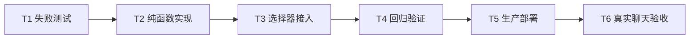

# Agent 项目选择模糊匹配与自定义输入 - 原子任务

## T1 失败测试

- 输入：候选项、自定义值和 Clarify 问题。
- 输出：选项合并、去重、其他选项、数字 ID、项目名称和空输入用例。
- 验收：实现前测试失败，失败原因对应缺失功能。

## T2-T3 实现

- 输入：后端推荐候选、项目 API 分页结果、用户关键词和自定义文本。
- 输出：稳定的项目选择器与合法 Clarify answers。
- 约束：不提交哨兵值，不绕过后端确认和权限检查。

## T4-T6 评估与部署

- 输入：通过的前后端代码与生产备份。
- 输出：新前端镜像、容器健康证据和真实 Agent 追问截图/DOM 证据。
- 验收：可搜索多个项目，可选择其他并输入名称，提交后后端正常继续追问或执行。

## 执行状态

- [x] T1 失败测试：缺少候选合并工具和搜索收窄逻辑时分别准确失败。
- [x] T2 纯函数实现：完成去重合并、搜索数据源切换和自定义答案转换。
- [x] T3 选择器接入：完成远程搜索、其他输入、加载状态和 3100 层级弹层。
- [x] T4 回归验证：前端 56 passed，后端 1041 passed，规范与构建检查通过。
- [x] T5 生产部署：Frontend 已切换到最终镜像。
- [x] T6 真实聊天验收：搜索、点击、自定义输入和 Clarify 回填全部通过。
