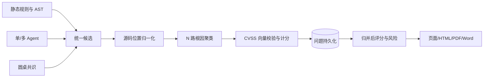
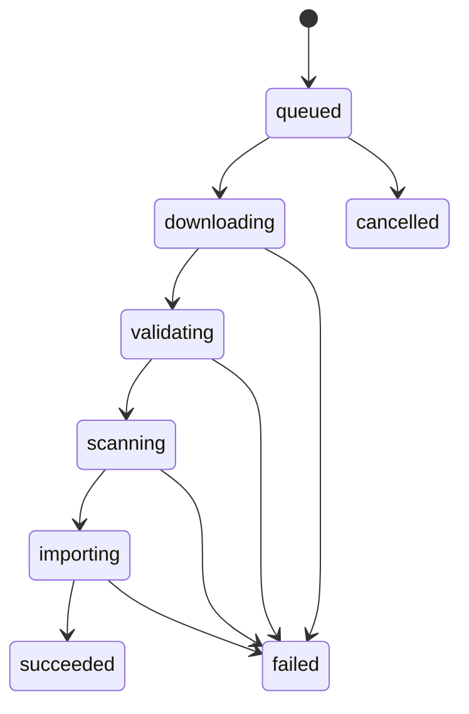

# Prism 测试报告完整修复：设计文档

## 总体架构

## 结果质量设计

- 候选携带文件、CWE/类别、标题、证据、原始位置、精确位置、来源、置信度和 CVSS 值对象。
- 聚类主键由文件、规范类别、调用点/证据锚点组成；行号邻近只是辅助条件。
- 规范问题保存指纹、确认次数、来源列表和位置来源；先建普通索引，不建唯一约束。
- 精确位置优先级为 AST/规则调用点、完整源码唯一证据匹配、模型位置。
- CVSS 服务只接受完整 v3.1 向量并确定性计算分数；无向量即未评分。
- 评分模块在归并后运行，返回版本、各严重度数量、单位扣分、总扣分、下限截断和风险等级。

## 安全设计

- Nginx 对所有含自身 `add_header` 的 location 显式复用安全头；CSP 先兼容验证再强制。
- 反向代理覆盖外部转发头；后端只有在可信代理来源时采信真实客户端地址。
- SlowAPI 使用 Redis 共享存储，认证失败为 5 次/分钟，不设置永久账号锁。
- 上传管线区分“可审查源码”和“可执行内容”；二进制、恶意软件、WebShell 继续隔离或拒绝。

## 远程导入设计

- 数据库任务是状态权威；字段包含归属、URL、项目名、幂等键、阶段、字节/文件进度、租约、心跳、重试次数、项目 ID 和脱敏错误。
- Worker 使用数据库租约领取任务，流式下载到受控临时文件并计算哈希；归档校验完成后才原子创建项目。
- 同一用户、URL 和项目名的并发提交返回已有活动任务；进程启动时回收过期租约并续跑。
- API 提交返回任务 ID，状态查询支持页面刷新恢复；旧同步调用保留兼容层。

### 成本闸门

- `SKILL_SCHEDULER_ENABLED=false` 和 `SKILL_EVENT_TRIGGER_ENABLED=false` 是默认值，防止周期或事件路径在缺省配置下调用模型。
- 管理员显式开启后，`agent_cost_budget_service` 以 Agent 配置的日 token 预算串行化跨 worker admission；预算耗尽或锁不可用时 fail-closed，不进入编排器。
- JARVIS 巡逻、健康检查、沙箱心跳和空会话归档保持确定性后台运行；模型诊断必须由管理员在小菱中明确发起。

## 前端设计

- HTML 预览在用户点击同步阶段预开窗口；失败则使用带 `sandbox` 的页内预览，Blob URL 在关闭时释放。
- 修复方案选择后等待 DOM 更新，再滚动详情 ref，设置 `scroll-margin-top` 和焦点；减少动画时即时滚动。
- 空邮箱 trim 后不发送；视图切换增加 `aria-pressed` 和足够触控尺寸；Radio 从 `label` 值迁移为 `value`。
- 菜单、顶栏搜索和 Agent 导航统一调用路由可见性函数；匹配通配兜底路由时视为未知目标，不把“无权限”或“页面不存在”暴露为可点击功能。
- 小菱导航优先解析结构化 `PRISM_NAVIGATE` 协议；历史消息遗漏协议时，只在代码围栏外、包含明确导航语义且路径命中前端静态路由表时恢复按钮，随后仍经过同一权限守卫。
- 可视化导航通过全局单次事件交给 `VirtualCursor`：优先定位带 `data-route` 的真实按钮，将离屏目标滚入可视区后调用其 `click()`；缺少常驻入口时才调用已鉴权回调。鼠标层高于对话面板且不接收指针事件，事件所有权避免双跳。
- 用户端小菱新会话在首个 `response.created` 前显示总调度默认模型 `deepseek-v4-pro`；响应建立后以服务端返回的真实模型覆盖，因此 Pro 降级到 Flash 时不会隐藏实际回退。
- 用户顶栏和管理顶栏使用带纯色降级的毛玻璃表面，用户顶栏提供活动下划线；用户端与管理端子路由使用短距离淡入过渡。
- 仪表盘复用既有 `useCountUp` 数据滚动，卡片和图表只增强表面、阴影和错峰入场，稳定网格尺寸保持不变；所有动效支持 `prefers-reduced-motion`。

## 异常与回滚

- 结果聚类保留原始来源和指纹，可通过管线版本切回旧逻辑。
- 异步任务失败必须保存可操作原因，不把异常任务标记成功。
- 新迁移只新增可空字段/表，旧镜像可读取；生产先备份数据库，再按提交哈希部署。
