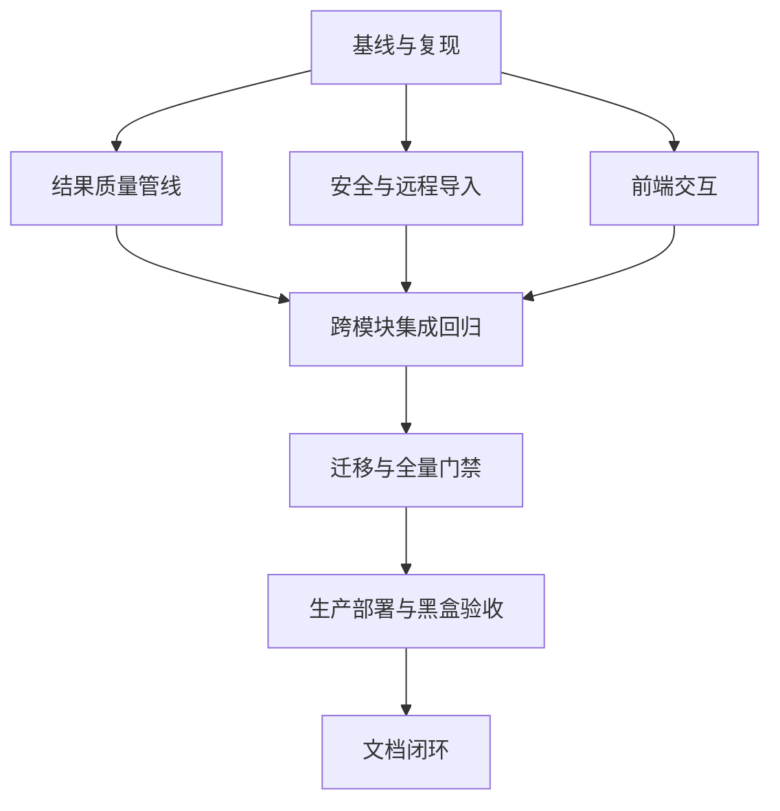

# Prism 测试报告完整修复：任务分解

## 依赖图

## 原子任务

| 编号 | 输入 | 输出 | 独立验收 |
| --- | --- | --- | --- |
| T1 | 当前生产/本地提交、测试交付包 | 可复现缺陷清单与纠正后的边界 | 每项有源码或真实点击证据 |
| T2 | Finding/Issue/圆桌现有路径 | 统一位置、N 路聚类、来源追溯和一次性持久化 | 重复、乱序、相邻独立、圆桌测试 |
| T3 | Python 扫描器与漏洞样本 | CWE-78 AST 检测 | 危险命中、安全 argv 不命中 |
| T4 | CVSS/评分现有逻辑 | 单一 CVSS 服务和评分明细 | 官方向量、非法向量、下限、跨输出一致 |
| T5 | Nginx/认证限流 | 全资源安全头、可信 IP、Redis 共享限流 | 根/API/资源头；第 6 次 429 |
| T6 | 上传安全边界 | 干净脚本可审查、恶意/二进制隔离测试 | 不在宿主机执行 |
| T7 | 远程导入服务 | 持久化任务、租约、进度、幂等、恢复 | 快速返回、重启恢复、无半成品 |
| T8 | 报告与表单组件 | 预览兜底、详情定位、邮箱、Radio、无障碍回归 | 组件测试和真实点击 |
| T9 | T2-T8 | 全量测试、Ruff、Lint、构建 | 所有门禁通过 |
| T10 | 已验证提交、数据库备份 | 不可变镜像部署与迁移 | 健康、版本、容器、迁移头正确 |
| T11 | 生产系统、三角色账号 | 黑盒点击与安全头/限流抽查 | 无控制台错误、权限不回归 |
| T12 | 路由表、RBAC、三类导航入口 | 无权限入口隐藏、未知路由失败关闭 | 菜单/搜索/Agent 链接单测与角色点击 |
| T13 | 现有活动边框、虚拟鼠标和页面框架 | 真实导航点击、毛玻璃、数字与路由动效 | 单次点击、构建、桌面/移动截图与减少动画 |

## 执行约束

- T2/T3/T4、T5/T6/T7、T8 可按写入范围并行，T9 前必须统一代码审查。
- 每个缺陷先有失败测试或可重复脚本，再修改实现。
- 生产验收不触发付费模型自动运维，不修改密码，不删除真实业务数据。

## 本轮执行状态

- [x] T1-T8：缺陷复现、实现和定向回归完成。
- [x] T9：后端 `2032` 项、前端 `315` 项、Lint/Ruff/类型检查/构建完成。
- [x] T12-T13：权限可见性、未知路由、虚拟点击和视觉交互实现及自动化回归完成。
- [ ] T10：以最终提交 SHA 执行生产备份、迁移和服务切换。
- [ ] T11：三角色真实点击、圆桌/团队追问、远程导入和控制台检查。
