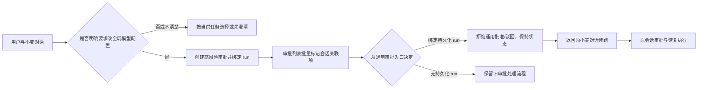

# 设计：Responses 审批闭环

## 模块与契约

- `agent_responses_service` 与运维知识：明确当前任务模型选择和全局配置修改的语义边界。
- `approval_service.session_resume_required_item_ids(db, items)`：批量收集 `request_json.run_id` 和 `resource=response_run:<id>` 候选值，一次查询持久化 run；任一命中即返回审批 ID。
- 治理审批列表 API/schema：对批量返回结果附加 `requires_session_resume`，不做逐项 SQL 查询。
- `GovernanceWorkstation.vue`：会话审批展示“返回小菱对话处理”，不显示通用决策动作；handler 对绑定事项做防御性拒绝。
- 通用决定 API：在修改审批状态前检查关联，返回 400；响应 run 与审批行保持原状。

## 异常处理

关联字段格式损坏时，对候选字段分别检查；任一字段命中都按受保护会话处理。只有两个关联字段均未命中持久化 run 时，才沿用原通用审批路径。SQL 使用单次 `IN` 查询并对批量空集合提前返回。
