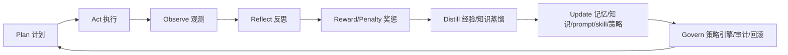

# ALIGNMENT_agent-governance-platform

> 任务名称：agent-governance-platform  
> 阶段：6A / Align 对齐阶段  
> 状态：待用户确认关键自治边界后进入 Consensus  
> 创建日期：2026-06-25  

## 1. 原始需求

在现有「基于大模型智能体的代码审查平台 / 棱镜 Prism」中建设完整的 Agent 治理平台：

- 添加管理 Agent，以及管理端自动审批 Agent。
- 设置审批事项，明确哪些内容需要管理员审批，并同步到管理员端。
- 管理员端只显示管理后台内容，并提供监控数据大屏。
- 所有 Agent 支持自我进化，引入 OpenClaw、Hermes、Loop Engineering 概念。
- 所有 Agent 接入对应 skill，实现子 Agent 隔离、独立记忆沉淀、独立知识库。
- 每个 Agent 每天自动抓取、清洗、蒸馏与自身职责相关的知识内容。
- 每个 Agent 引入 selfimprovingagent skill 和自我反思 skill，形成奖励/惩罚闭环。
- 干活之前先向用户提问，直到获取完美执行该任务所需背景信息。

## 2. 用户已选择的规格基线

### 2.1 第一轮选型

| 维度 | 选择 | 含义 |
|---|---|---|
| 交付深度 | D3 | 完整平台化改造，包括后台、调度、知识库、审计、监控全做 |
| 审批模式 | AP3 | 默认自动审批，只把异常同步给管理员 |
| Agent 架构 | AG2 | 模块化多 Agent，每个 Agent 独立职责、记忆、知识库 |
| 记忆与知识库 | K3 | 完整知识管线：抓取、清洗、向量化、评分、审批、版本管理 |
| 自我进化 | S3 | Agent 可自动更新自己的 prompt、skill、知识库和策略 |
| 管理端 | UI2 | 管理员专属后台，只显示管理内容 |
| 监控大屏 | M3 | 全量观测：链路追踪、日志聚合、模型表现、奖励惩罚趋势 |
| OpenClaw/Hermes/Loop | O2 | 抽象成项目内适配层和 Agent 协议 |
| 每日抓取蒸馏 | T3 | 每日自动抓取、自动蒸馏、低风险自动入库 |
| 安全策略 | SEC3 | 策略引擎级控制，每个工具调用都可审批和回放 |

### 2.2 第二轮细化选型

| 维度 | 选择 | 含义 |
|---|---|---|
| 任务名称 | N1 | agent-governance-platform |
| 初始 Agent | A3 | 标准集 + 安全策略 Agent、调度 Agent、记忆管理 Agent、告警 Agent |
| 人工审批事项 | H1 | 只有高风险系统操作人工审批 |
| 自我进化权限 | E4 | 全自动自我进化，仅保留审计和回滚 |
| 每日抓取来源 | C2 | 项目代码、项目文档、官方文档、指定 URL、GitHub issue/PR |
| 知识入库策略 | K2 | 低风险自动入库，高风险进入审批 |
| 用户与权限体系 | I3 | 新增 ABAC/策略引擎，按角色、资源、动作、风险动态判权 |
| 管理后台菜单 | R3 | R2 + 告警中心、成本中心、模型评测、回滚中心、沙箱管理、工具权限 |
| 监控指标 | P3 | P2 + 链路追踪、日志聚合、模型表现、工具调用、异常告警、SLA、回滚次数 |
| OpenClaw/Hermes | X2 | 抽象成项目内协议层：Agent Protocol、Tool Adapter、Message Bus、Execution Loop |
| 策略引擎粒度 | G3 | G2 + 每次工具调用可审批、回放、风险评分、自动降权 |
| Agent 外部能力 | V3 | 默认允许执行，靠策略引擎拦截高风险动作 |
| 最终交付内容 | L4 | 生产级闭环：L3 + 回滚中心 + 沙箱隔离 + 成本中心 + 告警系统 |

## 3. 项目上下文分析

### 3.1 当前技术栈

- 后端：FastAPI + SQLAlchemy 2.x + Pydantic v2 + Alembic + PyMySQL。
- 前端：Vue 3 + TypeScript + Vite + Element Plus + Pinia + Vue Router + ECharts。
- AI：DeepSeek API，多 Agent Prompt 编排，已有 Agent 事件总线、圆桌讨论、自进化基础。
- 数据库：MySQL 8.0，历史测试中存在 SQLite 兼容语境。
- 部署：Docker Compose，生产侧已有 Caddy/HTTPS 文档。

### 3.2 当前项目关键模块

| 模块 | 现有位置 | 现状 |
|---|---|---|
| Agent 注册中心 | `backend/app/agents/registry.py` | 已支持运行时 Agent 元数据列表、分类统计 |
| Agent 基类 | `backend/app/agents/base.py` | 统一模型调用、事件 emit、trace_id |
| Agent 事件 | `backend/app/agents/event_bus.py` | 已支持 SSE 事件链路 |
| 自进化 Agent | `backend/app/agents/evolution_agent.py` | 已具备反馈聚合、规则蒸馏、提案生成 |
| 自进化服务 | `backend/app/services/evolution_service.py` | 已具备提案评估、审批、回滚 |
| 个人知识库 | `backend/app/services/knowledge_service.py` | 已支持用户隔离、同步平台数据、embedding 检索 |
| 审计日志 | `backend/app/services/audit_service.py` | 已有通用审计记录和管理员查询 |
| 权限依赖 | `backend/app/core/dependencies.py` | 当前主要是 JWT + `require_admin` |
| 管理端页面 | `frontend/src/views/admin/` | 已有用户、AI 日志、审计、自进化、LLM、Embedding 配置 |
| 管理路由 | `frontend/src/router/index.ts` | 当前 admin 页面混在主 AppLayout 内 |
| 前端菜单 | `frontend/src/components/layout/AppSidebar.vue` | 当前主导航与管理菜单共用侧栏，admin 仍能看到部分普通页面 |

### 3.3 当前已存在的 Agent

从 `backend/app/agents/` 读取到的 Agent/编排相关文件包括：

- ai_prompt_agent
- chat_agent
- dashboard_agent
- evolution_agent
- file_agent
- language_agent
- orchestrator
- project_agent
- project_manager_agent
- report_agent
- review_agent
- review_orchestrator_agent
- rule_agent
- security_sentinel_agent

说明：项目已有 Agent 体系和自进化基础，本任务应以扩展治理能力为主，不应重写现有 Agent 框架。

### 3.4 当前数据模型基础

项目已有：

- `user`：当前角色以 `admin / user / reviewer` 为主。
- `audit_log`：操作审计。
- `ai_call_log`：AI 调用日志。
- `review_experience`：审查经验记忆。
- `evolution_proposal`：自进化提案、评估、审批、回滚。
- `eval_case`：黄金评估集。
- `knowledge_doc` / `knowledge_chunk`：个人知识库文档与切片。
- `system_config`：系统配置。

可复用点：

- 自进化提案表可扩展为通用 Agent 进化提案，或新增更通用的 `agent_evolution_proposal`。
- 个人知识库可升级为多主体知识库，支持 `owner_type=user/agent` 与 `owner_id`。
- 审计日志可作为策略引擎、审批流、工具调用回放的底座，但需要增强结构化字段。

## 4. 需求理解与边界确认

### 4.1 本任务目标

建设「Agent Governance Platform」：在当前 Prism 平台上扩展生产级多 Agent 治理能力，让管理后台能够集中治理 Agent 生命周期、审批策略、工具权限、知识库、记忆、自我进化、监控、告警、成本和回滚。

### 4.2 初始 Agent 清单

基于 A3，建议内置以下 10 类治理 Agent：

| Agent | 职责 |
|---|---|
| 管理 Agent | 统一管理 Agent 注册、状态、配置、版本和策略 |
| 审批 Agent | 默认自动审批低风险事项，异常/高风险升级 |
| 代码审查 Agent | 复用现有 Review/ReviewOrchestrator/SecuritySentinel 能力 |
| 知识蒸馏 Agent | 每日抓取、清洗、切片、嵌入、蒸馏 |
| 监控 Agent | 采集任务、模型、工具、SLA、成本和异常指标 |
| 自我反思 Agent | 对 Agent 行为做复盘、奖励、惩罚、改进建议 |
| 安全策略 Agent | 对动作、工具、网络、代码修改做风险评分和策略决策 |
| 调度 Agent | 负责每日抓取、定时评估、周期性自进化任务 |
| 记忆管理 Agent | 管理 Agent 独立记忆、短期记忆、长期记忆、沉淀版本 |
| 告警 Agent | 对失败率、越权、成本暴涨、模型退化等触发告警 |

### 4.3 管理端目标

基于 UI2/R3，管理员登录后应进入独立 Admin Shell，不再混入普通用户页面。后台菜单建议：

- 总览大屏
- Agent 管理
- 审批中心
- 策略中心
- 知识库
- 记忆管理
- 任务调度
- 审计日志
- 告警中心
- 成本中心
- 模型评测
- 回滚中心
- 沙箱管理
- 工具权限
- 系统配置

### 4.4 OpenClaw / Hermes / Loop Engineering 的项目内抽象

由于用户选择 X2，本任务不依赖外部 OpenClaw/Hermes 实现，而抽象为项目内协议层：

- Agent Protocol：Agent 身份、能力、权限、记忆、知识库、skill、生命周期协议。
- Tool Adapter：工具调用统一封装，所有工具调用先进入策略引擎。
- Message Bus：Agent 事件、审批事件、知识事件、告警事件的统一消息层。
- Execution Loop：计划、执行、观测、反思、奖惩、沉淀、策略更新的闭环。
- Skill Binding：每个 Agent 绑定自身 skill 集合，包括 selfimprovingagent 和 reflection skill。

Loop Engineering 在本项目中的落点：

## 5. 核心矛盾与风险识别

### 5.1 当前选择的风险特征

用户选择了 AP3 + E4 + V3 + L4，表示：

- 默认自动审批。
- Agent 可全自动自我进化。
- 默认允许执行，依赖策略引擎拦截高风险动作。
- 目标是生产级闭环。

这与现有 `Agent自进化` 文档中的红线存在差异：现有设计强调「进化提案必须评估闸门 + admin 人工审批后生效」。本任务的新目标更激进，需要通过策略引擎、沙箱、审计、回滚和风险评分重新定义安全边界。

### 5.2 必须在实现前确认的红线

以下事项若不确认，直接实现会有不可接受的安全与产品风险：

1. Agent 自动修改业务代码是否允许默认执行？
2. Agent 自动修改自身 prompt/skill/策略后是否可以立即生效？
3. Agent 执行 shell、联网抓取、调用外部 API 是否全部默认放行？
4. 高风险系统操作的定义是什么？
5. 策略引擎拦截失败时，是阻断优先还是执行优先？
6. 每日抓取官方文档/GitHub 时的具体来源列表由谁配置？
7. Agent 独立知识库是否可以读取其他 Agent 的知识？
8. 奖励/惩罚是否会影响 Agent 权限、调度优先级、模型预算或自动降权？

## 6. 初步技术方案方向

### 6.1 后端新增/扩展模块

| 模块 | 建议路径 | 说明 |
|---|---|---|
| Agent 治理 API | `backend/app/api/v1/agent_governance.py` | Agent 配置、状态、策略、工具、记忆入口 |
| 审批中心 API | `backend/app/api/v1/approvals.py` | 审批事项、自动审批结果、异常升级 |
| 策略引擎 | `backend/app/services/policy_engine.py` | ABAC、风险评分、动作决策、降权 |
| 工具网关 | `backend/app/services/tool_gateway.py` | 所有 Agent 工具调用统一入口 |
| Agent 记忆服务 | `backend/app/services/agent_memory_service.py` | 每个 Agent 独立短期/长期记忆 |
| Agent 知识管线 | `backend/app/services/agent_knowledge_service.py` | 抓取、清洗、蒸馏、向量化、版本 |
| 调度服务 | `backend/app/services/scheduler_service.py` | 每日抓取、评估、自进化任务 |
| 监控服务 | `backend/app/services/observability_service.py` | 大屏指标、SLA、成本、链路 |
| 奖惩服务 | `backend/app/services/reward_service.py` | reward/penalty、评分、自动降权 |
| 回滚服务 | `backend/app/services/rollback_service.py` | prompt/skill/策略/知识版本回滚 |

### 6.2 数据模型新增方向

建议新增或升级以下模型：

- `agent_profile`：Agent 身份、职责、状态、模型、预算、隔离策略。
- `agent_skill_binding`：Agent 与 skill 的绑定、版本和启停。
- `agent_memory`：Agent 独立记忆。
- `agent_knowledge_source`：每个 Agent 的抓取来源。
- `agent_knowledge_doc` / `agent_knowledge_chunk`：Agent 级知识库；也可复用现有 knowledge 表并增加 owner 维度。
- `approval_item`：审批事项和自动审批结果。
- `policy_rule`：策略规则。
- `policy_decision_log`：策略决策日志。
- `tool_call_log`：工具调用、输入输出摘要、风险、回放索引。
- `agent_reflection`：自我反思记录。
- `agent_reward_event`：奖励/惩罚事件。
- `agent_job`：调度任务。
- `agent_artifact_version`：prompt/skill/策略/知识版本。
- `agent_alert`：告警事件。

### 6.3 前端新增/重构方向

- 新增 AdminLayout 或 AdminShell，使 `/admin/**` 独立呈现管理后台内容。
- 管理员登录默认进入 `/admin/overview`。
- 普通用户不再看到管理入口，管理员后台不再显示普通用户业务菜单。
- 基于 Element Plus + ECharts 建设监控大屏，保持现有 UI 风格，但以运维/治理台为主，不做营销式页面。

## 7. 验收标准草案

进入 Automate 阶段后，L4 的完整验收应至少包含：

- 管理后台独立壳层完成，管理员端只显示后台菜单。
- Agent 管理页面可查看所有 Agent、状态、skill、权限、知识库、记忆、版本。
- 审批中心可查看自动审批、人工审批、高风险升级和历史决策。
- 策略中心可配置 ABAC/风险规则，并记录每次策略决策。
- 每个 Agent 有独立记忆与知识库。
- 每日抓取任务可配置、可执行、可查看结果和风险。
- 知识蒸馏支持低风险自动入库，高风险进入审批。
- Agent 自我反思、奖励、惩罚记录可追踪。
- prompt/skill/策略/知识变更可审计、可回滚。
- 监控大屏展示任务、审批、工具调用、模型表现、成本、SLA、告警、回滚趋势。
- 后端单元测试覆盖策略引擎、审批、记忆、知识管线、奖惩、回滚。
- 前端构建通过，核心管理页面无明显响应式溢出。

## 8. 当前不确定项与待用户确认

请用户在下一轮从 `QUESTION_OPTIONS_agent-governance-platform.md` 中选择或直接回答。确认后才能生成 `CONSENSUS_agent-governance-platform.md`。

### 8.1 高优先级

- 高风险系统操作的准确定义。
- E4 全自动自我进化的立即生效边界。
- V3 默认允许执行的动作范围。
- 策略引擎拦截失败时的默认行为。
- 每日抓取来源清单和凭证管理方式。

### 8.2 中优先级

- 是否复用现有 `knowledge_doc/knowledge_chunk` 还是新建 Agent 知识库表。
- 是否引入真实调度器依赖，还是先用项目内轻量调度表。
- 告警通知方式：仅后台显示，还是邮件/Webhook。
- 模型成本统计口径：按用户、Agent、任务、模型维度。

## 9. 对现有项目的影响面

| 层 | 影响 |
|---|---|
| 数据库 | 需要新增多张治理表，并可能扩展用户角色与知识库 owner 维度 |
| 后端 API | 新增 admin/governance/approval/policy/observability 系列接口 |
| Agent 框架 | 需要在 BaseAgent 外围增加工具网关、策略决策、记忆/知识上下文 |
| 前端路由 | 需要拆分用户端与管理端壳层 |
| 权限 | 从简单 RBAC 升级为 RBAC + ABAC + 风险策略 |
| 测试 | 需要新增策略、审批、回滚、知识管线、前端构建验证 |
| 运维 | 每日抓取和自动进化会带来定时任务、网络访问、成本和告警配置 |

## 10. Align 阶段结论

当前项目已有多 Agent、自进化、个人知识库、审计日志和管理页面基础，具备扩展为 Agent 治理平台的架构基础。

但用户选择的是最高自治规格，必须先确认安全红线和自动执行边界。确认后进入 Consensus 阶段，锁定：

- 需求描述与验收标准。
- 技术实现方案。
- 任务边界。
- 风险控制与集成方案。
