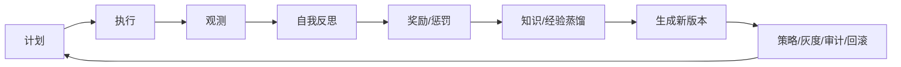

# CONSENSUS_agent-governance-platform

> 任务名称：agent-governance-platform  
> 阶段：6A / Align 最终共识  
> 状态：待用户审阅后进入 Architect  
> 日期：2026-06-25  

## 1. 共识结论

本任务将在现有 Prism 智能代码审查平台上建设「Agent 治理平台」：以现有多 Agent、自进化、知识库、审计和管理端为基础，扩展出管理员专属后台、Agent 管理、自动审批、策略引擎、独立记忆、独立知识库、每日知识抓取蒸馏、自我反思、奖励惩罚、监控大屏、告警、成本、模型评测、沙箱和回滚能力。

本期目标为 `L4` 生产级闭环，但实际实施会按 6A 工作流拆解为可验证的原子任务，避免一次性大爆炸式改造。

## 2. 已确认边界

| 编号 | 选择 | 共识 |
|---|---|---|
| Q1 | A | 仅权限变更、删除数据、生产配置变更算高风险系统操作。其他动作由策略引擎风险评分决定是否升级。 |
| Q2 | B | 知识和个人记忆可立即生效；prompt、skill、策略自动生成新版本，灰度生效并可回滚。 |
| Q3 | A | Agent 默认允许直接修改业务代码，但必须经过工具网关、策略引擎、审计与回滚记录。 |
| Q4 | A | shell/本地命令默认经过策略引擎；读命令自动放行，写命令/危险命令阻断或升级。 |
| Q5 | B | 策略引擎不可用或判断失败时阻断优先，进入审批或告警。 |
| Q6 | B | 每日抓取项目代码、项目文档、官方文档、指定 URL、GitHub issue/PR；外部来源由管理员配置白名单。 |
| Q7 | B | 低风险内容自动入库；高风险、低置信、外部未知来源进入审批。 |
| Q8 | B | Agent 知识库默认隔离；可通过策略引擎授予只读共享知识域。 |
| Q9 | B | 奖励/惩罚影响调度优先级、预算、自动审批阈值、是否降权，但不直接封禁。 |
| Q10 | B | 告警进入管理后台、系统审计，并预留 Webhook 配置。 |
| Q11 | C | 用户知识库与 Agent 知识库并存，并增加统一检索视图。 |
| Q12 | C | 引入调度能力，优先评估 APScheduler；如需要分布式再扩展 Celery/Redis。 |
| Q13 | A | 仅使用 OpenClaw/Hermes 概念，不接入其本体或外部依赖。 |
| Q14 | A | 同一个前端应用内新增独立 AdminLayout；管理员进入 `/admin/overview`，只显示管理后台菜单。 |
| Q15 | C | 本轮按 L4 全量目标规划和拆分，实施时按任务依赖逐步推进。 |

## 3. 明确需求描述

### 3.1 管理 Agent 与自动审批 Agent

- 新增或注册治理类 Agent：管理 Agent、审批 Agent、安全策略 Agent、调度 Agent、记忆管理 Agent、告警 Agent、自我反思 Agent、知识蒸馏 Agent、监控 Agent。
- 管理 Agent 负责 Agent 生命周期、配置、能力、skill、记忆、知识库和状态管理。
- 审批 Agent 负责低风险事项自动审批，高风险或策略失败事项同步到审批中心。
- 审批结果、自动审批理由、风险评分和触发策略必须可审计。

### 3.2 管理员专属后台

- 管理员登录后默认进入 `/admin/overview`。
- `/admin/**` 使用独立 AdminLayout，只展示管理后台内容。
- 普通用户继续使用现有用户端布局和业务菜单。
- 管理后台包含：总览大屏、Agent 管理、审批中心、策略中心、知识库、记忆管理、任务调度、审计日志、告警中心、成本中心、模型评测、回滚中心、沙箱管理、工具权限、系统配置。

### 3.3 Agent 独立工作与隔离

- 每个 Agent 必须有独立身份、职责、状态、skill 绑定、工具权限、记忆和知识库。
- 默认不能读取其他 Agent 私有知识库。
- 共享知识必须经过策略引擎授权，只读共享域与私有域分离。
- 子 Agent 执行动作必须通过工具网关，不允许绕开策略引擎和审计。

### 3.4 Agent 自我进化与 Loop Engineering

本任务采用如下闭环：

- 知识和记忆更新可立即生效。
- prompt、skill、策略更新必须生成版本，支持灰度与回滚。
- 奖励/惩罚影响调度优先级、预算、自动审批阈值和降权，不直接封禁 Agent。
- 自我反思记录必须落库，可在后台查看。

### 3.5 OpenClaw / Hermes 概念落点

本期只吸收概念，不接外部依赖：

- OpenClaw 概念映射：工具化执行、动作抽象、工具网关、风险拦截。
- Hermes 概念映射：Agent 消息总线、任务派发、事件追踪、异步协同。
- 项目内落点：Agent Protocol、Tool Adapter、Message Bus、Execution Loop、Skill Binding。

### 3.6 每日抓取与知识蒸馏

- 每个 Agent 可配置自身知识来源。
- 默认来源：项目代码、项目文档、官方文档、指定 URL、GitHub issue/PR。
- 外部来源由管理员配置白名单。
- 抓取内容经过清洗、切片、嵌入、风险评分和蒸馏。
- 低风险内容自动入库；高风险、低置信、未知来源进入审批。

### 3.7 策略引擎与工具网关

- 所有 Agent 工具调用通过统一工具网关。
- 策略引擎按主体、资源、动作、环境、风险进行判断。
- 策略失败时阻断优先。
- shell 命令、网络访问、业务代码修改、知识入库、prompt/skill/策略更新均必须记录决策日志。
- 业务代码修改默认允许，但必须可审计、可回放、可回滚。

## 4. 技术实现约束

### 4.1 复用现有架构

- 后端继续使用 FastAPI + SQLAlchemy + Pydantic + Alembic。
- 前端继续使用 Vue 3 + TypeScript + Element Plus + Pinia + ECharts。
- AI 调用继续复用现有 BaseAgent、DeepSeek 调用链路、AgentRegistry 和 AgentEventBus。
- 审计继续复用 `audit_log`，并新增结构化治理日志表。
- 自进化继续复用 `EvolutionAgent`、`evolution_service`、`eval_case` 和现有经验机制。

### 4.2 新增后端模块

| 模块 | 目标 |
|---|---|
| `agent_governance` | Agent 配置、状态、skill、权限、版本 |
| `approvals` | 审批事项、自动审批、人工审批、异常升级 |
| `policy_engine` | ABAC、风险评分、策略决策、降权 |
| `tool_gateway` | 统一工具调用入口和回放日志 |
| `agent_memory_service` | Agent 独立记忆 |
| `agent_knowledge_service` | Agent 知识抓取、蒸馏、入库 |
| `scheduler_service` | 周期任务、每日抓取、自进化任务 |
| `observability_service` | 大屏指标、SLA、成本、异常 |
| `reward_service` | 奖励/惩罚与行为影响 |
| `rollback_service` | prompt/skill/策略/知识/代码变更回滚 |

### 4.3 新增数据模型方向

- `agent_profile`
- `agent_skill_binding`
- `agent_memory`
- `agent_knowledge_source`
- `agent_knowledge_doc`
- `agent_knowledge_chunk`
- `agent_knowledge_index_view` 或统一检索服务
- `approval_item`
- `policy_rule`
- `policy_decision_log`
- `tool_call_log`
- `agent_reflection`
- `agent_reward_event`
- `agent_job`
- `agent_artifact_version`
- `agent_alert`
- `agent_metric_snapshot`

### 4.4 前端实现约束

- 新增 AdminLayout，不破坏现有 AppLayout。
- 管理后台偏运维/治理工具风格，保持信息密度和可扫描性。
- 监控大屏使用 ECharts，不做营销式 Hero 页面。
- 所有按钮、图标、筛选、表格、弹窗遵循现有 Element Plus 风格。
- 管理端页面必须考虑响应式，避免内容溢出。

## 5. 验收标准

### 5.1 功能验收

- 管理员登录后进入 `/admin/overview`，后台只显示管理菜单。
- Agent 管理可查看 Agent 身份、状态、skill、权限、记忆、知识库、版本。
- 审批中心可查看自动审批、人工审批、异常升级、审批原因和风险评分。
- 策略中心可配置策略规则，并查看策略决策日志。
- 工具权限中心可查看和控制 Agent 工具调用。
- 每个 Agent 有独立记忆和独立知识库。
- 每日抓取任务可配置、可触发、可查看结果。
- 低风险知识自动入库，高风险内容进入审批。
- 自我反思、奖励、惩罚记录可追踪。
- prompt/skill/策略/知识变更有版本和回滚。
- 监控大屏展示任务、Agent、审批、工具调用、模型表现、成本、SLA、告警、回滚。

### 5.2 技术验收

- 后端新增接口具备权限校验、策略决策和审计记录。
- Alembic 迁移可执行。
- 后端单元测试覆盖策略、审批、工具网关、记忆、知识管线、奖惩、回滚核心逻辑。
- 前端 `npm run build` 通过。
- 后端 ruff、compileall、pytest 通过。
- 不提交 `.env`、API Key 或外部凭证明文。

### 5.3 安全验收

- 策略引擎失败默认阻断。
- 工具调用不可绕过审计。
- Agent 知识库默认隔离。
- shell/网络/代码修改均有策略决策记录。
- 高风险系统操作同步到审批中心。
- 所有自动动作可追踪、可回放、可回滚。

## 6. 本期不做或暂缓事项

- 不接入真实 OpenClaw/Hermes 本体。
- 不做模型权重级训练或微调。
- 不把 Agent 奖惩设计为自动封禁。
- 不绕过现有 FastAPI/Vue 技术栈。
- 不把 API Key 写入代码或提交到仓库。
- 不在未完成策略网关前让 Agent 绕开治理执行危险动作。

## 7. 关键假设

- 当前项目继续以 MySQL 作为主数据库。
- 外部知识来源由管理员配置白名单。
- 管理员允许 Agent 默认修改业务代码，但接受策略引擎、审计和回滚约束。
- 调度实现可以引入 APScheduler；若后续需要分布式再评估 Celery/Redis。
- 当前已有未提交工作区改动，本任务实施时不回滚、不覆盖无关改动。

## 8. 进入 Architect 阶段的条件

本共识文档确认后，进入 Architect 阶段，生成：

- `DESIGN_agent-governance-platform.md`
- 总体架构图
- 模块依赖图
- 数据流图
- 接口契约
- 异常处理策略
- 数据模型设计
- 管理端页面结构
