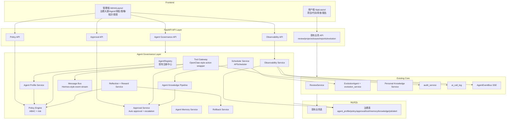
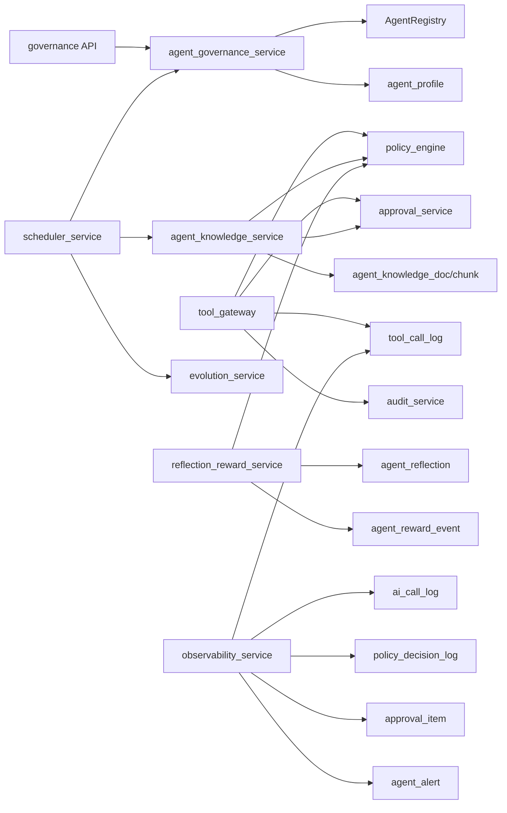
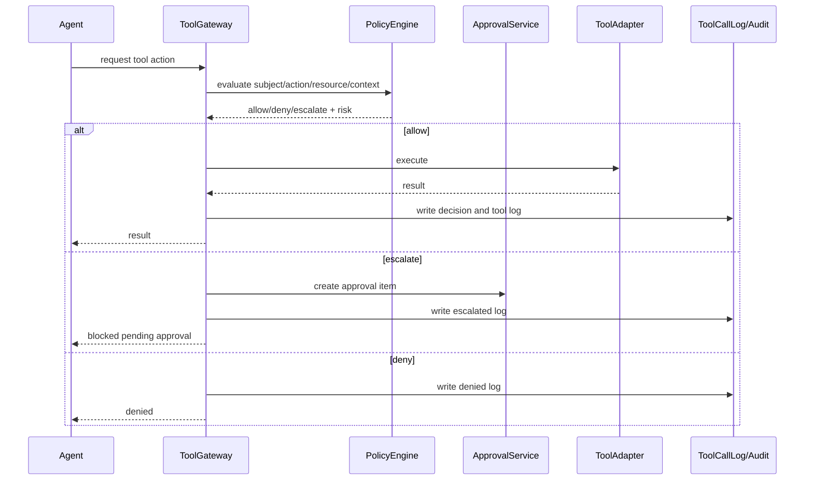
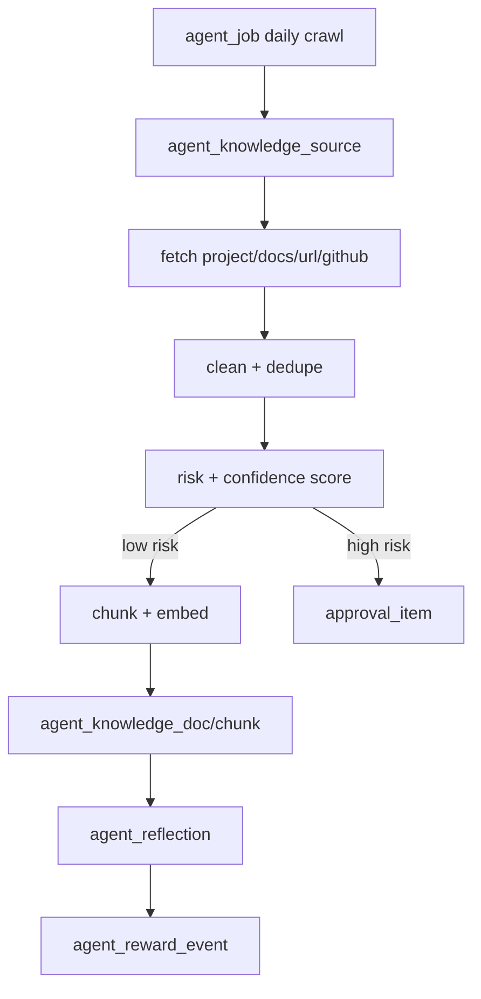
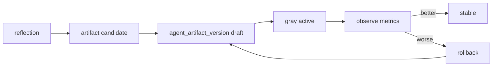

# DESIGN_agent-governance-platform

> 任务名称：agent-governance-platform  
> 阶段：6A / Architect 架构阶段  
> 日期：2026-06-25  
> 输入：`ALIGNMENT_agent-governance-platform.md`、`CONSENSUS_agent-governance-platform.md`、`BOUNDARY_FORM_agent-governance-platform.md`

## 1. 总体架构

本设计在现有 Prism 架构上增加一层「Agent Governance Layer」。现有代码审查、圆桌讨论、自进化、知识库和审计能力继续保留；新增治理层负责 Agent 身份、策略、审批、工具调用、知识、记忆、调度、监控、奖惩与回滚。

## 2. 分层设计

### 2.1 表现层

| 层 | 组件 | 职责 |
|---|---|---|
| 用户端 | `AppLayout` | 保留现有业务入口 |
| 管理端 | `AdminLayout` | 管理员专属后台，只展示治理菜单 |
| 管理页面 | `/admin/overview` 等 | 大屏、Agent、审批、策略、工具、知识、记忆、调度、告警、回滚 |

### 2.2 API 层

| API | 路径 | 职责 |
|---|---|---|
| Agent Governance | `/api/admin/governance/*` | Agent 画像、skill、权限、记忆、知识摘要 |
| Approval | `/api/admin/approvals/*` | 审批事项、自动审批记录、人工处理 |
| Policy | `/api/admin/policies/*` | 策略规则、决策日志、风险动作定义 |
| Tool | `/api/admin/tools/*` | 工具调用日志、权限、回放摘要 |
| Observability | `/api/admin/observability/*` | 监控大屏、成本、SLA、告警、模型评测 |
| Scheduler | `/api/admin/jobs/*` | 每日抓取、蒸馏、自进化、调度任务 |

### 2.3 业务服务层

| 服务 | 职责 |
|---|---|
| `agent_governance_service` | 同步注册中心与持久化 Agent Profile，提供治理总览 |
| `policy_engine` | 对主体、资源、动作、环境、风险进行决策 |
| `approval_service` | 生成审批事项，执行自动审批，升级人工审批 |
| `tool_gateway` | 包装 Agent 工具调用，写入策略与工具日志 |
| `agent_memory_service` | 维护 Agent 独立短期/长期记忆 |
| `agent_knowledge_service` | 管理 Agent 知识源、抓取、蒸馏、入库 |
| `scheduler_service` | APScheduler 任务定义、运行记录、手动触发 |
| `reward_service` | 记录奖励/惩罚，并影响预算/阈值/调度优先级 |
| `observability_service` | 聚合大屏指标、成本、SLA、告警 |
| `rollback_service` | 版本回滚，包括 prompt/skill/策略/知识/代码变更记录 |

## 3. 模块依赖关系

依赖原则：

- 策略引擎不依赖具体业务服务，保持可测试。
- 工具网关依赖策略与审批，但 Agent 不直接依赖审批表。
- 监控服务只读聚合，不改变业务状态。
- 回滚服务只处理版本化 artifact，不直接猜测业务语义。

## 4. 数据模型设计

### 4.1 Agent 身份与能力

| 表 | 关键字段 | 说明 |
|---|---|---|
| `agent_profile` | `code/name/category/status/model/budget/is_enabled` | Agent 持久化画像 |
| `agent_skill_binding` | `agent_code/skill_code/version/enabled/config_json` | skill 绑定与版本 |
| `agent_tool_permission` | `agent_code/tool_code/permission/risk_level/enabled` | 工具权限 |

### 4.2 策略、审批与工具

| 表 | 关键字段 | 说明 |
|---|---|---|
| `policy_rule` | `rule_code/subject/action/resource/effect/risk_level/condition_json/enabled` | ABAC 策略规则 |
| `policy_decision_log` | `subject/action/resource/decision/risk_score/reason/context_json` | 每次策略决策 |
| `approval_item` | `title/action/resource/risk_level/status/decision_reason/request_json` | 审批事项 |
| `tool_call_log` | `agent_code/tool_code/action/status/risk_level/input_summary/output_summary` | 工具调用与回放摘要 |

### 4.3 记忆、知识与版本

| 表 | 关键字段 | 说明 |
|---|---|---|
| `agent_memory` | `agent_code/memory_type/content/weight/status` | Agent 独立记忆 |
| `agent_knowledge_source` | `agent_code/source_type/source_uri/whitelist/enabled` | 抓取源 |
| `agent_knowledge_doc` | `agent_code/title/source_type/source_ref/risk_level/status` | Agent 知识文档 |
| `agent_knowledge_chunk` | `doc_id/agent_code/content/embedding/embed_model` | Agent 知识切片 |
| `agent_artifact_version` | `agent_code/artifact_type/version/content/snapshot/status` | prompt/skill/策略/知识版本 |

### 4.4 调度、奖惩、告警与指标

| 表 | 关键字段 | 说明 |
|---|---|---|
| `agent_job` | `job_code/job_type/agent_code/schedule/status/last_run_at` | 调度定义 |
| `agent_job_run` | `job_id/status/started_at/finished_at/result_json` | 调度运行记录 |
| `agent_reflection` | `agent_code/task_ref/summary/lesson/risk_score` | 自我反思 |
| `agent_reward_event` | `agent_code/event_type/score/reason/impact_json` | 奖励/惩罚 |
| `agent_alert` | `alert_type/severity/status/title/detail_json` | 告警 |
| `agent_metric_snapshot` | `metric_key/metric_value/dimension_json/window_start/window_end` | 指标快照 |

## 5. 接口契约

### 5.1 Agent 治理

| 方法 | 路径 | 返回 |
|---|---|---|
| GET | `/api/admin/governance/overview` | 治理总览指标 |
| GET | `/api/admin/governance/agents` | Agent 治理清单 |
| GET | `/api/admin/governance/agents/{code}` | Agent 详情 |
| PUT | `/api/admin/governance/agents/{code}` | 更新 Agent 配置 |
| GET | `/api/admin/governance/agents/{code}/memory` | Agent 记忆 |
| GET | `/api/admin/governance/agents/{code}/knowledge` | Agent 知识 |

### 5.2 审批与策略

| 方法 | 路径 | 返回 |
|---|---|---|
| GET | `/api/admin/approvals` | 审批列表 |
| POST | `/api/admin/approvals/{id}/approve` | 审批通过 |
| POST | `/api/admin/approvals/{id}/reject` | 审批拒绝 |
| GET | `/api/admin/policies` | 策略规则 |
| POST | `/api/admin/policies/evaluate` | 策略试算 |
| GET | `/api/admin/policies/decisions` | 决策日志 |

### 5.3 工具、调度与监控

| 方法 | 路径 | 返回 |
|---|---|---|
| GET | `/api/admin/tools/calls` | 工具调用日志 |
| GET | `/api/admin/jobs` | 调度任务 |
| POST | `/api/admin/jobs/{id}/run` | 手动运行任务 |
| GET | `/api/admin/observability/overview` | 大屏总览 |
| GET | `/api/admin/observability/alerts` | 告警 |
| POST | `/api/admin/observability/alerts/{id}/resolve` | 关闭告警 |

## 6. 核心数据流

### 6.1 Agent 工具调用流

### 6.2 每日知识抓取流

### 6.3 自我进化版本流

## 7. 异常处理策略

| 场景 | 策略 |
|---|---|
| 策略引擎不可用 | 阻断优先，写告警和审批事项 |
| 工具执行失败 | 写工具日志，触发惩罚事件，不影响其他 Agent |
| 抓取失败 | 记录 job_run failed，按配置重试 |
| 嵌入失败 | 文档进入 pending_embed，不进入正式检索 |
| 审批失败 | 保持 pending，写审计 |
| 版本灰度退化 | 自动回滚到上一 stable 版本 |
| 监控聚合失败 | 大屏降级显示最近快照 |

## 8. 设计约束与安全红线

- 不接真实 OpenClaw/Hermes，仅吸收概念。
- 策略失败必须阻断。
- 工具调用必须经过 ToolGateway。
- Agent 知识库默认隔离。
- 业务代码修改虽默认允许，但必须记录策略、工具、版本、审计和回滚信息。
- API Key 只允许 `.env` 或加密配置，不进入代码和日志。
- 管理端独立布局，不混入用户端菜单。

## 9. 实现切面

本轮已按 L4 目标完成项目内闭环：

1. 治理数据模型与迁移。
2. 策略引擎、审批服务、工具网关和工具权限配置。
3. Agent Profile 与现有 AgentRegistry 同步。
4. Agent 独立记忆、知识源、知识文档、统一检索和审批生效链路。
5. 项目代码、官方 URL、指定 URL、GitHub issue/PR 白名单来源真实抓取与蒸馏。
6. APScheduler 每日任务、管理端手动运行和任务配置。
7. 监控大屏总览聚合、告警关闭、奖惩记录、artifact 版本与策略回滚。
8. AdminLayout 与管理端可操作工作台页面。
9. 单元测试、lint、编译、路由注册和前端构建验证。
