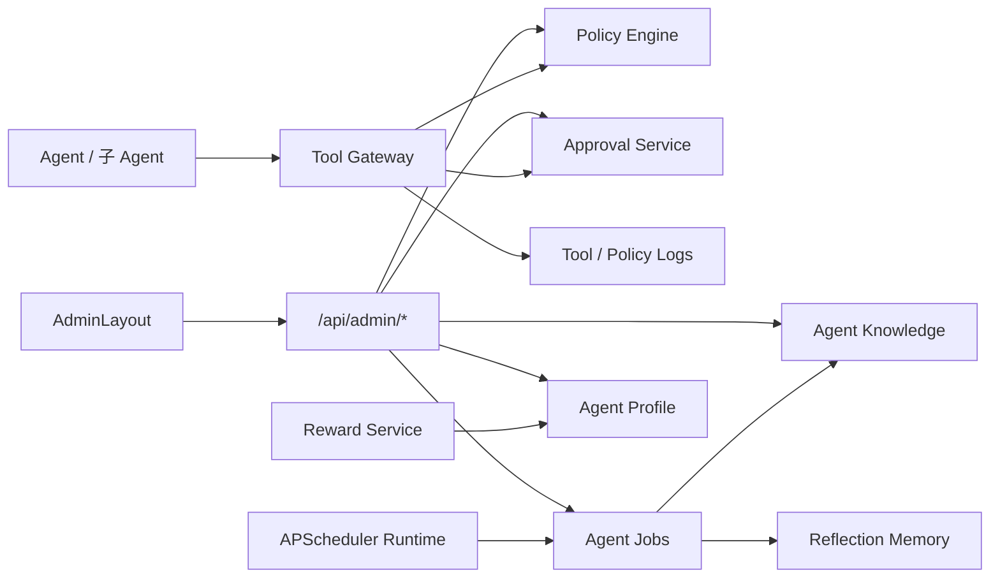

# FINAL_agent-governance-platform

> 任务名称：agent-governance-platform  
> 阶段：6A / Assess 最终总结  
> 日期：2026-06-25  

## 1. 项目总结

本次在现有 FastAPI + Vue3 智能代码审查平台上完成了 Agent 治理平台建设。实现重点是让所有 Agent 具备可治理的独立身份、独立记忆、独立知识库、skill 绑定、策略约束、审批流、工具网关、每日真实抓取与知识蒸馏、自我反思、奖惩和回滚记录，并为管理员提供独立后台入口和监控大屏。

用户特别确认的边界已全部纳入实现：OpenClaw/Hermes 只使用概念，不接入本体；管理员端在同一个前端应用内使用独立 `AdminLayout`；高风险系统操作进入审批；策略失败阻断优先；Agent 知识默认隔离；奖惩影响调度和阈值但不自动封禁。

## 2. 主要交付物

### 2.1 后端

- 新增 `backend/app/models/agent_governance.py`，覆盖 Agent Profile、skill、工具权限、策略、审批、工具日志、记忆、知识、调度、反思、奖惩、版本、告警、指标。
- 新增 `backend/alembic/versions/002_agent_governance_platform.py` 并执行到 `002 (head)`。
- 新增治理服务：
  - `policy_engine.py`
  - `approval_service.py`
  - `tool_gateway.py`
  - `agent_governance_service.py`
  - `agent_memory_service.py`
  - `agent_knowledge_service.py`
  - `scheduler_service.py`
  - `agent_scheduler_runtime.py`
  - `reward_service.py`
  - `rollback_service.py`
  - `observability_service.py`
- 新增 `backend/app/api/v1/agent_governance.py`，挂载到 `/api/admin`。
- 更新 `backend/app/main.py`，在 FastAPI 生命周期启动/停止 Agent 治理后台调度器。
- 更新 `backend/requirements.txt`，加入 `apscheduler`。
- 更新 `.env.example` 与 `deploy/.env.example`，补充 Agent 知识抓取超时、最大响应体、私有地址开关、DNS 校验和 GitHub token 配置项。

### 2.2 前端

- 新增 `frontend/src/components/admin/AdminLayout.vue`，管理端独立布局。
- 更新 `frontend/src/router/index.ts`，将 `/admin/**` 放入独立 AdminLayout。
- 更新 `frontend/src/utils/roleHome.ts`，管理员默认首页改为 `/admin/overview`。
- 新增 `frontend/src/api/adminGovernance.ts` 和 `frontend/src/types/adminGovernance.ts`。
- 新增管理端治理页面：
  - `AdminOverview.vue`
  - `AgentGovernance.vue`
  - `ApprovalCenter.vue`
  - `PolicyCenter.vue`
  - `ToolGovernance.vue`
  - `KnowledgeGovernance.vue`
  - `JobCenter.vue`
  - `ObservabilityCenter.vue`
  - `RewardCenter.vue`
  - `RollbackCenter.vue`
  - `GovernanceWorkstation.vue`
- 管理端治理工作台已从只读表格扩展为可操作闭环：策略规则保存、工具权限保存、记忆沉淀、知识提交、知识来源配置、手动抓取、任务配置、告警关闭、奖惩记录、artifact 版本创建与回滚。

### 2.3 文档

- `ALIGNMENT_agent-governance-platform.md`
- `QUESTION_OPTIONS_agent-governance-platform.md`
- `BOUNDARY_FORM_agent-governance-platform.md`
- `CONSENSUS_agent-governance-platform.md`
- `DESIGN_agent-governance-platform.md`
- `TASK_agent-governance-platform.md`
- `APPROVAL_agent-governance-platform.md`
- `ACCEPTANCE_agent-governance-platform.md`
- `FINAL_agent-governance-platform.md`
- `TODO_agent-governance-platform.md`
- `说明文档.md` 已同步更新进度。

## 3. 架构结果

本次形成了项目内的 Agent Governance Layer：

## 4. 验证结果

- 后端全量测试：`184 passed`
- 后端全量 ruff：通过
- 后端全量 compileall：通过
- Alembic：`002 (head)`
- 调度生命周期：启动注册 3 个每日任务，关闭正常
- API 注册：`/api/admin` 总计 38 个路由，其中 Agent 治理 34 个路由，关键治理端点无缺失
- 端点契约：前端 150 条 HTTP API 调用缺失 0；其中 `adminGovernance.ts` 23 条管理端 API 调用全部匹配后端真实路由；SSE `/agents/events` 和 WebSocket `/api/ws/discuss/{session_id}` 均匹配后端端点
- 管理端 API 闭环：Agent、记忆、知识源、抓取、审批、策略、工具权限、任务、告警、奖惩、回滚集成测试通过
- 前端构建：`npm run build` 通过

前端构建仍有项目既有警告：Dart Sass legacy JS API、Element Plus 依赖注释、Monaco/ECharts chunk 较大。这些不是运行失败项，未阻断构建；影响主要是未来依赖升级兼容风险和首屏资源体积优化空间。

## 5. 质量与风险结论

本次实现已满足当前 6A 共识文档中的核心功能闭环。剩余风险主要集中在生产配置与部署形态：需要管理员配置真实外部知识源白名单、Webhook 通知、生产环境多副本调度锁、浏览器端完整点击验收。这些不影响当前代码和管理端基础能力，但上线前建议按 TODO 逐项补齐。

## 6. 交付结论

`agent-governance-platform` 已完成本轮开发、验证和文档闭环，可以进入用户验收或部署准备阶段。
