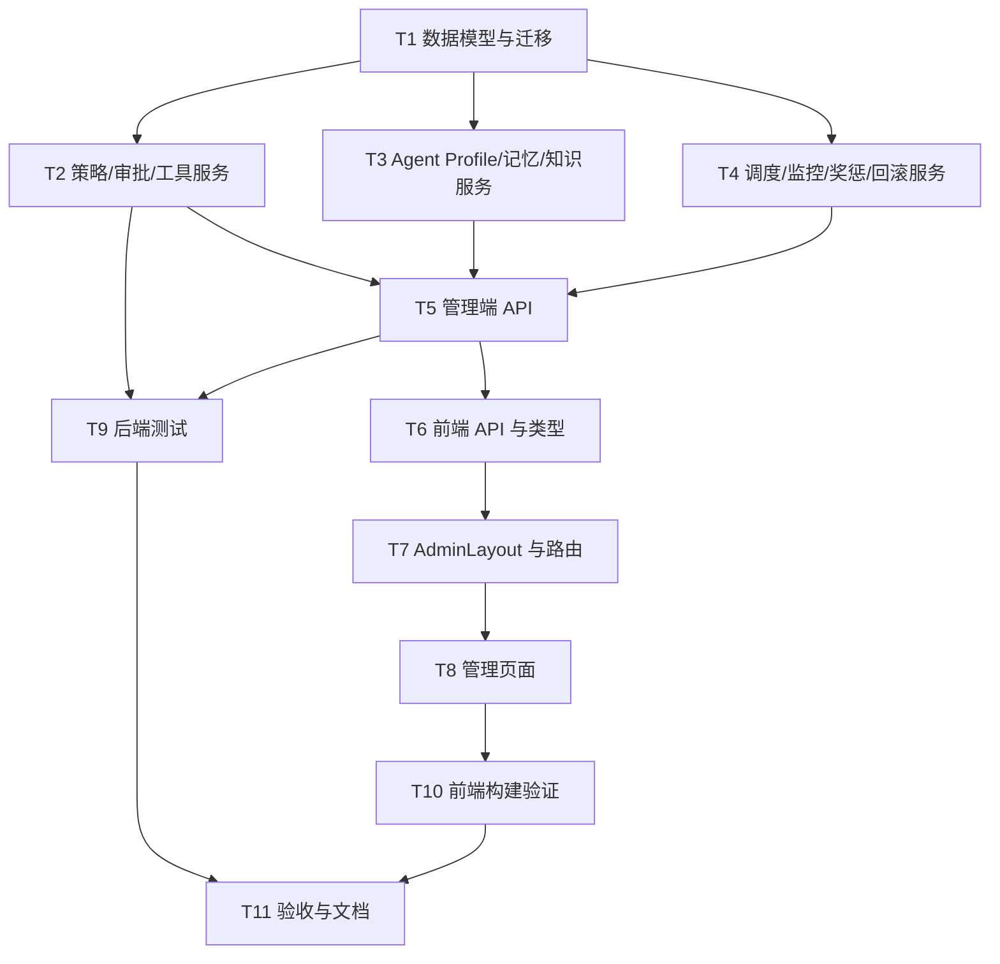

# TASK_agent-governance-platform

> 任务名称：agent-governance-platform  
> 阶段：6A / Atomize 原子化阶段  
> 日期：2026-06-25  
> 输入：`DESIGN_agent-governance-platform.md`

## 1. 任务依赖图

## 2. 原子任务清单

### T1. 数据模型与 Alembic 迁移

输入契约：

- 已有 SQLAlchemy Base、IdMixin、TimestampMixin。
- 已有 Alembic 目录与 MySQL 主库约束。

输出契约：

- 新增治理模型文件。
- 新增 Alembic 迁移文件。
- 模型可被导入，迁移可执行。

实现约束：

- 字段命名沿用现有 `create_time/update_time`。
- Text/LONGTEXT 兼容 MySQL 和 SQLite。
- 不改动现有个人知识库表结构，本期新增 Agent 知识表，并通过服务层统一检索。

验收标准：

- `python -m compileall app` 通过。
- 新增模型导入无循环。

### T2. 策略引擎、审批服务、工具网关

输入契约：

- T1 的 `policy_rule`、`policy_decision_log`、`approval_item`、`tool_call_log`。
- 已有 `audit_service` 与 `User`。

输出契约：

- `policy_engine.evaluate(...)`
- `approval_service.create_or_auto_decide(...)`
- `tool_gateway.execute(...)`

实现约束：

- 策略失败阻断优先。
- 高风险定义按 Q1-A：权限变更、删除数据、生产配置变更。
- shell 写命令/危险命令升级或阻断。
- 所有决策写日志。

验收标准：

- 单元测试覆盖 allow/deny/escalate/fail-closed。
- 工具调用日志包含 risk、decision、status。

### T3. Agent Profile、记忆、知识服务

输入契约：

- T1 的 Agent 身份、skill、memory、knowledge 表。
- 现有 AgentRegistry 和 knowledge_service。

输出契约：

- 从注册中心同步 Agent Profile。
- Agent 记忆 CRUD/统计。
- Agent 知识源/文档/切片基础能力。
- 用户知识库与 Agent 知识库统一检索服务。

实现约束：

- Agent 知识默认按 `agent_code` 隔离。
- 共享知识必须经策略服务授权。
- 不破坏现有个人知识库接口。

验收标准：

- Agent 清单包含现有注册 Agent 与治理字段。
- 记忆和知识统计可被 API 聚合。

### T4. 调度、监控、奖惩、回滚服务

输入契约：

- T1 的 job、reflection、reward、alert、metric、artifact_version 表。
- T2/T3 基础服务。

输出契约：

- 手动运行调度任务。
- 创建每日抓取任务定义。
- 聚合治理大屏指标。
- 记录奖励/惩罚与反思。
- 版本回滚基础能力。

实现约束：

- 本阶段可引入 APScheduler 依赖，但运行时先提供手动触发和任务记录。
- 奖惩不直接封禁 Agent。
- 回滚只对 artifact 版本做快照恢复。

验收标准：

- 大屏指标接口能返回非空结构。
- job_run 可记录成功/失败。

### T5. 管理端 API

输入契约：

- T2/T3/T4 服务。
- 现有 `require_admin`。

输出契约：

- `/api/admin/governance/*`
- `/api/admin/approvals/*`
- `/api/admin/policies/*`
- `/api/admin/tools/*`
- `/api/admin/jobs/*`
- `/api/admin/observability/*`

实现约束：

- 全部 admin-only。
- 返回统一 `Resp[T]`。
- API schema 明确。

验收标准：

- OpenAPI 注册成功。
- 非 admin 访问返回 403。

### T6. 前端 API 与类型

输入契约：

- T5 API 路径和响应结构。
- 现有 `frontend/src/api/http.ts`。

输出契约：

- `frontend/src/api/adminGovernance.ts`
- `frontend/src/types/adminGovernance.ts`

实现约束：

- 使用现有 `get/post/put/del` 封装。
- TypeScript 类型与后端字段对齐。

验收标准：

- `vue-tsc` 不报类型错误。

### T7. AdminLayout 与路由

输入契约：

- Q14-A：同一前端应用内新增独立 AdminLayout。
- 现有路由守卫和角色工具。

输出契约：

- 新增 AdminLayout/AdminSidebar/AdminHeader。
- `/admin/overview` 作为管理员首页。
- `/admin/**` 只展示管理后台菜单。

实现约束：

- 不破坏现有 AppLayout。
- 管理端保持 Element Plus 风格和响应式。

验收标准：

- admin 进入 `/admin/overview`。
- 普通用户访问 `/admin/**` 被拦截。

### T8. 管理端核心页面

输入契约：

- T6 API。
- T7 AdminLayout。

输出契约：

- Overview 大屏。
- Agent 管理。
- 审批中心。
- 策略中心。
- 工具调用。
- 知识与记忆。
- 调度任务。
- 告警/成本/模型评测/回滚。

实现约束：

- L4 全量菜单可见；关键治理动作必须提供可操作入口，包括策略编辑、工具权限、知识来源、手动抓取、任务配置、告警关闭、奖惩记录和版本回滚。
- 不做营销页，不做嵌套卡片堆叠。

验收标准：

- 页面可访问、无 TypeScript 错误。
- 关键指标、表格和操作按钮渲染正常。

### T9. 后端测试

输入契约：

- T1-T5 实现。

输出契约：

- 新增策略引擎、审批服务、工具网关、治理 API 测试。

实现约束：

- 遵循现有 pytest 风格。
- 不依赖真实外部网络。

验收标准：

- 新增测试通过。
- 既有核心测试不因本任务破坏。

### T10. 前端构建验证

输入契约：

- T6-T8 实现。

输出契约：

- `npm run build` 通过。

实现约束：

- 修复新增代码类型问题。
- 不处理无关历史警告，除非阻塞构建。

验收标准：

- 构建成功。

### T11. 验收与文档

输入契约：

- T1-T10 结果。

输出契约：

- `ACCEPTANCE_agent-governance-platform.md`
- `FINAL_agent-governance-platform.md`
- `TODO_agent-governance-platform.md`
- 更新 `说明文档.md`

验收标准：

- 记录完成项、验证命令、未完成 TODO 和后续配置。

## 3. 复杂度评估

| 任务 | 复杂度 | 风险 |
|---|---|---|
| T1 | 高 | 数据模型多，迁移需谨慎 |
| T2 | 高 | 策略 fail-closed 和自动审批边界 |
| T3 | 中 | 需不破坏个人知识库 |
| T4 | 中 | 调度与回滚先做可控闭环 |
| T5 | 中 | API 面较宽 |
| T6 | 低 | 类型映射 |
| T7 | 中 | 路由布局改造需避免影响用户端 |
| T8 | 高 | 页面多但可复用组件风格 |
| T9 | 中 | 服务测试优先 |
| T10 | 中 | 前端类型与构建 |
| T11 | 低 | 文档同步 |

## 4. 执行顺序

1. T1
2. T2
3. T3
4. T4
5. T5
6. T6
7. T7
8. T8
9. T9
10. T10
11. T11
