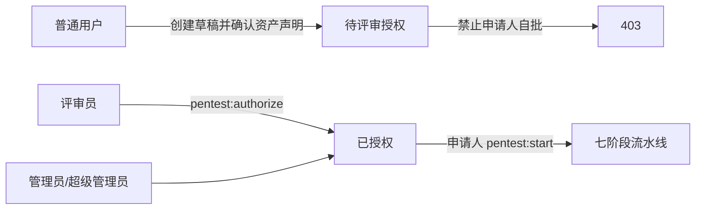

# v3.9.4 完整复核与角色授权收敛设计

## 角色收敛

- 新迁移把 `auditor` 权限集合并入 `reviewer`，将现有 `auditor` 用户关系迁到 `reviewer`，随后禁用 `auditor`。
- 非核心自定义角色禁用；历史用户关联保留但不再生效。所有账号按 `user.role` 收敛为恰好一个有效核心 `user_role`，自定义角色账号补 `user`，多核心关联移除冲突项。
- 迁移备份表分别记录新增与移除关联，使降级能精确恢复。
- 服务层与统一用户管理页只接受一个基础角色，不再展示附加角色。

## 渗透授权

- 新增 `pentest:authorize` 权限，仅授予 reviewer/admin/super_admin。
- `pentest_engagement` 增加 `authorized_by_user_id`。
- 申请人提交规则声明后进入 `pending_authorization`；独立批准接口才写 `authorized`、批准人和时间窗。
- 申请人不得批准自己的委托；reviewer 通过 `scope=all&status=pending_authorization` 查看队列。
- 审批采用带状态条件的原子更新，同一申请只能有一个批准人；评审员只能查看/批准，不能取消或删除他人委托。

## 小菱会话

- 旧裸 localStorage key 无法证明所有者，删除索引指针并依赖服务端按 user_id 发现。
- 会话索引、active session、草稿继续按账号作用域保存。
- user/admin 会话面由宿主显式传入，不再根据 `admin:<id>` 这类存储键字符串猜测。
