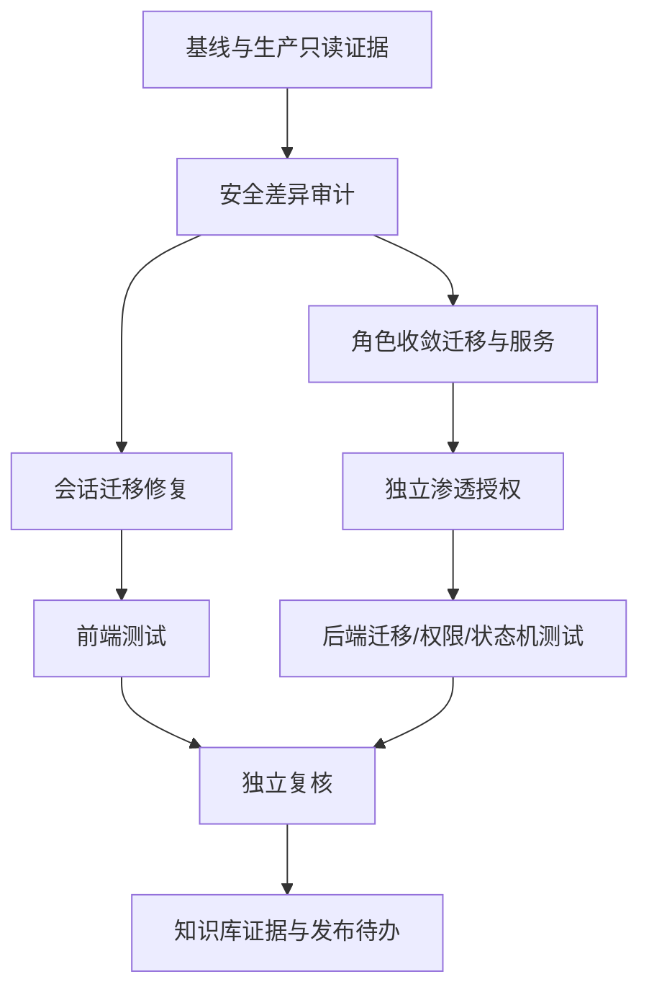

# v3.9.4 完整复核与角色授权收敛任务

| 原子任务 | 输入 | 输出 | 验收 |
| --- | --- | --- | --- |
| 版本/生产复核 | v3.9.2、v3.9.4、生产只读访问 | 版本、镜像、迁移、页面截图 | 三类证据相互一致 |
| 小菱隔离 | 旧裸缓存、账号作用域缓存 | 无跨账号迁移 | 单元测试覆盖旧/新键 |
| 角色收敛 | 现有 5 角色及附加角色 | 4 个系统角色，3 个可分配 | 迁移和权限矩阵通过 |
| 独立授权 | 现有自签流程 | reviewer 审批链 | 自批 403、跨人审批成功 |
| 知识库 | 截图、测试、差异审计 | 置顶待办和证据边界 | harness validate/postflight 通过 |
