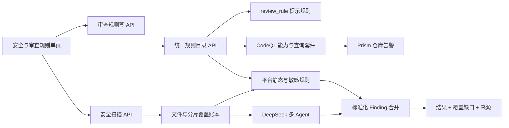

# DESIGN_v3.9.6安全规则与全项目闭环20260918

## 整体架构



## 分层设计

| 层 | 组件 | 职责 |
| --- | --- | --- |
| 展示层 | `SecurityRuleCenter.vue` | 单一页面标题、标签状态、可访问导航和错误反馈 |
| 既有视图 | `SecurityCenter.vue`、`RuleConfig.vue` | 嵌入式安全态势与规则管理，保留各自数据加载和写权限 |
| 目录层 | `security_rule_catalog_service.py` | 只读聚合多种规则来源，输出稳定事实模型 |
| 外部规则层 | `.github/workflows/codeql.yml` | 使用官方 Action 与 `security-extended` 扫描 Prism 仓库；不冒充平台上传项目扫描 |
| 覆盖层 | `review_service.py` / `security_sentinel_agent.py` | 冻结输入、记录分片状态、判定完整性和恢复未完成文件 |
| 治理层 | 测试矩阵/数据清单/重复矩阵 | 自动核验和发布证据 |

## 接口契约

### `GET /api/security/rule-catalog`

返回规则目录摘要、来源版本与 CodeQL 可用性。该接口是只读投影，不接管 `/api/rules` 的写操作。

### CodeQL 执行边界

- `.github/workflows/codeql.yml` 对 Prism 仓库的 Python、JavaScript/TypeScript 执行 GitHub CodeQL 高级配置扫描。
- `/api/security/rule-catalog` 只报告 `ci_configured`、`cli_detected` 或 `not_installed`，`executable` 始终不代表平台产品扫描已接通。
- 用户上传项目的受控 CLI、SARIF 导入与结果合并尚无实现，不提供虚假 API。

### 覆盖账本

```text
review_task -> frozen_files[] -> coverage.files[file_id] -> completed/failed chunks
```

完成判定：普通审查所有文件必须为 `complete`，项目安全扫描的字符核账必须完整；任何截断、超时、解析失败或预算停止都会使整体失败并携带覆盖缺口。

## 安全约束

- CodeQL Action 固定官方提交 SHA、语言与查询套件；产品运行时尚未接入，因此没有开放宿主路径或任意子进程入口。
- 浏览器渲染的规则内容走 Vue 文本绑定；Markdown 继续经 DOMPurify。
- URL 输入采用 scheme/host/解析后 IP 与重定向链复核，禁止回环、链路本地、私网和元数据地址，除非处于明确授权的隔离测试模式。
- 日志和证据不保存密钥、口令、完整令牌或第三方隐私。

## 异常策略

- 规则目录任一来源失败：保留其他来源，标明该来源不可用，整体不伪报完整。
- CodeQL 产品执行不可用：页面显示仓库 CI 或 CLI 探测状态；平台内置规则和 DeepSeek 继续执行，但不声称用户项目经过 CodeQL。
- DeepSeek 单分片失败：有界重试；其他分片继续；最终结果为 partial 并可从账本续跑。
- 生产数据归属不明：中止删除，只生成待确认清单。
