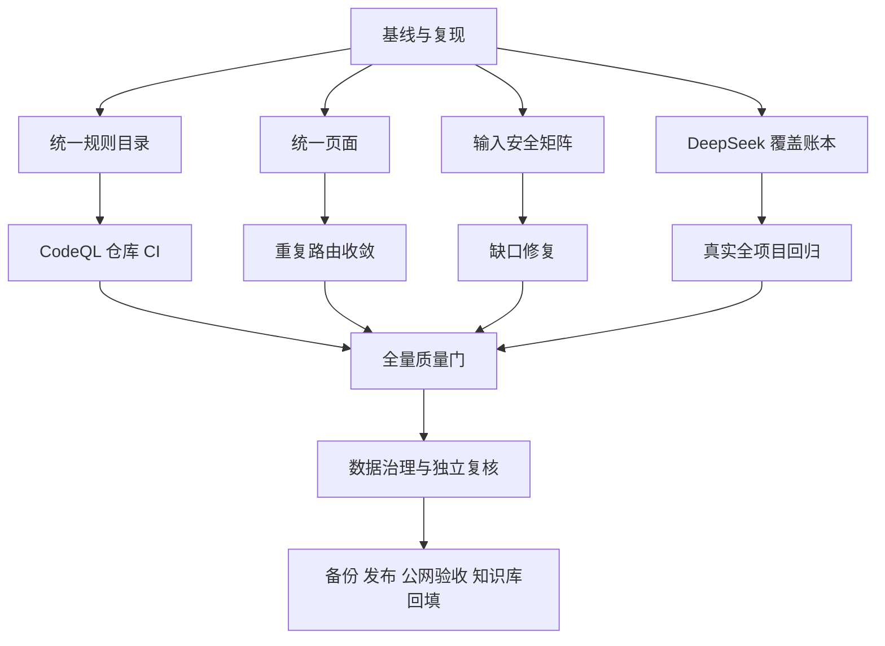

# TASK_v3.9.6安全规则与全项目闭环20260918

## 任务依赖图

## 原子任务

| 编号 | 输入契约 | 输出契约 | 独立验收 |
| --- | --- | --- | --- |
| T1 | v3.9.5 代码、生产与知识库基线 | 页面/API/模型/测试清单和可复现问题 | 只读审计报告 |
| T2 | 三类现有规则源 | 无双写的统一目录服务、Schema、API | 数量与元数据测试 |
| T3 | `/security`、`/rules` | 统一页面和嵌入式视图 | 路由/组件交互测试 |
| T4 | OpenAPI、Schema、高风险接收点 | 输入安全覆盖矩阵 | 自动清单与分类断言 |
| T5 | 现有 DeepSeek 分片/重试逻辑 | 持久或可恢复覆盖账本 | 截断、断点、预算测试 |
| T6 | GitHub CodeQL 官方 Action 与查询套件 | 仓库 CI 工作流、真实能力状态 | 工作流静态核验 + GitHub 运行结果 |
| T7 | 路由/API/页面重复矩阵 | 无歧义入口收敛与兼容跳转 | 菜单、搜索、引导、权限测试 |
| T8 | 矩阵发现的可验证缺口 | 最小安全修复 | 红绿回归 |
| T9 | 已授权真实项目和预算门禁 | 文件级覆盖账本、用量、缺口 | 真实 DeepSeek 结果 |
| T10 | 全部代码变更 | 全量测试、静态检查、构建 | 命令记录全绿 |
| T11 | 生产 QA/演示数据清单 | 可回滚动作与重算 | 独立子代理复核 |
| T12 | 不可变提交和备份 | v3.9.6 发布及公网截图 | 双账号/浏览器/API 验收 |

## 执行约束

- 不修改或提交 `.claude/launch.json`、`backend/uv.lock`。
- 不对生产未知数据做不可逆删除。
- 不提供尚未实现的 CodeQL 产品执行入口，不把仓库 CI 状态包装成用户项目扫描结果。
- 不把模拟、单元测试或页面存在误写成真实外部引擎/模型验收。
- 专用 Codex Security Deep Scan 因宿主缺少 managed filesystem permission profile 被阻断，最终报告必须保留此边界。
