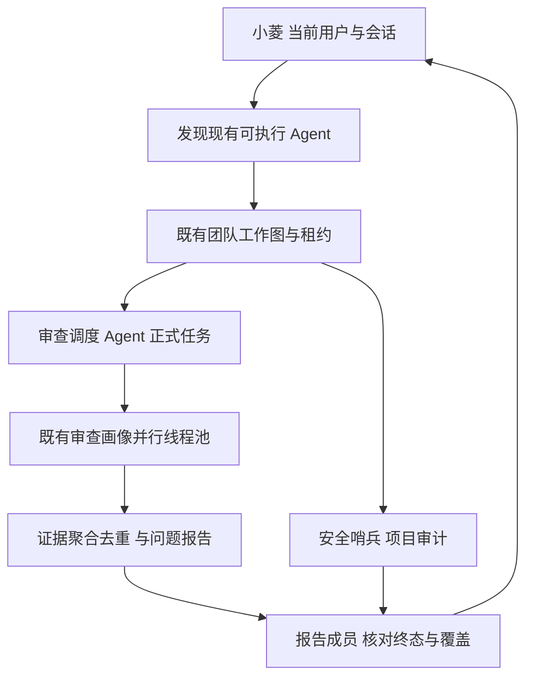

# 棱镜第四版实现设计

复用团队调度、正式审查后台工作线程、输入快照、模型归因和现有报告。团队内新增正式审查操作仅供持有有效内部租约的调度调用，不接受客户端伪造内部上下文；审查服务继续检查权限。使用既有归因字段关联团队任务，恢复时复用已创建正式任务。等待有上限，状态和证据按真实业务结果返回。

安全扫描传递实际支持的 scan_mode；保留扫描覆盖和失败结果。汇总成员按依赖任务的实际状态、证据、任务与报告引用形成结构化结论，不能仅包装依赖 JSON 后宣告成功。小菱指导必须与 Handler 支持参数一致。

前端使用容器内按钮布局、页头底对齐和明确网格区域；操作列与内容列分离，基于卡片统一内边距和色带定位，不使用随标题内容增长的定位。

失败策略：权限、归属、执行租约和数据完整性失败终止；模型失败保留部分结果和原因；不引入未证实成功的降级。

## 实现核对资料

- Python 官方线程池说明：已开始的线程不能通过 cancel_futures 强制终止，应用必须校验执行 token 并停止后续调用/落库。https://docs.python.org/3/library/concurrent.futures.html
- SQLAlchemy 官方 Session 说明：每个线程独立 Session，等待期间释放事务，不在线程之间共享可变会话。https://docs.sqlalchemy.org/en/20/orm/session_basics.html
- MDN 网格对齐说明：使用明确网格区域及 align-items 对齐盒子。https://developer.mozilla.org/en-US/docs/Web/CSS/Guides/Grid_layout/Box_alignment
