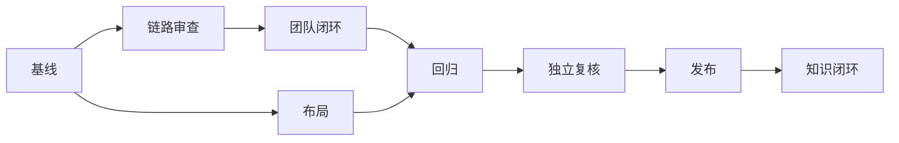

# 棱镜第四版任务拆分

|任务|输入|输出与验收|依赖|
|---|---|---|---|
|基线|版本、发布账本、镜像、迁移|当前 3.9.14 实时证据|无|
|链路审查|现有服务、Prompt、测试|准确复现和逻辑漏洞清单|基线|
|团队闭环|有效租约、现有成员、项目|真实并行、正式任务、去重和可信状态|链路审查|
|布局|五张截图、现有页面|各视口可点击、底对齐、稳定操作列|基线|
|回归|实现和失败用例|后端/前端测试、构建、真实模型、浏览器证据|团队闭环、布局|
|独立复核|原始日志和账本|数据重算、需求覆盖、证据限制|回归|
|生产发布|精确提交、备份、回滚点|4.0.0 同 SHA、健康迁移、真实业务复验|独立复核|
|知识闭环|用户明确偏好、实际证据|主库条目、validate、postflight|布局、生产发布|

