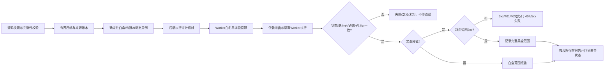
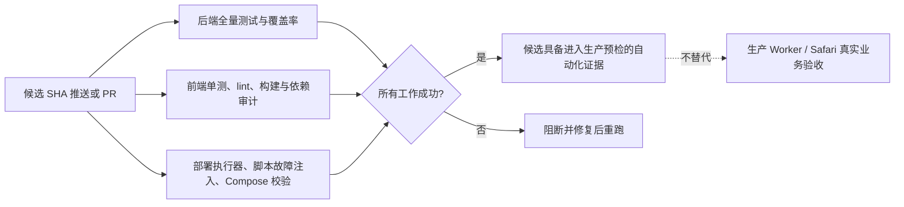

# 黑白盒可靠性设计

## 关键组件与职责

- 源码上下文层提供来源 ID/哈希、压缩完整性校验和调用预算。
- 沙箱服务负责组装审计信封、生成白名单 Worker payload、验证 Worker 与子步骤回执、计算覆盖等级。
- 固定 runner 只在隔离环境执行白盒检查和回环黑盒探测；目标路由发现是提示，不是模型可信输入。
- 报告 API 按 `REPORT_VIEW` 控制覆盖范围；前端以明确标签显示状态，不把未知或部分状态渲染为确定失败或通过。
- 发布后浏览器任务用于确认真实 Worker 交互和持久化结果，单元测试不能代替生产闭环。
- 用例生成器从完整源码分片核对标识符，不依赖有损摘要中的子串碰撞；安全属性和标准库名称使用明确白名单。
- Python 导入 grounding 按源码路径构建模块导出表；从模块、包、别名导入与模块属性调用都核对具体目标模块，其他源文件的同名符号不能替代。
- Python 动态黑盒端口校验识别 `os.environ`/`os.getenv` 的合法导入别名，并分析直接/反射写入、映射删除、`operator` 调用和 `methodcaller`；任何改写后的来源不再视为可信运行时端口。
- 黑盒回执的 `basis` 与动态断言状态必须吻合：未执行用例只能标为路由冒烟，执行并产生布尔结论才能标为路由与断言；解析器拒绝错配回执。
- 大源码分片在模型截断或逐字引文校验连续失败时确定性二分；每层仍要求来源 ID、顺序、逐字引文和覆盖完整，切分/调用预算耗尽即失败关闭。
- Node 动态用例统一生成 `.mjs` 并用 ESM 导入，避免项目 `package.json` 的 `type` 改变 harness 语义；runner 同时保留历史 CommonJS `.js` 白盒入口并实际识别 `blackbox.mjs`。
- Python grounding 在保留项目符号逐模块核验的同时，仅对显式导入并命中窄白名单的 `inspect`/`importlib` 反射链免除项目 API 检查；其他标准库属性仍按原规则检查，且放行链仍须由隔离 runner 实际执行。
- 任务列表和详情的状态呈现以 `verification_coverage.verification_status` 补充执行状态：runner 已退出但覆盖为 `partial` 时，显示警示态“部分通过”。
- Java 动态白盒 harness 编译和运行 classpath 同时包括 Worker 生成的 AI 测试类和已编译项目类目录；Maven/Gradle 第三方依赖仅在隔离缓存已具备时可用，缺失时必须作为未完成处理。
- 常规白盒和黑盒在应用启动/测试前执行离线依赖准备；离线缓存不具备所需依赖时不得把空跑或语法检查包装为业务通过。

## 状态计算原则

`passed` 是所有必需证据的合取条件，不由 Worker exit code 单独决定。远程探测使用 `follow_redirects=false`，因此只有 2xx 是通过；重定向不代表最终业务页面已验证。生成的 AI 动态用例需要执行清单与结果数量、哈希和通过状态一致。清理回执独立保存；未知 Worker/资源状态不能记录成已释放。

AI 动态用例回执语义：未生成/未执行为 `null`，执行失败为 `false`，仅已执行且通过才为 `true`。

## 候选持续集成门禁

- 后端工作流从锁文件安装 Python 3.11 依赖；以 `--network none` 的 Redis Unix socket 容器启用真实 Lua 限流集成，而不是把 6 个可执行用例留作 skipped。
- 前端工作流使用锁文件安装，并执行依赖审计、Vitest、ESLint 与 Vite/TypeScript 生产构建。
- 部署工作流执行部署执行器 Python 测试、发布绑定与故障注入、ShellCheck/语法和 Compose 静态配置检查。
- Action 引用固定到提交 SHA，CI 仅有读取仓库权限；所有步骤不连接生产账号或生产 Worker。
