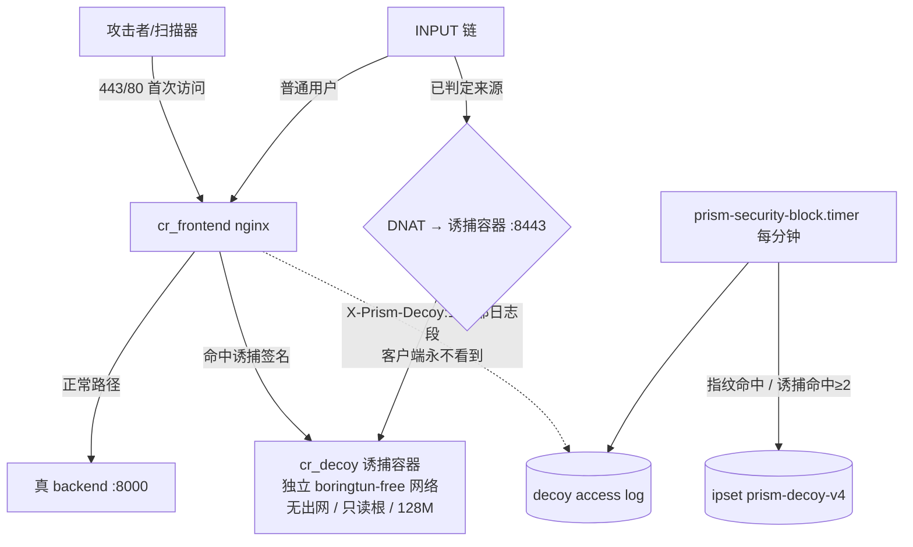

# 主动欺骗与网络隔离设计（v4.0.57 候选）

> 状态：**设计待评审**（本文件是设计交付，尚未落代码；生产仍为 v4.0.56 / `55152f64`）
> 定位：把"被动封禁"升级为"**攻击者留在诱捕层内空转 + 真业务对已判定来源不可见**"的主动欺骗。
> 全部动作发生在自有服务器与自有容器网络内，**没有任何对第三方的主动动作**。

## 0. 为什么不走"还手"这条路（写在最前面，避免反复讨论）

自动回击的命中对象是攻击者使用的跳板机/云主机/肉鸡，而不是攻击者本人；一条"谁打我我打谁"
的规则里没有目标清单、没有时间窗、没有中止条件，等于把开火权交给攻击者。本设计提供的是
**同等甚至更强的对抗效果**：让攻击者在假环境里耗尽时间、自以为得手，同时把他的指纹、
工具特征与行为链留成证据。

## 1. 交付范围

| 编号 | 内容 | 归属 |
| --- | --- | --- |
| D1 | 诱捕层（静态应答容器 + 敏感路径/管理面诱饵 + 反指纹） | 本机容器，独立网络 |
| D2 | 黑洞与重定向（已判定来源 DNAT 到诱捕层，不再 DROP，持续取证） | 现有 root 规则引擎 + ipset |
| D3 | 独立出网通道（运维/情报出网与业务入口 IP 分离） | 宿主机 iptables + 容器出网策略 |
| D4 | 诱捕台账与安全中心面板 | 后端 + 前端 |
| D5 | 表面迷惑（统一错误页、虚拟目录、CRT 证书收敛） | 前端 Nginx 配置 |

## 2. 生产环境事实（本设计的约束，均已实测）

```
宿主：OpenCloudOS 9.4 / VM-0-16-opencloudos，iptables v1.8.9 (legacy)，nft 存在
业务入口：0.0.0.0:80 / 443（cr_frontend 容器，nginx.conf.template:212 行）
对外暴露：仅 22 / 80 / 443；MySQL 127.0.0.1:3307；Redis/ClamAV 仅容器网络
业务 IP 与出网 IP 相同：81.70.251.90（curl ipinfo.io/ip 返回同一地址）
云厂商链：YJ-GLOBAL-INBLOCK / YJ-GLOBAL-OUTBLOCK（**不修改，保持只读**）
自有链：INPUT → PRISM-SEC-IN（ipset prism-sec-v4 → DROP）
       DOCKER-USER → PRISM-SEC-DK（conntrack 原始目的端口 80/443 → ipset → DROP）
Docker 网络：bridge / deploy_code_review_net / deploy_default / sandbox_test_net / none
前端 Nginx：listen 443 ssl default_server；server_name ${APP_DOMAIN} …；root /usr/share/nginx/html
```

关键结论：**出网 IP 与业务 IP 是同一个地址**，任何"拉黑我们的出口"的对抗都会同时打掉业务；
这是 D3 要解决的问题，也是最后一个真实风险点。

## 3. 架构



要点：
1. **第一层在 Nginx**：命中敏感路径/管理面诱饵的请求被路由到 `cr_decoy`，拿到的是"看起来很真"的假响应；
   真 backend 完全不参与，攻击者不知道自己在诱捕层。
2. **第二层在内核**：被规则引擎判定过的来源，**不再走 DROP**，而是 DNAT 到诱捕容器（:`8443`，自签 TLS）。
   攻击者仍然"能打开"，但看到的一切都是假业务；我们的取证是持续的。
3. **诱捕容器无出网**：`--network <internal>` + 默认拒绝，杜绝被当作反射/代理跳板。
4. **云厂商链与云安全组不改**：D2 只使用我们自己的 ipset 与 `PRISM-SEC-*` 链。

## 4. 模块设计

### D1 诱捕层（cr_decoy）

- 镜像：`nginx:alpine`（已在本机 Docker 缓存中）或 `python:3.11-alpine` + 静态服务；**不引入新第三方组件**。
- 运行约束：`--read-only`、`--tmpfs /tmp`、`--memory 128m`、`--cpus 0.25`、`--network prism-decoy-net`（internal）、
  `--security-opt no-new-privileges`、非 root 用户、无 volume 写权限。
- 诱饵目录（全部为**虚构内容**，绝不返回任何真实配置/密钥）：

| 路径 | 应答内容 | 设计意图 |
| --- | --- | --- |
| `/.env`、`/.env.production` | 假 `APP_KEY`/假 DB 密码/假 `REDIS_PASSWORD` | 让攻击者拿到"看起来可用"的凭据 |
| `/.git/config`、`/.git/HEAD` | 假仓库地址（`https://github.com/decoy/app.git`） | 诱导 git 下载尝试（实际 404） |
| `/wp-admin/`、`/wp-login.php`、`/xmlrpc.php`、`/wp-json/wp/v2/users` | 假 WordPress 登录页与用户枚举 | 命中率最高的自动化扫描目标 |
| `/phpmyadmin/`、`/pma/`、`/adminer.php` | 假 phpMyAdmin 登录页 | 同上 |
| `/manager/html`、`/solr/`、`/actuator/env`、`/actuator/heapdump` | 假 Spring/Tomcat 管理面 | 针对 Java 栈扫描器 |
| `/.aws/credentials`、`/credentials.json`、`/.kube/config` | 假云凭据（含明显无效的假 AK） | 诱导"横向移动"尝试 |
| `/backup.zip`、`/db.sql`、`/dump.sql`、`/app.tar.gz` | 假的 3.2MB 伪随机文件（限流） | 消耗对方带宽与时间 |
| `/api/v1/internal/debug`、`/api/admin/export` | 假 JSON（含 `trace_id` 假链） | 把 API 探测也吸进诱捕层 |

- **反指纹**（必须做，否则一眼看穿）：
  1. 统一模板：所有诱饵页共用一份"PHP 8.1 / nginx 1.24 / Ubuntu"特征外衣；
  2. 固定响应头集合（`Server`、`X-Powered-By`）随模板一致，且**抑制任何标识我们身份的头**；
  3. 随机延迟 80–400ms；响应体上限 64KB（伪文件除外，且强制限速 256KB/s、单 IP 并发 2）；
  4. 404 页面与真站同模板，避免"假 404"暴露；
  5. 不做任何重定向到真站。
- **限流防放大**：每 IP 3 r/s、并发 8、连接超时 10s；全局出口带宽上限 8MB/s（`--network` 层面 + nginx limit_rate）。
- 日志：`/var/log/prism-decoy/access.log`（只读 volume），只记 `remote_addr / path / ua / 内部标记`，
  **不记录任何真实业务数据**（诱捕层本来也没有）。

### D2 黑洞与重定向

- 新增 ipset：`prism-decoy-v4` / `prism-decoy-v6`（`hash:ip timeout 3600 maxelem 1024`）。
- 新增链：`PRISM-DECOY-IN`（INPUT 与 DOCKER-USER 各挂一条引用），规则：

```
-A PRISM-DECOY-IN -m set --match-set prism-decoy-v4 src -p tcp -m multiport --dports 80,443 \
   -j DNAT --to-destination <decoy_ip>:8443
-A PRISM-DECOY-IN -m set --match-set prism-decoy-v4 src \
   -p tcp ! --dport 80 ! --dport 443 -j DROP   # SSH 等其它端口直接丢弃
-A PRISM-DECOY-IN -m conntrack --ctstate NEW -m set --match-set prism-decoy-v4 src -j ACCEPT
```

- **顺序硬约束**：`PRISM-DECOY-IN` 必须在 `PRISM-SEC-IN` / `PRISM-SEC-DK` 的 DROP 规则**之前**被引用，
  否则流量会在 DROP 处终止，根本到不了诱捕层。启动时校验链序，不符合就拒绝启用（fail-closed）。
- 进入诱捕的判定来源（两条，都是确定性判定，模型不参与）：
  1. **指纹命中**：同一 IP 在 300s 窗口内命中 ≥2 个不同诱饵路径；
  2. **规则命中**：既有的 SSH/Web 确定性阈值命中（此时不再仅封禁，而是"封 + 引流到诱捕"）。
- 租约：默认 3600s，受现有 `auto_escalate` 影响（重复来源按倍数递增，硬上限 3600s）。
- 保护来源照旧排除（当前管理员连接、服务器本机、近一小时 SSH 成功来源、白名单、已建立公网对端）。

### D3 独立出网通道（与 D2 同等重要）

问题：业务 IP = 出网 IP。若被对手反向拉黑或云侧黑洞，业务直接受损。设计分两步：

**D3a（低成本，先做）**：把"高风险出网"改走独立出口。
- 高风险出网：威胁情报查询（`THREAT_INTEL_BASE_URL`）、`whois`、反向 DNS、证书续期探测、更新源。
- 实现：在宿主机用 `ip rule` + 独立路由表 + 第二个 EIP（或代理容器）把这批目的地址/进程走独立出口；
  退一步也可用 `socat`/tinyproxy 容器，仅允许白名单目的域名，诱捕层与业务容器禁止使用。
- **前置校验**：切换后必须核查供应商侧是否按源 IP 做风控（尤其是模型 API 供应商与通知渠道），
  变化会导致调用被拒；因此 **LLM API 出网默认保持现状**，只迁移情报/证书/更新这类无状态查询。

**D3b（彻底方案）**：运维通道与业务入口彻底分离。
- 第二个 EIP 承载 SSH（22 只在这个地址上开放）+ 出网；业务 IP 只承载 80/443；
- 云侧安全组把 22 从业务 IP 上摘掉。**这一步会改云安全组，需要你显式点头**，否则只做 D3a。

### D4 诱捕台账与面板

- 数据：复用 `OpsExecution` 审计 + 新增只读动作 `security_decoy_status`、`security_decoy_hits`；
- API（均 `require_super_admin`）：
  - `GET /api/admin/security-center/decoy` → 诱捕层状态（容器健康、命中计数、当前引流来源数）
  - `POST /api/admin/security-center/decoy/trace` → 对某个幽灵访客做一次完整溯源（复用 `security_ip_trace`）
  - `PUT /api/admin/security-center/decoy` → 开关与参数（`enabled`、`min_hits`、`lease_seconds`、`rate_limit`）
- 前端：安全中心新增第 5 个分区「诱捕层」，展示"幽灵访客"列表（IP / 命中路径 / 工具指纹 / 停留时长 / 已被引流次数），
  一键溯源、一键导出证据包（JSON + 文本，可交给云厂商或网警报案）。

### D5 表面迷惑（低风险、见效快）

- 真站 404/403 页面统一成与诱捕层同模板，避免"真站 404 暴露真身"；
- 关闭 Nginx `server_tokens`，统一 `Server` 头；
- 证书透明日志（CT）会暴露子域清单：只在证书里保留必要域名，减少攻击面枚举入口；
- 对已知扫描器的 UA 直接给"软 404"（200 + 假首页），而不是 403——减少"被 WAF 挡了"的确定性反馈。

## 5. 参数表（默认值，可在面板调整）

| 参数 | 默认 | 范围 | 说明 |
| --- | --- | --- | --- |
| `decoy_enabled` | false | — | 总开关，默认关闭，由最高管理员开启 |
| `decoy_min_hits` | 2 | 1–10 | 触发引流所需的不同诱饵路径命中数 |
| `decoy_window_seconds` | 300 | 60–900 | 命中统计窗口 |
| `decoy_lease_seconds` | 3600 | 60–3600 | `prism-decoy-*` 租约时长（内核 TTL 自动到期） |
| `decoy_rate_limit` | 3 r/s | 1–20 | 单 IP 对诱捕层的速率 |
| `decoy_max_bandwidth` | 8 MB/s | 1–32 | 诱捕层全局出口上限 |
| `decoy_allow_release` | true | — | 面板允许人工解除引流 |

## 6. 分阶段交付

| 阶段 | 内容 | 交付物 | 风险 |
| --- | --- | --- | --- |
| P1 | D1 诱捕层容器 + 反指纹 + 限流（**不引任何流量**，手动访问验证） | 容器编排、诱饵内容、单测 | 极低 |
| P2 | D4 台账与面板（只读展示 P1 的命中） | 后端 API + 前端分区 | 极低 |
| P3 | D2 引流（ipset + 链序校验 + root 规则引擎扩展） | 执行器改动 + 内核隔离回归 | 中（链序错会误伤业务，用 fail-closed 防） |
| P4 | D3a 高风险出网迁移 | 路由规则 + 校验报告 | 中（需核对供应商风控） |
| P5 | D5 表面迷惑 | Nginx 配置 + 404 模板 | 低（可能影响前端错误页体验，需真页面验收） |
| P6（需单独点头） | D3b 第二个 EIP / 云安全组调整 | 云侧变更记录 | 高（改云配置，单独窗口执行） |

## 7. 验收标准

1. **业务无损**：引流开启前后，`healthz`/`readyz`、登录、审查、溯源、对话四类真实路径全绿；
   管理员自身来源永不被引流（保护来源回归用例必须覆盖）。
2. **诱捕有效**：模拟扫描器（本机 `curl` 连续命中 3 个诱饵路径）在 `min_hits` 内被引流，
   之后请求全部落在诱捕层且真 backend 日志零记录。
3. **不可穿透**：诱捕容器 `--network internal`，`curl https://<域名>` 从诱捕容器内部发起必须失败；
   无法通过诱捕层访问任何真实数据。
4. **不放大**：单 IP 触发 20 并发请求时，诱捕层出口带宽不超过上限，且不影响业务容器 CPU/内存水位。
5. **可回滚**：一键关闭 → `ipset flush prism-decoy-*` + 删除链引用，10 秒内恢复原状；
   发布账本保留上一版本镜像与 `.releases/previous.env`。
6. **可取证**：导出的证据包含源 IP、ASN/组织、命中路径序列、UA/工具指纹、首末时间、引流次数。
7. **链序 fail-closed**：故意把 `PRISM-DECOY-IN` 放到 DROP 之后，必须拒绝启用并报错。

## 8. 明确不做（写进设计，避免以后被"顺手加进去"）

- 不对第三方地址做任何主动动作（扫描、探测、反打、慢速攻击他人）；
- 不做 TLS 中间人截获攻击者流量（我们只提供自签证书的假服务，不伪造第三方证书）；
- 不记录、不存储任何真实用户数据到诱捕层；
- 不改云安全组 / 云厂商黑洞链（D3b 另行授权）；
- 不把诱捕层做成任何形式的出网代理或跳板（`--network internal` 硬约束）。

## 9. 风险与缓解

| 风险 | 缓解 |
| --- | --- |
| 链序错导致业务被引流 | fail-closed 校验 + 内核隔离网络回归（沿用既有 `test_security_block_kernel.py` 模式） |
| 诱捕层被当成放大器打别人 | 无出网 + 限流 + 响应体上限 + 全局带宽上限 |
| 攻击者识破诱捕层后转向真站 | 反指纹规则 + 统一模板 + 软 404；识破也只影响该来源，不影响其他用户 |
| 出网迁移导致模型/通知渠道风控 | D3a 只迁移无状态查询；LLM 与通知渠道默认不动，变更前后各跑一次真实调用核对 |
| 诱捕容器成为新的攻击面 | 只读根、非 root、无 volume 写、无出网、无 shell 暴露；镜像固定 tag 并记录 digest |

## 10. 评审决策点（等你点头）

| 编号 | 决策 | 选项 |
| --- | --- | --- |
| Q1 | 是否开始 P1+P2（诱捕层 + 台账面板，不引流量、零业务风险） | 是 / 否 |
| Q2 | P3 引流的首个策略：`min_hits=2`（保守，先只抓扫描器）还是 `1`（激进，任何诱饵命中即引流） | 2 / 1 |
| Q3 | D3a 的出网迁移范围：仅情报+证书+更新（推荐） / 是否包含通知渠道 | 推荐 / 扩大 |
| Q4 | 是否安排 D3b（第二个 EIP + 云安全组调整）单独窗口 | 是 / 否 / 暂缓 |
