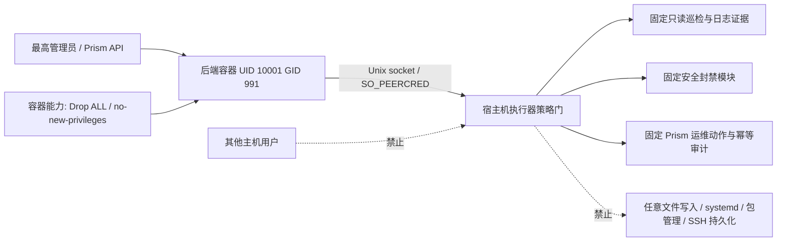
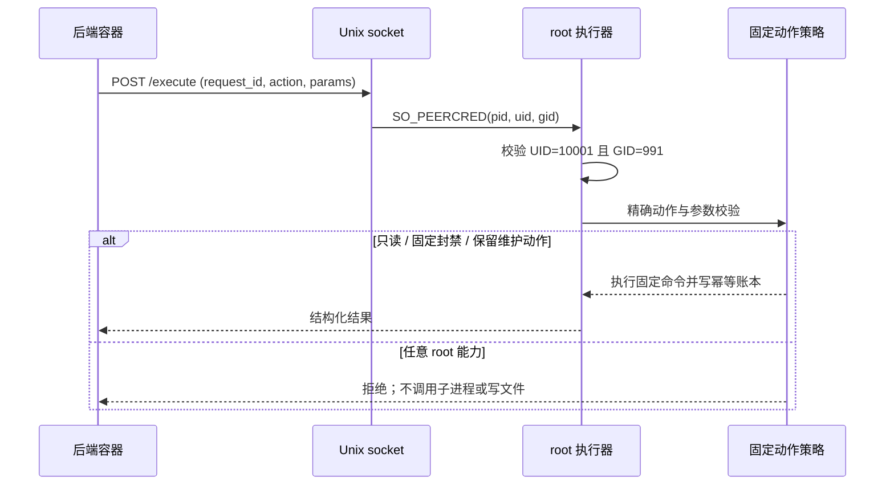

# 主机治理与执行器边界设计

## 信任边界

## 分层

1. **后端操作策略**：保留管理员身份、风险分类、人工审批、执行记录与幂等 request_id。风险审核是产品层控制，不被当作宿主机的唯一防线。
2. **Unix socket 身份**：执行器验证 Linux `SO_PEERCRED` 中的 UID 10001 与 GID 991；不再依赖泄露到后端环境的共享令牌。套接字目录 `0710 root:prism-ops` 使后端组可遍历但不可列举或写目录项。
3. **动作能力**：只保留明确注册的动作。高权限泛化接口删除；固定安全封禁继续由独立、确定性模块处理，不接受模型提供任意命令、目标 IP 或时长。
4. **文件证据**：仅读取明确允许的日志、运维审计和备份元数据目录；保留敏感文件名/私钥拒绝、符号链接拒绝和文本大小上限。
5. **root 进程环境**：执行器和安全封禁 oneshot 均不继承应用 dotenv 的数据库、JWT、模型或第三方密钥；封禁脚本按白名单逐行解析其实际使用的 3 项配置，其他键不进入进程环境或子进程环境。部署脚本仍可显式读取 dotenv 执行既有操作。

## 残余风险

Unix peer credential 证明调用进程身份，不证明应用层 actor、风险确认或审批状态。后端进程若失陷，仍可直接请求执行器中保留的固定高权限动作，例如固定服务变更、受限配置、回滚、备份恢复与清理，以及安全封禁策略接口。这些是参数受限的固定动作，不构成任意 shell 或任意路径写入；root 边界目前仍把后端视作可信运维调用方。若要求后端失陷后也不能绕过高风险审批，需另建后端不可单独授权的宿主机审批机制。

## 关键流程

## 失败策略

- 非 Linux 或无 `SO_PEERCRED` 时执行器拒绝请求，不回退静态令牌。
- peer UID/GID 错误、socket 状态不符合预期或动作未注册时 fail closed。
- 既有幂等账本与审计记录格式保持；生产拒绝测试不得执行命令。
- 部署失败沿用当前发布脚本的备份和应用回滚门禁；不得用手工复制容器镜像绕过同版本健康检查。
