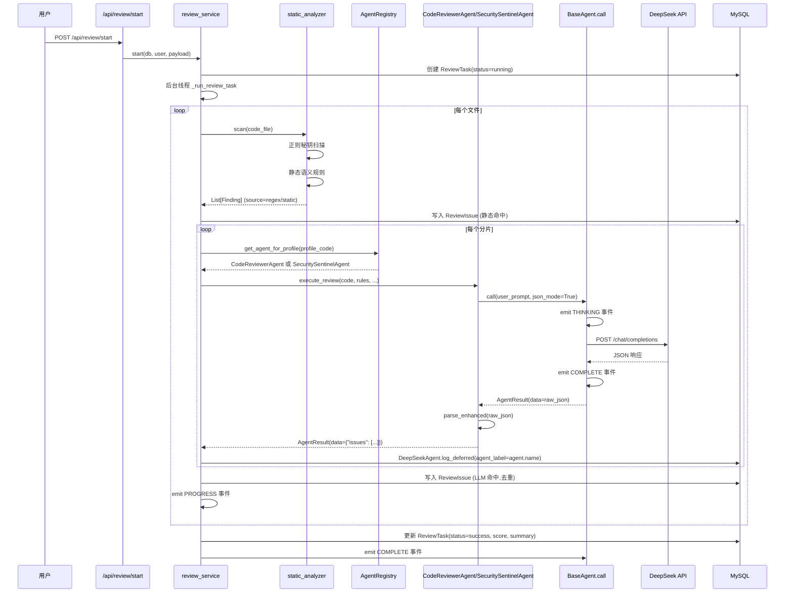
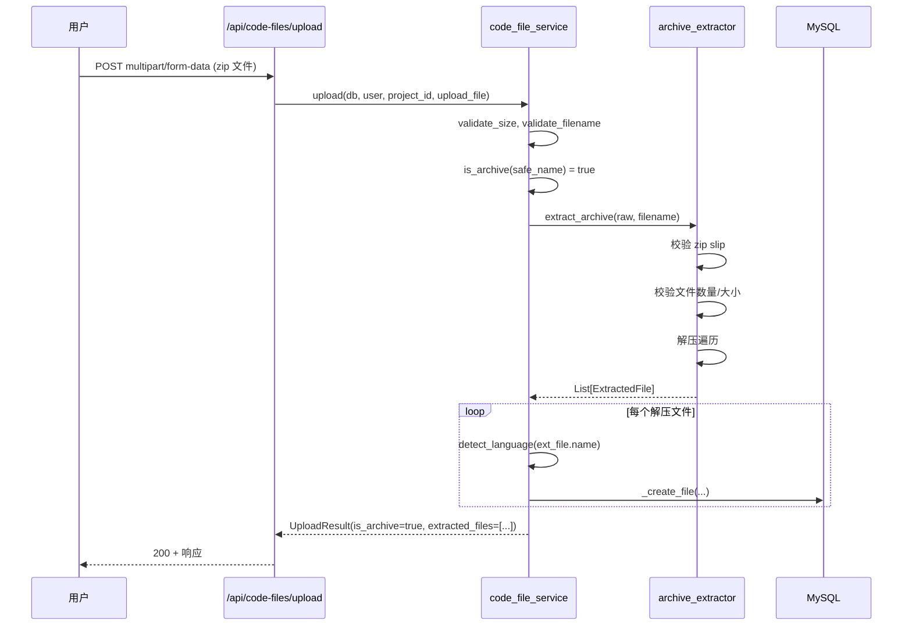
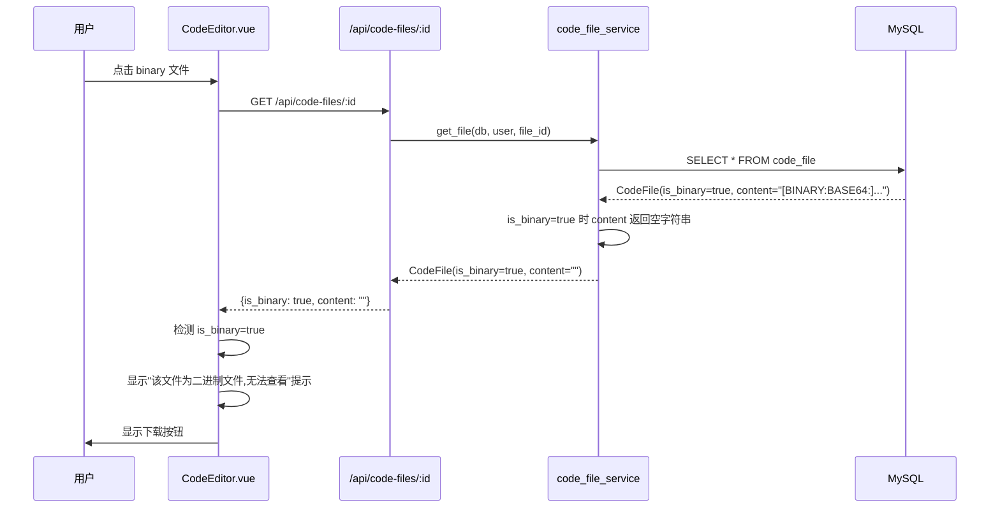
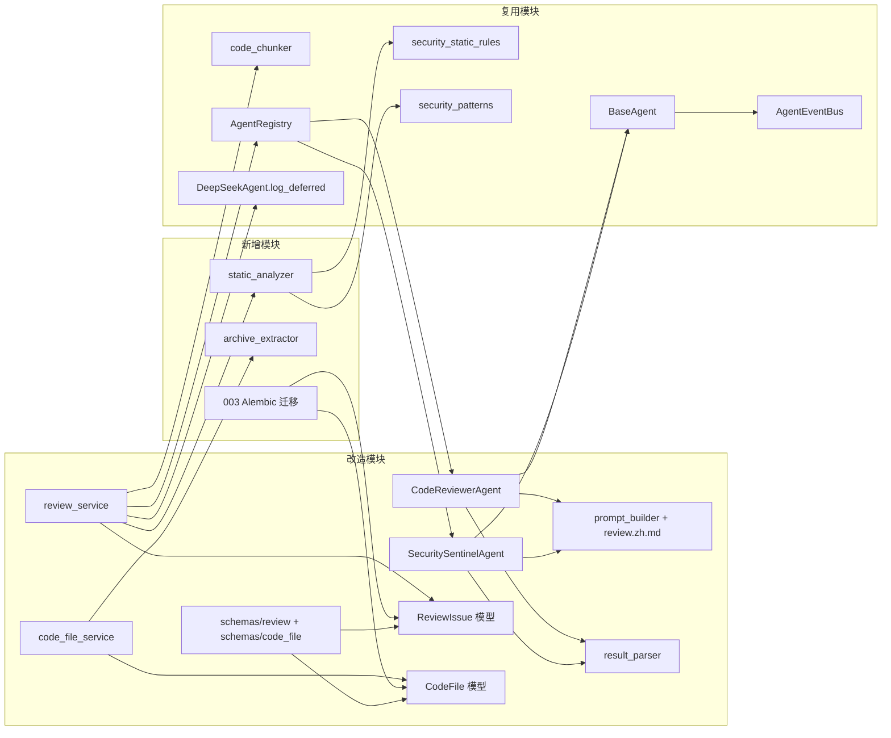

# DESIGN · 代码审计 Agent 集成与漏洞识别增强

> 任务名: `代码审计Agent集成与漏洞识别增强`
> 创建时间: 2026-06-25
> 阶段: Architect(架构)
> 输入: ALIGNMENT + CONSENSUS
> 输出: 整体架构图、分层设计、接口契约、数据流图、异常处理策略

---

## 一、整体架构图

```mermaid
flowchart TB
    subgraph 前端
        UI_ReviewStart[审查启动页 ReviewStart.vue]
        UI_CodeFileList[代码文件列表 CodeFileList.vue]
        UI_CodeEditor[代码编辑器 CodeEditor.vue]
        UI_ReviewTask[审查任务详情 ReviewTaskDetail.vue]
    end

    subgraph API层
        API_Review[/api/review/start]
        API_Upload[/api/code-files/upload]
        API_FileDetail[/api/code-files/:id]
        API_FileDownload[/api/code-files/:id/download]
    end

    subgraph 服务层
        RS[review_service]
        CFS[code_file_service]
    end

    subgraph Agent层
        Registry[AgentRegistry]
        CRA[CodeReviewerAgent]
        SSA[SecuritySentinelAgent]
        BA[BaseAgent.call]
        EventBus[AgentEventBus]
    end

    subgraph AI引擎
        SA[static_analyzer 静态分析新]
        SSR[security_static_rules 20条]
        SP[security_patterns 20类正则]
        PB[prompt_builder]
        RP[result_parser]
        DA[DeepSeekAgent.log_deferred]
    end

    subgraph 数据层
        RT[review_task]
        RI[review_issue 增强]
        CF[code_file 增强]
        ACL[ai_call_log]
    end

    subgraph 压缩包处理
        AE[archive_extractor 新]
        ZS[zip slip 安全校验]
    end

    UI_ReviewStart --> API_Review
    UI_CodeFileList --> API_Upload
    UI_CodeFileList --> API_FileDetail
    UI_CodeEditor --> API_FileDetail
    UI_CodeEditor --> API_FileDownload
    UI_ReviewTask --> API_Review

    API_Review --> RS
    API_Upload --> CFS
    API_FileDetail --> CFS
    API_FileDownload --> CFS

    CFS --> AE
    AE --> ZS
    CFS --> CF

    RS --> SA
    SA --> SSR
    SA --> SP
    SA --> RI

    RS --> Registry
    Registry --> CRA
    Registry --> SSA
    CRA --> BA
    SSA --> BA
    BA --> DA
    BA --> EventBus
    DA --> ACL

    CRA --> PB
    CRA --> RP
    SSA --> PB
    SSA --> RP

    RS --> RT
    RS --> RI
```

---

## 二、分层设计

### 2.1 API 层(无重大改动,仅新增下载接口)

#### 新增接口

`GET /api/code-files/{file_id}/download`
- 描述: 下载二进制文件原内容
- 权限: 文件所属项目 owner 或 admin
- 响应: `StreamingResponse` with `Content-Disposition: attachment; filename=...`
- 用途: 编辑器对 binary 文件提供下载入口

#### 修改接口

`POST /api/code-files/upload`
- 请求: multipart/form-data(同现有)
- 响应: 新增 `is_archive: bool` 和 `extracted_files: list[FileSummary]` 字段
- 行为变更: 检测压缩包时自动解压并创建多个 CodeFile,响应返回所有创建的文件列表

`GET /api/code-files/{file_id}`
- 响应: 新增 `is_binary: bool` 字段;`is_binary=true` 时 `content` 返回空字符串
- 用途: 前端编辑器据此决定是否渲染 Monaco

### 2.2 服务层

#### `code_file_service` 改造

新增 `archive_extractor.py` 工具模块:
- `is_archive(filename: str) -> bool`: 判断文件名是否为支持的压缩包格式
- `extract_archive(raw: bytes, filename: str) -> list[ExtractedFile]`: 解压并返回文件列表
- 内部严格校验:zip slip、文件数量、总大小、单文件大小、隐藏文件过滤

`upload()` 函数改造:
```python
def upload(db, user, project_id, upload_file, file_path=None, language=None) -> UploadResult:
    raw = upload_file.file.read()
    validate_size(len(raw), settings.max_upload_size)
    safe_name = validate_filename(upload_file.filename, settings.allowed_extensions)
    
    if is_archive(safe_name):
        extracted = extract_archive(raw, safe_name)
        file_summaries = []
        for ext_file in extracted:
            fid, lang, vno = _create_file(db, user, project_id, ext_file.name, 
                                          ext_file.path, ext_file.language, 
                                          ext_file.content, "压缩包解压")
            file_summaries.append(FileSummary(id=fid, file_name=ext_file.name, 
                                              language=lang, version_no=vno))
        return UploadResult(is_archive=True, extracted_files=file_summaries, 
                            primary_file_id=file_summaries[0].id)
    
    # 非压缩包:现有逻辑
    text = to_utf8(raw)
    is_binary = text.startswith(BASE64_PREFIX)
    lang = language or detect_language(safe_name)
    fid, lang, vno = _create_file(db, user, project_id, safe_name, file_path, lang, text, "初始上传")
    # 标记 is_binary
    if is_binary:
        _mark_binary(db, fid, raw)
    return UploadResult(is_archive=False, extracted_files=[FileSummary(...)], 
                        primary_file_id=fid, is_binary=is_binary)
```

`get_file()` 改造:
- 返回时增加 `is_binary` 字段
- `is_binary=true` 时 `content` 返回空字符串

#### `review_service` 改造

`_run_review_task()` 和 `_execute_review()` 改造:
- 移除 `agent: DeepSeekAgent` 参数,改为内部通过 `AgentRegistry` 获取 Agent
- 移除 `_emit_review_event` 中对 `THINKING/COMPLETE/FAILED` 的手动 emit(由 `BaseAgent.call()` 自动 emit)
- 保留 `DISPATCH`(任务启动)和 `PROGRESS`(文件进度)的手动 emit

`_review_one_file()` 改造为双引擎:
```python
def _review_one_file(db, task, code_file, rules, user, profiles, experience_section):
    chunks = chunk_code(code_file.content, code_file.language, threshold=settings.deepseek_chunk_threshold)
    issues_acc = []
    seen = set()
    
    # === 引擎1: 静态规则前置过滤(确定性命中,无 LLM 调用)===
    static_findings = static_analyzer.scan(code_file)
    for f in static_findings:
        fingerprint = _issue_fingerprint(file_id=code_file.id, line_number=f.line_number, 
                                          end_line=f.end_line, issue_type=f.issue_type,
                                          title=f.title, description=f.description)
        if fingerprint in seen:
            continue
        seen.add(fingerprint)
        issues_acc.append(_finding_to_review_issue(task.id, code_file, f))
    
    # === 引擎2: LLM 深度审查(通过 BaseAgent.call())===
    for chunk in chunks:
        llm_findings = _review_chunk_via_agent(db, task, code_file, rules, user, 
                                                profiles, chunk, experience_section)
        for f in llm_findings:
            fingerprint = _issue_fingerprint(...)
            if fingerprint in seen:
                continue
            seen.add(fingerprint)
            issues_acc.append(_finding_to_review_issue(task.id, code_file, f))
    
    if issues_acc:
        db.add_all(issues_acc)
        db.commit()
    return issues_acc
```

`_review_chunk_via_agent()` 改造(按 review_type 分派 Agent):
```python
def _review_chunk_via_agent(db, task, code_file, rules, user, profiles, chunk, experience_section):
    ctx = AgentContext(user_id=user.id, task_id=task.id, 
                       project_id=code_file.project_id, file_id=code_file.id,
                       extra={"trace_id": f"review_{task.id}"})
    api_config = resolve_api_config(db, user.id)
    
    findings = []
    for profile in profiles:
        agent = _get_agent_for_profile(profile.code)  # 从 Registry 获取真实 Agent
        result = agent.execute_review(
            code=chunk.text, rules=rules, language=code_file.language,
            file_name=code_file.file_name, line_offset=chunk.start_line,
            experience_section=experience_section, agent_section=format_agent_section(profile),
            api_config=api_config, ctx=ctx,
        )
        if result.success:
            findings.extend(result.data["issues"])  # 已解析的标准 Finding 列表
            # 写 AiCallLog
            DeepSeekAgent.log_deferred(db, task_id=task.id, user_id=user.id, 
                                        file_id=code_file.id, meta=result.meta, 
                                        status="success", agent_label=agent.name)
    return findings
```

`_get_agent_for_profile()` 映射:
```python
def _get_agent_for_profile(profile_code: str) -> BaseAgent:
    registry = AgentRegistry.instance()
    if profile_code == "security":
        return registry.get("security_sentinel")
    # general/reliability/performance/maintainability 都用 code_reviewer
    return registry.get("code_reviewer")
```

### 2.3 Agent 层

#### `CodeReviewerAgent` 改造

新增 `execute_review()` 方法:
```python
def execute_review(self, *, code, rules, language, file_name, line_offset, 
                   experience_section, agent_section, api_config, ctx) -> AgentResult:
    """执行单次代码审查,返回标准化的 Finding 列表
    
    通过 BaseAgent.call() 调用 LLM,自动 emit 事件、重试、归因 AiCallLog。
    """
    system_prompt, user_prompt = build_prompt(
        language=language, file_name=file_name, code=code, rules=rules,
        line_offset=line_offset, agent_section=agent_section,
        experience_section=experience_section,
    )
    # 用 call() 而非 chat(),统一事件链路
    result = self.call(user_prompt, ctx=ctx, json_mode=True, api_config=api_config)
    if not result.success:
        return result
    
    # 解析并增强
    review_result = parse_enhanced(result.data)  # 解析为带 owasp/cwe/evidence 的 Issue 列表
    findings = [_issue_to_finding(it, source="llm") for it in review_result.issues]
    
    return AgentResult(
        success=True, 
        data={"issues": findings, "summary": review_result.summary, "score": review_result.score},
        model=result.model, duration_ms=result.duration_ms, tokens=result.tokens,
    )
```

注意: `CodeReviewerAgent` 当前 `__init__` 用了一个固定的 system_prompt,需要改为在 `execute_review()` 内部用 `build_prompt()` 生成的 system_prompt,或通过参数覆盖。

#### `SecuritySentinelAgent` 改造

新增 `scan_file_for_review()` 方法,供 review_service 调用:
```python
def scan_file_for_review(self, *, code, language, file_name, line_offset, 
                         experience_section, api_config, ctx) -> AgentResult:
    """供 review_service 主流程调用的安全审查入口
    
    复用 _llm_audit_chunk() 的 prompt 和解析逻辑,但返回与 CodeReviewerAgent 同结构的 Finding 列表。
    """
    findings = []
    parsed = self._llm_audit_chunk(
        code=code, language=language, file_path=file_name, 
        line_offset=line_offset, ctx=ctx,
    )
    if parsed:
        for raw in parsed.get("findings") or []:
            finding = self._normalize_finding_for_review(raw, line_offset=line_offset)
            if finding:
                findings.append(finding)
    return AgentResult(success=True, data={"issues": findings}, ...)
```

#### `BaseAgent` 改造

不动 `BaseAgent.call()` 核心,但 `CodeReviewerAgent` 和 `SecuritySentinelAgent` 都已继承 `BaseAgent`,直接复用即可。

`AiCallLog` 写入:`BaseAgent.call()` 本身不写 log,由调用方(`review_service`)调 `DeepSeekAgent.log_deferred()` 写入,`agent_label` 字段用真实 Agent name(`code_reviewer`/`security_sentinel`)。

### 2.4 AI 引擎层

#### 新增 `app/ai/static_analyzer.py`

```python
"""静态分析模块:确定性漏洞规则 + 正则秘钥扫描,无 LLM 调用"""

from dataclasses import dataclass
from typing import List
from app.ai.security_patterns import scan_secrets
from app.ai.security_static_rules import apply_static_rules
from app.models.code_file import CodeFile

@dataclass
class Finding:
    """标准化漏洞发现"""
    line_number: int
    end_line: int
    issue_type: str       # "安全漏洞"
    severity: str          # 严重/高/中/低
    title: str
    description: str
    suggestion: str
    fixed_code: str
    owasp: str
    cwe: str
    evidence: str
    exploit_scenario: str
    references: list
    confidence: float
    source: str            # static/regex/llm

def scan(file: CodeFile) -> List[Finding]:
    """对单个文件应用静态规则 + 正则秘钥扫描
    
    Args:
        file: 代码文件 ORM 对象
    
    Returns:
        List[Finding]: 标准化漏洞发现列表
    """
    findings = []
    # 1. 正则秘钥扫描
    for m in scan_secrets(file.content or ""):
        findings.append(Finding(
            line_number=m.line_number, end_line=m.line_number,
            issue_type="安全漏洞", severity="严重",
            title=f"硬编码 {m.pattern_name}",
            description=m.description,
            suggestion="改从环境变量或密钥管理服务读取",
            fixed_code="",
            owasp=m.owasp, cwe=m.cwe,
            evidence=m.evidence_redacted,
            exploit_scenario="若代码泄露,凭据将被攻击者复用",
            references=[...],
            confidence=0.99, source="regex",
        ))
    # 2. 静态语义规则
    for m in apply_static_rules(file.content or "", file.file_name):
        findings.append(Finding(
            line_number=m.line_number, end_line=m.line_number,
            issue_type="安全漏洞", severity=m.severity,
            title=m.rule_name, description=m.description,
            suggestion=m.fix_suggestion, fixed_code="",
            owasp=m.owasp, cwe=m.cwe,
            evidence=m.evidence_line,
            exploit_scenario=m.description,
            references=[...],
            confidence=0.95, source="static",
        ))
    return findings
```

#### `prompt_builder.build_prompt()` 增强

修改 `review.zh.md` 模板,在 `issues` 数组的字段约束中新增:
```
- "owasp": "OWASP 编号,如 A03:2021-Injection(安全类必填,其他类空字符串)"
- "cwe": "CWE 编号,如 CWE-89(安全类必填,其他类空字符串)"
- "evidence": "关键代码片段(1-3 行,直接从代码中复制)"
- "exploit_scenario": "30-200 字攻击场景描述(安全类必填)"
- "references": ["参考链接 URL"]
- "confidence": 0.0-1.0 的浮点数
```

#### `result_parser.Issue` 增强

新增字段:
```python
@dataclass
class Issue:
    line_number: int = 0
    end_line: Optional[int] = None
    issue_type: str = "其他"
    severity: str = "中"
    title: Optional[str] = None
    description: str = ""
    suggestion: Optional[str] = None
    fixed_code: Optional[str] = None
    # 新增字段
    owasp: str = ""
    cwe: str = ""
    evidence: str = ""
    exploit_scenario: str = ""
    references: list = field(default_factory=list)
    confidence: float = 0.8
```

#### `_normalize_issue()` 增强

解析新增字段,对未提供的用默认值,对 cwe 为空的尝试用 `_infer_owasp_cwe()` 推断。

### 2.5 数据层

#### `ReviewIssue` 模型增强

新增字段:
```python
class ReviewIssue(Base):
    # 现有字段...
    owasp = Column(VARCHAR(32), nullable=True)
    cwe = Column(VARCHAR(32), nullable=True)
    evidence = Column(Text, nullable=True)
    exploit_scenario = Column(Text, nullable=True)
    references_json = Column(JSON, nullable=True)
    confidence = Column(Float, nullable=True)
    source = Column(VARCHAR(16), nullable=True, default="llm")
```

#### `CodeFile` 模型增强

新增字段:
```python
class CodeFile(Base):
    # 现有字段...
    is_binary = Column(Boolean, default=False)
    original_blob = Column(LargeBinary, nullable=True)  # 仅 binary 文件用
```

#### Alembic 迁移 `003_review_issue_vuln_metadata.py`

```python
def upgrade():
    op.add_column('review_issue', sa.Column('owasp', sa.String(32), nullable=True))
    op.add_column('review_issue', sa.Column('cwe', sa.String(32), nullable=True))
    op.add_column('review_issue', sa.Column('evidence', sa.Text(), nullable=True))
    op.add_column('review_issue', sa.Column('exploit_scenario', sa.Text(), nullable=True))
    op.add_column('review_issue', sa.Column('references_json', sa.JSON(), nullable=True))
    op.add_column('review_issue', sa.Column('confidence', sa.Float(), nullable=True))
    op.add_column('review_issue', sa.Column('source', sa.String(16), nullable=True, server_default='llm'))
    
    op.add_column('code_file', sa.Column('is_binary', sa.Boolean(), nullable=False, server_default='0'))
    op.add_column('code_file', sa.Column('original_blob', sa.LargeBinary(), nullable=True))

def downgrade():
    op.drop_column('code_file', 'original_blob')
    op.drop_column('code_file', 'is_binary')
    op.drop_column('review_issue', 'source')
    op.drop_column('review_issue', 'confidence')
    op.drop_column('review_issue', 'references_json')
    op.drop_column('review_issue', 'exploit_scenario')
    op.drop_column('review_issue', 'evidence')
    op.drop_column('review_issue', 'cwe')
    op.drop_column('review_issue', 'owasp')
```

---

## 三、接口契约定义

### 3.1 `POST /api/code-files/upload` 响应

```typescript
interface UploadResponse {
  code: number;
  data: {
    is_archive: boolean;            // 是否压缩包
    is_binary: boolean;             // 是否二进制文件(非压缩包场景)
    primary_file_id: number;        // 主文件 ID(压缩包场景为第一个解压文件)
    extracted_files: Array<{        // 解压/创建的文件列表
      id: number;
      file_name: string;
      language: string;
      version_no: number;
    }>;
  };
}
```

### 3.2 `GET /api/code-files/{file_id}` 响应

```typescript
interface CodeFileDetailOut {
  id: number;
  project_id: number;
  file_name: string;
  file_path: string;
  language: string;
  content: string;        // binary 文件返回空字符串
  is_binary: boolean;     // 新增
  size_bytes: number;
  line_count: number;
  version_no: number;
  // ...现有字段
}
```

### 3.3 `GET /api/code-files/{file_id}/download` 响应

`StreamingResponse` with `Content-Disposition: attachment; filename={file_name}`

### 3.4 `ReviewIssue` Schema 增强

```python
class ReviewIssueOut(BaseModel):
    id: int
    task_id: int
    file_id: Optional[int]
    file_name: str
    line_number: int
    end_line: Optional[int]
    issue_type: str
    severity: str
    title: str
    description: str
    suggestion: str
    fixed_code: str
    status: str
    # 新增字段
    owasp: str = ""
    cwe: str = ""
    evidence: str = ""
    exploit_scenario: str = ""
    references: list = []
    confidence: float = 0.0
    source: str = "llm"
```

---

## 四、数据流向图

### 4.1 代码审查主流程数据流



### 4.2 压缩包上传数据流



### 4.3 编辑器加载 binary 文件数据流



---

## 五、模块依赖关系图



---

## 六、异常处理策略

### 6.1 Agent 调用失败

- `BaseAgent.call()` 已有重试机制(默认 2 次重试,指数退避)
- 重试全部失败后返回 `AgentResult(success=False, error=...)`
- `review_service._review_chunk_via_agent()` 收到失败结果时:
  - 记录 warning 日志
  - 不中断整个任务,继续处理其他分片/文件
  - 在 `ReviewTask.error_message` 字段追加失败信息(不超过 500 字)

### 6.2 静态分析失败

- 静态分析模块(`static_analyzer.scan()`)失败时:
  - 记录 warning 日志
  - 返回空列表,不中断主流程
  - LLM 审查照常进行

### 6.3 压缩包解压失败

- 解压失败时返回 400 错误,错误信息明确:
  - "压缩包已损坏"
  - "压缩包内文件数量超过 100 限制"
  - "压缩包解压后总大小超过 50MB 限制"
  - "压缩包包含不安全路径(可能是 zip slip 攻击)"
- 不创建任何 CodeFile 记录(原子性)

### 6.4 LLM 返回非 JSON

- `result_parser.parse()` 已有 `ResultParseError` 异常
- `CodeReviewerAgent.execute_review()` 捕获后返回 `AgentResult(success=False, error=...)`
- `review_service` 收到失败结果时跳过该分片,继续处理

### 6.5 数据库迁移失败

- Alembic 迁移失败时回滚
- 服务器部署时若迁移失败,自动回滚到上一个版本,不重启后端容器

### 6.6 服务器同步失败

- rsync 失败时保留本地副本,提示用户检查网络
- deploy.sh 失败时保留上一个镜像版本,自动回滚

---

## 七、设计原则

1. **严格按任务范围,避免过度设计**: 不修改 `/api/security/scan*`、不重构 `audit_service`、不重构圆桌讨论
2. **复用现有组件**: 复用 `BaseAgent.call()`、`AgentEventBus`、`AgentRegistry`、`security_static_rules`、`security_patterns`、`code_chunker`、`DeepSeekAgent.log_deferred`
3. **向后兼容**: 新增字段都有默认值,旧数据不破坏;`/api/security/scan*` 行为不变;前端旧版本仍可工作(新字段忽略)
4. **安全第一**: 压缩包解压严格校验 zip slip;`is_binary` 文件不返回 base64 内容,减少信息泄露
5. **可观测性**: 所有 LLM 调用通过 `BaseAgent.call()` 统一 emit 事件 + 写 `AiCallLog`,Agent 中心统计真实可信

---

## 八、设计可行性验证

- [x] `BaseAgent.call()` 已支持 `api_config` 参数,可直接复用
- [x] `AgentRegistry` 已注册 `code_reviewer` 和 `security_sentinel`,可直接获取
- [x] `security_static_rules.apply_static_rules()` 和 `security_patterns.scan_secrets()` 都是纯函数,可直接复用
- [x] `DeepSeekAgent.log_deferred()` 是静态方法,可在 `review_service` 中调用
- [x] `code_chunker.chunk_code()` 已存在,无需修改
- [x] Alembic 迁移已有 `001` 和 `002`,新增 `003` 符合规范
- [x] 前端 `CodeEditor.vue` 结构清晰,添加 `is_binary` 判断简单
- [x] Python 3.9 兼容:`Optional[X]`、`List[X]`、`Dict[X, Y]` 而非 `X | None`、`list[X]`、`dict[X, Y]`

---

## 九、进入 Atomize 阶段条件

- [x] 架构图清晰准确
- [x] 接口定义完整
- [x] 与现有系统无冲突(复用现有 Agent/AI/服务层模块)
- [x] 设计可行性验证通过

下一步: 进入 Atomize 阶段,生成 `TASK_代码审计Agent集成与漏洞识别增强.md`,拆分原子任务并明确依赖关系。
