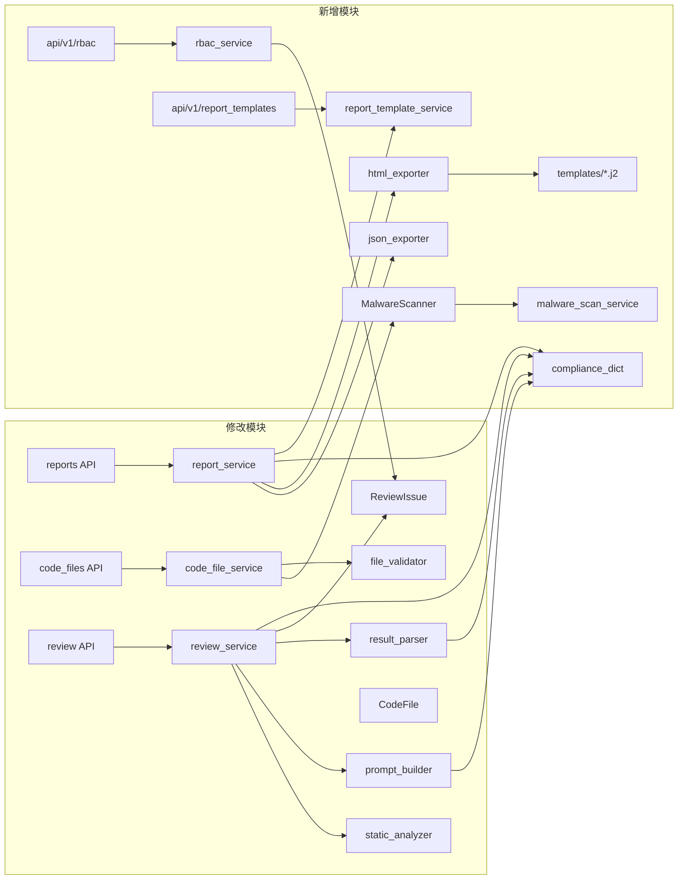
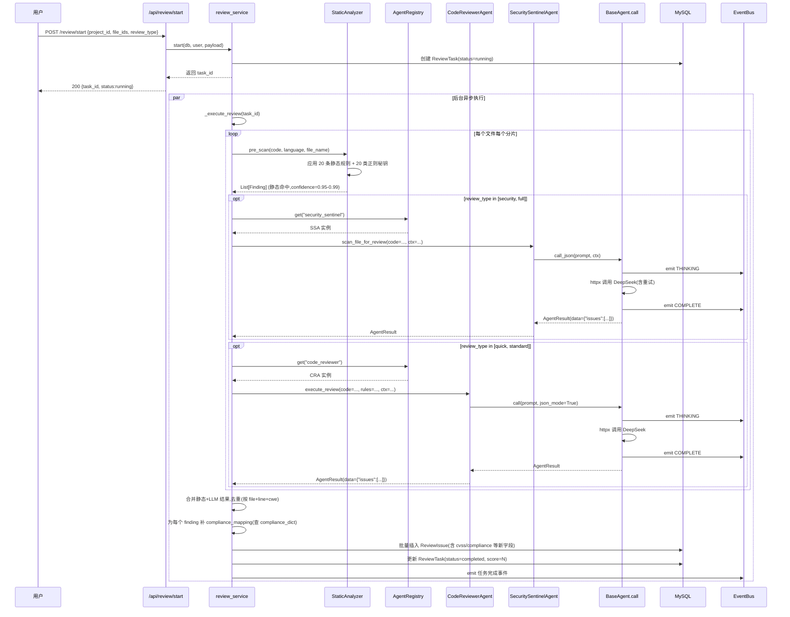
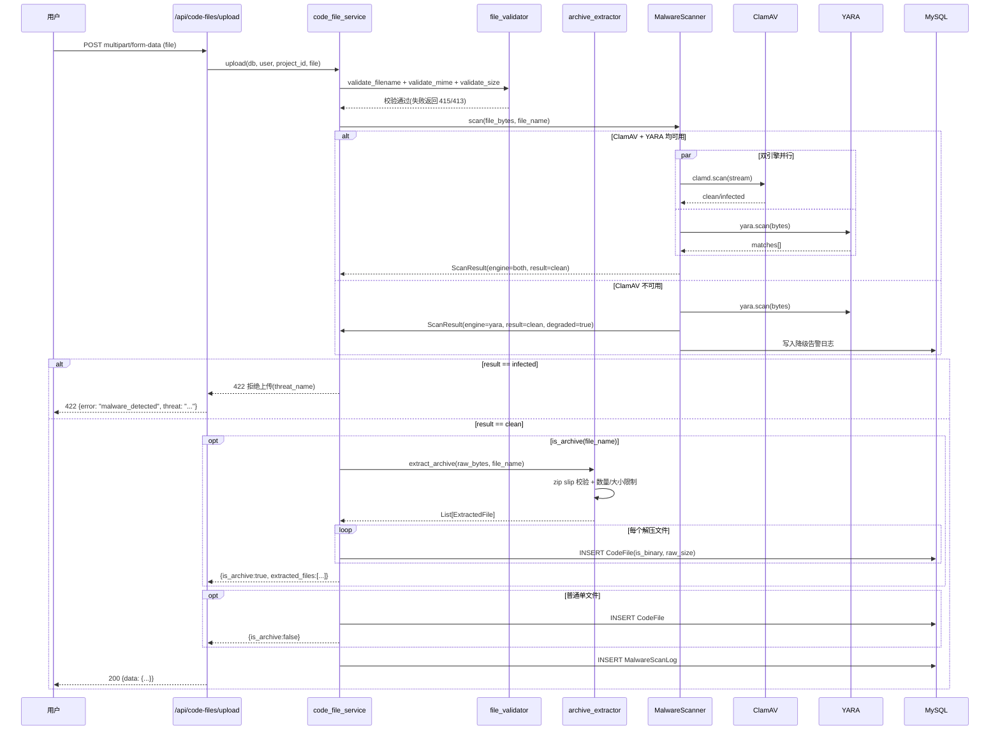

# DESIGN · 代码审计 Agent 集成与漏洞识别增强

> 任务名: `代码审计Agent集成与漏洞识别增强`
> 创建时间: 2026-06-25
> 阶段: Architect(架构)
> 输入: ALIGNMENT + CONSENSUS
> 输出: 整体架构图、分层设计、模块依赖图、接口契约、数据流图、异常处理策略、RBAC 权限点清单、合规条款字典、Jinja2 报告模板结构

---

## 一、整体架构图

```mermaid
flowchart TB
    subgraph 前端层
        UI_Review[审查启动页 ReviewStart.vue]
        UI_FileList[代码文件列表 CodeFileList.vue]
        UI_Editor[代码编辑器 CodeEditor.vue]
        UI_Task[审查任务详情 ReviewTaskDetail.vue]
        UI_Report[报告详情 ReportDetail.vue]
        UI_Role[角色管理 RoleManage.vue 新]
        UI_Perm[权限分配 PermissionAssign.vue 新]
        UI_Menu[菜单管理 MenuManage.vue 新]
        UI_Tpl[报告模板管理 ReportTemplate.vue 新]
        UI_Permission[权限Store permission.ts 新]
    end

    subgraph API层
        API_Review[/api/review/*]
        API_Upload[/api/code-files/upload]
        API_File[/api/code-files/:id]
        API_Report[/api/reports/:id/export/{pdf,word,json,html} 新]
        API_Tpl[/api/report-templates/* 新]
        API_Rbac[/api/rbac/{roles,permissions,menus}/* 新]
        API_Scan[/api/security/scan/* 保留]
    end

    subgraph 服务层
        RS[review_service]
        CFS[code_file_service]
        RSvc[report_service 扩展]
        RbacSvc[rbac_service 新]
        TplSvc[report_template_service 新]
    end

    subgraph Agent层
        Registry[AgentRegistry]
        CRA[CodeReviewerAgent 已实现execute_review]
        SSA[SecuritySentinelAgent 已实现scan_file_for_review]
        ROA[ReviewOrchestratorAgent]
        BA[BaseAgent.call 含重试/事件/AiCallLog]
        EventBus[AgentEventBus]
    end

    subgraph AI引擎层
        SA[static_analyzer 含Finding]
        SSR[security_static_rules 20条]
        SP[security_patterns 20类正则]
        PB[prompt_builder 增强]
        RP[result_parser 扩展Issue]
        DA[DeepSeekAgent.log_deferred]
    end

    subgraph 安全扫描层 新
        MS[MalwareScanner 新]
        CL[ClamAV 容器]
        YR[YARA 规则集]
    end

    subgraph 数据层
        RT[review_task]
        RI[review_issue 扩展cvss/compliance]
        CF[code_file 扩展is_binary]
        ACL[ai_call_log]
        Role[role 新]
        Perm[permission 新]
        RP2[role_permission 新]
        UR[user_role 新]
        Menu[menu 新]
        DS[data_scope 新]
        RTpl[report_template 新]
        MLog[malware_scan_log 新]
    end

    subgraph 压缩包处理
        AE[archive_extractor 已实现]
        FV[file_validator 扩展MIME]
    end

    subgraph 合规与模板 新
        CD[compliance_dict 4套]
        JJ[json_exporter 新]
        HJ[html_exporter 新 Jinja2]
        Tpl[templates/ simple/detailed/compliance .j2]
    end

    UI_Review --> API_Review
    UI_FileList --> API_Upload
    UI_Editor --> API_File
    UI_Task --> API_Review
    UI_Report --> API_Report
    UI_Role --> API_Rbac
    UI_Perm --> API_Rbac
    UI_Menu --> API_Rbac
    UI_Tpl --> API_Tpl
    UI_Permission -.权限校验.-> API_Rbac

    API_Review --> RS
    API_Upload --> CFS
    API_File --> CFS
    API_Report --> RSvc
    API_Tpl --> TplSvc
    API_Rbac --> RbacSvc

    CFS --> AE
    CFS --> MS
    CFS --> FV
    AE --> CF
    MS --> CL
    MS --> YR
    MS --> MLog

    RS --> SA
    SA --> SSR
    SA --> SP
    RS --> Registry
    Registry --> CRA
    Registry --> SSA
    CRA --> BA
    SSA --> BA
    BA --> DA
    BA --> EventBus
    DA --> ACL
    CRA --> PB
    CRA --> RP
    SSA --> PB
    SSA --> RP
    RS --> RT
    RS --> RI

    RSvc --> JJ
    RSvc --> HJ
    HJ --> Tpl
    RSvc --> CD
    RbacSvc --> Role
    RbacSvc --> Perm
    RbacSvc --> RP2
    RbacSvc --> UR
    RbacSvc --> Menu
    RbacSvc --> DS
```

---

## 二、分层设计与核心组件

### 2.1 API 层(新增 4 个路由文件,修改 2 个)

| 路由文件 | 改造类型 | 说明 |
|---------|---------|------|
| `app/api/v1/review.py` | 修改 | 启动接口注入 `require_permission("review:start")` |
| `app/api/v1/code_files.py` | 修改 | 上传接口响应新增 `is_archive`/`extracted_files`;新增 `GET /code-files/{id}/download` |
| `app/api/v1/reports.py` | 修改 | 新增 `/reports/{id}/export/json`、`/reports/{id}/html`、`/reports/{id}/template/{tpl_id}` |
| `app/api/v1/rbac.py` | **新增** | RBAC 管理路由(角色/权限/菜单/数据范围 CRUD + 用户角色分配) |
| `app/api/v1/report_templates.py` | **新增** | 报告模板 CRUD + 预置模板查询 |
| `app/api/v1/malware_scan.py` | **新增** | 恶意扫描记录查询(管理员) |

### 2.2 服务层(新增 3 个服务,修改 2 个)

| 服务 | 改造类型 | 核心职责 |
|------|---------|---------|
| `review_service` | **修改** | `_execute_review()` 重构:① 调 `StaticAnalyzer.pre_scan()` 前置过滤;② 通过 `AgentRegistry.get(name).execute_review()` 调用真实 Agent;③ 合并静态+LLM 结果去重;④ 写入扩展后的 `ReviewIssue`(含 cvss/compliance_mapping) |
| `code_file_service` | **修改** | `upload()` 入口识别压缩包 → `archive_extractor.extract_archive()` → 逐文件入库;调 `MalwareScanner.scan()`;MIME 白名单与大小校验;项目总大小校验 |
| `report_service` | **修改** | `get_report_detail()` 增加 `compliance_summary` 字段;新增 `export_json()`/`render_html()`/`render_with_template()` |
| `rbac_service` | **新增** | `assign_role()`/`revoke_role()`/`check_permission()`/`list_user_permissions()`/`list_user_menus()`/`get_data_scope()` |
| `report_template_service` | **新增** | 模板 CRUD;3 套预置模板种子数据;模板渲染入口 |
| `malware_scan_service` | **新增** | 扫描记录查询/统计/降级告警查询 |

### 2.3 Agent 层(修改 2 个,无新增)

| Agent | 改造类型 | 说明 |
|-------|---------|------|
| `CodeReviewerAgent` | 已实现 `execute_review()`,**仅扩展 Prompt 输出字段** | `prompt_builder` 增加 cvss/compliance_mapping 字段约束 |
| `SecuritySentinelAgent` | 已实现 `scan_file_for_review()`,**仅扩展 Prompt 输出字段** | 同上 |
| `ReviewOrchestratorAgent` | 待激活 | `security`/`full` 类型审查由 review_service 显式调用其 `orchestrate()` 方法编排多 Agent |

### 2.4 AI 引擎层(修改 4 个,无新增)

| 模块 | 改造类型 | 说明 |
|------|---------|------|
| `prompt_builder` | **修改** | `build_prompt()` 增加漏洞元数据 JSON Schema 约束段(cvss_score/cvss_vector/compliance_mapping 必填) |
| `result_parser` | **修改** | `Issue` dataclass 扩展 `cvss_score: float`/`cvss_vector: str`/`compliance_mapping: dict`/`remediation: str`;`parse()` 兼容新旧格式 |
| `static_analyzer` | **修改** | `Finding` dataclass 扩展同上字段;`scan_file()` 入口供 review_service 调用做前置过滤 |
| `security_static_rules` | 已实现 | 20 条静态规则,无需改动 |
| `security_patterns` | 已实现 | 20 类正则秘钥扫描,无需改动 |

### 2.5 工具层(新增 2 个,修改 1 个)

| 模块 | 改造类型 | 说明 |
|------|---------|------|
| `archive_extractor` | 已实现 | 压缩包解压,无需改动 |
| `file_validator` | **修改** | 新增 `ALLOWED_MIME_EXTENSIONS` 常量(代码文件白名单)与 `validate_mime()` 函数;`validate_size()` 增加项目总大小校验入口 |
| `malware_scanner` | **新增** | `MalwareScanner` 类:封装 ClamAV(`clamd` 库)+ YARA(`yara-python`),支持降级;`scan(bytes, filename) -> ScanResult` |

### 2.6 数据层(新增 6 张表,修改 2 张)

| 表 | 改造类型 | 说明 |
|----|---------|------|
| `review_issue` | **修改** | 新增 `cvss_score`(Float)/`cvss_vector`(String 64)/`compliance_mapping`(JSON)/`remediation`(Text)/`static_rule_hits`(Integer) 5 字段 |
| `code_file` | **修改** | 新增 `is_binary`(Boolean)/`raw_size`(Integer) 2 字段 |
| `role` | **新增** | 角色表:id/name/code/description/status/sort |
| `permission` | **新增** | 权限点表:id/code/name/module/type(菜单/按钮/接口) |
| `role_permission` | **新增** | 角色-权限关联:role_id/permission_id |
| `user_role` | **新增** | 用户-角色关联:user_id/role_id |
| `menu` | **新增** | 菜单表:id/parent_id/name/path/component/icon/sort/permission_code/visible |
| `data_scope` | **新增** | 数据范围表:role_id/scope_type(all/project_own/project_member/custom) |
| `report_template` | **新增** | 报告模板表:id/name/type(simple/detailed/compliance)/content(Jinja2)/is_builtin/creator_id |
| `malware_scan_log` | **新增** | 扫描记录表:id/file_id/file_name/scan_engine(clamav/yara/both)/result(clean/infected/error)/threat_name/duration_ms/scanned_at |

### 2.7 常量层(新增 1 个)

| 模块 | 改造类型 | 说明 |
|------|---------|------|
| `app/constants/compliance.py` | **新增** | ISO 27001/GDPR/PCI-DSS/HIPAA 4 套合规条款字典 + CWE→合规反向映射 |

### 2.8 导出层(新增 2 个,修改 1 个)

| 模块 | 改造类型 | 说明 |
|------|---------|------|
| `pdf_exporter` | **修改** | 渲染新增字段(cvss/compliance);支持模板选择 |
| `word_exporter` | **修改** | 同上 |
| `json_exporter` | **新增** | `export_json_report(detail) -> dict` |
| `html_exporter` | **新增** | `render_html_report(detail, template_name) -> str` 用 Jinja2 |
| `exporters/templates/` | **新增** | `simple.md.j2`/`detailed.md.j2`/`compliance.md.j2` 3 套 Jinja2 模板 |

---

## 三、模块依赖关系图



---

## 四、接口契约定义

### 4.1 新增 API:RBAC 管理

#### 4.1.1 角色 CRUD

```
POST   /api/rbac/roles                  创建角色
GET    /api/rbac/roles                  角色列表
GET    /api/rbac/roles/{id}             角色详情(含权限点)
PUT    /api/rbac/roles/{id}             更新角色
DELETE /api/rbac/roles/{id}             删除角色(预置角色不可删)
POST   /api/rbac/roles/{id}/permissions 为角色分配权限(批量)
POST   /api/rbac/roles/{id}/users       为角色分配用户(批量)
```

**Schema: `RoleCreateIn`**
```json
{
  "name": "评审员",
  "code": "reviewer",
  "description": "可启动审查、处理问题,不可管理用户",
  "sort": 100
}
```

**Schema: `RoleOut`**
```json
{
  "id": 2,
  "name": "评审员",
  "code": "reviewer",
  "description": "...",
  "status": "active",
  "sort": 100,
  "permission_codes": ["review:start", "review:view", "issue:handle"],
  "user_count": 12,
  "is_builtin": true,
  "create_time": "2026-06-25T10:00:00Z"
}
```

#### 4.1.2 权限点查询

```
GET /api/rbac/permissions              全部权限点(按 module 分组)
GET /api/rbac/permissions/{code}       权限点详情
```

**Schema: `PermissionOut`**
```json
{
  "id": 1,
  "code": "review:start",
  "name": "启动审查",
  "module": "review",
  "type": "api",
  "description": "调用 POST /api/review/start 启动新审查任务"
}
```

#### 4.1.3 菜单管理

```
POST   /api/rbac/menus                 创建菜单
GET    /api/rbac/menus                 菜单树
PUT    /api/rbac/menus/{id}            更新菜单
DELETE /api/rbac/menus/{id}            删除菜单
GET    /api/rbac/menus/user            当前用户可见菜单(登录后调用)
```

**Schema: `MenuOut`**
```json
{
  "id": 1,
  "parent_id": null,
  "name": "代码审查",
  "path": "/review",
  "component": "review/ReviewStart",
  "icon": "review",
  "sort": 10,
  "permission_code": "review:view",
  "visible": true,
  "children": []
}
```

#### 4.1.4 用户角色分配

```
GET    /api/rbac/users/{id}/roles      用户角色列表
POST   /api/rbac/users/{id}/roles      为用户分配角色(批量替换)
GET    /api/rbac/users/{id}/permissions 用户有效权限点(含角色继承)
GET    /api/rbac/users/{id}/data-scope 用户数据范围
```

#### 4.1.5 数据范围

```
GET /api/rbac/data-scopes              数据范围规则列表
POST /api/rbac/data-scopes             创建数据范围规则
PUT  /api/rbac/data-scopes/{id}        更新
DELETE /api/rbac/data-scopes/{id}      删除
```

**Schema: `DataScopeIn`**
```json
{
  "role_id": 2,
  "scope_type": "project_own",
  "project_ids": []
}
```

`scope_type` 枚举:
- `all`: 全部数据
- `project_own`: 仅自己创建的项目
- `project_member`: 自己参与的项目(含 owner/reviewer)
- `custom`: 指定项目 ID 列表(配 `project_ids`)

### 4.2 新增 API:报告模板与多格式导出

```
POST   /api/report-templates                  创建模板
GET    /api/report-templates                  模板列表
GET    /api/report-templates/builtin          预置模板(3 套)
GET    /api/report-templates/{id}             模板详情
PUT    /api/report-templates/{id}             更新模板
DELETE /api/report-templates/{id}             删除模板(预置不可删)

GET    /api/reports/{task_id}/export/json     JSON 报告下载
GET    /api/reports/{task_id}/export/html     HTML 报告在线查看(返回 text/html)
GET    /api/reports/{task_id}/export/html?template_id=2  指定模板渲染
```

**Schema: `ReportTemplateIn`**
```json
{
  "name": "企业合规版",
  "type": "compliance",
  "content": "...Jinja2 模板字符串...",
  "is_builtin": false
}
```

**Schema: `JsonReportOut`**
```json
{
  "task_id": 123,
  "task_name": "...",
  "project_name": "...",
  "review_type": "security",
  "start_time": "...",
  "end_time": "...",
  "duration_ms": 12345,
  "model_name": "deepseek-v4-flash",
  "summary": "...",
  "score": 78,
  "metrics": {
    "total_files": 5,
    "total_issues": 12,
    "severity_counts": {"critical": 2, "high": 3, "medium": 5, "low": 2, "info": 0},
    "owasp_coverage": ["A01", "A03", "A07"],
    "static_rule_hits": 8,
    "llm_findings": 4
  },
  "issues": [
    {
      "id": 1,
      "file_name": "auth.py",
      "line_number": 42,
      "end_line": 45,
      "issue_type": "安全漏洞",
      "severity": "critical",
      "title": "SQL 注入",
      "description": "...",
      "suggestion": "...",
      "owasp": "A03:2021-Injection",
      "cwe": "CWE-89",
      "cvss_score": 9.8,
      "cvss_vector": "AV:N/AC:L/PR:N/UI:N/S:U/C:H/I:H/A:H",
      "confidence": 0.95,
      "evidence": "cursor.execute(f\"SELECT * FROM users WHERE id={user_id}\")",
      "exploit_scenario": "...",
      "remediation": "使用参数化查询...",
      "references": ["https://cwe.mitre.org/data/definitions/89.html"],
      "compliance_mapping": {
        "iso27001": ["A.14.2.1"],
        "gdpr": ["Art.32"],
        "pci_dss": ["Req-6.2.4"],
        "hipaa": ["§164.312(b)"]
      },
      "source": "llm",
      "status": "unfixed"
    }
  ],
  "compliance_summary": {
    "iso27001": {"total_findings": 12, "covered_controls": ["A.14.2.1", "A.14.2.5"]},
    "gdpr": {"total_findings": 8, "covered_articles": ["Art.32", "Art.25"]},
    "pci_dss": {"total_findings": 10, "covered_requirements": ["Req-6.2.4"]},
    "hipaa": {"total_findings": 4, "covered_sections": ["§164.312(b)"]}
  }
}
```

### 4.3 新增 API:文件下载与扫描记录

```
GET    /api/code-files/{id}/download          下载二进制文件原内容
                                            (StreamingResponse,Content-Disposition: attachment)

GET    /api/admin/malware-scans               扫描记录列表(管理员)
GET    /api/admin/malware-scans/{id}          扫描记录详情
GET    /api/admin/malware-scans/stats         扫描统计(按天/引擎/结果)
```

### 4.4 修改 API:文件上传响应

`POST /api/code-files/upload` 响应扩展:

```json
{
  "code": 0,
  "data": {
    "id": 123,
    "file_name": "test.zip",
    "is_archive": true,
    "extracted_files": [
      {"id": 124, "file_name": "main.py", "language": "python", "size": 1024},
      {"id": 125, "file_name": "utils.py", "language": "python", "size": 512}
    ],
    "malware_scan": {
      "engine": "both",
      "result": "clean",
      "duration_ms": 234,
      "threat_name": null
    }
  }
}
```

### 4.5 修改 API:审查启动鉴权

`POST /api/review/start` 路由依赖注入新增 `require_permission("review:start")`:

```python
@router.post("/start", response_model=Resp[ReviewStartOut])
def start_review(
    payload: ReviewStartIn,
    db: Session = Depends(get_db),
    user: User = Depends(get_current_user),
    _: bool = Depends(require_permission("review:start")),
):
    ...
```

---

## 五、数据流向图

### 5.1 审查主流程数据流(双引擎)



### 5.2 文件上传数据流(压缩包+恶意扫描)



### 5.3 报告导出数据流(4 格式)

```mermaid
flowchart LR
    U[用户] -->|GET /reports/:id/export/{fmt}| API
    API --> RSvc[report_service]
    RSvc --> DB[(review_task + review_issue + code_file)]
    DB --> Detail[ReportDetail dict]
    Detail -->|fmt=pdf| PDF[pdf_exporter]
    Detail -->|fmt=word| WORD[word_exporter]
    Detail -->|fmt=json| JJ[json_exporter]
    Detail -->|fmt=html| HJ[html_exporter]
    HJ --> TplChoice{template_id?}
    TplChoice -->|默认| TplD[详细版模板]
    TplChoice -->|指定| TplDB[(report_template 表)]
    TplDB --> HJ
    HJ --> Jinja[Jinja2 渲染]
    PDF --> Resp[StreamingResponse]
    WORD --> Resp
    JJ --> Resp
    Jinja --> Resp
    Resp --> U
```

---

## 六、异常处理策略

### 6.1 LLM 调用降级与重试

| 场景 | 策略 |
|------|------|
| DeepSeek API 429/5xx | `BaseAgent.call()` 已实现,默认 3 次指数退避重试(2/4/8 秒) |
| 重试全失败 | 返回 `AgentResult(success=False)`,review_service 跳过该分片 LLM 审查,仅保留静态结果,task 状态仍为 completed 但 `error_count++` |
| LLM 返回非 JSON | `call_json()` 返回失败,同上降级 |
| LLM 输出缺 cvss/compliance 字段 | `result_parser.parse()` 兼容旧格式,缺字段填默认值(`cvss_score=0.0`、`compliance_mapping={}`)并记 `parse_warning` |
| LLM 超时(>60s) | httpx 已配置 `deepseek_timeout`,超时后走重试;全失败降级 |

### 6.2 静态规则引擎异常

| 场景 | 策略 |
|------|------|
| 静态规则抛异常 | `StaticAnalyzer.scan_file()` 内 try/except,单文件异常不中断流程,记日志 |
| 正则秘钥扫描异常 | 同上,降级为跳过该文件正则扫描 |

### 6.3 压缩包解压异常

| 场景 | 策略 |
|------|------|
| zip slip 攻击 | `archive_extractor._validate_path()` 拒绝 `..`/绝对路径,返回 400 |
| 文件数量超限(>100) | 返回 40001 错误,提示用户精简压缩包 |
| 总大小超限(>50MB) | 同上 |
| 单文件超限(>10MB) | 同上 |
| 解压后无可用文件(全被过滤) | 返回 40001,提示压缩包内容不合规 |
| 解压损坏 | `BadZipFile`/`TarError` 捕获,返回 40001 |

### 6.4 恶意扫描降级

| 场景 | 策略 |
|------|------|
| ClamAV 容器停机 | `MalwareScanner` 检测 `clamd.ping()` 失败 → 降级为仅 YARA + 启发式;写告警日志;前端管理员页显示"ClamAV 不可用" |
| YARA 规则加载失败 | 降级为仅 ClamAV;写告警日志 |
| 双引擎均不可用 | 降级为仅启发式(可执行后缀黑名单 + shebang 检测);写告警日志;**不阻塞上传** |
| 扫描超时(>30s) | 中断扫描,标记 `result=timeout`,降级为启发式;不阻塞上传 |
| EICAR/webshell 命中 | 返回 422,拒绝上传,记录 `MalwareScanLog(result=infected)` |

### 6.5 RBAC 异常

| 场景 | 策略 |
|------|------|
| 用户无权限访问路由 | `require_permission()` 依赖抛 `PermissionError`,全局异常处理器返回 403 |
| 用户无数据范围访问项目 | `project_service` 查询前应用 `data_scope` 过滤;越权访问返回 404(不暴露存在性) |
| 角色删除时仍有用户绑定 | 拒绝删除,返回 409 "该角色下仍有 N 个用户,请先迁移" |
| 预置角色删除 | 拒绝删除,返回 403 "预置角色不可删除" |

### 6.6 报告渲染异常

| 场景 | 策略 |
|------|------|
| Jinja2 模板渲染失败 | 捕获 `TemplateSyntaxError`,回退到 `detailed` 模板,记日志 |
| HTML 报告生成超时 | 不应超时(纯内存渲染),若发生则返回 500 |
| JSON 报告字段缺失 | `json_exporter` 用 `None` 兜底,保证 schema 完整 |

---

## 七、RBAC 权限点完整清单

### 7.1 权限点设计原则

- **code 命名规范**:`{module}:{action}`,如 `review:start`
- **type 分类**:`api`(接口权限)/`menu`(菜单可见)/`button`(按钮可见)
- **预置角色**:super_admin 拥有全部权限;admin 拥有除"用户管理/角色管理"外的全部权限;reviewer 拥有审查相关权限;auditor 拥有只读权限;user 拥有基础权限

### 7.2 权限点清单(共 36 项)

| code | name | module | type | 说明 |
|------|------|--------|------|------|
| **项目管理(6)** ||||
| `project:create` | 创建项目 | project | api | POST /api/projects |
| `project:view` | 查看项目 | project | api+menu | GET /api/projects(受 data_scope 限制) |
| `project:update` | 更新项目 | project | api | PUT /api/projects/:id |
| `project:delete` | 删除项目 | project | api | DELETE /api/projects/:id |
| `project:import` | 导入项目 | project | api | POST /api/projects/import |
| `project:member:manage` | 成员管理 | project | api | 项目成员 CRUD |
| **代码文件(5)** ||||
| `file:upload` | 上传文件 | file | api+button | POST /api/code-files/upload |
| `file:view` | 查看文件 | file | api | GET /api/code-files |
| `file:edit` | 编辑文件 | file | api | PUT /api/code-files/:id |
| `file:delete` | 删除文件 | file | api | DELETE /api/code-files/:id |
| `file:download` | 下载文件 | file | api+button | GET /api/code-files/:id/download |
| **代码审查(5)** ||||
| `review:start` | 启动审查 | review | api+button+menu | POST /api/review/start |
| `review:view` | 查看审查 | review | api+menu | GET /api/review/tasks |
| `review:approve` | 审批审查 | review | api+button | POST /api/review/:id/approve |
| `review:cancel` | 取消审查 | review | api | POST /api/review/:id/cancel |
| `review:rerun` | 重新审查 | review | api+button | POST /api/review/:id/rerun |
| **问题管理(4)** ||||
| `issue:view` | 查看问题 | issue | api | GET /api/issues |
| `issue:handle` | 处理问题 | issue | api+button | PUT /api/issues/:id/status |
| `issue:batch` | 批量处理 | issue | api | PUT /api/issues/batch |
| `issue:export` | 导出问题 | issue | api+button | GET /api/issues/export |
| **规则管理(4)** ||||
| `rule:view` | 查看规则 | rule | api+menu | GET /api/rules |
| `rule:create` | 创建规则 | rule | api | POST /api/rules |
| `rule:update` | 更新规则 | rule | api | PUT /api/rules/:id |
| `rule:delete` | 删除规则 | rule | api | DELETE /api/rules/:id |
| **报告(4)** ||||
| `report:view` | 查看报告 | report | api+menu | GET /api/reports |
| `report:export:pdf` | 导出 PDF | report | api+button | GET /api/reports/:id/export/pdf |
| `report:export:word` | 导出 Word | report | api+button | GET /api/reports/:id/export/word |
| `report:export:json` | 导出 JSON | report | api+button | GET /api/reports/:id/export/json |
| `report:export:html` | 查看 HTML | report | api+button | GET /api/reports/:id/export/html |
| **Agent 与 AI(3)** ||||
| `agent:view` | 查看 Agent | agent | api+menu | GET /api/agents/runtime |
| `agent:chat` | AI 对话 | agent | api+button | POST /api/ai/chat |
| `agent:configure` | 配置 Agent | agent | api | Agent 配置变更 |
| **安全扫描(2)** ||||
| `security:scan` | 安全扫描 | security | api+menu+button | POST /api/security/scan |
| `security:view` | 查看扫描结果 | security | api | GET /api/security/* |
| **用户与权限管理(6)** ||||
| `user:view` | 查看用户 | user | api+menu | GET /api/users(仅 admin+) |
| `user:create` | 创建用户 | user | api | POST /api/users |
| `user:update` | 更新用户 | user | api | PUT /api/users/:id |
| `user:delete` | 删除用户 | user | api | DELETE /api/users/:id |
| `role:manage` | 角色权限管理 | rbac | api+menu | /api/rbac/* 全部 |
| `menu:manage` | 菜单管理 | rbac | api | /api/rbac/menus/* |
| **审计与日志(2)** ||||
| `audit:view` | 操作审计 | audit | api+menu | GET /api/admin/audit |
| `ai_log:view` | AI 调用日志 | audit | api+menu | GET /api/ai-logs |

### 7.3 预置角色权限矩阵

| 权限点 | user | reviewer | auditor | admin | super_admin |
|--------|:----:|:--------:|:-------:|:-----:|:-----------:|
| project:create | ✓ | ✓ | - | ✓ | ✓ |
| project:view | ✓(自己) | ✓(参与) | ✓(全部) | ✓(全部) | ✓(全部) |
| project:update | ✓(自己) | ✓(参与) | - | ✓ | ✓ |
| project:delete | ✓(自己) | - | - | ✓ | ✓ |
| project:member:manage | ✓(自己) | - | - | ✓ | ✓ |
| file:upload | ✓ | ✓ | - | ✓ | ✓ |
| file:view | ✓ | ✓ | ✓ | ✓ | ✓ |
| file:edit | ✓ | ✓ | - | ✓ | ✓ |
| file:delete | ✓ | - | - | ✓ | ✓ |
| file:download | ✓ | ✓ | ✓ | ✓ | ✓ |
| review:start | - | ✓ | - | ✓ | ✓ |
| review:view | ✓ | ✓ | ✓ | ✓ | ✓ |
| review:approve | - | - | - | ✓ | ✓ |
| review:cancel | ✓ | ✓ | - | ✓ | ✓ |
| review:rerun | - | ✓ | - | ✓ | ✓ |
| issue:view | ✓ | ✓ | ✓ | ✓ | ✓ |
| issue:handle | - | ✓ | - | ✓ | ✓ |
| issue:batch | - | ✓ | - | ✓ | ✓ |
| issue:export | ✓ | ✓ | ✓ | ✓ | ✓ |
| rule:view | ✓ | ✓ | ✓ | ✓ | ✓ |
| rule:create | - | - | - | ✓ | ✓ |
| rule:update | - | - | - | ✓ | ✓ |
| rule:delete | - | - | - | ✓ | ✓ |
| report:view | ✓ | ✓ | ✓ | ✓ | ✓ |
| report:export:* | ✓ | ✓ | ✓ | ✓ | ✓ |
| agent:view | ✓ | ✓ | ✓ | ✓ | ✓ |
| agent:chat | ✓ | ✓ | - | ✓ | ✓ |
| agent:configure | - | - | - | ✓ | ✓ |
| security:scan | - | ✓ | - | ✓ | ✓ |
| security:view | ✓ | ✓ | ✓ | ✓ | ✓ |
| user:view | - | - | - | ✓ | ✓ |
| user:create | - | - | - | - | ✓ |
| user:update | - | - | - | ✓ | ✓ |
| user:delete | - | - | - | - | ✓ |
| role:manage | - | - | - | - | ✓ |
| menu:manage | - | - | - | - | ✓ |
| audit:view | - | - | ✓ | ✓ | ✓ |
| ai_log:view | - | - | - | ✓ | ✓ |

### 7.4 数据范围规则

| 角色 | scope_type | 说明 |
|------|-----------|------|
| user | project_own | 仅自己创建的项目 |
| reviewer | project_member | 自己参与的项目(owner 或 project_member) |
| auditor | all | 全部项目(只读) |
| admin | all | 全部项目 |
| super_admin | all | 全部项目 |

---

## 八、合规条款字典设计

### 8.1 字典结构

`app/constants/compliance.py` 定义 4 套合规条款字典,每套为 `Dict[str, ComplianceControl]`:

```python
from dataclasses import dataclass
from typing import Dict, List

@dataclass
class ComplianceControl:
    """合规条款描述"""
    code: str           # 条款编号,如 "A.14.2.1"
    title: str          # 条款标题
    description: str    # 简要说明
    category: str       # 分类(如 "Secure Development")
```

### 8.2 ISO 27001:2022 字典(节选)

```python
ISO_27001_CONTROLS: Dict[str, ComplianceControl] = {
    "A.5.1": ComplianceControl("A.5.1", "信息安全的策略", "信息安全策略应被定义、批准并发布", "组织策略"),
    "A.5.7": ComplianceControl("A.5.7", "威胁情报", "应收集和分析威胁情报", "组织策略"),
    "A.6.3": ComplianceControl("A.6.3", "信息安全意识、教育和培训", "员工应接受安全培训", "人员安全"),
    "A.8.1": ComplianceControl("A.8.1", "用户终端资产清单", "资产应被识别并维护清单", "资产管理"),
    "A.8.25": ComplianceControl("A.8.25", "安全开发生命周期", "应在软件开发全生命周期中应用安全规则", "安全开发"),
    "A.8.26": ComplianceControl("A.8.26", "应用安全要求", "应建立并记录应用安全要求", "安全开发"),
    "A.8.27": ComplianceControl("A.8.27", "安全系统架构与工程", "应建立安全系统架构原则", "安全开发"),
    "A.8.28": ComplianceControl("A.8.28", "安全编码", "应应用安全编码规则", "安全开发"),
    "A.8.29": ComplianceControl("A.8.29", "开发与验收中的安全测试", "应测试并验证开发中的安全", "安全开发"),
    "A.8.30": ComplianceControl("A.8.30", "外包开发", "应监督外包开发的安全", "安全开发"),
    "A.8.31": ComplianceControl("A.8.31", "信息的分离", "信息系统应被分离", "安全开发"),
    "A.5.34": ComplianceControl("A.5.34", "隐私与个人数据保护", "应识别并保护个人数据", "隐私保护"),
    # ... 完整 93 条款
}
```

### 8.3 GDPR 字典(节选)

```python
GDPR_ARTICLES: Dict[str, ComplianceControl] = {
    "Art.5": ComplianceControl("Art.5", "个人数据处理原则", "合法性、公平性、透明性、目的限制、数据最小化", "数据保护原则"),
    "Art.6": ComplianceControl("Art.6", "处理的合法性", "处理需有合法依据", "合法性"),
    "Art.7": ComplianceControl("Art.7", "同意的条件", "同意应是自由给出的、具体的、知情的、明确的", "合法性"),
    "Art.25": ComplianceControl("Art.25", "数据保护设计与默认设置", "应在设计阶段融入数据保护", "数据保护设计"),
    "Art.32": ComplianceControl("Art.32", "处理的安全性", "应实施适当的技术和组织措施保证安全", "安全性"),
    "Art.33": ComplianceControl("Art.33", "向监管机构通知数据违规", "应在72小时内通知", "数据违规通知"),
    "Art.34": ComplianceControl("Art.34", "向数据主体通知数据违规", "高风险时应通知数据主体", "数据违规通知"),
    "Art.35": ComplianceControl("Art.35", "数据保护影响评估", "高风险处理应进行 DPIA", "影响评估"),
    # ... 完整 99 条款
}
```

### 8.4 PCI-DSS v4.0 字典(节选)

```python
PCI_DSS_REQUIREMENTS: Dict[str, ComplianceControl] = {
    "Req-1.1": ComplianceControl("Req-1.1", "安全网络架构", "建立并实施网络配置标准", "网络隔离"),
    "Req-2.1": ComplianceControl("Req-2.1", "配置标准", "为系统组件建立配置标准", "配置管理"),
    "Req-3.1": ComplianceControl("Req-3.1", "最小化存储", "仅保留必要的持卡人数据", "数据保护"),
    "Req-4.1": ComplianceControl("Req-4.1", "传输中加密", "在开放公共网络传输时加密", "加密"),
    "Req-5.1": ComplianceControl("Req-5.1", "防病毒部署", "在所有系统中部署防病毒", "恶意软件防护"),
    "Req-6.2.1": ComplianceControl("Req-6.2.1", "漏洞扫描", "至少每季度扫描一次", "漏洞管理"),
    "Req-6.2.4": ComplianceControl("Req-6.2.4", "安全编码培训", "开发人员应接受安全编码培训", "安全开发"),
    "Req-6.2.3": ComplianceControl("Req-6.2.3", "代码审查", "审查自定义代码以发现漏洞", "安全开发"),
    "Req-6.4.1": ComplianceControl("Req-6.4.1", "面向公众应用的安全控制", "保护面向公众的应用", "应用安全"),
    "Req-6.4.2": ComplianceControl("Req-6.4.2", "公共应用测试", "至少每年测试一次", "应用安全"),
    "Req-7.1": ComplianceControl("Req-7.1", "访问控制", "限制对持卡人数据的访问", "访问控制"),
    "Req-8.1": ComplianceControl("Req-8.1", "身份验证", "为所有组件定义并实施身份验证", "身份验证"),
    "Req-10.1": ComplianceControl("Req-10.1", "审计日志", "实施审计日志", "日志监控"),
    # ... 完整 12 大类要求
}
```

### 8.5 HIPAA 字典(节选)

```python
HIPAA_SECTIONS: Dict[str, ComplianceControl] = {
    "§164.308": ComplianceControl("§164.308", "管理性保障措施", "策略、程序和培训", "行政保障"),
    "§164.310": ComplianceControl("§164.310", "物理性保障措施", "设施访问和设备控制", "物理保障"),
    "§164.312(a)": ComplianceControl("§164.312(a)", "访问控制", "技术政策和程序限制访问", "技术保障"),
    "§164.312(b)": ComplianceControl("§164.312(b)", "审计控制", "记录并审查访问活动", "技术保障"),
    "§164.312(c)": ComplianceControl("§164.312(c)", "完整性", "防止不当修改", "技术保障"),
    "§164.312(d)": ComplianceControl("§164.312(d)", "人员或实体身份验证", "验证访问者身份", "技术保障"),
    "§164.312(e)(1)": ComplianceControl("§164.312(e)(1)", "传输安全", "电子传输中保护 ePHI", "技术保障"),
    "§164.312(e)(2)(ii)": ComplianceControl("§164.312(e)(2)(ii)", "加密", "对 ePHI 加密", "技术保障"),
    # ... 完整 Security Rule
}
```

### 8.6 CWE → 合规反向映射

为减少 LLM 输出负担,`compliance_dict` 模块提供 `CWE_TO_COMPLIANCE` 反向映射,LLM 只输出 `cwe_id`,后端根据 cwe_id 自动查表填充 `compliance_mapping`:

```python
CWE_TO_COMPLIANCE: Dict[str, Dict[str, List[str]]] = {
    "CWE-89": {  # SQL Injection
        "iso27001": ["A.8.25", "A.8.26", "A.8.28", "A.8.29"],
        "gdpr": ["Art.25", "Art.32"],
        "pci_dss": ["Req-6.2.4", "Req-6.4.1", "Req-6.4.2"],
        "hipaa": ["§164.312(a)", "§164.312(b)"],
    },
    "CWE-79": {  # XSS
        "iso27001": ["A.8.25", "A.8.28", "A.8.29"],
        "gdpr": ["Art.32"],
        "pci_dss": ["Req-6.4.1", "Req-6.4.2"],
        "hipaa": ["§164.312(a)"],
    },
    "CWE-78": {  # Command Injection
        "iso27001": ["A.8.25", "A.8.28", "A.8.29"],
        "gdpr": ["Art.25", "Art.32"],
        "pci_dss": ["Req-6.2.4", "Req-6.4.1"],
        "hipaa": ["§164.312(a)", "§164.312(c)"],
    },
    "CWE-22": {  # Path Traversal
        "iso27001": ["A.8.25", "A.8.28"],
        "gdpr": ["Art.25", "Art.32"],
        "pci_dss": ["Req-6.4.1", "Req-7.1"],
        "hipaa": ["§164.312(a)"],
    },
    "CWE-502": {  # Deserialization
        "iso27001": ["A.8.25", "A.8.28", "A.8.29"],
        "gdpr": ["Art.25", "Art.32"],
        "pci_dss": ["Req-6.2.4", "Req-6.4.1"],
        "hipaa": ["§164.312(c)"],
    },
    "CWE-918": {  # SSRF
        "iso27001": ["A.8.25", "A.8.28", "A.8.29"],
        "gdpr": ["Art.32"],
        "pci_dss": ["Req-6.4.1"],
        "hipaa": ["§164.312(a)"],
    },
    "CWE-798": {  # Hardcoded Credentials
        "iso27001": ["A.5.17", "A.8.25"],
        "gdpr": ["Art.25", "Art.32"],
        "pci_dss": ["Req-8.1", "Req-6.4.1"],
        "hipaa": ["§164.312(a)", "§164.312(d)"],
    },
    "CWE-327": {  # Weak Crypto
        "iso27001": ["A.8.24", "A.8.25"],
        "gdpr": ["Art.32"],
        "pci_dss": ["Req-4.1", "Req-3.1"],
        "hipaa": ["§164.312(e)(2)(ii)"],
    },
    # ... 完整 CWE-1000+ 映射,覆盖 OWASP Top 10 全部
}
```

### 8.7 模块对外接口

```python
def get_compliance_mapping(cwe_id: str) -> Dict[str, List[str]]:
    """根据 CWE ID 返回 4 套合规标准映射"""

def lookup_control(standard: str, code: str) -> Optional[ComplianceControl]:
    """查询某标准的某条款详情"""

def list_controls(standard: str) -> Dict[str, ComplianceControl]:
    """列出某标准全部条款"""

def build_compliance_summary(issues: List[dict]) -> dict:
    """根据 issue 列表生成合规汇总(用于报告)"""

SUPPORTED_STANDARDS = ("iso27001", "gdpr", "pci_dss", "hipaa")
```

---

## 九、Jinja2 报告模板结构

### 9.1 模板目录与命名

```
backend/app/exporters/templates/
├── simple.md.j2          # 简洁版(适合周报/快速概览)
├── detailed.md.j2        # 详细版(默认,适合技术团队)
└── compliance.md.j2      # 合规版(适合审计/合规团队)
```

### 9.2 模板上下文(Context)统一结构

所有模板共用同一 context,由 `report_service.get_report_detail()` 构造:

```python
{
    "task": {
        "id": 123,
        "task_name": "...",
        "project_name": "...",
        "review_type": "security",
        "start_time": "2026-06-25T10:00:00Z",
        "end_time": "2026-06-25T10:15:30Z",
        "duration_ms": 930000,
        "model_name": "deepseek-v4-flash",
        "status": "completed",
    },
    "summary": "本次审查共发现 12 个问题,其中严重 2 个...",
    "score": 78,
    "metrics": {
        "total_files": 5,
        "total_issues": 12,
        "severity_counts": {"critical": 2, "high": 3, "medium": 5, "low": 2, "info": 0},
        "owasp_coverage": ["A01", "A03", "A07"],
        "cwe_distribution": {"CWE-89": 3, "CWE-79": 2, "CWE-798": 1},
        "static_rule_hits": 8,
        "llm_findings": 4,
    },
    "issues": [...],  # 见 §4.2 JsonReportOut.issues
    "compliance_summary": {
        "iso27001": {"total_findings": 12, "covered_controls": ["A.14.2.1", ...]},
        "gdpr": {...},
        "pci_dss": {...},
        "hipaa": {...},
    },
    "rendered_at": "2026-06-25T10:20:00Z",
    "rendered_by": "admin",
}
```

### 9.3 简洁版模板 `simple.md.j2`

```jinja2
{# 简洁版报告模板:周报/快速概览 #}
# 代码审查报告 · {{ task.task_name }}

- **项目**: {{ task.project_name }}
- **审查类型**: {{ task.review_type }}
- **执行时间**: {{ task.start_time }} ~ {{ task.end_time }}({{ (task.duration_ms / 1000) | round(1) }}s)
- **审查模型**: {{ task.model_name }}
- **风险评分**: {{ score }}/100

## 总览

{{ summary }}

| 严重度 | 数量 |
|--------|------|
| 严重 | {{ metrics.severity_counts.critical }} |
| 高 | {{ metrics.severity_counts.high }} |
| 中 | {{ metrics.severity_counts.medium }} |
| 低 | {{ metrics.severity_counts.low }} |
| 信息 | {{ metrics.severity_counts.info }} |

## Top 5 高危问题



- **{{ it.title }}** [{{ it.severity }}] - `{{ it.file_name }}:L{{ it.line_number }}`
  - CWE: {{ it.cwe }} | CVSS: {{ it.cvss_score }}
  - 修复: {{ it.remediation[:80] }}...



---
*本报告由 PRISM 棱镜代码审查平台于 {{ rendered_at }} 生成*
```

### 9.4 详细版模板 `detailed.md.j2`

```jinja2
{# 详细版报告模板:默认,适合技术团队 #}
# 代码审查报告 · {{ task.task_name }}

## 1. 基本信息

| 项目 | 值 |
|------|-----|
| 项目名称 | {{ task.project_name }} |
| 审查类型 | {{ task.review_type }} |
| 执行时间 | {{ task.start_time }} ~ {{ task.end_time }} |
| 耗时 | {{ (task.duration_ms / 1000) | round(2) }} 秒 |
| 审查模型 | {{ task.model_name }} |
| 任务状态 | {{ task.status }} |
| 风险评分 | {{ score }}/100 |

## 2. 审查摘要

{{ summary }}

### 2.1 度量统计

| 指标 | 值 |
|------|-----|
| 扫描文件数 | {{ metrics.total_files }} |
| 发现问题总数 | {{ metrics.total_issues }} |
| 静态规则命中 | {{ metrics.static_rule_hits }} |
| LLM 发现 | {{ metrics.llm_findings }} |
| OWASP 覆盖 | {{ metrics.owasp_coverage | join(", ") }} |

### 2.2 严重度分布

| 严重度 | 数量 | 占比 |
|--------|------|------|
| 严重 | {{ metrics.severity_counts.critical }} | {{ (metrics.severity_counts.critical / metrics.total_issues * 100) | round(1) }}% |
| 高 | {{ metrics.severity_counts.high }} | {{ (metrics.severity_counts.high / metrics.total_issues * 100) | round(1) }}% |
| 中 | {{ metrics.severity_counts.medium }} | ... |
| 低 | {{ metrics.severity_counts.low }} | ... |
| 信息 | {{ metrics.severity_counts.info }} | ... |

## 3. 问题详情


### 3.{{ loop.index }} {{ issue.title }}

| 属性 | 值 |
|------|-----|
| 文件 | `{{ issue.file_name }}` |
| 行号 | L{{ issue.line_number }} ~ L{{ issue.end_line }} |
| 严重度 | **{{ issue.severity }}** |
| 类型 | {{ issue.issue_type }} |
| CWE | [{{ issue.cwe }}](https://cwe.mitre.org/data/definitions/{{ issue.cwe | replace("CWE-", "") }}.html) |
| OWASP | {{ issue.owasp }} |
| CVSS | {{ issue.cvss_score }} ({{ issue.cvss_vector }}) |
| 置信度 | {{ (issue.confidence * 100) | round(0) }}% |
| 来源 | {{ issue.source }} |
| 状态 | {{ issue.status }} |

**证据代码**:
```
{{ issue.evidence }}
```

**攻击场景**:
{{ issue.exploit_scenario }}

**修复建议**:
{{ issue.remediation }}

**参考链接**:

- [{{ ref }}]({{ ref }})


---



## 4. 附录

### 4.1 CWE 分布

- {{ cwe }}: {{ count }}


---
*本报告由 PRISM 棱镜代码审查平台于 {{ rendered_at }} 由 {{ rendered_by }} 渲染*
```

### 9.5 合规版模板 `compliance.md.j2`

```jinja2
{# 合规版报告模板:适合审计/合规团队 #}
# 合规审计报告 · {{ task.project_name }}

> 本报告依据 ISO 27001:2022、GDPR、PCI-DSS v4.0、HIPAA Security Rule 四项标准,
> 对项目「{{ task.project_name }}」进行代码层面的合规性审查。

## 1. 审查概况

- **审查任务**: {{ task.task_name }}
- **执行时间**: {{ task.start_time }} ~ {{ task.end_time }}
- **审查模型**: {{ task.model_name }}
- **覆盖文件数**: {{ metrics.total_files }}
- **发现问题数**: {{ metrics.total_issues }}
- **综合风险评分**: {{ score }}/100

## 2. 合规概览

| 合规标准 | 关联问题数 | 覆盖条款数 |
|----------|----------|----------|
| ISO 27001:2022 | {{ compliance_summary.iso27001.total_findings }} | {{ compliance_summary.iso27001.covered_controls | length }} |
| GDPR | {{ compliance_summary.gdpr.total_findings }} | {{ compliance_summary.gdpr.covered_articles | length }} |
| PCI-DSS v4.0 | {{ compliance_summary.pci_dss.total_findings }} | {{ compliance_summary.pci_dss.covered_requirements | length }} |
| HIPAA Security Rule | {{ compliance_summary.hipaa.total_findings }} | {{ compliance_summary.hipaa.covered_sections | length }} |

## 3. ISO 27001:2022 合规分析

### 3.1 命中条款


- **{{ control.code }}** {{ control.title }}: {{ control.description }}


### 3.2 关联问题

- [{{ issue.severity }}] {{ issue.title }}({{ issue.cwe }}) - `{{ issue.file_name }}:L{{ issue.line_number }}`
  - 命中条款: {{ issue.compliance_mapping.iso27001 | join(", ") }}


## 4. GDPR 合规分析

### 4.1 命中条款

- **{{ article.code }}** {{ article.title }}


### 4.2 关联问题

- [{{ issue.severity }}] {{ issue.title }}({{ issue.cwe }}) - `{{ issue.file_name }}:L{{ issue.line_number }}`
  - 命中条款: {{ issue.compliance_mapping.gdpr | join(", ") }}


## 5. PCI-DSS v4.0 合规分析

### 5.1 命中要求

- **{{ req.code }}** {{ req.title }}


### 5.2 关联问题

- [{{ issue.severity }}] {{ issue.title }}({{ issue.cwe }}) - `{{ issue.file_name }}:L{{ issue.line_number }}`
  - 命中要求: {{ issue.compliance_mapping.pci_dss | join(", ") }}


## 6. HIPAA Security Rule 合规分析

### 6.1 命中条款

- **{{ section.code }}** {{ section.title }}


### 6.2 关联问题

- [{{ issue.severity }}] {{ issue.title }}({{ issue.cwe }}) - `{{ issue.file_name }}:L{{ issue.line_number }}`
  - 命中条款: {{ issue.compliance_mapping.hipaa | join(", ") }}


## 7. 整改建议



### 7.1 立即整改(严重级别)

- {{ issue.title }}({{ issue.cwe }}): {{ issue.remediation }}





### 7.2 优先整改(高级别)

- {{ issue.title }}({{ issue.cwe }}): {{ issue.remediation }}



## 8. 声明

本报告仅基于代码静态分析与 AI 模型深度审查,不能替代完整的安全渗透测试与合规审计。
建议结合人工审计、动态测试与基础设施扫描综合评估。

---
*报告生成时间: {{ rendered_at }} | 操作员: {{ rendered_by }} | PRISM 棱镜代码审查平台*
```

### 9.6 模板渲染入口

`app/exporters/html_exporter.py`:

```python
from jinja2 import Environment, FileSystemLoader, select_autoescape

def render_html_report(detail: dict, template_name: str = "detailed") -> str:
    """用 Jinja2 渲染 HTML 报告

    Args:
        detail: report_service.get_report_detail() 返回的字典
        template_name: 模板名(simple/detailed/compliance),或自定义模板的 id

    Returns:
        str: 渲染后的 HTML 字符串
    """
    env = Environment(
        loader=FileSystemLoader("app/exporters/templates"),
        autoescape=select_autoescape(["html", "xml"]),
    )
    # 用户自定义模板优先
    if template_name.isdigit():
        # 从 report_template 表加载
        ...
    else:
        template = env.get_template(f"{template_name}.md.j2")
    return template.render(**detail)
```

---

## 十、设计原则与质量门控

### 10.1 设计原则

1. **严格按任务范围**:不做 CONSENSUS §4.2 "不做"清单之外的任何扩展
2. **复用现有组件**:沿用 BaseAgent/AgentEventBus/AiCallLog/archive_extractor/SecuritySentinelAgent 现有能力,仅扩展不重写
3. **向后兼容**:新增字段全部 nullable,旧客户端不受影响;旧路由行为不变
4. **降级优先**:LLM/ClamAV/YARA 任何外部依赖失败均降级而非阻塞主流程
5. **测试优先**:每个新模块配套单测,边界条件全覆盖

### 10.2 质量门控(Architect 阶段自检)

| 门控项 | 状态 |
|--------|------|
| 架构图清晰准确 | ✅ 整体架构图 + 模块依赖图 + 3 个数据流图 |
| 接口定义完整 | ✅ 4 类新增 API + 2 类修改 API,全部含 Schema |
| 与现有系统无冲突 | ✅ 沿用现有 BaseAgent/EventBus/AiCallLog/archive_extractor |
| 设计可行性验证 | ✅ CodeReviewerAgent.execute_review/SSA.scan_file_for_review 已实现;archive_extractor 已实现 |
| 异常处理完整 | ✅ 6 大类异常场景全部覆盖降级策略 |
| RBAC 权限点清单完整 | ✅ 36 项权限点 + 5 角色矩阵 + 数据范围规则 |
| 合规字典设计完整 | ✅ 4 套标准字典 + CWE 反向映射 |
| Jinja2 模板结构清晰 | ✅ 3 套模板(简洁/详细/合规)+ 统一 context |

---

## 十一、进入 Atomize 阶段准备

输入文档已就绪:
- `ALIGNMENT_代码审计Agent集成与漏洞识别增强.md`
- `CONSENSUS_代码审计Agent集成与漏洞识别增强.md`
- 本 DESIGN 文档

下一步: 进入 Atomize 阶段,生成 `TASK_代码审计Agent集成与漏洞识别增强.md`,包含:
- 原子任务拆分(预计 15-20 个子任务)
- 每个子任务的输入契约/输出契约/实现约束/依赖关系
- 任务依赖图(mermaid)
- 复杂度评估
