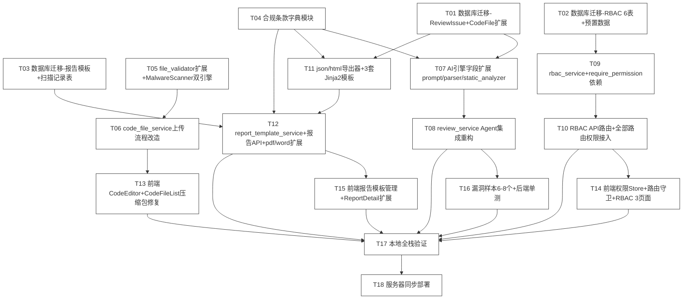

# TASK · 代码审计 Agent 集成与漏洞识别增强 · 原子任务拆分

> 任务名: `代码审计Agent集成与漏洞识别增强`
> 创建时间: 2026-06-25
> 阶段: Atomize(原子化)
> 输入: ALIGNMENT + CONSENSUS + DESIGN
> 输出: 18 个原子任务 + 输入/输出契约 + 依赖图 + 复杂度评估

---

## 一、任务拆分原则

1. **原子性**:每个任务可独立编译、独立测试、独立提交
2. **依赖清晰**:任务间依赖无循环,可并行任务标注
3. **复杂度可控**:单任务代码量 ≤500 行(含测试),超过则拆分
4. **验收明确**:每个任务有可执行的验收命令
5. **向后兼容**:每个任务完成后系统仍可运行,不破坏既有功能

---

## 二、任务依赖图

### 依赖关系矩阵

| 任务 | 前置依赖 | 可并行任务 |
|------|---------|-----------|
| T01 | - | T02,T03,T04 |
| T02 | - | T01,T03,T04 |
| T03 | - | T01,T02,T04 |
| T04 | - | T01,T02,T03 |
| T05 | - | T01-T04 |
| T06 | T05 | T07,T08,T09,T10,T11 |
| T07 | T01,T04 | T06,T09,T11 |
| T08 | T07 | T06,T09,T10,T11,T12 |
| T09 | T02 | T06,T07,T08,T11 |
| T10 | T09 | T06,T07,T08,T11,T12 |
| T11 | T01,T04 | T06,T07,T08,T09,T10 |
| T12 | T03,T11 | T06,T07,T08,T09,T10 |
| T13 | T06 | T14,T15 |
| T14 | T10 | T13,T15 |
| T15 | T12 | T13,T14 |
| T16 | T08 | T17 准备 |
| T17 | T08,T10,T12,T13,T14,T15,T16 | - |
| T18 | T17 | - |

---

## 三、原子任务详情

### T01 · 数据库迁移-ReviewIssue+CodeFile 扩展字段

**目标**:为 `review_issue` 表新增 5 字段,为 `code_file` 表新增 2 字段

**输入契约**:
- 前置依赖:无
- 输入数据:现有 `review_issue`/`code_file` 表结构
- 环境依赖:MySQL 8.0,Docker `cr_mysql` 容器运行中

**输出契约**:
- 交付物:
  - `backend/alembic/versions/006_review_issue_vuln_metadata_full.py`
  - 修改 `backend/app/models/review_issue.py`(新增 5 字段)
  - 修改 `backend/app/models/code_file.py`(新增 2 字段)
  - 修改 `backend/app/schemas/review.py`(Pydantic Schema 同步)
- 验收标准:
  - `alembic upgrade head` 成功
  - `alembic downgrade -1` 成功
  - 既有数据未丢失(字段 nullable)

**实现约束**:
- 技术栈:SQLAlchemy 2.0 + Alembic
- 新增字段:`review_issue.cvss_score:Float`/`cvss_vector:String(64)`/`compliance_mapping:JSON`/`remediation:Text`/`static_rule_hits:Integer`
- 新增字段:`code_file.is_binary:Boolean`/`raw_size:Integer`
- 所有新字段 `nullable=True`,默认值 None/0
- 函数级注释完整

**复杂度**:低(数据库迁移,模式化工作)

---

### T02 · 数据库迁移-RBAC 6 表+预置数据

**目标**:创建 RBAC 6 张表,预置 5 角色 + 36 权限点 + 默认菜单

**输入契约**:
- 前置依赖:无
- 输入数据:DESIGN §7 RBAC 权限点清单
- 环境依赖:MySQL 8.0

**输出契约**:
- 交付物:
  - `backend/alembic/versions/007_rbac_tables.py`(建表 + 预置数据)
  - `backend/app/models/rbac.py`(6 个 ORM 模型)
  - `backend/app/schemas/rbac.py`(Pydantic Schema)
- 验收标准:
  - `alembic upgrade head` 成功,6 张表创建
  - `role` 表预置 5 角色(user/reviewer/auditor/admin/super_admin)
  - `permission` 表预置 36 权限点
  - `role_permission` 表按 DESIGN §7.3 矩阵预置关联
  - `menu` 表预置默认菜单树
  - `data_scope` 表预置 5 角色数据范围规则
  - `alembic downgrade -1` 成功

**实现约束**:
- 表名:`role`/`permission`/`role_permission`/`user_role`/`menu`/`data_scope`
- `permission.code` 唯一索引
- `role.code` 唯一索引
- `menu` 自引用 `parent_id`
- 预置数据用 `op.bulk_insert()`

**复杂度**:中(6 表 + 大量预置数据)

---

### T03 · 数据库迁移-报告模板+扫描记录表

**目标**:创建 `report_template` 与 `malware_scan_log` 表

**输入契约**:
- 前置依赖:无
- 环境依赖:MySQL 8.0

**输出契约**:
- 交付物:
  - `backend/alembic/versions/008_report_template_malware_log.py`
  - `backend/app/models/report_template.py`
  - `backend/app/models/malware_scan_log.py`
  - `backend/app/schemas/report_template.py`
  - `backend/app/schemas/malware_scan_log.py`
- 验收标准:
  - `alembic upgrade head` 成功
  - `report_template` 表预置 3 套模板(simple/detailed/compliance),`is_builtin=True`
  - `alembic downgrade -1` 成功

**实现约束**:
- `report_template.content` 为 Text 类型存 Jinja2 模板字符串
- `malware_scan_log` 含 `file_id` 外键、`scan_engine`/`result`/`threat_name`/`duration_ms`/`scanned_at`

**复杂度**:低

---

### T04 · 合规条款字典模块

**目标**:建立 4 套合规标准字典 + CWE→合规反向映射

**输入契约**:
- 前置依赖:无
- 输入数据:DESIGN §8 合规条款字典设计

**输出契约**:
- 交付物:
  - `backend/app/constants/compliance.py`
  - `backend/tests/test_compliance_dict.py`
- 验收标准:
  - `ISO_27001_CONTROLS`/`GDPR_ARTICLES`/`PCI_DSS_REQUIREMENTS`/`HIPAA_SECTIONS` 4 字典可导入
  - `CWE_TO_COMPLIANCE` 覆盖 OWASP Top 10 全部 CWE
  - `get_compliance_mapping("CWE-89")` 返回 4 标准映射
  - `build_compliance_summary(issues)` 返回结构化汇总
  - 单测覆盖核心 CWE 与未命中场景

**实现约束**:
- 使用 `@dataclass` 定义 `ComplianceControl`
- 4 套字典为模块级常量
- `SUPPORTED_STANDARDS = ("iso27001", "gdpr", "pci_dss", "hipaa")`
- 函数级注释完整

**复杂度**:中(数据量较大)

---

### T05 · file_validator 扩展+MalwareScanner 双引擎

**目标**:实现 MIME 白名单校验 + ClamAV+YARA 双引擎恶意扫描

**输入契约**:
- 前置依赖:无
- 输入数据:DESIGN §2.5 工具层设计

**输出契约**:
- 交付物:
  - 修改 `backend/app/utils/file_validator.py`(新增 `ALLOWED_MIME_EXTENSIONS` + `validate_mime()` + `validate_project_total_size()`)
  - 新增 `backend/app/utils/malware_scanner.py`(`MalwareScanner` 类)
  - 新增 `backend/requirements.txt`(`clamd`、`yara-python`)
  - 修改 `deploy/docker-compose.yml`(新增 `clamav` 服务)
  - `backend/tests/test_malware_scanner.py`
- 验收标准:
  - 上传 `.exe` 文件 `validate_mime()` 返回 False
  - 上传 `.py` 文件返回 True
  - ClamAV 可用时 `scan()` 返回 `ScanResult(engine="clamav")`
  - ClamAV 不可用时降级为 YARA + 启发式,`degraded=True`
  - EICAR 测试签名被 ClamAV 拒绝
  - webshell 特征被 YARA 拒绝
  - 单测覆盖可用/不可用/降级三种场景

**实现约束**:
- `ALLOWED_MIME_EXTENSIONS` 白名单:.py/.js/.ts/.java/.go/.rs/.c/.cpp/.h/.hpp/.php/.rb/.vue/.jsx/.tsx/.sql/.sh/.yml/.yaml/.json/.md/.txt/.xml/.html/.css
- 拒绝:.exe/.dll/.so/.dylib/.bat/.com/.scr/.msi
- ClamAV 通过 `clamd` 库连接 `clamav:3310`
- YARA 规则放 `deploy/yara/rules/`
- 扫描超时 30s 降级
- 函数级注释完整

**复杂度**:中高(双引擎集成 + 降级逻辑)

---

### T06 · code_file_service 上传流程改造

**目标**:上传入口识别压缩包自动解压 + 调用恶意扫描 + MIME 校验

**输入契约**:
- 前置依赖:T05
- 输入数据:DESIGN §5.2 文件上传数据流

**输出契约**:
- 交付物:
  - 修改 `backend/app/services/code_file_service.py`(`upload()` 方法改造)
  - 修改 `backend/app/api/v1/code_files.py`(响应扩展 `is_archive`/`extracted_files`/`malware_scan`;新增 `GET /code-files/{id}/download`)
  - `backend/tests/test_code_file_upload.py`
- 验收标准:
  - 上传 zip 文件返回 `is_archive=true` + `extracted_files` 列表
  - 上传 .py 文件返回 `is_archive=false`
  - 上传 .exe 文件返回 415
  - 上传 11MB 文件返回 413
  - 上传 EICAR 文件返回 422
  - `GET /code-files/{id}/download` 返回 StreamingResponse
  - 单测覆盖压缩包/普通文件/恶意文件/超限

**实现约束**:
- 复用 `archive_extractor.extract_archive()`
- 调用 `MalwareScanner.scan()` 在解压前扫描原文件
- 解压后逐文件入库,设置 `is_binary`/`raw_size`
- 项目总大小校验:查询该项目所有 `code_file.raw_size` 求和

**复杂度**:中

---

### T07 · AI 引擎字段扩展(prompt/parser/static_analyzer)

**目标**:扩展 Prompt 输出约束 + Issue/Finding 字段 + 静态分析入口

**输入契约**:
- 前置依赖:T01(ReviewIssue 模型扩展)、T04(合规字典)
- 输入数据:DESIGN §2.4 AI 引擎层

**输出契约**:
- 交付物:
  - 修改 `backend/app/ai/prompt_builder.py`(增加 JSON Schema 约束段)
  - 修改 `backend/app/ai/result_parser.py`(`Issue` dataclass 扩展 5 字段 + `parse()` 兼容新旧格式)
  - 修改 `backend/app/ai/static_analyzer.py`(`Finding` dataclass 扩展 + `scan_file()` 入口)
  - `backend/tests/test_result_parser.py`
- 验收标准:
  - Prompt 包含 cvss_score/cvss_vector/compliance_mapping 字段约束
  - `parse()` 解析新格式 JSON 返回完整字段
  - `parse()` 解析旧格式(缺字段)返回默认值不报错
  - `scan_file()` 返回 `List[Finding]`,每个 Finding 含 cwe_id
  - 单测覆盖新旧格式 + 边界

**实现约束**:
- Prompt 用 JSON Schema 描述输出结构
- `Issue.cvss_score: float = 0.0`
- `Issue.compliance_mapping: dict = field(default_factory=dict)`
- `Issue.remediation: str = ""`
- 旧格式兼容:缺字段填默认值并记 `parse_warning`

**复杂度**:中

---

### T08 · review_service Agent 集成重构

**目标**:`_execute_review()` 真正调用 Agent,接入静态规则前置过滤

**输入契约**:
- 前置依赖:T07
- 输入数据:DESIGN §5.1 审查主流程数据流

**输出契约**:
- 交付物:
  - 修改 `backend/app/services/review_service.py`(`_execute_review()` 重构)
  - `backend/tests/test_review_service_agent_integration.py`
- 验收标准:
  - `_execute_review()` 调用栈含 `AgentRegistry.get()` + `agent.execute_review()`/`scan_file_for_review()`
  - `AiCallLog.agent_label` 为真实 Agent name(`code_reviewer`/`security_sentinel`)
  - 静态规则前置过滤命中后,LLM 仍深度审查该文件
  - 合并结果去重(按 file+line+cwe)
  - `compliance_mapping` 字段通过 `compliance_dict.get_compliance_mapping(cwe_id)` 自动填充
  - `ReviewIssue` 写入含全部新字段
  - LLM 失败时降级为仅静态结果,task 仍为 completed
  - 单测覆盖 Agent 调用/降级/去重

**实现约束**:
- `REVIEW_USE_BASE_AGENT` 环境变量开关(默认 true)
- 保留旧路径作为 fallback
- `REVIEW_ENABLE_STATIC_RULES`/`REVIEW_ENABLE_LLM` 环境变量控制双引擎
- 静态规则与 LLM 结果合并去重逻辑:`key = (file_name, line_number, cwe_id)`

**复杂度**:高(核心改造)

---

### T09 · rbac_service + require_permission 依赖

**目标**:实现 RBAC 服务核心 + 权限校验依赖注入装饰器

**输入契约**:
- 前置依赖:T02
- 输入数据:DESIGN §2.2 服务层 + §7 RBAC 权限点

**输出契约**:
- 交付物:
  - 新增 `backend/app/services/rbac_service.py`
  - 修改 `backend/app/core/dependencies.py`(新增 `require_permission()`)
  - `backend/tests/test_rbac_service.py`
- 验收标准:
  - `assign_role(user_id, role_code)` 成功
  - `check_permission(user_id, "review:start")` 返回 True/False
  - `list_user_menus(user_id)` 返回菜单树(按 data_scope 过滤)
  - `get_data_scope(user_id)` 返回 scope_type
  - `require_permission("review:start")` 作为依赖注入,无权限抛 PermissionError
  - 单测覆盖 5 角色 × 关键权限点

**实现约束**:
- 权限缓存:用 `functools.lru_cache` 缓存用户权限点(5 分钟)
- `super_admin` 直接返回 True
- 数据范围查询时注入 `data_scope` 过滤
- 函数级注释完整

**复杂度**:中高

---

### T10 · RBAC API 路由+全部路由权限接入

**目标**:新增 RBAC 管理路由 + 全部既有路由接入权限校验

**输入契约**:
- 前置依赖:T09
- 输入数据:DESIGN §4.1 RBAC API

**输出契约**:
- 交付物:
  - 新增 `backend/app/api/v1/rbac.py`
  - 新增 `backend/app/api/v1/malware_scan.py`
  - 修改全部既有路由文件(注入 `require_permission()`)
- 验收标准:
  - `/api/rbac/roles` CRUD 全部可用
  - `/api/rbac/permissions` 查询可用
  - `/api/rbac/menus` CRUD + `/menus/user` 可用
  - `/api/rbac/users/{id}/roles` 分配可用
  - `/api/admin/malware-scans` 查询可用
  - 既有路由无权限访问返回 403
  - 单测覆盖关键路由鉴权

**实现约束**:
- 路由前缀:`/api/rbac`
- 预置角色不可删除
- 角色删除前检查用户绑定
- 全局异常处理器捕获 `PermissionError` 返回 403

**复杂度**:中

---

### T11 · json/html 导出器+3 套 Jinja2 模板

**目标**:实现 JSON 导出器 + HTML 导出器 + 3 套 Jinja2 模板

**输入契约**:
- 前置依赖:T01(ReviewIssue 字段)、T04(合规字典)
- 输入数据:DESIGN §9 Jinja2 模板结构

**输出契约**:
- 交付物:
  - 新增 `backend/app/exporters/json_exporter.py`
  - 新增 `backend/app/exporters/html_exporter.py`
  - 新增 `backend/app/exporters/templates/simple.md.j2`
  - 新增 `backend/app/exporters/templates/detailed.md.j2`
  - 新增 `backend/app/exporters/templates/compliance.md.j2`
  - `backend/tests/test_exporters.py`
- 验收标准:
  - `export_json_report(detail)` 返回完整 JSON dict
  - `render_html_report(detail, "detailed")` 返回 HTML 字符串
  - 3 套模板均可渲染,无 Jinja2 错误
  - 合规版模板按 4 标准分章节
  - 单测覆盖 3 套模板渲染 + 缺字段兜底

**实现约束**:
- Jinja2 `Environment` 用 `select_autoescape(["html", "xml"])`
- 模板渲染失败回退到 `detailed`
- JSON 导出器字段缺失用 None 兜底
- 函数级注释完整

**复杂度**:中

---

### T12 · report_template_service + 报告 API + pdf/word 扩展

**目标**:实现模板服务 + 报告 API 扩展 + pdf/word 渲染新字段

**输入契约**:
- 前置依赖:T03(模板表)、T11(json/html 导出器)
- 输入数据:DESIGN §4.2 报告 API

**输出契约**:
- 交付物:
  - 新增 `backend/app/services/report_template_service.py`
  - 新增 `backend/app/api/v1/report_templates.py`
  - 修改 `backend/app/api/v1/reports.py`(新增 `/export/json`/`/export/html`/`/export/html?template_id=`)
  - 修改 `backend/app/services/report_service.py`(`get_report_detail()` 增加 `compliance_summary`)
  - 修改 `backend/app/exporters/pdf_exporter.py`(渲染 cvss/compliance)
  - 修改 `backend/app/exporters/word_exporter.py`(同上)
  - `backend/tests/test_report_api.py`
- 验收标准:
  - `GET /api/reports/{id}/export/json` 返回 JSON
  - `GET /api/reports/{id}/export/html` 返回 HTML
  - `GET /api/reports/{id}/export/html?template_id=2` 用指定模板渲染
  - `/api/report-templates` CRUD 可用
  - `/api/report-templates/builtin` 返回 3 套预置模板
  - PDF/Word 报告包含 cvss_score/compliance_mapping 字段
  - 单测覆盖 4 格式导出 + 模板切换

**实现约束**:
- HTML 报告路由返回 `Response(media_type="text/html")`
- 模板渲染调 `html_exporter.render_html_report()`
- `compliance_summary` 通过 `compliance_dict.build_compliance_summary()` 生成
- 函数级注释完整

**复杂度**:中

---

### T13 · 前端 CodeEditor+CodeFileList 压缩包修复

**目标**:编辑器拒绝渲染 binary + 文件列表标记压缩包已展开

**输入契约**:
- 前置依赖:T06(后端上传响应扩展)
- 输入数据:DESIGN §3.2 前端改造

**输出契约**:
- 交付物:
  - 修改 `frontend/src/views/code/CodeEditor.vue`(检测 is_binary 显示下载入口)
  - 修改 `frontend/src/views/code/CodeFileList.vue`(标记压缩包已展开)
  - 修改 `frontend/src/api/code.ts`(新增 download 接口)
- 验收标准:
  - binary 文件不传 Monaco,显示"该文件为二进制,请下载查看"+ 下载按钮
  - 压缩包文件显示"已展开为 N 个文件"标记
  - 下载按钮调用 `GET /api/code-files/{id}/download`
  - `vue-tsc --noEmit` 零错误

**实现约束**:
- 沿用 Element Plus + Monaco Editor
- 下载用 `<a download>` 或 `window.open`
- 函数级注释完整

**复杂度**:低

---

### T14 · 前端权限 Store+路由守卫+RBAC 3 页面

**目标**:权限 Store + 路由守卫 + 角色管理/权限分配/菜单管理 3 页面

**输入契约**:
- 前置依赖:T10(RBAC API)
- 输入数据:DESIGN §3.2 前端改造 + §7 RBAC 权限点

**输出契约**:
- 交付物:
  - 新增 `frontend/src/stores/permission.ts`
  - 修改 `frontend/src/router/index.ts`(路由守卫接入权限点)
  - 新增 `frontend/src/api/rbac.ts`
  - 新增 `frontend/src/views/admin/RoleManage.vue`
  - 新增 `frontend/src/views/admin/PermissionAssign.vue`
  - 新增 `frontend/src/views/admin/MenuManage.vue`
- 验收标准:
  - 登录后拉取用户权限点 + 菜单
  - 路由守卫拦截无权限页面跳转 403
  - 菜单按 `menu` 表配置动态渲染
  - 角色管理页 CRUD 可用
  - 权限分配页角色×权限矩阵可勾选
  - 菜单管理页树形 CRUD 可用
  - `vue-tsc --noEmit` 零错误

**实现约束**:
- 沿用 Pinia + Vue Router + Element Plus
- 权限 Store 用 `pinia` defineStore
- 路由守卫 `beforeEach` 检查 `to.meta.permission`
- 函数级注释完整

**复杂度**:中高(3 个新页面)

---

### T15 · 前端报告模板管理+ReportDetail 扩展

**目标**:报告模板管理页 + ReportDetail 支持 4 格式下载 + 模板切换

**输入契约**:
- 前置依赖:T12(报告 API)
- 输入数据:DESIGN §3.2 前端改造

**输出契约**:
- 交付物:
  - 新增 `frontend/src/views/admin/ReportTemplate.vue`
  - 修改 `frontend/src/views/report/ReportDetail.vue`(JSON/HTML 下载 + 模板切换)
  - 修改 `frontend/src/api/report.ts`(扩展 JSON/HTML/模板 API)
- 验收标准:
  - 模板管理页 CRUD 可用
  - ReportDetail 页有 PDF/Word/JSON/HTML 4 个下载按钮
  - HTML 下载可选模板
  - `vue-tsc --noEmit` 零错误

**实现约束**:
- 沿用 Element Plus
- 下载用 `<a download>` 或 `window.open`
- 函数级注释完整

**复杂度**:低中

---

### T16 · 漏洞样本 6-8 个+后端单测

**目标**:新建漏洞样本 + 补全后端单测

**输入契约**:
- 前置依赖:T08(review_service 重构)
- 输入数据:CONSENSUS §2.2 漏洞识别验收

**输出契约**:
- 交付物:
  - 新增 `tests/fixtures/vuln_samples/sqli.py`(SQL 注入)
  - 新增 `tests/fixtures/vuln_samples/xss.py`(XSS)
  - 新增 `tests/fixtures/vuln_samples/hardcoded_secret.py`(硬编码密钥)
  - 新增 `tests/fixtures/vuln_samples/path_traversal.py`(路径遍历)
  - 新增 `tests/fixtures/vuln_samples/deserialization.py`(反序列化)
  - 新增 `tests/fixtures/vuln_samples/ssrf.py`(SSRF)
  - 新增 `tests/fixtures/vuln_samples/command_injection.py`(命令注入)
  - 新增 `tests/fixtures/vuln_samples/weak_crypto.py`(弱加密)
  - 新增 `backend/tests/test_vuln_samples_review.py`(端到端验证)
  - 补全 T05-T12 缺失的单测
- 验收标准:
  - 每个样本至少 1 个漏洞被识别
  - `cwe_id`/`owasp_category`/`cvss_score`/`severity` 非空
  - `compliance_mapping` 至少映射 1 个合规标准
  - 单测全部通过
  - 既有 38 项单测无回归

**实现约束**:
- 样本为真实可执行 Python 代码(含注释标注漏洞类型)
- 端到端测试调真实 review_service.start()(mock DeepSeek 或真实调用)
- 函数级注释完整

**复杂度**:中

---

### T17 · 本地全栈验证

**目标**:本地 Docker MySQL + 后端 + 前端全栈跑通

**输入契约**:
- 前置依赖:T08,T10,T12,T13,T14,T15,T16

**输出契约**:
- 交付物:
  - 验证记录文档(写入 ACCEPTANCE 文档)
- 验收标准:
  - Docker MySQL 3307 + ClamAV 3310 启动
  - 后端 8000 启动,健康检查通过
  - 前端 5173 启动,登录页可访问
  - 登录后菜单按权限渲染
  - 上传 zip 压缩包自动解压
  - 上传 .exe 拒绝
  - 启动 review 任务,任务详情显示结构化漏洞
  - 下载 PDF/Word/JSON/HTML 报告
  - 角色管理/权限分配/菜单管理可用
  - `ruff check backend/` 零警告
  - `python -m compileall backend/app` 通过
  - `vue-tsc --noEmit` 零错误
  - `npm run build` 通过
  - 全部单测通过

**实现约束**:
- 真实点击 + API 调用验证
- 截图/录屏存档(可选)

**复杂度**:中(验证工作)

---

### T18 · 服务器同步部署

**目标**:rsync 同步 + Alembic 迁移 + deploy.sh 重建容器

**输入契约**:
- 前置依赖:T17
- 服务器:81.70.251.90(root/Lijd20041107)
- 部署路径:/opt/code-review

**输出契约**:
- 交付物:
  - 同步执行命令记录(写入 ACCEPTANCE 文档)
- 验收标准:
  - `rsync -avz --exclude='.env' --exclude='__pycache__' --exclude='node_modules' backend/ frontend/ deploy/ docs/ root@81.70.251.90:/opt/code-review/` 成功
  - 服务器 `cd /opt/code-review && alembic upgrade head` 成功,数据未丢失
  - 服务器 `cd /opt/code-review/deploy && docker compose up -d --build` 成功
  - 线上 `lijiadong.cn` 访问正常
  - 线上 review 任务可启动并返回结构化漏洞结果
  - 线上 ClamAV 容器运行正常

**实现约束**:
- `.env` 不覆盖(保留线上现有)
- 数据库迁移前备份(`mysqldump`)
- 部署失败可回滚(保留上一版本镜像)
- SSH 用密码或密钥(密码不写入代码)
- 函数级注释完整

**复杂度**:中(部署 + 验证)

---

## 四、复杂度评估汇总

| 任务 | 复杂度 | 预计代码量(含测试) | 关键风险 |
|------|--------|------------------|---------|
| T01 | 低 | ~150 行 | 无 |
| T02 | 中 | ~400 行 | 预置数据量大 |
| T03 | 低 | ~200 行 | 无 |
| T04 | 中 | ~600 行 | 合规条款数据量大 |
| T05 | 中高 | ~500 行 | ClamAV/YARA 集成 |
| T06 | 中 | ~400 行 | 上传流程改造 |
| T07 | 中 | ~400 行 | 新旧格式兼容 |
| T08 | 高 | ~600 行 | 核心改造,Agent 集成 |
| T09 | 中高 | ~500 行 | RBAC 核心逻辑 |
| T10 | 中 | ~500 行 | 全部路由接入 |
| T11 | 中 | ~600 行 | Jinja2 模板 |
| T12 | 中 | ~500 行 | 报告 4 格式 |
| T13 | 低 | ~250 行 | 前端组件改造 |
| T14 | 中高 | ~700 行 | 3 个新页面 |
| T15 | 低中 | ~300 行 | 前端组件改造 |
| T16 | 中 | ~500 行 | 漏洞样本设计 |
| T17 | 中 | 验证工作 | 全栈验证 |
| T18 | 中 | 部署工作 | 线上数据安全 |

**总计**:~6600 行代码(含测试)+ 验证 + 部署

---

## 五、执行计划

### 5.1 执行批次(按依赖关系)

**批次 1(可并行,4 任务)**:T01, T02, T03, T04
**批次 2(可并行,2 任务)**:T05, T07(依赖 T01+T04)
**批次 3(可并行,3 任务)**:T06(依赖 T05), T09(依赖 T02), T11(依赖 T01+T04)
**批次 4(可并行,3 任务)**:T08(依赖 T07), T10(依赖 T09), T12(依赖 T03+T11)
**批次 5(可并行,3 任务)**:T13(依赖 T06), T14(依赖 T10), T15(依赖 T12)
**批次 6(1 任务)**:T16(依赖 T08)
**批次 7(1 任务)**:T17(依赖 T08+T10+T12+T13+T14+T15+T16)
**批次 8(1 任务)**:T18(依赖 T17)

### 5.2 每个任务执行流程

按 6A 工作流 Automate 阶段要求:
1. 执行前检查(验证输入契约、环境准备、依赖满足)
2. 实现核心逻辑(按设计文档编写代码)
3. 编写单元测试(边界条件、异常情况)
4. 运行验证测试
5. 更新相关文档
6. 每完成一个任务立即验证

### 5.3 异常处理

- 遇到不确定问题立刻中断执行
- 在本文档对应任务下记录问题详细信息
- 寻求人工澄清后继续
- 从中断点任务继续执行

---

## 六、质量门控(Atomize 阶段自检)

| 门控项 | 状态 |
|--------|------|
| 任务覆盖完整需求 | ✅ 18 任务覆盖 CONSENSUS 全部 12 项 FR + 10 项 NFR |
| 依赖关系无循环 | ✅ 依赖图无环 |
| 每个任务都可独立验证 | ✅ 每个任务有可执行验收命令 |
| 复杂度评估合理 | ✅ 单任务 ≤700 行,高复杂度任务已标注 |
| 输入/输出契约清晰 | ✅ 18 任务全部含输入/输出契约 |
| 与设计文档一致 | ✅ 与 DESIGN 完全对齐 |
