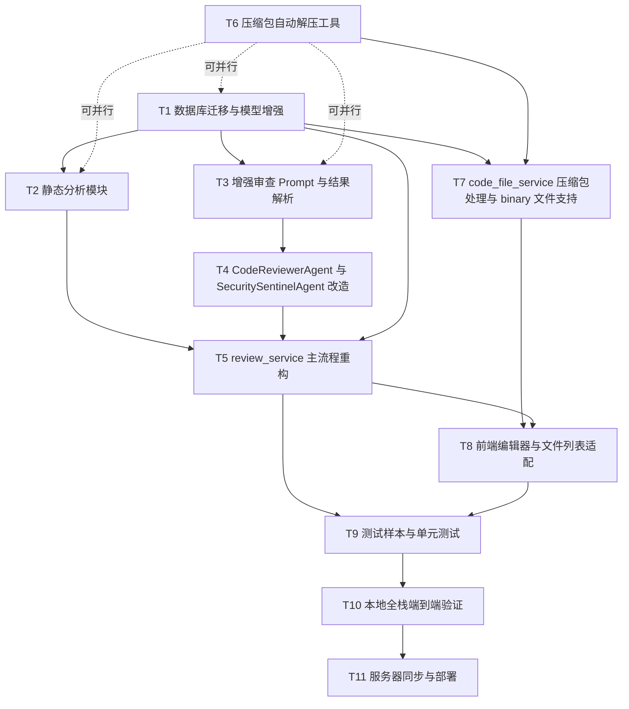

# TASK · 代码审计 Agent 集成与漏洞识别增强

> 任务名: `代码审计Agent集成与漏洞识别增强`
> 创建时间: 2026-06-25
> 阶段: Atomize(原子化)
> 输入: DESIGN 文档
> 输出: 原子任务拆分 + 依赖关系图 + 输入/输出契约

---

## 一、原子任务拆分

### T1 · 数据库迁移与模型增强

**输入契约**:
- 前置依赖: 无
- 输入数据: 现有 `ReviewIssue` / `CodeFile` 模型定义
- 环境依赖: 本地 Docker MySQL `cr_mysql` 健康运行

**任务内容**:
1. 修改 `backend/app/models/review_issue.py`,新增 `owasp/cwe/evidence/exploit_scenario/references_json/confidence/source` 字段
2. 修改 `backend/app/models/code_file.py`,新增 `is_binary/original_blob` 字段
3. 创建 `backend/alembic/versions/003_review_issue_vuln_metadata.py` 迁移脚本
4. 本地执行 `alembic upgrade head` 验证迁移成功

**输出契约**:
- 输出数据: 修改后的模型文件 + 迁移脚本
- 交付物: `review_issue.py`、`code_file.py`、`003_review_issue_vuln_metadata.py`
- 验收标准:
  - `alembic upgrade head` 成功
  - `alembic current` 显示 `003 (head)`
  - MySQL 表结构包含所有新字段
  - 旧数据不破坏(`source` 字段默认 `llm`,`is_binary` 默认 `0`)

**实现约束**:
- Python 3.9 兼容
- SQLAlchemy 1.4 风格
- 迁移脚本支持 `upgrade` 和 `downgrade`

**依赖关系**: 后置任务:T2、T3、T4、T5、T7

---

### T2 · 静态分析模块

**输入契约**:
- 前置依赖: T1
- 输入数据: `app/ai/security_static_rules.py`、`app/ai/security_patterns.py`(已存在)
- 环境依赖: 无

**任务内容**:
1. 创建 `backend/app/ai/static_analyzer.py`,定义 `Finding` 数据类和 `scan(file)` 函数
2. 复用 `scan_secrets()` 和 `apply_static_rules()`,把它们的输出转换为标准 `Finding`
3. 每个 `Finding` 必须填充: `line_number/end_line/issue_type/severity/title/description/suggestion/fixed_code/owasp/cwe/evidence/exploit_scenario/references/confidence/source`

**输出契约**:
- 输出数据: `static_analyzer.py` 模块
- 交付物: `Finding` 数据类、`scan(file: CodeFile) -> List[Finding]` 函数
- 验收标准:
  - 对硬编码密钥样本,`scan()` 返回至少 1 个 `Finding`,`source=regex`,`confidence≥0.99`
  - 对弱加密样本,`scan()` 返回至少 1 个 `Finding`,`source=static`,`confidence≥0.95`
  - 对正常代码,`scan()` 返回空列表

**实现约束**:
- 纯函数,无 LLM 调用,无 DB 写入
- Python 3.9 兼容

**依赖关系**: 后置任务:T5

---

### T3 · 增强审查 Prompt 与结果解析

**输入契约**:
- 前置依赖: T1
- 输入数据: `app/ai/prompts/review.zh.md`、`app/ai/result_parser.py`、`app/ai/prompt_builder.py`
- 环境依赖: 无

**任务内容**:
1. 修改 `review.zh.md` 模板,在 `issues` 数组字段约束中新增 `owasp/cwe/evidence/exploit_scenario/references/confidence` 字段说明
2. 修改 `result_parser.Issue` 数据类,新增上述字段
3. 修改 `result_parser._normalize_issue()`,解析新增字段
4. 修改 `result_parser.parse()`,对新字段缺失的 issue 用默认值填充
5. 在 `result_parser` 中新增 `_infer_owasp_cwe()` 辅助函数,对未填 cwe 的安全类 issue 推断补全(复用 `SecuritySentinelAgent._infer_owasp_cwe` 逻辑)

**输出契约**:
- 输出数据: 修改后的 `review.zh.md`、`result_parser.py`
- 交付物: 增强后的模板和解析器
- 验收标准:
  - LLM 返回带新字段的 JSON 时,`parse()` 能正确解析
  - LLM 返回旧格式 JSON(无新字段)时,`parse()` 用默认值填充,不报错
  - 安全类 issue 缺 cwe 时,`_infer_owasp_cwe()` 能补全

**实现约束**:
- 向后兼容,旧格式 JSON 仍能解析
- Python 3.9 兼容

**依赖关系**: 后置任务:T4

---

### T4 · CodeReviewerAgent 与 SecuritySentinelAgent 改造

**输入契约**:
- 前置依赖: T3
- 输入数据: `app/agents/review_agent.py`、`app/agents/security_sentinel_agent.py`、`app/agents/base.py`、`app/ai/prompt_builder.py`、`app/ai/result_parser.py`
- 环境依赖: 无

**任务内容**:
1. 修改 `CodeReviewerAgent`:
   - 新增 `execute_review(*, code, rules, language, file_name, line_offset, experience_section, agent_section, api_config, ctx) -> AgentResult` 方法
   - 内部调用 `build_prompt()` 生成 system+user prompt
   - 通过 `self.call(user_prompt, ctx=ctx, json_mode=True, api_config=api_config)` 调用 LLM
   - 解析返回结果为 `List[Finding]`
   - 返回 `AgentResult(data={"issues": findings, "summary": ..., "score": ...})`
2. 修改 `SecuritySentinelAgent`:
   - 新增 `scan_file_for_review(*, code, language, file_name, line_offset, experience_section, api_config, ctx) -> AgentResult` 方法
   - 复用 `_build_audit_prompt()` 和 `_normalize_finding()`
   - 返回与 `CodeReviewerAgent` 同结构的 `AgentResult`

**输出契约**:
- 输出数据: 修改后的 `review_agent.py`、`security_sentinel_agent.py`
- 交付物: 两个 Agent 类的新方法
- 验收标准:
  - `execute_review()` 返回 `AgentResult.success=True` 时,`data["issues"]` 是 `List[Finding]`
  - LLM 调用失败时返回 `AgentResult.success=False`
  - 调用过程中 `BaseAgent.call()` 自动 emit `THINKING/COMPLETE/FAILED` 事件

**实现约束**:
- 通过 `BaseAgent.call()` 调用,不直接调 `DeepSeekAgent.chat()`
- `api_config` 参数支持用户自定义 API 配置
- Python 3.9 兼容

**依赖关系**: 后置任务:T5

---

### T5 · review_service 主流程重构

**输入契约**:
- 前置依赖: T1、T2、T3、T4
- 输入数据: `app/services/review_service.py`、`app/agents/registry.py`、`app/ai/static_analyzer.py`、改造后的 `CodeReviewerAgent` 和 `SecuritySentinelAgent`
- 环境依赖: 本地 Docker MySQL + DeepSeek API Key

**任务内容**:
1. 移除 `_PROFILE_TO_AGENT_CODE` 映射(改为通过 `AgentRegistry` 获取真实 Agent)
2. 新增 `_get_agent_for_profile(profile_code: str) -> BaseAgent` 函数,从 `AgentRegistry` 获取:
   - `security` profile → `security_sentinel` Agent
   - `general/reliability/performance/maintainability` profile → `code_reviewer` Agent
3. 重构 `_review_one_file()` 为双引擎:
   - 引擎1: 调用 `static_analyzer.scan(code_file)` 获取静态 findings
   - 引擎2: 对每个 chunk,调用 `_review_chunk_via_agent()` 获取 LLM findings
   - 合并去重(按 `file_id + line_number + cwe` 指纹)
4. 重构 `_review_chunk_via_agent()`:
   - 通过 `_get_agent_for_profile()` 获取 Agent
   - 调用 `agent.execute_review()` 或 `agent.scan_file_for_review()`
   - 写 `AiCallLog` 时 `agent_label` 用真实 Agent name
5. 重构 `_execute_review()`:
   - 移除 `agent: DeepSeekAgent` 参数
   - 移除手动 emit `THINKING/COMPLETE/FAILED`(由 `BaseAgent.call()` 自动 emit)
   - 保留 `DISPATCH` 和 `PROGRESS` 事件
6. 新增 `_finding_to_review_issue()` 辅助函数,把 `Finding` 转为 `ReviewIssue` ORM 对象(填充所有新字段)

**输出契约**:
- 输出数据: 修改后的 `review_service.py`
- 交付物: 重构后的主流程
- 验收标准:
  - 启动 review 任务,后端日志显示 `code_reviewer`/`security_sentinel` Agent 被调用
  - `ai_call_log` 表的 `agent_label` 字段为真实 Agent name
  - `review_issue` 表的新字段(owasp/cwe/evidence 等)有数据写入
  - 静态规则命中的 finding `source=regex/static`,LLM 命中的 `source=llm`
  - 现有的 `quick/standard/security/performance/full` 5 种审查类型都能正常完成

**实现约束**:
- 保留 `_safe_commit()` 安全提交逻辑
- 保留 `TaskCancelledError` 取消机制
- 保留经验注入(`experience_service.retrieve`)和个性化注入(`personalization_service.build_review_context`)
- Python 3.9 兼容

**依赖关系**: 后置任务:T8、T9

---

### T6 · 压缩包自动解压工具

**输入契约**:
- 前置依赖: 无(与 T1-T5 并行)
- 输入数据: 无
- 环境依赖: Python 标准库 `zipfile`、`tarfile`

**任务内容**:
1. 创建 `backend/app/utils/archive_extractor.py` 模块
2. 实现 `is_archive(filename: str) -> bool`: 判断是否为支持的压缩包格式(zip/tar/tar.gz/tgz/tar.bz2/tar.xz)
3. 实现 `extract_archive(raw: bytes, filename: str) -> list[ExtractedFile]`: 解压并返回文件列表
4. 严格安全校验:
   - 拒绝 `..` 路径(zip slip 防护)
   - 拒绝绝对路径
   - 限制解压后文件数量 ≤ 100
   - 限制解压后总大小 ≤ 50MB
   - 限制单个文件大小 ≤ 10MB
   - 跳过隐藏文件(`.git/`、`.svn/`、`__pycache__/` 等)
5. 定义 `ExtractedFile` 数据类:`name/path/content/language/size`

**输出契约**:
- 输出数据: `archive_extractor.py` 模块
- 交付物: `is_archive()`、`extract_archive()`、`ExtractedFile` 数据类
- 验收标准:
  - 正常 zip 解压返回正确文件列表
  - 恶意 zip(含 `../evil.py`)抛出 `ValidationError`
  - 超过 100 个文件的 zip 抛出 `ValidationError`
  - 超过 50MB 的 zip 抛出 `ValidationError`
  - tar.gz/tar.bz2 同样能解压

**实现约束**:
- 纯函数,无 DB 操作
- Python 标准库,不引入新依赖
- Python 3.9 兼容

**依赖关系**: 后置任务:T7

---

### T7 · code_file_service 压缩包处理与 binary 文件支持

**输入契约**:
- 前置依赖: T1、T6
- 输入数据: `app/services/code_file_service.py`、`app/utils/archive_extractor.py`、`app/schemas/code_file.py`、`app/api/v1/code_files.py`
- 环境依赖: 无

**任务内容**:
1. 修改 `code_file_service.upload()`:
   - 检测压缩包时调用 `extract_archive()` 解压,逐个文件入库
   - 非压缩包 binary 文件(图片/可执行文件等)标记 `is_binary=1`,把原始字节存入 `original_blob`,`content` 字段仍存 base64(向后兼容)
   - 返回值改为 `UploadResult` 数据类,含 `is_archive/is_binary/primary_file_id/extracted_files`
2. 修改 `code_file_service.get_file()`:
   - 返回时增加 `is_binary` 字段
   - `is_binary=true` 时 `content` 返回空字符串(不返回 base64)
3. 修改 `app/schemas/code_file.py`:
   - `CodeFileDetailOut` 新增 `is_binary: bool = False`
   - `UploadOut` 改为 `is_archive: bool`、`is_binary: bool`、`primary_file_id: int`、`extracted_files: list[FileSummary]`
4. 新增 `GET /api/code-files/{file_id}/download` 接口:
   - 返回 `StreamingResponse`,Content-Disposition 为 attachment
   - binary 文件返回 `original_blob`,文本文件返回 `content` 编码后的字节
5. 修改 `app/api/v1/code_files.py` 增加下载路由

**输出契约**:
- 输出数据: 修改后的 `code_file_service.py`、`schemas/code_file.py`、`api/v1/code_files.py`
- 交付物: 压缩包自动解压、binary 文件标记、下载接口
- 验收标准:
  - 上传 zip,响应 `is_archive=true`,`extracted_files` 列表非空
  - 上传 png,响应 `is_binary=true`
  - `GET /api/code-files/{id}` 对 binary 文件返回 `is_binary=true, content=""`
  - `GET /api/code-files/{id}/download` 返回原文件字节

**实现约束**:
- 向后兼容,旧客户端仍可工作
- Python 3.9 兼容

**依赖关系**: 后置任务:T8

---

### T8 · 前端编辑器与文件列表适配

**输入契约**:
- 前置依赖: T5、T7
- 输入数据: `frontend/src/views/code/CodeEditor.vue`、`frontend/src/views/code/CodeFileList.vue`、`frontend/src/api/codeFile.ts`、`frontend/src/types/project.ts`
- 环境依赖: 前端 npm 依赖已安装

**任务内容**:
1. 修改 `types/project.ts`:
   - `CodeFileDetailOut` 新增 `is_binary: boolean`
   - `UploadResult` 改为 `is_archive/is_binary/primary_file_id/extracted_files`
2. 修改 `api/codeFile.ts`:
   - `getDetail()` 返回类型包含 `is_binary`
   - 新增 `downloadFile(fileId: number): Promise<Blob>` 调用 `GET /api/code-files/{id}/download`
3. 修改 `CodeEditor.vue`:
   - `fetchDetail()` 后检测 `is_binary`
   - `is_binary=true` 时不渲染 Monaco Editor,显示提示"该文件为二进制文件,无法在编辑器中查看"
   - 提供"下载原文件"按钮,调用 `downloadFile()`
4. 修改 `CodeFileList.vue`:
   - 对 binary 文件名后加 `[二进制]` 标签
   - 上传压缩包后,提示"压缩包已解压为 N 个文件"并刷新列表

**输出契约**:
- 输出数据: 修改后的前端文件
- 交付物: 前端适配
- 验收标准:
  - 上传 zip 后,文件列表显示解压后的多个文件
  - 上传 png 后,文件列表显示 `[二进制]` 标签
  - 点击 binary 文件,编辑器显示提示而非 base64
  - 点击"下载原文件"按钮,浏览器下载原文件
  - `npm run build` 通过,vue-tsc 零错误

**实现约束**:
- TypeScript 类型完整
- 复用 Element Plus 组件
- 保持现有视觉风格

**依赖关系**: 后置任务:T9

---

### T9 · 测试样本与单元测试

**输入契约**:
- 前置依赖: T5、T8
- 输入数据: 无
- 环境依赖: pytest

**任务内容**:
1. 创建 `backend/tests/fixtures/vuln_samples/` 目录,新增 7 个测试样本:
   - `sqli_python.py` — SQL 字符串拼接注入(CWE-89)
   - `xss_javascript.js` — DOM XSS 内联拼接(CWE-79)
   - `hardcoded_secrets.py` — 硬编码 AWS Key + DB 密码(CWE-798)
   - `path_traversal_python.py` — 用户输入拼接到文件路径(CWE-22)
   - `deserialization_python.py` — pickle.loads 用户输入(CWE-502)
   - `ssrf_python.py` — requests.get(user_url) 无校验(CWE-918)
   - `command_injection_python.py` — os.system(user_input)(CWE-78)
2. 创建单元测试:
   - `tests/unit/ai/test_static_analyzer.py`: 测试静态分析模块
   - `tests/unit/agents/test_code_reviewer_agent.py`: 测试 `execute_review()` 方法(mock LLM)
   - `tests/unit/agents/test_security_sentinel_review.py`: 测试 `scan_file_for_review()` 方法(mock LLM)
   - `tests/unit/services/test_review_service_v2.py`: 测试双引擎审查流程(mock LLM)
   - `tests/unit/utils/test_archive_extractor.py`: 测试压缩包解压与安全校验
   - `tests/unit/services/test_code_file_service_v2.py`: 测试压缩包上传与 binary 文件
3. 确保现有 184 个测试不回归

**输出契约**:
- 输出数据: 测试样本 + 单元测试文件
- 交付物: 7 个漏洞样本 + 6 个测试文件
- 验收标准:
  - `pytest -q` 全量通过(184 + 新增 ≥ 10)
  - 静态分析对 7 个样本能命中至少 5 个漏洞
  - 压缩包解压测试覆盖正常/异常/zip slip/超限场景
  - 现有测试无回归

**实现约束**:
- 测试 mock LLM 调用,不真实调用 DeepSeek
- 测试覆盖正常流程、边界条件、异常情况
- Python 3.9 兼容

**依赖关系**: 后置任务:T10

---

### T10 · 本地全栈端到端验证

**输入契约**:
- 前置依赖: T9
- 输入数据: 7 个漏洞样本 + 现有 `qa_security_fixture.py`
- 环境依赖: Docker MySQL + 后端 + 前端全部启动

**任务内容**:
1. 启动 Docker MySQL、后端(uvicorn)、前端(vite dev)
2. 通过 API 创建测试项目,上传 7 个漏洞样本
3. 对每个样本启动 review 任务(security 类型),验证:
   - 后端日志显示 `code_reviewer`/`security_sentinel` Agent 被调用
   - `ai_call_log` 表的 `agent_label` 为真实 Agent name
   - `review_issue` 表的新字段有数据
   - 能识别出对应漏洞并给出 CWE/OWASP/修复建议
4. 上传测试 zip 压缩包,验证自动解压
5. 上传测试 png 图片,验证编辑器显示提示而非 base64
6. 浏览器真实点击验证前端交互
7. 截图保存到 `docs/代码审计Agent集成与漏洞识别增强/screenshots/`

**输出契约**:
- 输出数据: 验证报告 + 截图
- 交付物: `ACCEPTANCE_代码审计Agent集成与漏洞识别增强.md` 初稿
- 验收标准:
  - AC1-AC8 全部通过(见 CONSENSUS 文档)
  - 7 个漏洞样本至少识别出 5 个漏洞
  - 压缩包自动解压成功
  - binary 文件编辑器显示提示
  - 浏览器控制台零错误

**实现约束**:
- 真实调用 DeepSeek API(用 `.env` 中的 Key)
- 真实浏览器点击验证

**依赖关系**: 后置任务:T11

---

### T11 · 服务器同步与部署

**输入契约**:
- 前置依赖: T10
- 输入数据: 本地验证通过的代码
- 环境依赖: SSH 访问服务器 81.70.251.90

**任务内容**:
1. rsync 同步代码到 `root@81.70.251.90:/opt/code-review/`:
   ```bash
   rsync -avz --exclude='.git' --exclude='node_modules' --exclude='.venv' \
     --exclude='__pycache__' --exclude='*.pyc' --exclude='.env' \
     /Users/li/Documents/代码程序/基于大模型智能体的代码审查平台/ \
     root@81.70.251.90:/opt/code-review/
   ```
2. SSH 到服务器执行部署:
   ```bash
   ssh root@81.70.251.90 "cd /opt/code-review/deploy && ./deploy.sh"
   ```
3. 等待部署完成,验证服务:
   - `https://lijiadong.cn/healthz` 返回 200
   - `https://lijiadong.cn/docs` 可访问
   - 线上 alembic 迁移成功(`alembic current` 显示 003)
4. 线上跑一次 review 任务验证 Agent 调用链路
5. 验证线上编辑器压缩包解压与 binary 文件展示

**输出契约**:
- 输出数据: 服务器部署完成
- 交付物: 线上服务正常
- 验收标准:
  - AC9 通过(线上同样能跑通 AC1-AC8)
  - 服务器数据库数据未丢失
  - 线上 HTTPS 证书正常

**实现约束**:
- 保留服务器 `.env`(不同步本地 .env)
- 保留数据库数据
- 选择业务低峰期部署

**依赖关系**: 无后置任务

---

## 二、任务依赖图



---

## 三、任务执行顺序

按依赖关系,建议执行顺序:

1. **第一批(并行)**: T1(数据库迁移) + T6(压缩包解压工具)
2. **第二批(并行)**: T2(静态分析) + T3(Prompt 与解析) + T7(code_file_service,依赖 T1+T6)
3. **第三批**: T4(Agent 改造,依赖 T3)
4. **第四批**: T5(review_service 重构,依赖 T1+T2+T4)
5. **第五批**: T8(前端适配,依赖 T5+T7)
6. **第六批**: T9(测试样本与单测,依赖 T5+T8)
7. **第七批**: T10(本地全栈验证,依赖 T9)
8. **第八批**: T11(服务器部署,依赖 T10)

---

## 四、复杂度评估

| 任务 | 复杂度 | 风险 | 预计代码量 |
|------|-------|------|----------|
| T1 数据库迁移 | 低 | 低 | ~80 行 |
| T2 静态分析模块 | 中 | 低 | ~150 行 |
| T3 Prompt 与解析增强 | 中 | 中(LLM 输出不可控) | ~120 行 |
| T4 Agent 改造 | 中 | 中(需保持 Agent 独立性) | ~200 行 |
| T5 review_service 重构 | 高 | 高(主流程改动) | ~300 行 |
| T6 压缩包解压工具 | 中 | 高(zip slip 安全) | ~180 行 |
| T7 code_file_service 改造 | 中 | 中 | ~200 行 |
| T8 前端适配 | 中 | 低 | ~150 行 |
| T9 测试样本与单测 | 中 | 低 | ~400 行 |
| T10 本地全栈验证 | 中 | 中(依赖外部服务) | ~文档 |
| T11 服务器部署 | 低 | 中(线上影响) | ~脚本 |

总计: 约 1900 行代码 + 文档

---

## 五、质量门控

- [x] 任务覆盖完整需求(AC1-AC9 全部有对应任务)
- [x] 依赖关系无循环(T1→T2→T5→T8→T9→T10→T11 主链)
- [x] 每个任务都可独立验证(有明确验收标准)
- [x] 复杂度评估合理(单任务最大代码量 ≤ 400 行)
- [x] 可并行任务已识别(T1‖T6,T2‖T3‖T7)

---

## 六、进入 Approve 阶段条件

已完成原子任务拆分,每个任务有明确的输入契约、输出契约、实现约束、依赖关系和验收标准。

下一步: 进入 Approve 阶段,提交给用户审批。
