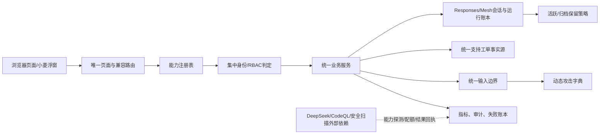
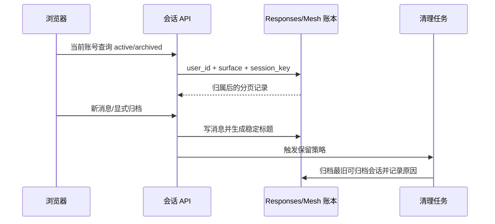

# Prism 继续优化机会审计设计

## 1. 目标架构

## 2. 事实源设计

| 领域 | 主事实源 | 兼容源处理 |
| --- | --- | --- |
| 小菱会话 | `AgentMeshConversation`、`AgentResponseRun` 及消息账本 | 旧 `AdminChatSession/AdminChatMessage` 只读迁移，迁移后禁止新写入 |
| 支持中心 | `/support` 页面与统一工单模型 | 旧 `/maintenance`、`/feedback` 仅跳转/适配，不进入导航、搜索和权限目录 |
| 角色权限 | 集中角色解析与 capability 判定 | 旧 `user.role` 只作为迁移兼容，不能与 RBAC 产生相反结论 |
| 自定义 Agent | 管理员审批的平台级发布目录 | 列表、搜索和派发共用 enabled + published 谓词，普通目录不暴露 owner_id |
| 模型扫描 | 任务/分片/续跑账本 | 配置值、单次输出或截断响应不能替代结果账本 |

## 3. 会话流程

## 4. 输入安全契约

- 结构化请求模型统一 `extra="forbid"`，标识字段只允许规定字符集。
- 文本字段按业务用途设置长度、控制字符策略和是否允许换行；错误信息不回显 SQL、模板或凭据。
- `dict/list/data URL` 必须限制嵌套深度、键/元素数量、单项字节数和总字节数。
- 动态字典验证响应码、无 500、无 SQL/模板执行、无 HTML 执行、无越权写入和无日志泄漏。

## 5. 兼容与回滚

先添加只读审计、指标和迁移前检查，再切换写路径；新旧计数不一致时停止切换。数据库迁移必须可逆，保留当前发布备份，回滚点要包含应用版本、迁移版本和配置快照。
