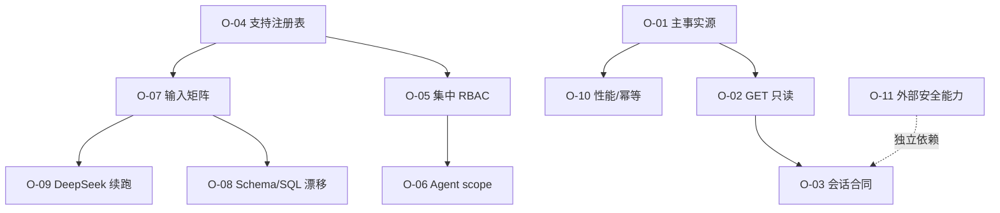

# Prism 继续优化机会审计任务

## P0 事实源与会话

| 编号 | 原子任务 | 输入 | 输出/验收 | 依赖 |
| --- | --- | --- | --- | --- |
| O-01 | 旧管理员历史只读化 | AdminChat 与 Responses/Mesh 运行账本 | **完成**：旧写入/历史路由返回 410，历史服务 GET 不再创建空会话 | 无 |
| O-02 | GET 副作用清理 | `list_agents`、归档策略、指标 | **完成**：GET 列表/收件箱/个人资料/论坛/反馈为纯读，写操作改为显式 POST 或启动/心跳流程 | O-01 |
| O-03 | 10 条合同闭环 | 两个账号、两个 surface、11+ 条会话、运行中会话 | **完成**：账号级 10 条硬上限、用户行锁、空闲归档、全占用 409、owner-scoped 检索/恢复均有测试 | O-02 |
| O-12 | 归档/运行事务收口 | 旧标签页、归档、checkpoint create/claim | **完成**：共享会话行锁；归档后新建/恢复运行失败，运行创建后归档失败 | O-03 |

## P1 统一入口与安全边界

| 编号 | 原子任务 | 输入 | 输出/验收 | 依赖 |
| --- | --- | --- | --- | --- |
| O-04 | `/support` 注册表合并 | 前端路由、能力注册表、页面指南、旧 API | **完成**：能力注册和页面指南统一为 `/support` | 无 |
| O-05 | 集中 RBAC 判定 | Mesh、Responses、Agent Studio、管理员服务 | **完成**：`resolve_effective_role_code/has_effective_role/is_admin_user/is_super_admin_user` 统一判定，旧字段与 RBAC 冲突时 fail-closed | O-04 |
| O-06 | 自定义 Agent scope | 管理员审批后的平台级发布合同 | **完成**：目录只返回启用且 published 项，不暴露 `owner_id`，派发复用相同可调用判定 | O-05 |
| O-07 | 输入安全矩阵 | 文本/JSON/data URL Schema | **完成本轮范围**：统一 `extra=forbid`、控制字符、JSON 字节/深度/元素上限，覆盖 Feedback/Maintenance/Studio/Mesh/Responses/Pentest | O-04 |
| O-08 | ORM/初始化 SQL 漂移 | User ORM、MySQL init SQL | **完成**：密码列收窄为 60，角色注释与固定角色合同对齐，并新增合同测试 | O-07 |
| O-13 | 权限验收固定角色化 | 生产验收账号和 manifest | **完成**：仅引用内置 `user`，不创建自定义角色、不改角色权限，并拒绝高权限漂移 | O-05 |

## P2 可靠性与外部依赖

| 编号 | 原子任务 | 输入 | 输出/验收 | 依赖 |
| --- | --- | --- | --- | --- |
| O-09 | DeepSeek 能力与续跑账本 | 供应商回执、额度、任务分片 | **部分完成**：截断保留并在上限内加倍输出预算重试 1 次；真实 1m 仍需供应商/额度回执 | O-07 |
| O-10 | 列表性能和跨 worker 幂等 | SQL 查询、OpsExecution、运行指标 | **完成**：会话运行态改为批量查询；OpsExecution 已有 DB 唯一 `request_id`、行锁和恢复路径 | O-01 |
| O-11 | CodeQL/Codex Security 里程碑 | CLI、隔离 worker、受管只读权限 | 真实运行 ID、SARIF/发现去重或扫描结果；阻塞时显式保留 | 外部依赖 |

## 依赖图

