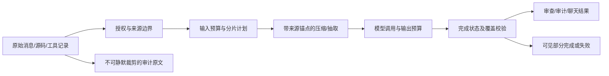

# 全 AI 上下文压缩与完整性：设计

每个生产模型入口使用相同原则，不强制统一成一个跨业务的大类：预算估计、完整分片、来源索引、摘要或结构化抽取、覆盖校验、输出完成判断、部分失败显式反馈。小菱保留完整 checkpoint 并压缩投影；圆桌复用分批提炼；审查/审计优先复用已有 bounded batches 与 coverage gate。所有压缩调用计入模型用量。对不能自动证明语义完备的摘要，至少验证来源覆盖，并把原文定位留给后续复查。

详细文件、接口和迁移设计以入口盘点后补充；任何单一入口无法满足该契约时，应在验收中列阻断而不是假定已覆盖。

## 来源与压缩契约

1. 账号级会话以服务端持久化检查点为原文账本。新浏览器请求只发送本轮用户消息，后台按 `user_id + surface + session_key` 取历史；图片资产还需匹配原运行归属并校验内容散列。分页接口只影响显示，不决定模型能看到的历史范围。
2. 代码、审计证据和工具结果先建立来源序号、原文字节数与 SHA-256，再按模型输入预算拆成可还原的连续片段。摘要需逐来源或逐片段声明覆盖，末尾更正、限制与失败事实保留；摘要验证不通过时拒绝发送下一阶段模型调用。
3. 最新一轮用户原话、审批限制和当前工具契约不得由旧会话摘要代替。源码审查保留行号与文件身份；工具调用与结果必须成对恢复，不能把裁掉结果的工具调用送回无状态 Responses API。
4. 任一阶段收到 `response.incomplete`、`finish_reason=length`、解析失败或来源覆盖缺口，不得返回完整成功。允许在可用上下文窗口内增大输出预算或缩小输入批次重试；半截工具参数不执行，部分证据记录进独立审计字段。
5. 不同业务入口保持不同合并语义：审查/审计按文件或发现记录汇总，聊天按时间顺序合并，圆桌按轮次和发言来源合并。通用基类只做输入容量门禁；它无法安全推断任意业务字段如何压缩。

## 关键接口与失败反馈

| 组件 | 输入 | 输出与门禁 |
|---|---|---|
| `DeepSeekResponsesRuntime` | 完整检查点、工具契约、输出预算 | 来源锚点的有界语义投影；压缩模型请求独立记账；未覆盖或未完整终止时 `failed/incomplete` |
| `AgentResponsesService.start` | 当前消息、同账号原始会话历史 | 按会话接续文本/工具/历史图片；图片缺失、归属不符时 4xx，不伪装为已看图 |
| `BaseAgent.call` | 旧 Agent 的业务 prompt | 超容量返回 `input_exceeds_context` 且 0 次 HTTP；上层必须按业务拆分，不能取前 N 字 |
| 正式审查与已发布 Agent | 代码分片、画像/Skill、规则 | 输入预算预检、完整代码重构哈希、逐片覆盖账本；失败分片使任务覆盖不完整 |
| 报告/渗透/沙箱审计 | 有来源的结构化事实与证据 | 各阶段独立压缩并校验覆盖；无法覆盖时保留可见失败，不把未知判为零问题 |

## 异常与性能边界

压缩调用存在模型成本，设置每运行调用上限并把每次调用写入既有用量审计。模型宣称覆盖全部来源只能证明来源被送入并被引用，不能证明自然语言总结绝对忠实；验收还须用末尾反例、约束更正、长工具结果和真实模型回问复核。长期会话目前按运行扫描检查点，负载测试和增量消息账本作为独立性能门禁；不会用显示端的最近 100 条代替原文。

## 已确认的接入边界

- `BaseAgent.call` 是多个旧 Agent 共用的 Chat Completions 入口；当前 `_project_input` 的“取输入前部”必须改成有来源范围的分块/压缩，或在不能安全压缩的业务调用中显式失败。不能保留尾部未知的成功状态。
- 正式审查 `review_service` 已按源码分片并为失败分片维护 coverage ledger；改动应保持该账本和独立 Agent 用量归因，而不是把整个项目汇成一段无行号摘要。
- 安全审计 `security_sentinel_agent` 已有自适应拆分、失败叶片和已覆盖字符统计；质量门禁要继续阻止部分覆盖被解释为“零漏洞”。
- 旧 `/ai_chat` 路径的意图分类、规划和聊天回复都要使用同一完整上下文契约，不能只修第一层而第二层仍取前几百字。
- 白盒测试报告与已发布 Agent Skill 组合应在聚合时保留每个证据/步骤的标识、顺序、状态。模型预算不足时选择分批摘要及覆盖校验，绝不能把固定 `[:N]` 切片隐藏在成功报告中。
