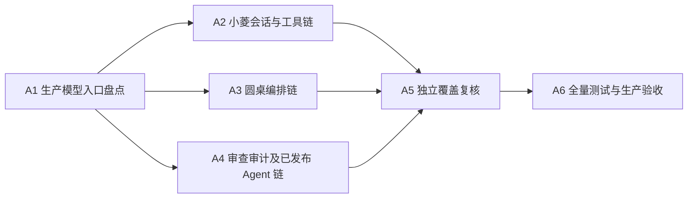

# 全 AI 上下文压缩与完整性：原子任务

| 任务 | 输入 | 输出与门禁 |
|---|---|---|
| A1 | 当前候选源码、项目文档、生产基线 | 实际模型入口清单，逐项记录输入裁剪、压缩、输出和失败契约 |
| A2 | Responses checkpoint、聊天 API/UI | 来源可追溯压缩、长输出安全重试/显式未完成、历史可查及账号隔离回归 |
| A3 | 圆桌编排器、持久发言 | 源码/发言分片抽取、真实进度及覆盖状态、长记录游标与回归 |
| A4 | 审查、审计、已发布 Agent 入口 | 保留完整覆盖与结果状态，逐链路修复高风险截断并测试 |
| A5 | A1–A4 代码与证据 | 由独立 Agent 重新读数据和文件，核对范围及失败边界 |
| A6 | 全部修复、版本/备份/迁移 | 后端与前端全量回归、生产真调用与移动点击、阻断清零后发布 |
