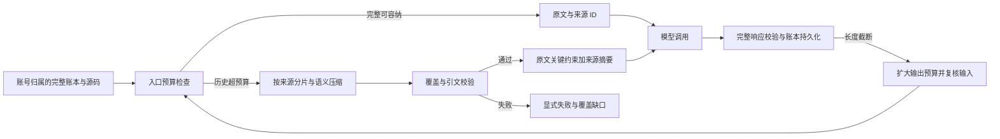

# 全域 AI 上下文压缩：架构设计

旧聊天与公开 Responses 网关只投影送模上下文，不改完整历史存储。正式审查保留源码分片和规则契约，先对可压缩的画像、Skill 与经验建来源摘要。安全审计对列表分批覆盖，再汇总证据；未覆盖批次进入覆盖账本，不允许仅凭单次调用成功称为完整。任一新摘要属于当前账号请求的低信任历史数据，不升级为系统指令。

直连模型的基类以完整消息 JSON 的 UTF-8 字节数作为保守入窗门槛，业务调用方负责有语义的分片。全链审计对高危证据逐来源分片并校验引文；PoC 按目标独立生成，脚本及沙箱结果必须覆盖目标索引全集且不得重复。模型推理的 confirmed 与沙箱实际复现分开统计，报告只对后者使用“实测复现”。

接口沿用现有路由和响应错误映射；无数据库迁移。错误策略为超预算或摘要缺失显式失败，用户可看到原因并重试，原始输入可恢复。

后续入口复核新增三条实现约束：论坛助手用完整消息 UTF-8 字节上界判断是否入窗，对画像、知识片段、草稿逐片压缩并保留标题/草稿结尾；渗透验证的探测背景要求每个来源路径及分片原文引文逐项可核验；团队内部依赖使用完整但已脱敏的私有载荷，公开事件仍保持有界预览，临时 Agent 对私有载荷重新预算并压缩。团队确定性汇总读取完整私有问题列表计数，公开问题列表仅为显式标注的预览。上游 HTTP 402 作为支付或额度状态原样分类，不能伪装成网络故障或上下文不足。

第二轮入口审计发现渗透六阶段有总提示预算与候选假设上限缺口，已发布 Agent 的只读 Skill 结果只有超窗拒绝，正式协同审查的确定性聚合会跳过无效声明后仍报完成，沙箱多 Agent 报告会把三段知识合并后固定裁到 2000 字。渗透流程应逐阶段检查系统词、固定字段和来源片段的总量，超过推演线预算时保留候选并明确标记覆盖不足；Skill 和沙箱知识按来源有界压缩、逐片验指纹及原文引文；正式审查把聚合丢失作为覆盖失败并保留有效发现待复核。上述路径仍沿用既有接口和失败状态，不新增数据库迁移。
