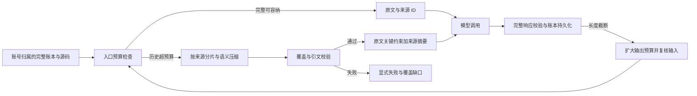

# 全域 AI 上下文压缩：架构设计

旧聊天与公开 Responses 网关只投影送模上下文，不改完整历史存储。正式审查保留源码分片和规则契约，先对可压缩的画像、Skill 与经验建来源摘要。安全审计对列表分批覆盖，再汇总证据；未覆盖批次进入覆盖账本，不允许仅凭单次调用成功称为完整。任一新摘要属于当前账号请求的低信任历史数据，不升级为系统指令。

直连模型的基类以完整消息 JSON 的 UTF-8 字节数作为保守入窗门槛，业务调用方负责有语义的分片。全链审计对高危证据逐来源分片并校验引文；PoC 按目标独立生成，脚本及沙箱结果必须覆盖目标索引全集且不得重复。模型推理的 confirmed 与沙箱实际复现分开统计，报告只对后者使用“实测复现”。

接口沿用现有路由和响应错误映射；无数据库迁移。错误策略为超预算或摘要缺失显式失败，用户可看到原因并重试，原始输入可恢复。
