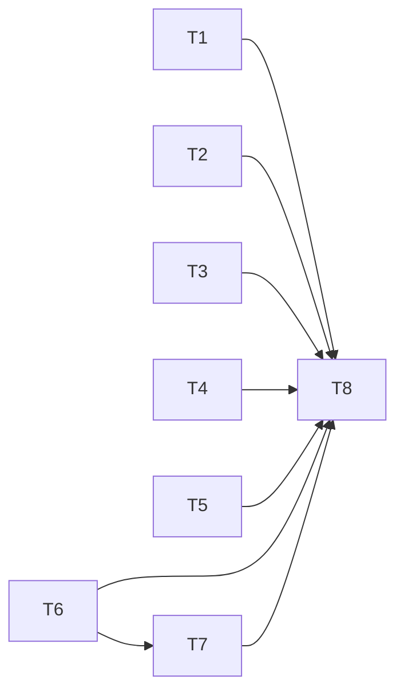

# 全域 AI 上下文压缩：原子任务

| 任务 | 输入 | 输出及验收 | 依赖 |
|---|---|---|---|
| T1 旧聊天 | 账号历史、当前请求、模型预算 | 取代固定字符摘录；长中段约束、来源与异常回归 | 无 |
| T2 Responses 网关 | 历史 replay、当前输入、调用者凭据 | 投影压缩且完整账本不变；缺来源/截断/超窗拒绝 | 无 |
| T3 安全审计 | 数据流全量列表、高危证据 | 分批覆盖并准确标记未完成；第 31 项和第 13 条回归 | 无 |
| T4 协同审查 | 源码分片、画像、规则、经验 | 源码和强制规则不丢，非源码超限按来源压缩 | 无 |
| T5 前端手机 | 圆桌 Markdown 长表格 | 横向可读、无页面整体溢出 | 无 |
| T6 基类容量门禁 | 中文、转义和标点密集的完整模型请求 | 保守核算系统与用户消息，超限不隐式发送或截断 | 无 |
| T7 全链审计 | 完整高危证据、多个 PoC 目标与沙箱输出 | 来源压缩、逐目标索引覆盖，区分推理与沙箱实测 | T6 |
| T8 集成发布 | T1–T7 和现有生产 v4.0.12 | 全量回归、独立复核、生产巡检、真实点击与截图 | T1–T7 |

每项先复现现有缺口并做能失败的边界测试，再最小修改；不能用桩测试替代生产真实模型和手机证据。
