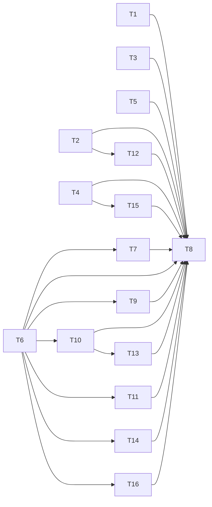

# 全域 AI 上下文压缩：原子任务

| 任务 | 输入 | 输出及验收 | 依赖 |
|---|---|---|---|
| T1 旧聊天 | 账号历史、当前请求、模型预算 | 取代固定字符摘录；长中段约束、来源与异常回归 | 无 |
| T2 Responses 网关 | 历史 replay、当前输入、调用者凭据 | 投影压缩且完整账本不变；缺来源/截断/超窗拒绝 | 无 |
| T3 安全审计 | 数据流全量列表、高危证据 | 分批覆盖并准确标记未完成；第 31 项和第 13 条回归 | 无 |
| T4 协同审查 | 源码分片、画像、规则、经验 | 源码和强制规则不丢，非源码超限按来源压缩 | 无 |
| T5 前端手机 | 圆桌 Markdown 长表格 | 横向可读、无页面整体溢出 | 无 |
| T6 基类容量门禁 | 中文、转义和标点密集的完整模型请求 | 保守核算系统与用户消息，超限不隐式发送或截断 | 无 |
| T7 全链审计 | 完整高危证据、多个 PoC 目标与沙箱输出 | 来源压缩、逐目标索引覆盖，区分推理与沙箱实测 | T6 |
| T8 集成发布 | T1–T7、T9–T16 和现有生产版本 | 全量回归、独立复核、生产巡检、真实点击与截图 | T1–T7、T9–T16 |
| T9 论坛助手 | 画像、知识片段、长草稿、模型窗口 | UTF-8 入窗判断；逐来源摘要及引文校验；失败不发送正式建议请求 | T6 |
| T10 渗透背景 | 分片探测事实与状态 | 每个来源路径/片号/原文引文校验；未覆盖即停止验证 | T6 |
| T11 团队依赖 | 同账号前置结果、临时成员模型预算 | 私有完整脱敏、分片压缩、源覆盖及第 201 条问题计数；公开预览保持有界 | T6 |
| T12 上游支付状态 | 压缩调用上游 HTTP 402 | 明确传递状态且不使用部分摘要 | T2 |
| T13 渗透其余阶段 | 授权范围、情报、假设、探测、验证、后渗透推演 | 各阶段总提示预算、来源连续分片、缺字段及候选超限显式失败，保留未覆盖候选 | T10 |
| T14 已发布 Agent 只读工具 | Skill 只读 JSON、账号、模型窗口 | 按 JSON 来源压缩，逐来源/片段 ID、指纹、尾部引文和失败态核验 | T6 |
| T15 正式审查聚合 | 多 Agent 原始发现、聚合诊断 | 任一无效或遗失声明使任务覆盖失败；有效发现留待人工复核 | T4 |
| T16 沙箱报告知识引用 | 检索的三条方法论知识、四角色报告 | 短来源原文保留；长来源分片压缩逐片核验；失败走确定性报告 | T6 |

每项先复现现有缺口并做能失败的边界测试，再最小修改；不能用桩测试替代生产真实模型和手机证据。
