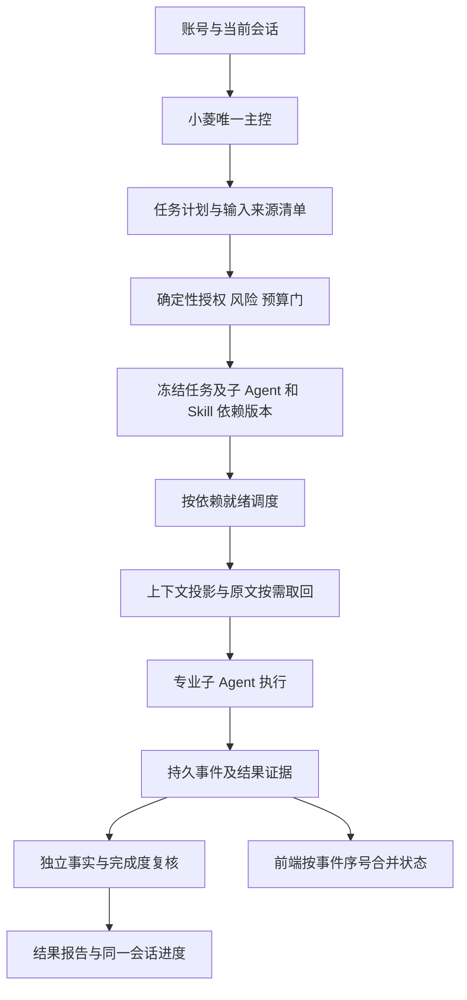

# 全系统审计结构与建议架构

本图是后续改进建议，不是已经实现的声明。复用现有团队/任务/审批/租约表，优先补授权时点、版本闭包、压缩保真与状态合并契约；无需重建第二主控或全面重写系统。

接口契约建议：任务输入保留不可变任务意图、账号和会话面、来源哈希及版本、风险确认指纹；执行前重验当前权限。重试策略与业务指令分离。结果携带团队/任务/尝试编号、单调事件序号、事实来源和未验证项。前端异步请求固定发起时对象 ID，陈旧响应不得覆盖当前对象。

异常策略：低风险可观测重试；权限、依赖版本、证据不足和高风险确认变化必须显式阻塞；压缩失败保留原文、分块重试或按需检索，不伪报完整。

## 本轮增量设计

复用发现聚合与人工裁决表，不新增另一套审计主体：原始模型主张→严格源码片段匹配→候选合并→安全条件/影响待核实→有权限的人工裁决→修复后独立复测。`verified`保留兼容枚举，其展示含义限定为“源码引用已匹配”；当前聚合器没有运行环境验证工件，因此安全主张不能仅凭该枚举被自动接受。历史人工裁决不被批量改写，人工“已处理/已修复”与复测结论分别记录。

输入预算复用现有估算器，加入可解释的保守估算以及完整请求结构开销，保留现有输出预算和压缩失败关闭门。精确本地tokenizer计数仅用于确定性反例与修复回归，不替代供应商usage；未知模型适配仍需按实际接口验证。

圆桌宿主复用账号和列表世代号，新增详情选择世代号。列表刷新不会改变当前详情请求的选择归属，关闭/账号变更/卸载同步使详情世代失效。无新增API或权限。

## 2026-10-04 外部旧报告剩余能力适配

R2–R10原报告针对4.0.33；先按当前源码、实际生产点击与测试证据核对，不把报告旧数字当当前状态。详细逐项见 `../外部审查问题核验修复20261001/复核对照20261004.md`。

- R2-01：列表动作已可用；复用既有软删除API，在详情补有权限可见的确认入口，冻结项目ID/名称/账号，取消、撤权、换账号或离开后不提交/不更新新页面。不新增后台删除语义，不删除生产项目作验收。
- R8-01：答案原已留在服务端，真正能力缺口是明文算式可直接计算。复用锁定Pillow生成168×56 PNG挑战，固定提示不含字符/算式；沿用五分钟有效、错误也消费、一次性、接口限流与内测码。前端只接收有界PNG数据地址，图像/请求失败禁用提交并可刷新；不部署新外部供应商或声称抗OCR。现单进程存储、视觉挑战的无障碍替代仍是明确限制，不能称强人机验证或全部注册防护完成。
- R3-02：复用项目成员关系的viewer，读与全局RBAC相交，写仅owner/admin，执行仅owner/admin/reviewer；未知角色拒绝。REST、小菱、团队、圆桌、审查/沙箱Worker都要按实际资源复核执行权限；保持已有作者/报告指标边界。新增can_execute为资源能力，前端缺值拒绝执行；不自动改变任何生产成员或扩展安全权限。相关工作尚在实施，不能仅枚举增加就宣布只读安全。

## 只读成员发布与回退合同补充（2026-10-04）

本轮新增 viewer 使用现有 String(20) 项目角色列，没有新表或迁移。旧 4.0.37 的写门只拒绝 reviewer，因此旧代码无法安全解释新角色；这属于新增能力的兼容约束，当前生产没有 viewer 记录，不登记为已经发生的生产越权。

标准回退脚本在绑定目标镜像后、切换任何容器前，执行无网、只读、无额外能力的实际角色判断/读写执行 helper 探测；未知、异常或不支持均拒绝。即使 viewer 暂空也拒绝旧代码，避免维护目录锁不能拦住业务写者造成竞态。38 之后不能通过此脚本回退 37，须保留数据前向修复或选已验证支持该合同的镜像，不删除成员或恢复旧备份来绕过门禁。

探测验证的是实际四个权限 helper 与固定角色/不可见记录的行为，不证明目标全部调用入口安全。发布前实际 HTTP、模型前后、队列降级和界面权限回归仍是独立必要证据；不得仅回植 helper 后把全站执行链写成兼容通过。

环境能力按原行为分别输出：can_execute 是创建者或最高管理员的执行能力，can_preview 保留合法审查员共享预览能力，can_stop 保留创建者/最高管理员在执行资格降级后的自身回收能力。三者都不替代各自全局权限、可见性、状态和后端复核，缺值不授予能力。
