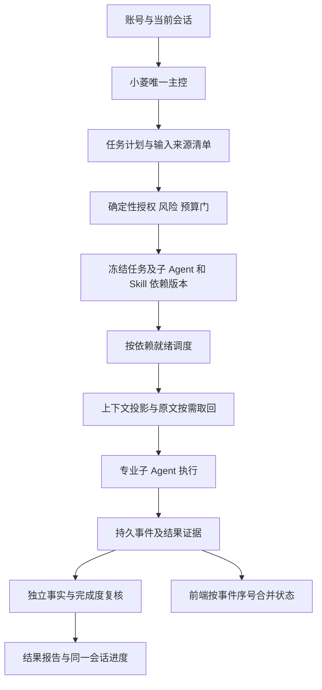

# 全系统审计结构与建议架构

本图是后续改进建议，不是已经实现的声明。复用现有团队/任务/审批/租约表，优先补授权时点、版本闭包、压缩保真与状态合并契约；无需重建第二主控或全面重写系统。

接口契约建议：任务输入保留不可变任务意图、账号和会话面、来源哈希及版本、风险确认指纹；执行前重验当前权限。重试策略与业务指令分离。结果携带团队/任务/尝试编号、单调事件序号、事实来源和未验证项。前端异步请求固定发起时对象 ID，陈旧响应不得覆盖当前对象。

异常策略：低风险可观测重试；权限、依赖版本、证据不足和高风险确认变化必须显式阻塞；压缩失败保留原文、分块重试或按需检索，不伪报完整。
