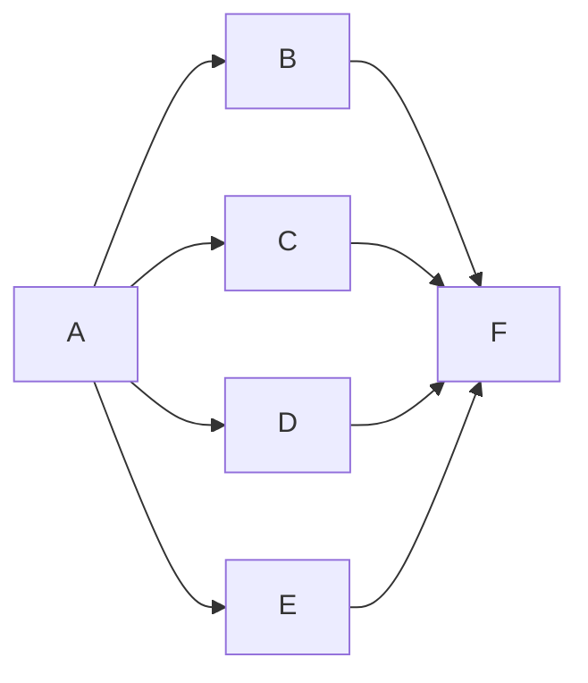

# 全系统审计任务

| 任务 | 输入 | 输出和验收 | 依赖 |
|---|---|---|---|
| A 基线与知识规则 | 当前工作树、知识收据、既有设计 | 明确代码/生产版本与范围 | 无 |
| B 小菱架构 | 主控、团队、压缩、发布与持久化 | 只读脚本、精确触发条件和边界 | A |
| C 后端逻辑 | 权限、报告、源码与 Worker | 隔离数据库复现及已有回归 | A |
| D 前端逻辑 | 组件、请求与生命周期 | 组件复现，三次重复样本 | A |
| E 生产体验与运维 | 普通 Safari 会话、SSH 只读能力 | 当前截图、健康/磁盘/证书链路事实 | A |
| F 独立重跑与报告 | B/C/D/E 的证据 | 核对结论、区分未测风险、后续验证清单 | B C D E |

实现约束：仅新增审计文档和证据；不得改生产权限、审批、源码、任务状态或运行付费模型压力测试。

## 继续修复的任务增量

上条约束对应初始只读盘点。后续用户已明确授权源代码修复、验收与发布；不扩大账号权限、处理未确认审批、执行攻击或伪造付费模型验收。

| 任务 | 输入契约 | 输出契约与验收 | 依赖 |
|---|---|---|---|
| G 圆桌选择 | 当前账号、列表与详情请求 | 最后选择生效；关闭/换账号/卸载使迟到响应失效；原红样本、扩大样本、三轮和独立复核 | D |
| H 上下文预算 | 序列化原文、配置窗口、输出和协议结构 | 本地官方tokenizer反例触发压缩/拒绝；保留账本与事实；小样本及百万token本地三轮；不冒充供应商实测 | B |
| I 发现判定 | 原始主张、完整源码、来源及人工状态 | 不匹配片段与安全候选进入待核实；非安全真实匹配保持正向；持久化/API函数序列化/详情展示贯通 | B C |
| J 评分与规范说明 | 现有扣分公式、官方标准页面 | 保持公式；说明候选/驳回计分、多来源边界与参考规范时效；不声明认证或最新库同步 | I |
| K 冻结与发布 | G H I J源码和证据 | 整合回归、独立核验、固定提交制品、备份恢复、同SHA运行及受影响真实点击 | G H I J |

