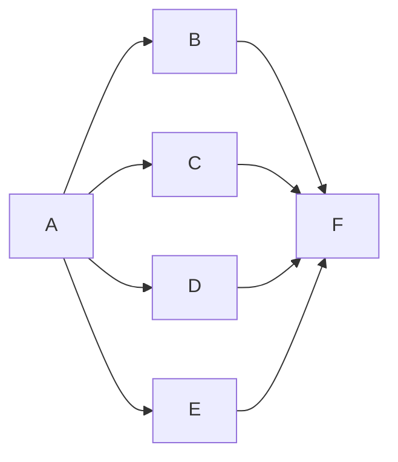

# 全系统审计任务

| 任务 | 输入 | 输出和验收 | 依赖 |
|---|---|---|---|
| A 基线与知识规则 | 当前工作树、知识收据、既有设计 | 明确代码/生产版本与范围 | 无 |
| B 小菱架构 | 主控、团队、压缩、发布与持久化 | 只读脚本、精确触发条件和边界 | A |
| C 后端逻辑 | 权限、报告、源码与 Worker | 隔离数据库复现及已有回归 | A |
| D 前端逻辑 | 组件、请求与生命周期 | 组件复现，三次重复样本 | A |
| E 生产体验与运维 | 普通 Safari 会话、SSH 只读能力 | 当前截图、健康/磁盘/证书链路事实 | A |
| F 独立重跑与报告 | B/C/D/E 的证据 | 核对结论、区分未测风险、后续验证清单 | B C D E |

实现约束：仅新增审计文档和证据；不得改生产权限、审批、源码、任务状态或运行付费模型压力测试。

