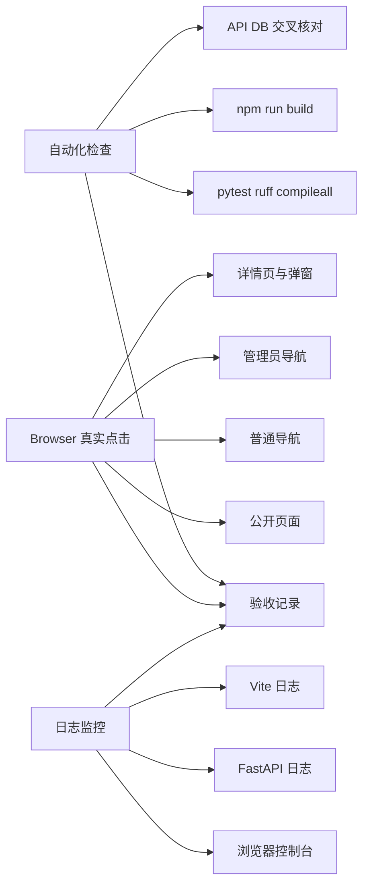

# 全量功能回归测试 · 设计文档

## 验证架构

```mermaid
flowchart LR
    A[自动化检查] --> D[验收记录]
    B[Browser 真实点击] --> D
    C[日志监控] --> D
    A --> A1[pytest ruff compileall]
    A --> A2[npm run build]
    A --> A3[API DB 交叉核对]
    B --> B1[公开页面]
    B --> B2[普通导航]
    B --> B3[管理员导航]
    B --> B4[详情页与弹窗]
    C --> C1[浏览器控制台]
    C --> C2[FastAPI 日志]
    C --> C3[Vite 日志]
```

## 异常处理

- 自动化失败：先定位失败用例，再修复和重跑。
- 页面点击报错：记录页面、按钮、控制台日志和后端日志，再修复和回归。
- 外部 AI 调用：提交前请求用户确认，避免未经确认发送代码。
- 删除或账号状态变更：验证到确认弹窗，最终提交前请求用户确认。

