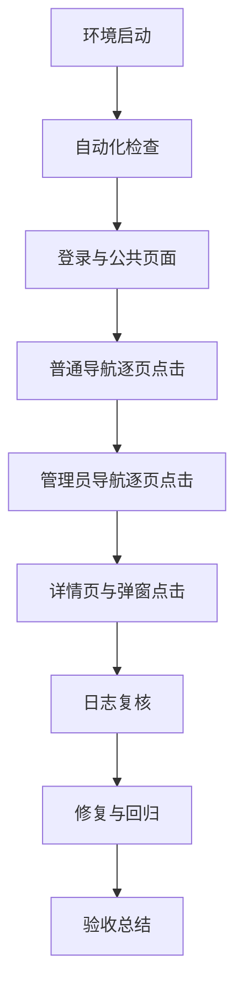

# 全量功能回归测试 · 原子任务

| 任务 | 输入契约 | 输出契约 | 验收标准 | 状态 |
| --- | --- | --- | --- | --- |
| T1 环境启动 | Docker Desktop 可用 | MySQL、FastAPI、Vite 可访问 | 健康检查成功 | 已完成 |
| T2 自动化检查 | T1 完成 | 测试、构建、数据核对结果 | 无失败 | 已完成 |
| T3 登录与公共页面 | T1 完成 | 登录、注册入口结果 | 登录无错误 | 已完成 |
| T4 普通导航逐页点击 | T3 完成 | 普通页面按钮覆盖记录 | 可见按钮已点击或记录边界 | 已完成 |
| T5 管理员导航逐页点击 | T3 完成 | 管理页面按钮覆盖记录 | 可见按钮已点击或记录边界 | 已完成 |
| T6 详情页与弹窗点击 | T4、T5 完成 | 详情和弹窗覆盖记录 | 交互反馈正确 | 已完成 |
| T7 日志复核 | T2 至 T6 完成 | 日志复核结论 | 无未处理异常 | 已完成 |
| T8 修复与回归 | 存在缺陷时执行 | 修复和回归结果 | 缺陷关闭 | 已完成 |
| T9 验收总结 | 前序任务完成 | FINAL、TODO | 结论明确 | 已完成 |

## 补测说明

- 应用内 Browser 连接中断后仍未恢复，本轮已通过 Safari Computer Use 完成剩余真实点击补测。
- 用户已授权 DeepSeek 和合成测试数据删除；QA 审查任务、QA 项目、QA 规则已完成真实点击删除，并通过精确 SQL 清理残留。
- 真实账号禁用/重置密码、真实密码提交、Agent 自进化审批/回滚等生产破坏性最终提交未对正常数据执行；相关确认路径已覆盖。
