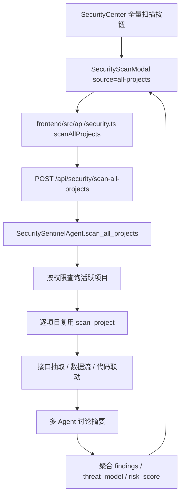
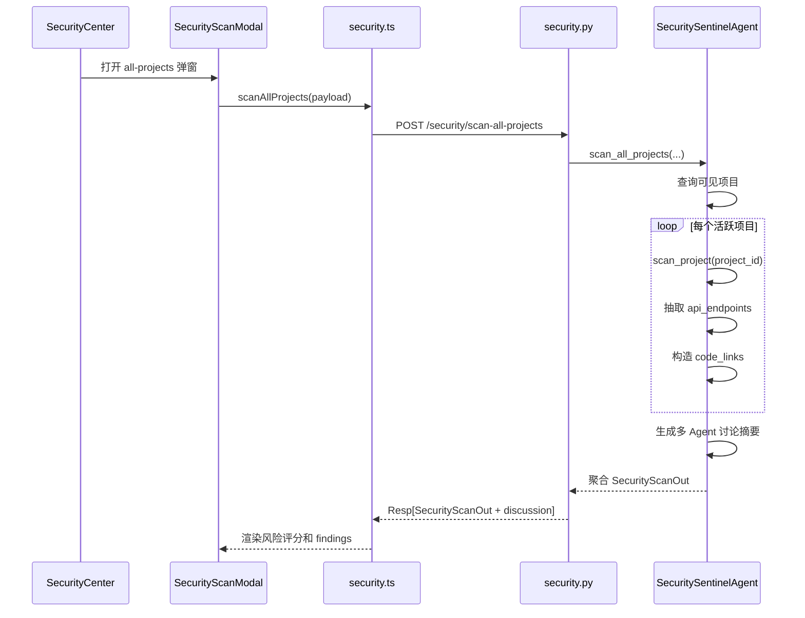

# DESIGN_全量项目安全扫描

## 整体架构



## 模块设计

| 模块 | 职责 |
| --- | --- |
| `backend/app/schemas/security.py` | 定义全量扫描输入参数、接口扫描、代码联动和讨论输出结构 |
| `backend/app/api/v1/security.py` | 暴露全量扫描 HTTP API |
| `backend/app/agents/security_sentinel_agent.py` | 查询可见项目、复用单项目扫描、抽取接口、生成代码联动、多 Agent 摘要、聚合结果 |
| `frontend/src/types/security.ts` | 对齐新增输入与输出类型 |
| `frontend/src/api/security.ts` | 封装 `scanAllProjects` |
| `frontend/src/components/security/SecurityScanModal.vue` | 新增 all-projects 模式，展示接口、联动关系和讨论结论 |
| `frontend/src/views/security/SecurityCenter.vue` | 提供全量扫描入口 |

## 接口契约

### 请求

`POST /api/security/scan-all-projects`

```json
{
  "top_n_per_project": 50,
  "trace_dataflow": true
}
```

### 响应

复用 `SecurityScanOut`：

```json
{
  "findings": [],
  "threat_model": {
    "entry_points": [],
    "data_flows": [],
    "api_endpoints": [],
    "code_links": [],
    "attack_surface_summary": "..."
  },
  "discussion": {
    "mode": "multi_agent_summary",
    "participants": [],
    "turns": [],
    "consensus": "...",
    "action_items": []
  },
  "compliance": {},
  "risk_score": 100,
  "summary": "...",
  "file_count": 0,
  "duration_ms": 0
}
```

## 数据流



## 异常处理

- 未注入 DB：返回 AgentResult 失败。
- 无活跃项目：返回成功空结果，风险评分 100。
- 单个项目无文件或失败：跳过该项目并在 `compliance.project_errors` 中记录，不中断其他项目。
- 权限控制：普通用户仅查询 `Project.user_id == user.id` 的活跃项目。
