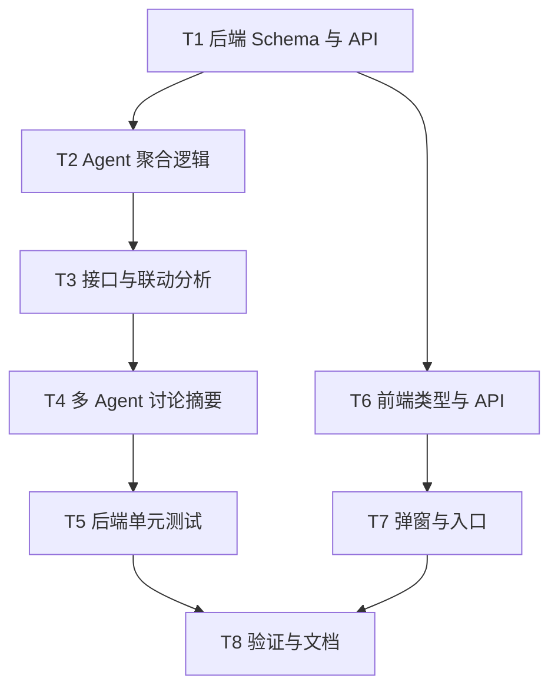

# TASK_全量项目安全扫描

## 任务依赖图

## 原子任务

| 编号 | 任务 | 输入契约 | 输出契约 | 验收 |
| --- | --- | --- | --- | --- |
| T1 | 后端 Schema 与 API | 现有 `security.py` 路由和 Schema | 新增 `SecurityScanAllProjectsIn`、`ApiEndpointOut`、`CodeLinkOut`、`SecurityDiscussionOut` 与 `scan-all-projects` | OpenAPI 路由可导入 |
| T2 | Agent 聚合逻辑 | 已有 `scan_project` | 新增 `scan_all_projects` | 可聚合多项目结果 |
| T3 | 接口与联动分析 | 代码文件内容、入口、危险接收点、数据流 | 输出 `api_endpoints` 和 `code_links` | 能识别常见接口并生成联动关系 |
| T4 | 多 Agent 讨论摘要 | findings 与 threat_model | 输出 `discussion` | 包含发言、共识和行动项 |
| T5 | 后端测试 | 现有 SecuritySentinel 测试 | 新增全量、接口、联动、讨论测试 | pytest 指定文件通过 |
| T6 | 前端类型与 API | 现有 security 类型 | 新增 `SecurityScanAllProjectsIn` 和增强输出类型 | TS 类型可用 |
| T7 | 弹窗与入口 | `SecurityScanModal.vue`、`SecurityCenter.vue` | 支持全量扫描配置、结果展示和入口 | 不影响 file/task/project |
| T8 | 验证与文档 | 代码完成 | 更新验收、总结、TODO | 构建/测试结果记录 |

## 执行约束

- 不回滚工作区既有改动。
- 不新增迁移。
- 保持函数级注释风格。
- 前端按钮文本避免与单项目入口混淆。
