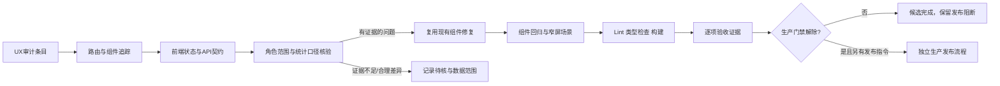
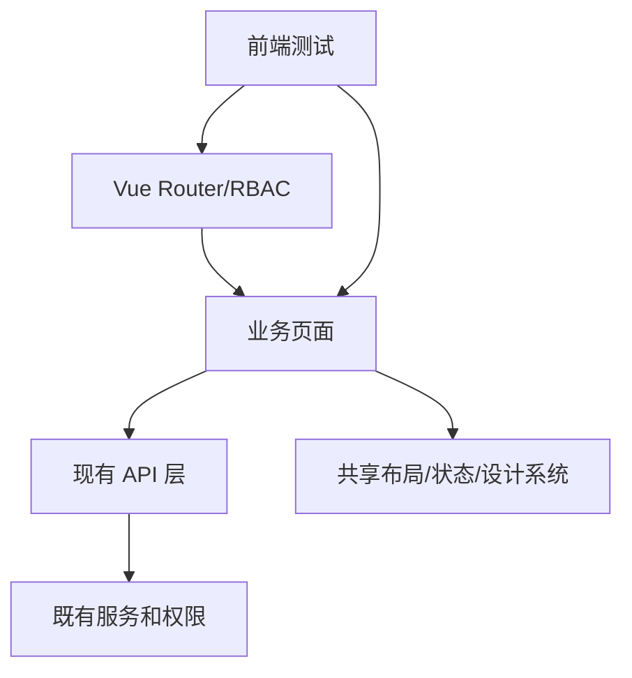

# DESIGN 前端 UX 审计修复

## 方案

## 模块设计

- **入口与职责**：管理路由使用现有 `AdminUnifiedCenter` 分区；任何聚合都只是导航/呈现，不改变后端 workflow、审批处理器或权限。
- **数据契约**：定位各页面 composable/API/service 的角色范围、筛选参数、状态映射和时间窗；不能共享同口径时给统计加标签/辅助说明。
- **术语与引导**：统一中文文案映射；关闭的指南泡泡按当前账号记录，提供设置或帮助入口重新打开。
- **响应式**：复用 `AppSidebar`、`AppHeader` 现有移动抽屉模式和 design tokens；375px 验证遮罩、焦点、关闭、滚动锁及页头溢出。
- **加载状态**：沿用当前 Skeleton/状态组件，在仪表盘首屏只有一个加载表达，错误/空态仍可区分。

## 异常处理

- API 失败保留可见错误和重试路径，不把错误改为空列表或“正常”。
- 无权限与无数据状态分别展示 403/空态，不向角色提供越权的汇总记录。
- 不能从静态代码确定生产账号中的数字归属时，记录待生产复核，不猜测。

## 模块依赖

