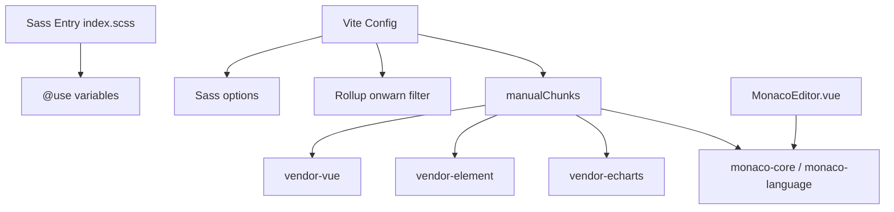

# 前端构建警告清理 · Design

## 架构图

## 设计说明

- Sass 入口继续只从 `main.ts` 导入一次，避免重复样式注入。
- `onwarn` 只识别 `INVALID_ANNOTATION` 且路径包含 `@vueuse/core` 的警告，避免误吞真实构建问题。
- Monaco 按 editor 核心、语言贡献和 Worker 拆分，保持编辑器动态路由懒加载能力。

## 风险控制

- 所有改动通过 `npm run build` 验证。
- 代码编辑器通过浏览器路由加载验证，确保拆分后 worker 和编辑器没有明显运行错误。
