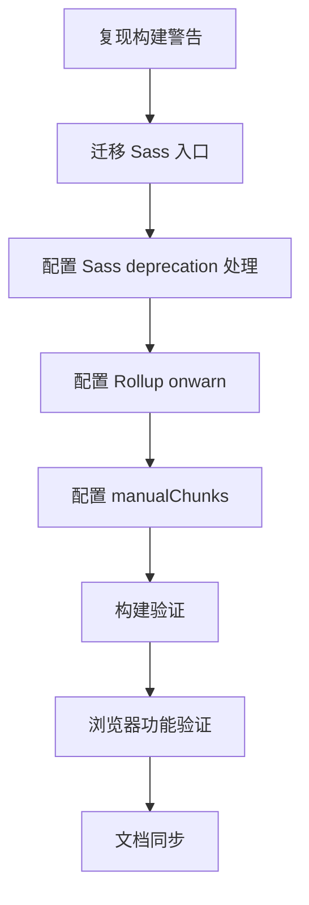

# 前端构建警告清理 · Task

## 原子任务

1. 复现并记录警告清单。
2. 修改 `frontend/src/assets/styles/index.scss`。
3. 修改 `frontend/vite.config.ts`。
4. 运行 `npm run build`，确认无警告。
5. 启动前端和轻量 mock API，验证登录、仪表盘、代码编辑器页面。
6. 更新验收、总结、TODO 和 `说明文档.md`。
