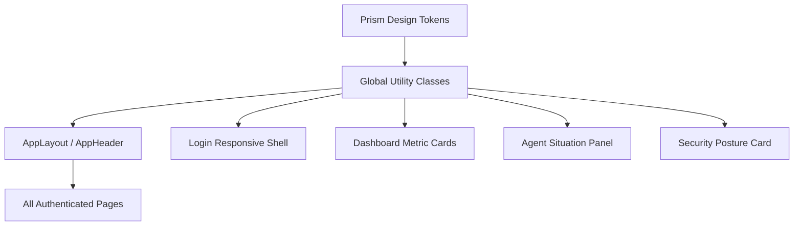

# 前端高级感优化 · Design

## 架构图

## 分层设计

- Token 层：扩展 `variables.scss`，定义背景、surface、focus、hover、panel 等统一变量。
- 基础样式层：在 `index.scss` 中提供页面壳、surface、标题等轻量类。
- 布局层：调整 AppLayout、AppHeader，使后台页面拥有统一的工作台背景和工具栏。
- 页面层：Dashboard、Login、Agent、Security 局部接入统一视觉。

## 数据流

本次不改变接口和数据流，仅改变展示结构和样式映射。

## 异常处理

- 保留现有 `PrismLoading`、`EmptyState`、接口错误提示。
- 视觉调整不影响业务状态判断。
