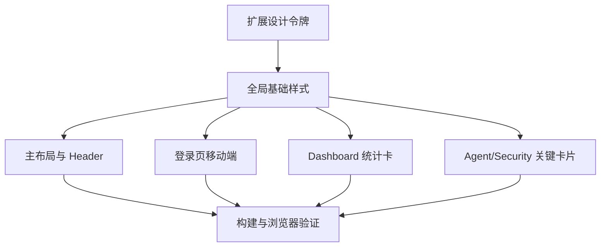

# 前端高级感优化 · Task

## T1 扩展设计令牌

- 输入：现有 `variables.scss`。
- 输出：新增 surface/backdrop/focus 等变量。
- 验收：不破坏现有变量引用。

## T2 全局基础样式

- 输入：`index.scss`。
- 输出：新增复用页面壳与卡片类。
- 验收：不影响 Element Plus 基础组件使用。

## T3 主布局与 Header

- 输入：`AppLayout.vue`、`AppHeader.vue`。
- 输出：更统一的后台外观。
- 验收：移动端侧栏仍可正常打开关闭。

## T4 登录页移动端

- 输入：`Login.vue`。
- 输出：移动端 compact brand 和更自然的表单密度。
- 验收：390px 宽度无横向溢出。

## T5 Dashboard 统计卡

- 输入：`Dashboard.vue`。
- 输出：图标组件替代字符符号，卡片层级更清晰。
- 验收：构建通过，统计数据展示逻辑不变。

## T6 Agent/Security 关键卡片

- 输入：`SituationPanel.vue`、`SecurityPostureCard.vue`。
- 输出：减少 emoji 和过强光效，统一为 Prism 视觉。
- 验收：组件 props/API 不变。
